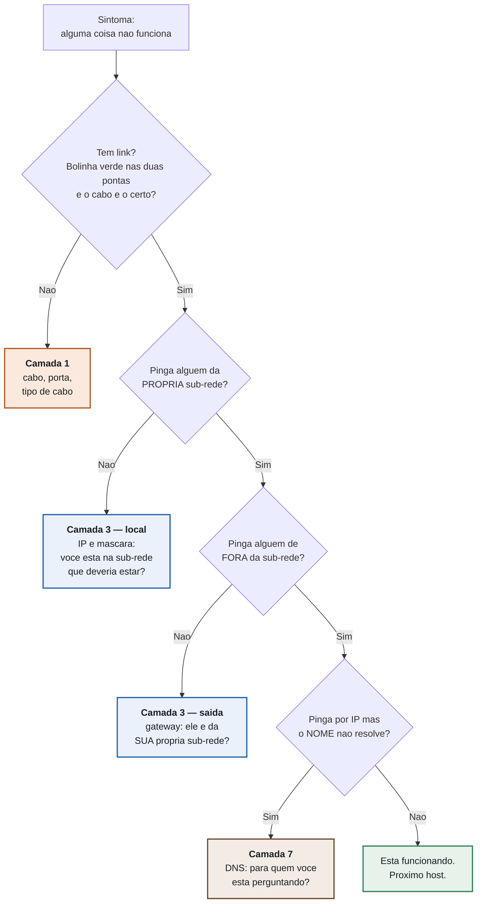

# 🟢 Aula 01: Lab 0 — Resgate

**Disciplina:** Redes de Computadores II (49309) · Ciência da Computação — Uniube
**Professor:** Romualdo Mathias Filho
**Semana:** 1 · **Tipo:** 🛠️ Prática (75 min)
**P11:** segunda, 27/07/2026 · VIA215 — **P12:** quinta, 30/07/2026 · VIA216

---

> [!INFO] 🎯 Visão Geral da Aula & Recursos
> Uma rede de campus foi entregue por um estagiário apressado. Ela está **quase** funcionando — e "quase" é a palavra mais cara da infraestrutura. Hoje você não monta uma rede: você **conserta** uma, e sai daqui com o método que vai usar em todos os laboratórios do semestre e na sua primeira semana de trabalho.
>
> **O que você vai dominar nesta aula**
> - O método de diagnóstico **de baixo para cima** — a sequência de perguntas que transforma "não funciona" em "está quebrado *aqui*".
> - Como usar o `ping` para **dividir o problema em dois** em vez de sair mexendo em configuração.
> - O ambiente do semestre inteiro no ar: conta NetAcad + Packet Tracer rodando na sua máquina.
>
> **📂 Recursos**
> - [Cisco Packet Tracer + conta NetAcad](https://www.netacad.com/) — grátis, obrigatório, **instale antes de vir**. Sem ele você faz o laboratório na tela do colega, e ele vale ponto.
> - `lab00_resgate.pka` — o cenário de hoje, entregue em sala
> - [Vevox](https://vevox.app/) — exit ticket, anônimo e sem cadastro

### ⏱️ Como os 75 minutos de hoje rodam

| Min | Bloco | Onde está nesta página |
| :-- | :--- | :--- |
| 0–8 | Abertura: a rede que caiu por **um** caractere | Revisão Rápida |
| 8–20 | **Setup** — NetAcad e Packet Tracer funcionando | Tópico 1 |
| 20–25 | **Worked example**: um defeito resolvido no projetor | Tópico 2 |
| 25–55 | **Lab 0 em duplas** — a caça | Tópico 3 |
| 55–65 | **Debrief**: os quatro defeitos e o que cada um cobra | Debrief |
| 65–72 | Como o semestre funciona na prática | Antes de sair |
| 72–75 | Exit ticket no Vevox | Fechamento |

---

## 🎯 Objetivo da Aula

Ao final desta aula você será capaz de:

- **Aplicar** uma sequência de diagnóstico de baixo para cima, testando uma camada por vez em vez de chutar.
- **Interpretar** o resultado de um `ping` como informação que *elimina* causas, e não apenas como "funcionou / não funcionou".
- **Localizar** em qual camada do modelo OSI está um defeito, a partir do sintoma que o usuário relata.
- **Operar** o Packet Tracer no fluxo que a disciplina vai usar por 20 semanas: abrir o cenário, configurar host, testar, conferir o resultado.

---

## 🔄 Revisão Rápida — o que Redes I deixou pronto

Redes II não recomeça: ela continua. **Tudo o que está no laboratório de hoje é conteúdo de Redes I** — nenhum defeito exige algo que você ainda não viu. É de propósito: o objetivo de hoje não é conteúdo novo, é **método**.

| O que Redes I deixou pronto | Como isso aparece hoje |
| :--- | :--- |
| **Endereçamento IPv4, máscara e sub-rede** | Decidir se dois hosts estão ou não na mesma rede — e por quê |
| **Gateway padrão** | Entender que ele só entra em cena para **sair** da sub-rede |
| **Modelo OSI: quem faz o quê** | Nomear a camada do defeito antes de tocar em qualquer configuração |
| **Switch × roteador** | Saber o que cada caixa da topologia resolve, e o que ela não resolve |
| **DNS: quem traduz nome em endereço** | Distinguir "a rede caiu" de "o nome não resolve" |

> [!NOTE] 🧭 P11 e P12 — a ordem é diferente para vocês, e isso é intencional
> **P11 (segunda):** você faz este laboratório **antes** da aula teórica de terça. Os conceitos que você reencontrar aqui voltam amanhã no diagnóstico da turma — você chega com a experiência na mão.
> **P12 (quinta):** você já votou nas cinco questões de terça. Vai reconhecer pelo menos uma delas dentro deste cenário, viva e mordendo. Repare em qual.

---

## 📌 1. Ambiente pronto: NetAcad + Packet Tracer [Hands-On ⏳ 12 min]

O Packet Tracer é o laboratório desta disciplina por 20 semanas. Ele é gratuito, roda em Windows, macOS e Linux, e exige uma conta gratuita na Cisco Networking Academy — **a conta é a parte que demora**, não o download.

**Os três passos, nesta ordem:**

1. Criar a conta em [netacad.com](https://www.netacad.com/) e confirmar o e-mail (o link de confirmação às vezes cai no spam — olhe lá antes de tentar de novo).
2. Matricular-se no curso gratuito **"Getting Started with Cisco Packet Tracer"**. É ele que libera o download.
3. Baixar e instalar a versão **8.2 ou superior**, e abrir o programa uma vez logado, para validar a conta.

> [!WARNING] ⚠️ Gotcha de Infraestrutura
> **A rede da sala não aguenta vinte downloads simultâneos de ~250 MB.** Se todo mundo baixar agora, ninguém baixa.
> Quem já instalou: levante a mão e **ajude o vizinho** — a sala termina este bloco 100% funcional, e essa é a meta real dos 12 minutos.
> Quem não conseguiu instalar: sente com quem conseguiu. **Dupla resolve hoje**; até a próxima prática, resolva o seu.
> Se a instalação falhar por política da máquina (notebook corporativo, sem permissão de administrador), me procure no fim da aula — existe caminho, mas ele é individual.

> [!TIP] 💡 Dica de Produção (Pro-Tip)
> Salve o arquivo do laboratório numa pasta que **não** seja o Desktop nem a pasta de Downloads sincronizada com nuvem. Simulador escreve no arquivo o tempo todo; sincronização automática no meio disso é a receita clássica de "meu trabalho sumiu" — e a versão que o serviço de nuvem devolve costuma ser a de dez minutos atrás. Crie uma pasta local `Redes2/` e trabalhe nela o semestre inteiro.

---

## 📌 2. O método: um defeito resolvido no projetor [Worked Example ⏳ 5 min]

Antes de você caçar, eu caço **um** — narrando cada pergunta em voz alta. Não é para você decorar a resposta: é para você copiar **a sequência de perguntas**.

### 2.1 A sequência

A regra é subir uma camada por vez, e **só subir quando a de baixo estiver provada**. Cada resposta elimina um conjunto inteiro de causas — é isso que separa diagnóstico de tentativa e erro.



> Mesma convenção de cor de todos os diagramas do semestre: **laranja = camada física**, **azul = camada de rede**, **marrom = camada de aplicação**, **verde = resolvido**.

### 2.2 O ponto que quase todo mundo pula

O passo mais valioso do fluxo acima é o segundo, e ele é o mais ignorado: **pingar alguém da própria sub-rede antes de pingar a internet.**

Esse teste divide o problema em dois. Se o ping local **funciona**, você acabou de provar que o cabo, a porta, o switch e o seu próprio endereço estão bons — o defeito está na *saída* da rede. Se o ping local **falha**, nem adianta olhar gateway ou DNS: o problema está antes disso.

Quem começa perguntando "o DNS está certo?" está adivinhando. Quem começa perguntando "eu enxergo o meu vizinho?" está diagnosticando.

> [!TIP] 💡 Dica de Produção (Pro-Tip)
> Este exemplo resolvido no projetor não é enfeite de aula: é **worked example**, e a pesquisa de carga cognitiva é bem estabelecida no ponto — quem é iniciante num domínio aprende mais estudando uma solução narrada do que tentando resolver do zero, porque a busca às cegas consome a memória de trabalho que deveria estar formando o esquema (Sweller, Ayres & Kalyuga, 2011).
>
> E o inverso também é verdade: conforme você ganha repertório, o exemplo pronto passa a **atrapalhar** — é o *expertise reversal effect* (Kalyuga et al., 2003). Por isso o andaime desta disciplina encolhe de propósito: até a S08 você tem exemplo completo; a partir da S11, só pedaços; da S16 em diante, o problema aberto direto. Se em novembro você achar que "o professor parou de explicar", é isso acontecendo, e é deliberado.

> [!NOTE] 💼 Pergunta de Entrevista
> *"Um usuário liga dizendo que a internet caiu. Qual é a sua primeira pergunta?"*
>
> **Resposta esperada de um sênior:** *"Caiu para você só, ou para a sala inteira?"* — e logo depois: *"você consegue abrir alguma coisa pelo IP?"*. As duas perguntas custam dez segundos e cortam o espaço de busca pela metade cada uma: a primeira separa problema de host de problema de rede; a segunda separa problema de conectividade de problema de resolução de nome. Candidato júnior começa pedindo para reiniciar o roteador. **Sênior começa medindo o tamanho do incêndio.**

### 🧠 Checkpoint: Teste seu Conhecimento!

<details>
<summary><b>🔍 Um host pinga o gateway sem perda, mas não pinga nenhuma máquina da própria sala. Isso é possível? O que você já eliminou?</b></summary>
<blockquote>

**É possível, sim** — e é exatamente o tipo de resultado que parece contraditório até você olhar a máscara.

Se o host **alcança o gateway**, então cabo, porta, switch e a pilha IP local estão funcionando: **camada 1 e 2 estão eliminadas**. O que sobra é a fronteira da sub-rede. Uma máscara mais restritiva do que a da rede real coloca o host num bloco pequeno que **contém** o gateway e **exclui** os vizinhos — o host enxerga quem está no seu bloco e trata todo o resto como "fora", mandando para o gateway, que não tem por que devolver o tráfego para a mesma interface.

**A lição transferível:** "pinga o gateway" não é prova de que a rede está certa. É prova de que o caminho *até o gateway* está certo. Máscara errada é o defeito que engana quem testa só uma coisa.

</blockquote>
</details>

---

## 📌 3. Lab 0 "Resgate" — a caça, em duplas [Hands-On Lab ⏳ 30 min]

### 3.1 O cenário

Três sub-redes diretamente conectadas num roteador. Sem protocolo de roteamento, sem VLAN, sem nada que você ainda não tenha visto — **roteamento dinâmico é a S11, VLAN é a S03.** Hoje é tudo Redes I.

```text
        Administrativo                 Laboratorio
       192.168.10.0/24                192.168.20.0/24
    ┌──────────────────┐          ┌──────────────────┐
    │ PC-ADM1          │          │ PC-LAB1          │
    │ PC-ADM2          │          │ PC-LAB2          │
    └────────┬─────────┘          └────────┬─────────┘
             │                             │
        [ SW-ADM ]                    [ SW-LAB ]
             │ Fa0/24                      │ Fa0/24
       G0/0  │                             │  G0/1
        ┌────┴─────────────────────────────┴────┐
        │            R-CAMPUS  (2911)           │
        └──────────────────┬────────────────────┘
                           │ G0/2
                      [ SW-SRV ]
                           │
                  SRV-PORTAL  192.168.30.10
                  Servidores  192.168.30.0/24
                  DNS + HTTP · portal.uniube.local
```

**Existem quatro defeitos.** Cada um é **um valor trocado** — nunca dois no mesmo lugar — e cada um produz um sintoma **diferente**. Nenhum deles é pegadinha: os quatro são conteúdo de Redes I.

### 3.2 As regras da caça

| Regra | Detalhe |
| :--- | :--- |
| **Em dupla, falando alto** | Digam um para o outro o que estão testando **antes** de testar. Diagnóstico silencioso não se aprende. |
| **Não adicione nem remova equipamento** | Trocar cabo, se for o caso, pode. |
| **O que já está certo** | O **R-CAMPUS** está configurado corretamente nas três interfaces. O **SRV-PORTAL** está correto, com DNS e HTTP no ar. Não gaste tempo neles. |
| **Critério de pronto** | Os quatro PCs precisam **(1)** pingar `192.168.30.10` e **(2)** abrir `http://portal.uniube.local` **pelo nome**, no navegador. |

> [!WARNING] ⚠️ Gotcha — o erro que faz a nota **cair**
> A tentação, ao achar um host que não alcança o gateway, é mudar o **gateway** para bater com o host. Às vezes o ping até anda depois disso — e você acabou de trocar um defeito por dois, porque escondeu a causa real.
>
> O cenário compara o seu resultado com a rede correta: **remendo derruba o seu percentual.** Se um valor parece errado, pergunte antes *"qual dos dois lados é que está errado?"*. Na dúvida, o que está errado é quase sempre o **host**, não a infraestrutura — foi o host que alguém configurou às pressas.

### 3.3 Como você sabe que terminou

O arquivo do laboratório carrega os testes dentro dele. O botão **`Check Results`** mostra o seu percentual de **Completion** na própria tela, atualizado a cada correção que você aplica.

> [!TIP] ✅ Como o ponto de hoje é apurado — leia uma vez e não tenha mais dúvida
> **Este laboratório vale 1 ponto da Atividade N1, e o ponto sai para quem fechar `Completion ≥ 80%`.**
>
> São **10 itens** apurados: os valores corrigidos nos hosts **e** dois testes de conectividade de ponta a ponta. Oitenta por cento = **8 dos 10**. Os dois testes de conectividade existem para impedir o "consertei o campo e não testei" — e um deles só fecha se o acesso funcionar **pelo nome**, não pelo IP.
>
> Você sai da aula sabendo a sua nota. Não existe "depois eu corrijo".
>
> São seis laboratórios valendo ponto no semestre (Lab 0 a Lab 5) e contam **os cinco melhores** — o sexto é a sua margem para um dia ruim.

### 3.4 Terminou antes? A quebra deliberada

Se a sua dupla fechar 100% antes do tempo, eu vou até a sua máquina, derrubo alguma coisa no roteador e digo só isto:

> *"Acabei de derrubar uma coisa. Você tem dois minutos para me dizer **qual** e **como descobriu**."*

Não é castigo por ser rápido: é o formato dos laboratórios a partir da S02, em que a quebra deliberada ocupa os últimos 20 minutos. Hoje ela é um aperitivo — **e o "como descobriu" vale mais do que o "qual".**

---

## 🧭 Debrief — os quatro defeitos, na ordem das camadas (10 min)

A ordem em que a gente revisa **é** a lição. Não vamos do mais fácil ao mais difícil: vamos de baixo para cima, porque é assim que se diagnostica.

| Camada | O defeito ensinou que… | E a semana que vai cobrar isso é… |
| :-: | :--- | :--- |
| **1** | Ter cabo não é ter rede. O meio de transmissão é uma escolha, e o cabo errado conecta fisicamente sem transportar nada útil. | **S04** — para discutir a tag 802.1Q dentro do quadro no Wireshark, você precisa distinguir o quadro do fio que o carrega. |
| **3** | A máscara define fronteira. Ela decide, sozinha, quem é "vizinho" e quem é "estrangeiro". | **S03** — cada VLAN é uma sub-rede. Errar máscara aqui derruba o roteamento inteiro da **S05**. |
| **3** | O gateway só entra em cena para **sair**. Host com gateway de outra sub-rede fica mudo para o mundo e perfeito para o vizinho. | **S05** — em `router-on-a-stick`, **cada VLAN tem o seu gateway**. É o mesmo erro, multiplicado por quantas VLANs você criar. |
| **7** | "A internet caiu" é sintoma, não diagnóstico. Nome e endereço são coisas diferentes, e só uma delas quebrou. | **S03 em diante** — toda VLAN nova precisa saber para onde perguntar. |

**A frase que abre o semestre:** a pergunta de Redes II é sempre *"isso quebrou na camada 2 ou na 3?"* — e hoje você respondeu isso quatro vezes, antes de a disciplina começar.

---

## 🗺️ Antes de sair: como o semestre funciona na prática (7 min)

> [!NOTE] 📌 P11, isto aqui é o seu adiantamento
> A aula de terça (28/07) é o contrato completo — cronograma, notas, acordos de sala votados pela turma, política de IA. **P11: você viu a prática antes da teoria, então leve estes cinco pontos hoje.** P12: você já viu tudo isto na terça; aqui é só a confirmação de que a prática cumpre o combinado.

| O combinado | Como funciona |
| :--- | :--- |
| **Laboratório vale ponto na hora** | `Completion ≥ 80%` na tela, durante a aula. Sem espera, sem entrega posterior. |
| **Duplas são rotativas** | Ninguém passa o semestre com o mesmo par, e ninguém carrega o outro. |
| **Toda prática tem quebra deliberada** | A partir da S02, os últimos 20 minutos são "eu derrubo, você descobre". |
| **Toda aula abre com recuperação** | Quatro questões sem nota: três da semana passada, uma antiga. Recuperar da memória é o que fixa. |
| **Toda aula fecha com exit ticket** | O que você responde no Vevox **abre a aula seguinte**. É por ele que a turma dirige o ritmo. |

**Datas que já estão travadas:** Prova N1 em **22/09** · Prova N2 em **01/12**. Ambas na terça, em duas etapas — individual e depois em grupo.

> [!WARNING] ⚠️ Pendência sua para a próxima prática
> **Conta NetAcad criada e Packet Tracer instalado na sua máquina.** Hoje a dupla cobriu quem não tinha; a partir da S02 o laboratório começa no minuto zero e não há bloco de setup. Chegar sem o simulador é assistir ao laboratório, e laboratório assistido não fecha Completion.

---

## 🎬 Fechamento — Exit Ticket (3 min)

Duas perguntas anônimas, sem nota, no **Vevox**. O que você responder aqui **abre a aula da semana que vem**.

**Hoje:**
1. *Qual assunto de Redes I você sente que mais esqueceu?*
2. *Qual foi o ponto mais confuso da aula de hoje?*

> [!INFO] 📲 Como responder
> **QR projetado no slide final** — ou acesse [vevox.app](https://vevox.app/) e digite o ID de sessão que aparece na tela.
> Anônimo, sem cadastro, funciona em qualquer celular. Sem sinal? Meia folha de papel na saída resolve.
>

---


<div class="au-podcast">
  <p><b>🎧 Revisão em áudio (~10 min)</b> — gerada por IA a partir desta página, para ouvir no trajeto. O áudio complementa; a página é a fonte.</p>
  <p><i>Disponível em breve.</i></p>
</div>
## 📋 Resumo Estrutural

| Item | O que você precisa lembrar |
| :--- | :--- |
| **O método** | Link → ping local → ping externo → resolução de nome. Uma camada por vez, e só sobe quando a de baixo está provada. |
| **O teste que divide o problema em dois** | Ping para alguém da **própria sub-rede**. Funcionou? O defeito está na saída. Falhou? Está antes dela. |
| **Camada 1** | Cabo, porta, tipo de cabo. Ter cabo ≠ ter rede. |
| **Camada 3 — local** | IP e máscara: você está na sub-rede em que deveria estar? |
| **Camada 3 — saída** | Gateway: ele pertence à **sua** sub-rede? |
| **Camada 7** | Pinga por IP e o nome não resolve → DNS. |
| **Critério de pronto do lab** | Os 4 PCs pingam `192.168.30.10` **e** abrem `http://portal.uniube.local` **pelo nome**. |
| **Nota de hoje** | 1 pt da Atividade N1, apurado por `Completion ≥ 80%` (8 de 10 itens), na tela, em sala. |
| **Regra de ouro do remendo** | Mudar a infraestrutura para caber no host errado **derruba** o seu percentual. |
| **Pendência** | Conta NetAcad + Packet Tracer instalados **antes da S02** — não há bloco de setup na próxima. |
| **Ferramenta do semestre** | Packet Tracer 8.2+, salvo em pasta local (nunca em pasta sincronizada com nuvem). |


## 📄 Artigo de Aprofundamento

- [Effective Troubleshooting — Google SRE Book, capítulo 12](https://sre.google/sre-book/effective-troubleshooting/)

> *Resumo prático:* o capítulo descreve como engenheiros do Google diagnosticam sistemas em produção, e a estrutura é exatamente a que você usou hoje, num contexto muito maior: **triagem** (qual é o tamanho do incêndio?), **exame** (o que o sistema está dizendo?), **diagnóstico** e só então **cura**. O texto insiste em dois pontos que valem para a sua carreira inteira: diagnóstico eficaz depende de **dividir o espaço de busca pela metade a cada teste** — que é literalmente o que o ping local faz no fluxo desta aula — e de **resistir à tentação de aplicar a correção antes de entender a causa**, porque remendo esconde a evidência e obriga a começar de novo na próxima ocorrência. Leitura de 15 minutos, em inglês, gratuita e completa no site. Se você pretende trabalhar com infraestrutura, é um dos textos mais citados da área.

---

## 📚 Referências Bibliográficas

**Bibliografia da disciplina:**

- **KUROSE, James F.; ROSS, Keith W.** *Redes de computadores e a internet: uma abordagem top-down.* 8. ed. São Paulo: Pearson Education do Brasil, 2021. **(Cap. 1 — Arquitetura em camadas; Cap. 6 — Camada de enlace e redes locais.)**
- **TANENBAUM, Andrew S.; FEAMSTER, Nicholas; WETHERALL, David J.** *Redes de Computadores.* 6. ed. São Paulo: Pearson, 2021. **(Cap. 1 — Modelos de referência; Cap. 4 — Subcamada de acesso ao meio.)**
- **CISCO SYSTEMS.** *CCNA: Switching, Routing, and Wireless Essentials (SRWE).* Cisco Networking Academy, 2026. Disponível em: https://www.netacad.com/.

**Evidência que sustenta o formato desta aula** — citada ao longo do texto:

- **SWELLER, John; AYRES, Paul; KALYUGA, Slava.** *Cognitive Load Theory.* New York: Springer, 2011. **(Cap. 8 — The worked example effect.)**
- **KALYUGA, Slava; AYRES, Paul; CHANDLER, Paul; SWELLER, John.** The expertise reversal effect. *Educational Psychologist*, v. 38, n. 1, p. 23–31, 2003.
- **BEYER, Betsy; JONES, Chris; PETOFF, Jennifer; MURPHY, Niall R. (org.).** *Site Reliability Engineering: How Google Runs Production Systems.* Sebastopol: O'Reilly, 2016. **(Cap. 12 — Effective Troubleshooting.)** Disponível gratuitamente em: https://sre.google/sre-book/effective-troubleshooting/.

---
*Última atualização: 2026-07-26 · Sujeito à confirmação institucional (ver aviso na aula teórica).*

---
[Voltar ao índice da disciplina](./)
