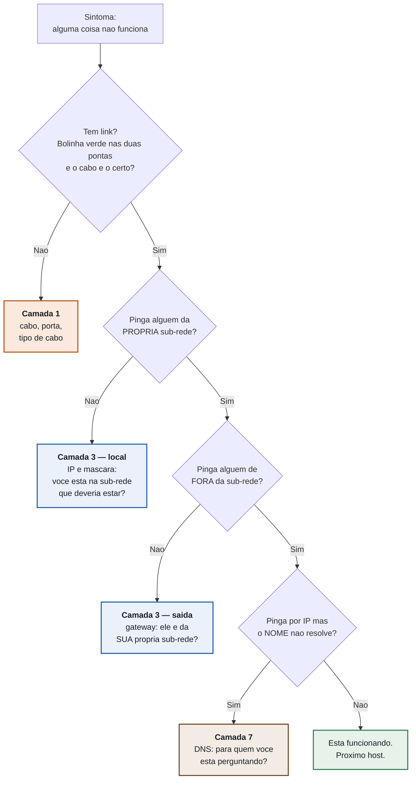

# 🟢 Aula 01 — Lab 0: Resgate

**Disciplina:** Redes de Computadores II (49309) — Uniube
**Professor:** Romualdo Mathias Filho
**Semana:** 1 · 🛠️ Prática (75 min)
**P11:** segunda, 27/07/2026 · VIA215 — **P12:** quinta, 30/07/2026 · VIA216

---

<b>Nosso caminho até aqui</b>

Esta é a primeira prática de Redes II, então o "até aqui" é **Redes I**. Nenhum defeito do laboratório de hoje exige algo que você ainda não viu — é de propósito: o objetivo de hoje não é conteúdo novo, é **método**.

Responda **antes** de abrir. O que você errar aqui é o que vai te custar tempo na caça, daqui a vinte minutos.

Você pinga o gateway com sucesso. O que isso <i>prova</i>, e o que não prova?

**Prova:** que existe caminho íntegro de ida e volta entre a sua máquina e a interface do roteador — cabo, porta, switch e a sua pilha IP local funcionando. Prova também, e isto quase todo mundo esquece, que **a sua máscara inclui o gateway**: se não incluísse, você nem teria tentado entregar o pacote a ele.

**Não prova:** que o roteador *encaminha* para os outros lados, que a rota existe, que o destino está no ar, nem que nomes resolvem. "Pinga o gateway" é um teste de trecho, não um atestado de saúde da rede.

Guarde a distinção: cada teste vale pelo que **elimina**, não pelo que confirma.

PC-A é 192.168.10.20/24 e PC-B é 192.168.10.200/26, no mesmo switch. Quem enxerga quem?

**A conversa fica torta — e é a assimetria, não a falha, que denuncia máscara.** Cada host calcula sozinho quem é vizinho:

- **PC-A (`/24`)** enxerga o bloco `192.168.10.0–255`. Para ele, PC-B é local: envia o quadro direto, sem gateway.
- **PC-B (`/26`)** enxerga só `192.168.10.192–255`. Para ele, PC-A é estrangeiro: manda para o gateway.

Um lado entrega direto e o outro pede carona ao roteador. Dependendo do que houver no caminho o ping pode até andar, por rota indireta — mas **a rede parou de ser simétrica**, e é isso que você tem de notar.

A lição que vale o semestre: **a máscara é a fronteira, e ela decide sozinha.** Cada VLAN da S03 vai ser uma sub-rede, e cada gateway da S05 vai depender desta conta.

O que um cabo console conecta, exatamente?

**A porta de gerenciamento, não o plano de dados.** O acesso por console existe para *configurar* o equipamento, tipicamente quando a rede está indisponível, e é deliberadamente independente do encaminhamento. **Nenhum quadro de usuário atravessa essa porta.**

Por isso "as duas caixas estão ligadas por um cabo" nunca é resposta para "há enlace de dados?". São perguntas sobre coisas diferentes.

**"Tem cabo" e "tem rede" são afirmações diferentes** — é o primeiro degrau do fluxo de diagnóstico, e o degrau em que mais gente escorrega em campo.

> [!INFO] 🎯 Visão geral e recursos
> Uma rede de campus foi entregue por um estagiário apressado. Ela está **quase** funcionando — e "quase" é a palavra mais cara da infraestrutura. Hoje você não monta uma rede: você **conserta** uma, e sai daqui com o método que vai usar em todos os laboratórios do semestre e na sua primeira semana de trabalho.
>
> **O que você leva desta aula**
> - O método de diagnóstico **de baixo para cima** — a sequência de perguntas que transforma "não funciona" em "está quebrado *aqui*".
> - Como usar o `ping` para **dividir o problema em dois** em vez de sair mexendo em configuração.
> - O ambiente do semestre inteiro no ar: conta NetAcad + Packet Tracer rodando na sua máquina.
> - **1 ponto da Atividade N1**, apurado na tela, antes de você sair da sala.
>
> **📂 Recursos**
> - [Plano de Ensino e Contrato](./Plano-de-Ensino-e-Contrato) — a referência do semestre: calendário das três turmas, nota, prazos e regras
> - [Cisco Packet Tracer + conta NetAcad](https://www.netacad.com/) — grátis, obrigatório, **instale antes de vir**. Sem ele você faz o laboratório na tela do colega, e ele vale ponto.
> - `lab00_resgate.pka` — o cenário de hoje, entregue em sala
> - [Vevox](https://vevox.app/) — exit ticket, anônimo e sem cadastro

### ⏱️ Os 75 minutos de hoje

| Min | Bloco | Onde está nesta página |
| :-- | :--- | :--- |
| 0–5 | Entrada, chamada, distribuição do cenário | — |
| 5–13 | **Nosso caminho até aqui** — 3 questões de Redes I, sem nota | bloco de abertura |
| 13–23 | **Setup** — NetAcad e Packet Tracer funcionando na sua máquina | Tópico 1 |
| 23–30 | **Worked example** — a sequência de diagnóstico, narrada no projetor | Tópico 2 |
| 30–33 | **Briefing** do cenário e das regras da caça | Tópico 3 |
| 33–57 | **Lab 0 em duplas** — a caça | Prática |
| 57–67 | **Debrief coletivo** — o que a sala achou, na ordem das camadas | Debrief |
| 67–70 | Reflexão + exit ticket | Fechamento |
| **70–75** | **Folga** — máquina que não instala, dúvida longa | — |

> [!NOTE] 🧭 P11 e P12 — a ordem é diferente para vocês, e isso é intencional
> **P11 (segunda):** você faz este laboratório **antes** da teórica de terça (28/07), conforme o horário emitido em 25/07 — o agrupamento das duas práticas nessa aula está em confirmação na secretaria. Os conceitos que reencontrar aqui voltam no diagnóstico da turma; você chega com a experiência na mão.
> **P12 (quinta):** se você já teve a teórica de terça, vai reconhecer aqui pelo menos um dos princípios que discutimos lá, vivo e mordendo. Repare em qual.

<aside class="au-antes">
<b class="au-nota-t">Antes de começar</b>

**Worked example (exemplo resolvido)** — uma solução completa, narrada passo a passo por quem já sabe, estudada *antes* de você tentar sozinho. Não é "o professor fazendo por você": é o andaime que libera memória de trabalho para você formar o método em vez de gastá-la procurando às cegas.

**Completion** — o percentual que o arquivo `.pka` calcula sozinho e mostra na tela, comparando a sua rede com a rede correta. É a nota do laboratório, apurada em sala.

**Quebra deliberada** — eu derrubo algo na sua topologia sem avisar o quê, e você descobre. A partir da S02 isso ocupa os últimos 20 minutos de toda prática. Hoje é aperitivo.

**Remendo** — mudar a infraestrutura para caber no host errado, em vez de corrigir o host. Funciona na aparência e **derruba** o seu Completion. Tem seção própria mais abaixo.

</aside>

---

## 📌 1. Ambiente pronto: NetAcad + Packet Tracer [Hands-on ⏳ 10 min]

O Packet Tracer é o laboratório desta disciplina por 20 semanas. Ele é gratuito, roda em Windows, macOS e Linux, e exige uma conta gratuita na Cisco Networking Academy — **a conta é a parte que demora**, não o download.

**Os três passos, nesta ordem:**

1. Criar a conta em [netacad.com](https://www.netacad.com/) e confirmar o e-mail (o link de confirmação às vezes cai no spam — olhe lá antes de tentar de novo).
2. Matricular-se no curso gratuito **"Getting Started with Cisco Packet Tracer"**. É ele que libera o download.
3. Baixar e instalar a versão **8.2 ou superior**, e abrir o programa uma vez logado, para validar a conta.

> [!WARNING] ⚠️ Gotcha de infraestrutura
> **A rede da sala não aguenta a turma inteira baixando ~250 MB ao mesmo tempo.** Se todo mundo baixar agora, ninguém baixa.
> Quem já instalou: levante a mão e **ajude o vizinho** — a sala termina este bloco 100% funcional, e essa é a meta real dos 10 minutos.
> Quem não conseguiu: sente com quem conseguiu. **Dupla resolve hoje**; até a próxima prática, resolva o seu.
> Falhou por política da máquina (notebook corporativo, sem permissão de administrador)? Me procure no fim da aula — existe caminho, mas ele é individual.

> [!TIP] 💡 Dica de produção
> Salve o arquivo do laboratório numa pasta que **não** seja o Desktop nem a pasta de Downloads sincronizada com nuvem. Simulador escreve no arquivo o tempo todo; sincronização automática no meio disso é a receita clássica de "meu trabalho sumiu" — e a versão que o serviço devolve costuma ser a de dez minutos atrás. Crie uma pasta local `Redes2/` e trabalhe nela o semestre inteiro.

---

## 📌 2. O método: um defeito resolvido no projetor [Worked example ⏳ 7 min]

Antes de você caçar, eu caço **um** — narrando cada pergunta em voz alta. Não é para você decorar a resposta: é para você copiar **a sequência de perguntas**.

### 2.1 A sequência

A regra é subir uma camada por vez, e **só subir quando a de baixo estiver provada**. Cada resposta elimina um conjunto inteiro de causas — é isso que separa diagnóstico de tentativa e erro.

> Mesma convenção de cor de todos os diagramas do semestre: **laranja = camada física**, **azul = camada de rede**, **marrom = camada de aplicação**, **verde = resolvido**.

### 2.2 O passo que quase todo mundo pula

O passo mais valioso do fluxo é o segundo, e é o mais ignorado: **pingar alguém da própria sub-rede antes de pingar a internet.**

Esse teste divide o problema em dois. Se o ping local **funciona**, você acabou de provar que o cabo, a porta, o switch e o seu próprio endereço estão bons — o defeito está na *saída* da rede. Se o ping local **falha**, nem adianta olhar gateway ou DNS: o problema está antes disso.

Quem começa perguntando *"o DNS está certo?"* está adivinhando. Quem começa perguntando *"eu enxergo o meu vizinho?"* está diagnosticando.

Numa rede **qualquer** — os endereços abaixo são de uma topologia de exemplo, não a de hoje — a sequência tem esta cara:

<b>PC-EXEMPLO</b> · Command Prompt · recorte

! 1. eu enxergo o meu vizinho? — o teste que divide o problema em dois
C:\&gt; ping 10.0.99.11
Pinging 10.0.99.11 with 32 bytes of data:
Request timed out.
Reply from 10.0.99.11: bytes=32 time&lt;1ms TTL=128
Reply from 10.0.99.11: bytes=32 time&lt;1ms TTL=128
Reply from 10.0.99.11: bytes=32 time&lt;1ms TTL=128
    Packets: Sent = 4, Received = 3, Lost = 1 (25% loss)
!
! o 1o timeout e o ARP, nao defeito: leia o conjunto, nunca a 1a linha.
! 2. local provado. agora: eu saio da sub-rede?
C:\&gt; ping 10.0.99.254
C:\&gt; ipconfig

Repare no que aconteceu: sem tocar em **nenhuma** configuração, o espaço de busca caiu de "a rede inteira" para um dos dois lados da fronteira. A linha marcada é a que fez o trabalho.

> [!WARNING] ⚠️ Gotcha — o primeiro pacote mente
> No Packet Tracer o **primeiro** `ping` de uma sequência quase sempre dá `Request timed out`: o host ainda está resolvendo o ARP do destino e o primeiro pacote morre esperando. **Isso não é defeito.** Leia sempre as quatro linhas e a estatística, nunca a primeira. Quem julga pela primeira linha vai "consertar" uma rede que já estava certa — e derrubar o próprio Completion.

Aposte antes de ver: um host pinga o gateway sem perda, mas não pinga nenhuma máquina da própria sala. Isso é possível?

**É possível, sim** — e é exatamente o tipo de resultado que parece contraditório até você olhar a máscara.

Se o host **alcança o gateway**, cabo, porta, switch e a pilha IP local estão funcionando: **camadas 1 e 2 eliminadas**. O que sobra é a fronteira da sub-rede. Uma máscara mais restritiva do que a da rede real coloca o host num bloco pequeno que **contém** o gateway e **exclui** os vizinhos — ele enxerga quem está no seu bloco e entrega todo o resto ao gateway, inclusive o colega que está a dois metros dele.

E aqui vem a parte que confunde: o roteador **pode** encaminhar esse tráfego de volta pela mesma interface — é o comportamento normal dele, e ele ainda avisa o host com um *ICMP redirect*. Então às vezes o ping até anda. O que **não** anda é a rede ser simétrica: um lado fala direto, o outro fala por intermediário, e o desempenho e o comportamento passam a depender de quem começou a conversa.

**A lição transferível:** "pinga o gateway" não é prova de que a rede está certa — é prova de que o caminho *até o gateway* está certo. E "o ping passou" também não é prova: **passou por onde?**

> [!TIP] 💡 Dica de produção
> Este exemplo resolvido no projetor não é enfeite: é **worked example**, e a pesquisa de carga cognitiva é bem estabelecida no ponto — quem é iniciante num domínio aprende mais estudando uma solução narrada do que tentando resolver do zero, porque a busca às cegas consome a memória de trabalho que deveria estar formando o esquema (Sweller, Ayres & Kalyuga, 2011).
>
> E o inverso também é verdade: conforme você ganha repertório, o exemplo pronto passa a **atrapalhar** — é o *expertise reversal effect* (Kalyuga et al., 2003). Por isso o andaime desta disciplina encolhe de propósito: até a S08 você tem exemplo completo; a partir da S11, só pedaços; da S16 em diante, o problema aberto direto. Se em novembro você achar que "o professor parou de explicar", é isso acontecendo, e é deliberado.

> [!NOTE] 💼 Pergunta de entrevista
> *"Um usuário liga dizendo que a internet caiu. Qual é a sua primeira pergunta?"*
>
> **Resposta esperada de um sênior:** *"Caiu para você só, ou para a sala inteira?"* — e logo depois: *"você consegue abrir alguma coisa pelo IP?"*. As duas perguntas custam dez segundos e cortam o espaço de busca pela metade cada uma: a primeira separa problema de host de problema de rede; a segunda separa conectividade de resolução de nome. Candidato júnior começa pedindo para reiniciar o roteador. **Sênior começa medindo o tamanho do incêndio.**

---

## 📌 3. O cenário: uma rede de campus com quatro defeitos [Briefing ⏳ 3 min]

Três sub-redes diretamente conectadas num roteador. Sem protocolo de roteamento, sem VLAN, sem nada que você ainda não tenha visto — **roteamento dinâmico é a S11, VLAN é a S03.** Hoje é tudo Redes I.

<figure class="au-fig">
<svg viewBox="0 0 660 300" role="img" aria-label="Topologia do laboratorio: tres sub-redes ligadas ao roteador R-CAMPUS. Administrativo 192.168.10.0/24 com dois PCs no switch SW-ADM, Laboratorio 192.168.20.0/24 com dois PCs no switch SW-LAB, e Servidores 192.168.30.0/24 com o SRV-PORTAL no switch SW-SRV">
<rect x="20" y="14" width="180" height="62" rx="6" fill="none" stroke="#2778c4" stroke-width="2"></rect>
<text x="110" y="34" text-anchor="middle" font-size="12" fill="#2778c4" font-family="monospace" font-weight="bold">ADMINISTRATIVO</text>
<text x="110" y="49" text-anchor="middle" font-size="11" fill="#8a8f98" font-family="monospace">192.168.10.0/24</text>
<text x="110" y="67" text-anchor="middle" font-size="11" fill="#8a8f98" font-family="monospace">PC-ADM1 · PC-ADM2</text>
<rect x="460" y="14" width="180" height="62" rx="6" fill="none" stroke="#2778c4" stroke-width="2"></rect>
<text x="550" y="34" text-anchor="middle" font-size="12" fill="#2778c4" font-family="monospace" font-weight="bold">LABORATÓRIO</text>
<text x="550" y="49" text-anchor="middle" font-size="11" fill="#8a8f98" font-family="monospace">192.168.20.0/24</text>
<text x="550" y="67" text-anchor="middle" font-size="11" fill="#8a8f98" font-family="monospace">PC-LAB1 · PC-LAB2</text>
<line x1="110" y1="76" x2="110" y2="104" stroke="#8a8f98" stroke-width="2"></line>
<rect x="55" y="104" width="110" height="28" rx="5" fill="none" stroke="#8a8f98" stroke-width="2"></rect>
<text x="110" y="123" text-anchor="middle" font-size="12" fill="#8a8f98" font-family="monospace">SW-ADM</text>
<line x1="550" y1="76" x2="550" y2="104" stroke="#8a8f98" stroke-width="2"></line>
<rect x="495" y="104" width="110" height="28" rx="5" fill="none" stroke="#8a8f98" stroke-width="2"></rect>
<text x="550" y="123" text-anchor="middle" font-size="12" fill="#8a8f98" font-family="monospace">SW-LAB</text>
<line x1="110" y1="132" x2="110" y2="168" stroke="#8a8f98" stroke-width="2"></line>
<line x1="110" y1="168" x2="240" y2="168" stroke="#8a8f98" stroke-width="2"></line>
<text x="150" y="162" font-size="10" fill="#8a8f98" font-family="monospace">G0/0</text>
<line x1="550" y1="132" x2="550" y2="168" stroke="#8a8f98" stroke-width="2"></line>
<line x1="550" y1="168" x2="420" y2="168" stroke="#8a8f98" stroke-width="2"></line>
<text x="480" y="162" font-size="10" fill="#8a8f98" font-family="monospace">G0/1</text>
<rect x="240" y="148" width="180" height="40" rx="6" fill="none" stroke="#00aa9f" stroke-width="2.5"></rect>
<text x="330" y="173" text-anchor="middle" font-size="13" fill="#00aa9f" font-family="monospace" font-weight="bold">R-CAMPUS (2911)</text>
<line x1="330" y1="188" x2="330" y2="216" stroke="#8a8f98" stroke-width="2"></line>
<text x="337" y="206" font-size="10" fill="#8a8f98" font-family="monospace">G0/2</text>
<rect x="275" y="216" width="110" height="28" rx="5" fill="none" stroke="#8a8f98" stroke-width="2"></rect>
<text x="330" y="235" text-anchor="middle" font-size="12" fill="#8a8f98" font-family="monospace">SW-SRV</text>
<line x1="330" y1="244" x2="330" y2="258" stroke="#8a8f98" stroke-width="2"></line>
<rect x="145" y="256" width="370" height="40" rx="6" fill="none" stroke="#2778c4" stroke-width="2"></rect>
<text x="330" y="273" text-anchor="middle" font-size="12" fill="#2778c4" font-family="monospace" font-weight="bold">SERVIDORES · 192.168.30.0/24</text>
<text x="330" y="288" text-anchor="middle" font-size="10" fill="#8a8f98" font-family="monospace">SRV-PORTAL 192.168.30.10 · DNS + HTTP · portal.uniube.local</text>
</svg>
<figcaption class="au-legenda">O verde marca o que já está correto e não deve ser tocado: o R-CAMPUS nas três interfaces e o SRV-PORTAL. Tudo o que está em azul é território de caça — os defeitos estão nos hosts, não na infraestrutura.</figcaption>
</figure>

**Existem quatro defeitos.** Cada um é **um valor trocado** — nunca dois no mesmo lugar — e cada um produz um sintoma **diferente**. Nenhum é pegadinha: os quatro são conteúdo de Redes I.

---

<b>Lab 0 "Resgate" — 24 min, em duplas</b>

1. Abra o arquivo `lab00_resgate.pka` no Packet Tracer.
2. **Antes de tocar em qualquer configuração**, rode o fluxo do bloco 2.1 em **um** host de cada sub-rede e anote o sintoma de cada um. Diagnóstico primeiro, correção depois.
3. Para cada sintoma, **nomeie a camada** antes de abrir a tela de configuração. Diga em voz alta para a sua dupla: *"isto é camada 1"*, *"isto é camada 3 local"*.
4. Corrija **um** defeito por vez e reteste. Corrigir dois de uma vez e o ping voltar não te diz qual dos dois era.
5. Clique em **`Check Results`** depois de cada correção e acompanhe o Completion subir.

**As regras da caça:**

| Regra | Detalhe |
| :--- | :--- |
| **Em dupla, falando alto** | Digam um ao outro o que vão testar **antes** de testar. Diagnóstico silencioso não se aprende. |
| **Não adicione nem remova equipamento** | Trocar cabo, se for o caso, pode. |
| **O que já está certo** | O **R-CAMPUS** está correto nas três interfaces. O **SRV-PORTAL** está correto, com DNS e HTTP no ar. Não gaste tempo neles. |

<b>Critério de pronto:</b> os quatro PCs <b>(1)</b> pingam <code>192.168.30.10</code> e <b>(2)</b> abrem <code>http://portal.uniube.local</code> <b>pelo nome</b>, no navegador — e o <code>Check Results</code> mostra <b>Completion ≥ 80%</b>. O cenário apura os valores corrigidos nos hosts <b>e</b> dois testes de conectividade de ponta a ponta; os testes existem justamente para impedir o "consertei o campo e não testei", e um deles só fecha se o acesso funcionar <b>pelo nome</b>, não pelo IP.

> [!WARNING] ⚠️ Gotcha — o erro que faz a nota **cair**
> A tentação, ao achar um host que não alcança o gateway, é mudar o **gateway** para bater com o host. Às vezes o ping até anda depois disso — e você acabou de trocar um defeito por dois, porque escondeu a causa real.
>
> O cenário compara o seu resultado com a rede correta: **remendo derruba o seu percentual.** Se um valor parece errado, pergunte antes *"qual dos dois lados é que está errado?"*. Na dúvida, o errado é quase sempre o **host** — foi ele que alguém configurou às pressas, não a infraestrutura.

> [!TIP] ✅ Como o ponto de hoje é apurado
> **Este laboratório vale 1 ponto da Atividade N1, e o ponto sai para quem fechar `Completion ≥ 80%`** — na tela, durante a aula. Você sai da sala sabendo a sua nota; não existe "depois eu corrijo".
>
> São seis laboratórios valendo ponto no semestre (Lab 0 a Lab 5) e contam **os cinco melhores** — o sexto é a sua margem para um dia ruim.

### Terminou antes? A quebra deliberada

Se a sua dupla fechar 100% antes do tempo, eu vou até a sua máquina, derrubo alguma coisa no roteador e digo só isto:

> *"Acabei de derrubar uma coisa. Você tem dois minutos para me dizer **qual** e **como descobriu**."*

Não é castigo por ser rápido: é o formato dos laboratórios a partir da S02, em que a quebra deliberada ocupa os últimos 20 minutos. Hoje ela é um aperitivo — **e o "como descobriu" vale mais do que o "qual".**

---

## 🧭 Debrief coletivo — de baixo para cima (10 min)

O debrief é **ao vivo, com a sala**, e a ordem em que a gente revisa **é** a lição. Não vamos do mais fácil ao mais difícil: subimos as camadas, porque é assim que se diagnostica. Esta página não adianta as respostas de propósito — se você chegar sabendo o que está quebrado, você não diagnosticou nada, só digitou.

Cada dupla vai responder, na sua vez, três perguntas sobre **um** dos defeitos que encontrou:

1. **Qual era o sintoma?** Não o que estava errado — o que o usuário teria reclamado.
2. **Qual teste te levou até ele, e o que esse teste eliminou?**
3. **Que camada era, e como você soube antes de abrir a configuração?**

Enquanto a sala responde, eu monto o quadro no projetor: uma linha por camada, do fio ao nome. **No fim, a coluna que interessa não é "o que estava errado" — é "que semana deste semestre vai cobrar isso de você de novo".** Adianto só o eixo: tudo o que você caçou hoje reaparece entre a S03 e a S05, quando cada VLAN virar uma sub-rede e cada sub-rede precisar do seu próprio gateway.

**A frase que abre o semestre:** a pergunta de Redes II é sempre *"isso quebrou na camada 2 ou na 3?"* — e hoje você respondeu isso quatro vezes, antes de a disciplina começar.

> [!TIP] 💡 Dica de produção
> Repare no formato das três perguntas: **sintoma → teste → camada**, nunca "qual era o erro". É o mesmo roteiro de um *post-mortem* de incidente em produção, e pela mesma razão: a equipe que só registra a correção repete a falha, porque não guardou o caminho. O que se documenta é o raciocínio, não o conserto.

> [!NOTE] 📌 P11, isto aqui é o seu adiantamento
> A aula de terça (28/07) é o contrato completo — cronograma, notas, acordos de sala votados pela turma, política de IA. Ela está publicada no [Plano de Ensino e Contrato](./Plano-de-Ensino-e-Contrato), então nada depende de você estar lá. **P11: você viu a prática antes da teoria**, então leve o essencial hoje: laboratório vale ponto na hora (`Completion ≥ 80%`), duplas são rotativas, toda prática tem quebra deliberada a partir da S02, toda aula abre com recuperação e fecha com exit ticket. **Datas travadas: Prova N1 em 22/09 · Prova N2 em 01/12.**
> **P12:** se você já teve a teórica, aqui é só a confirmação de que a prática cumpre o combinado.

---

<b>Interativo</b> · Vevox · 3 min

**Exit ticket.** Abra **vevox.app** e entre com o ID de sessão que está no projetor. Duas perguntas anônimas, sem nota:

1. *Qual assunto de Redes I você sente que mais esqueceu?*
2. *Qual foi o ponto mais confuso da aula de hoje?*

O que você responder aqui **abre a aula da semana que vem** — os pontos mais citados entram no retrieval de abertura. É por este canal que a turma dirige o ritmo da disciplina.

<b>Plano B:</b> sem rede na sala, as mesmas duas perguntas vão em meia folha de papel, recolhida na porta. Anônima do mesmo jeito, e eu leio antes de terça. O exit ticket nunca é cortado — ele é a entrada da próxima aula.

---

<b>Resumo da aula</b>

| Item | O que você precisa lembrar |
| :--- | :--- |
| **O método** | Link → ping local → ping externo → resolução de nome. Uma camada por vez, e só sobe quando a de baixo está provada. |
| **O teste que divide o problema em dois** | Ping para alguém da **própria sub-rede**. Funcionou? O defeito está na saída. Falhou? Está antes dela. |
| **Camada 1 — a pergunta** | Tem enlace, e o meio é o certo para este par de portas? **Ter cabo ≠ ter rede.** |
| **Camada 3 — a pergunta local** | IP e máscara: você está na sub-rede em que deveria estar? A máscara define a fronteira sozinha. |
| **Camada 3 — a pergunta de saída** | O gateway pertence à **sua** sub-rede? Se não, você não sai. |
| **Camada 7 — a pergunta** | Pinga por IP e o nome não resolve? Então quebrou o DNS, não a rede. |
| **O que "pinga o gateway" prova** | O caminho *até o gateway*, e que a sua máscara o inclui. Só isso — não é atestado de saúde da rede. |
| **O que "o ping passou" prova** | Que passou. **Não** por onde: rota indireta e ICMP redirect fazem rede torta parecer rede boa. |
| **Ler ping no Packet Tracer** | O 1º pacote costuma cair por ARP. Julgue pelas 4 linhas e pela estatística, nunca pela primeira. |
| **Critério de pronto do lab** | Os 4 PCs pingam `192.168.30.10` **e** abrem `http://portal.uniube.local` **pelo nome**. |
| **Nota de hoje** | 1 pt da Atividade N1, por `Completion ≥ 80%` (8 de 10 itens), na tela, em sala. |
| **Regra de ouro do remendo** | Mudar a infraestrutura para caber no host errado **derruba** o seu percentual. |
| **Um defeito por vez** | Corrigir dois e o ping voltar não diz qual dos dois era. |
| **Pendência** | Conta NetAcad + Packet Tracer instalados **antes da S02** — não há bloco de setup na próxima. |
| **Ferramenta do semestre** | Packet Tracer 8.2+, salvo em pasta local (nunca em pasta sincronizada com nuvem). |

<b>🎧 Revisão em áudio (~10 min)</b> — gerada por IA a partir desta página, para ouvir no trajeto. O áudio complementa; a página é a fonte.

<i>Disponível em breve.</i>

<b>Para pensar até a próxima aula</b>

Diagnosticar por comparação é barato: você acha a máquina que funciona, põe as duas telas lado a lado e o defeito salta. Metade das duplas de hoje vai ter feito exatamente isso, e está certo.

Mas numa rede corporativa as estações não nascem uma a uma — nascem de uma <b>imagem</b>, de um template, de um perfil distribuído do servidor. Quando o erro está na origem, ele chega idêntico em todo o parque.

<b>Quando todo mundo está errado do mesmo jeito, contra o que você compara?</b> E que documento precisaria existir na empresa para que essa pergunta tivesse resposta?

<b>Referências desta aula</b>

**Bibliografia da disciplina** — biblioteca virtual da Uniube:

- KUROSE, J. F.; ROSS, K. W. **Redes de computadores e a internet: uma abordagem top-down.** 8. ed. São Paulo: Pearson, 2021. cap. 1, seç. 1.5 — arquitetura em camadas; cap. 6, seç. 6.1 e 6.4 — camada de enlace e LANs comutadas
- TANENBAUM, A. S.; FEAMSTER, N.; WETHERALL, D. J. **Redes de Computadores.** 6. ed. São Paulo: Pearson, 2021. cap. 1, seç. 1.4 — modelos de referência; cap. 4, seç. 4.8 — comutação na camada de enlace
- CISCO NETWORKING ACADEMY. **CCNA: Switching, Routing, and Wireless Essentials (SRWE).** Cisco Systems, 2026. Disponível em: https://www.netacad.com/. módulo 1 — configuração básica e verificação de conectividade

**Evidência que sustenta o formato desta aula:**

- SWELLER, J.; AYRES, P.; KALYUGA, S. **Cognitive Load Theory.** New York: Springer, 2011. cap. 8 — The worked example effect
- KALYUGA, S.; AYRES, P.; CHANDLER, P.; SWELLER, J. The expertise reversal effect. **Educational Psychologist**, v. 38, n. 1, 2003. p. 23–31
- BEYER, B.; JONES, C.; PETOFF, J.; MURPHY, N. R. (org.). **Site Reliability Engineering: How Google Runs Production Systems.** Sebastopol: O'Reilly, 2016. cap. 12 — Effective Troubleshooting. Disponível gratuitamente em: https://sre.google/sre-book/effective-troubleshooting/

**Leitura de aprofundamento (15 min, em inglês):** o capítulo 12 do SRE Book descreve como engenheiros do Google diagnosticam sistemas em produção, e a estrutura é exatamente a que você usou hoje, num contexto muito maior: **triagem** (qual é o tamanho do incêndio?), **exame**, **diagnóstico** e só então **cura**. Insiste em dois pontos que valem para a sua carreira inteira: diagnóstico eficaz depende de **dividir o espaço de busca pela metade a cada teste** — literalmente o que o ping local faz no fluxo desta aula — e de **resistir à tentação de aplicar a correção antes de entender a causa**, porque remendo esconde a evidência e obriga a começar de novo na próxima ocorrência.

<b>Na próxima aula</b>

Hoje você consertou a rede sem nunca perguntar <b>como o switch decide para onde mandar cada quadro</b> — e não precisou, porque ele acertou sozinho. Na próxima prática você vai abrir a tabela MAC e ver que essa decisão é aprendida, não configurada. E vai descobrir o que o switch faz quando <i>não</i> sabe.

---

*Última atualização: 26/07/2026 · Sujeito à confirmação institucional (ver aviso na aula teórica).*

**◀ [Voltar ao índice da disciplina](./)**

