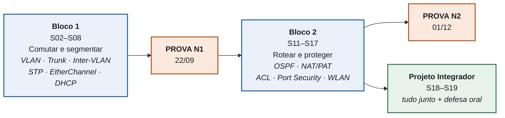

# 🟢 Aula 01: Plano de Ensino e Contrato da Disciplina

**Disciplina:** Redes de Computadores II (49309) · Ciência da Computação — Uniube
**Professor:** Romualdo Mathias Filho
**Semana:** 1 · **Data:** terça, 28/07/2026 · **Sala:** VIA203 · **Tipo:** 📘 Teórica (75 min)

---

> [!INFO] 🎯 Visão Geral da Aula & Recursos
> Em novembro você vai construir, sozinho, uma rede corporativa completa: segmentada em VLANs, com roteamento dinâmico, saída para a internet e política de acesso — e vai ter três minutos para defender por que fez cada escolha. **Hoje a gente combina como chegar lá.**
>
> **O que você vai dominar nesta aula**
> - Como a disciplina funciona por dentro — e por que ela vai parecer mais difícil do que uma aula expositiva, sendo mais eficaz.
> - O mapa completo: as 20 semanas, as datas das duas provas, os feriados que atingem a sua turma.
> - Onde cada um dos 100 pontos é ganho, com que instrumento e em que data.
>
> **📂 Recursos**
> - [Cisco Packet Tracer + conta NetAcad](https://www.netacad.com/) — grátis e obrigatório. **P12:** instalar até quinta 30/07. **P11:** você já precisou dele no Lab 0 de segunda — se não conseguiu instalar, me procure hoje, no intervalo.
> - [Wireshark](https://www.wireshark.org/download.html) — analisador de tráfego, grátis
> - [Vevox](https://vevox.app/) — usado nos exit tickets (anônimo, sem cadastro)
> - AVA Uniube On-line — entregas, Uniube+ e o vídeo de 6 min de cada semana

### ⏱️ Como os 75 minutos de hoje rodam

| Min | Bloco | Onde está nesta página |
| :-- | :--- | :--- |
| 0–5 | Abertura: o mapa do semestre em um slide | Tópico 2 |
| 5–25 | **O contrato** — buy-in, ritual da aula, acordos votados pela turma | Tópico 1 |
| 25–45 | **Diagnóstico Plickers** — 5 questões de Redes I, sem nota | Revisão Rápida |
| 45–47 | Pausa procedural (estreia do ritual) | Tópico 1 |
| 47–62 | **Demonstração ao vivo:** a rede plana que virou tempestade | Tópico 2 |
| 62–72 | Notas, datas, ferramentas e bibliografia | Tópico 3 |
| 72–75 | Exit ticket no Vevox | Fechamento |

---

## 🎯 Objetivo da Aula

Ao final desta aula você será capaz de:

- **Explicar** o que separa Redes I de Redes II — e por que a segunda é a disciplina em que a rede deixa de funcionar por acaso.
- **Localizar** qualquer semana do semestre no cronograma, sabendo o que cai, quando cai e em qual das três turmas.
- **Calcular** quanto vale cada entrega e o que precisa acontecer para você fechar os 60 pontos.
- **Negociar** e assumir os acordos de convivência da sala — porque quem escreve a regra cumpre a regra.

---

## 🔄 Revisão Rápida (5 min)

Redes II não recomeça: ela continua. Esta tabela é o contrato técnico entre as duas disciplinas — **e é exatamente o que o diagnóstico de hoje vai medir.**

| O que Redes I deixou pronto | Onde Redes II cobra isso de volta |
| :--- | :--- |
| **Endereçamento IPv4, máscara e sub-rede** | Cada VLAN é uma sub-rede. Errar a máscara na S03 derruba o roteamento inteiro da S05. |
| **Gateway padrão** | Em `router-on-a-stick` cada VLAN tem o seu — e o host que aponta para o gateway errado fica mudo. |
| **Modelo OSI: quem faz o quê** | A pergunta central do semestre é "isso quebrou na camada 2 ou na 3?". Sem OSI a resposta é chute. |
| **Switch × roteador** | Redes I disse que são diferentes. Redes II mostra *quando* o switch tem que virar roteador. |
| **DNS: quem resolve nome em endereço** | Toda VLAN nova precisa saber para onde perguntar. Servidor errado é o defeito que mais parece "internet caiu" sem ter caído. |

> [!NOTE] 🧭 Diagnóstico de hoje (20 min, **sem nota**)
> Cinco questões no Plickers, uma para cada linha da tabela acima. Não vale ponto e não vai para lugar nenhum. Serve para uma coisa só: **descobrir onde a turma está fraca antes de eu acelerar.** Responder errado hoje é barato. Responder errado na prova de setembro, não.
>
> Nas questões em que a turma acertar entre 35% e 70%, a gente vota, discute em dupla e vota de novo — é o ritual do semestre inteiro estreando aqui.

---

## 📌 1. O Contrato: como esta disciplina funciona [Teoria ⏳ 20 min]

### 1.1 O aviso que quase nenhum professor dá

Você vai trabalhar mais nesta disciplina do que numa aula expositiva tradicional. E vai **sentir que está aprendendo menos.**

Isso não é uma impressão sua: é um resultado medido. Deslauriers e colegas (2019, PNAS) puseram alunos de Harvard em duas versões da mesma aula — expositiva excelente e ativa. Os da ativa **aprenderam mais** e **avaliaram a própria aprendizagem como pior**. A fluência da aula expositiva é confortável e engana; o esforço da aula ativa incomoda e funciona.

Estou dizendo isso na primeira aula de propósito, e vou lembrar em novembro. Sem esse combinado, o método vira reclamação em vez de virar nota.

**O que sustenta a escolha:** aprendizagem ativa eleva desempenho em g = 0,47 e derruba a reprovação de 33,8% para 21,8% (Freeman et al., 2014, PNAS) — e o ganho é **maior para quem chega com menos base** (Theobald et al., 2020, PNAS). Se você acha que está atrás, este formato é a seu favor, não contra.

### 1.2 O ritual de toda aula

| Momento | O que acontece | Quanto dura |
| :--- | :--- | :--- |
| **Abertura** | 4 questões de recuperação — 3 da semana passada, 1 antiga. Sem nota. | 6 min |
| **Gancho** | Uma história real de rede que caiu, terminando numa pergunta. | 2 min |
| **Exposição em blocos** | Nunca mais de 15 min seguidos falando. | — |
| **Pausa procedural** | "Comparem anotações com o colega. Eu fico calado." | 2 min |
| **ConcepTest** | Você vota → discute com o vizinho → vota de novo. | 8 min, 2× |
| **Exit ticket** | "O que ficou mais confuso hoje?" — e isso abre a aula seguinte. | 3 min |

> [!TIP] 💡 Dica de Produção (Pro-Tip)
> A abertura com 4 questões parece perda de tempo. É o oposto: **recuperar da memória é o que fixa**, não reler. O efeito é robusto (g ≈ 0,50, Rowland 2014) e cresce quando as questões voltam com uns 7 dias de intervalo (d = 0,54, Mawson & Kang 2025). É por isso que sempre tem uma questão velha na abertura — a "espiral". Quem estuda relendo o slide na véspera sente que sabe. Quem responde às perguntas descobre que não sabia, com tempo de corrigir.

> [!WARNING] ⚠️ Gotcha de Infraestrutura
> A rede da faculdade não aguenta vinte downloads simultâneos do Packet Tracer. **Instale em casa, hoje.**
> **P12 (quinta):** você tem até 30/07 — chegar sem o simulador é passar o laboratório olhando a tela do colega, e o Lab 0 vale ponto. **P11 (segunda):** o seu Lab 0 foi ontem; se você não conseguiu instalar a tempo, me procure hoje que a gente resolve antes que vire nota perdida.

### 1.3 Os acordos de sala — a gente escreve juntos

Regra que o professor decreta, o aluno obedece. Regra que a turma escreve, a turma cobra. Há evidência consistente de que normas coconstruídas geram menos violação do que normas impostas, e os centros de ensino de Cornell e Harvard tratam isso como prática padrão de primeira aula.

**Hoje a turma propõe e vota 4 a 5 acordos.** Eu entro com quatro propostas na mesa; vocês cortam, mudam e acrescentam:

1. **Celular é agendado, não proibido.** Há janelas em que o celular *é* a ferramenta (Vevox, consultar documentação) e janelas de tela para baixo (recuperação, prova, defesa). Proibição total não se sustenta na evidência; distração, sim (Ravizza et al., 2017).
2. **Pergunta errada é matéria-prima.** O distrator de um ConcepTest sai de erro real cometido nesta sala. Errar em voz alta acelera a turma inteira.
3. **Dupla é rotativa.** Ninguém passa o semestre com o mesmo par — e ninguém carrega o outro no laboratório.
4. **Quem chega atrasado entra em silêncio.** A abertura é curta e é a parte que mais rende; ela não para.

> [!NOTE] 💼 Pergunta de Entrevista
> *"Você entrou num time e a rede do cliente não tem documentação. Por onde começa?"*
>
> **Resposta esperada de um sênior:** antes de tocar em qualquer configuração, levantar o estado atual — topologia física, tabela de VLANs, endereçamento, rotas — e **escrever isso**. Mudança sem inventário é aposta. É exatamente por isso que a documentação vale ponto na rubrica do projeto integrador deste semestre: no mercado, a rede que ninguém consegue desenhar é a rede que ninguém consegue consertar.

### 🧠 Checkpoint: Teste seu Conhecimento!

<b>🔍 Se aula ativa dá mais resultado, por que tanto aluno prefere a aula expositiva?</b>

<blockquote>

**Resposta:** porque a aula expositiva boa é **fluente** — ela é fácil de acompanhar, e o cérebro confunde facilidade de processamento com aprendizagem. Deslauriers et al. (2019) mediram exatamente essa dissociação: mais aprendizagem real, menos percepção de aprendizagem. A consequência prática para você é que **o desconforto do retrieval é sinal de que está funcionando**, não sinal de aula mal dada.

</blockquote>

---

## 📌 2. O Mapa: cronograma, calendário e as três turmas [Teoria + Demonstração ⏳ 20 min]

### 2.1 O arco do semestre

> Cores fixas de propósito: azul = conteúdo, laranja = avaliação, verde = entrega final. É a mesma convenção em todos os diagramas do semestre — se algo estiver laranja, é dia de nota.

**Redes I ensinou a rede a funcionar. Redes II ensina a rede a não cair** — e a não deixar o problema de um setor derrubar os outros.

### 2.2 A demonstração de hoje: a rede plana que virou tempestade

Antes do cronograma, um problema real, montado ao vivo no Packet Tracer: **quarenta hosts pendurados num único switch, sem nenhuma divisão.** Cada broadcast que qualquer máquina emite chega a todas as outras. Basta um laço acidental de cabo, ou uma placa defeituosa repetindo quadros, para o tráfego se multiplicar até que ninguém mais consiga transmitir nada. A rede não é invadida nem desligada — ela se afoga sozinha.

> [!NOTE] 🃏 ConcepTest Plickers #1
> **Durante a demonstração, antes de eu apertar o botão:** o que acontece com o *ping* entre dois hosts que estão do outro lado da sala, sem nenhuma relação com a máquina defeituosa?
>
> Vote, discuta com o vizinho, vote de novo. A resposta é a razão de existir a semana S03.

A pergunta que essa demonstração deixa em aberto — *"como impedir que o problema de um setor afogue os outros?"* — é literalmente a primeira frase da aula de VLANs, daqui a duas semanas. Guarde a imagem: você vai reencontrá-la.

### 2.3 Semana a semana

Três turmas, três calendários. **T** = teórica de terça (todos juntos, VIA203) · **P11** = prática de segunda (VIA215) · **P12** = prática de quinta (VIA216).

| S | Terça (T) | Segunda (P11) | Quinta (P12) | Conteúdo | Laboratório |
|:-:|:-:|:-:|:-:|---|---|
| **01** | 28/07 | 27/07 | 30/07 | Contrato + diagnóstico de Redes I | **Lab 0** — Resgate: setup + "conserte esta rede" |
| **02** | 04/08 | 03/08 | 06/08 | Comutação: tabela MAC, domínios de colisão e broadcast | **Lab 1** — Switching básico |
| **03** | 11/08 | 10/08 | 13/08 | VLANs: conceito, criação, portas de acesso | **Lab 2** — VLANs |
| **04** | 18/08 | 17/08 | 20/08 | Trunking 802.1Q (+ a tag vista no Wireshark) | **Lab 3** — Trunk entre switches |
| **05** | 25/08 | 24/08 | 27/08 | Roteamento entre VLANs · **consolidação** | **Lab 4** — Router-on-a-stick |
| **06** | 01/09 | 🚫 31/08 | 03/09 | STP: por que um loop de camada 2 derruba a rede | P12: desafio broadcast storm |
| **07** | 08/09 | 🚫 07/09 | 10/09 | EtherChannel + redundância de gateway (FHRP) | P12: desafio EtherChannel |
| **08** | 15/09 | 14/09 | 17/09 | DHCPv4 · SLAAC/DHCPv6 · **revisão N1** | **Lab 5** — DHCP + revisão de STP (a compensação da P11) |
| **09** | 🎯 **22/09 — PROVA N1** | 21/09 | 24/09 | Prova em duas etapas | Troubleshooting integrador |
| **10** | 29/09 | 28/09 | 01/10 | **Vista da N1** — devolutiva por erro · **consolidação** | Refazer os cenários da prova |
| **11** | 06/10 | 05/10 | 08/10 | Roteamento dinâmico + OSPF: introdução | Lab 6 *(formativo)* — OSPF área única |
| **12** | 🚫 13/10 | 🚫 12/10 | 15/10 | (feriados) | P12: prática espiral de OSPF |
| **13** | 20/10 | 19/10 | 22/10 | OSPF: custo, DR/BDR, verificação | Lab 7 *(formativo)* — Diagnóstico OSPF |
| **14** | 27/10 | 26/10 | 29/10 | NAT estático, dinâmico e PAT | Lab 8 *(formativo)* — NAT/PAT |
| **15** | 03/11 | 🚫 02/11 | 05/11 | ACLs padrão: lógica, wildcard, posicionamento | P12: exercícios de ACL |
| **16** | 10/11 | 09/11 | 12/11 | ACLs estendidas + segurança de camada 2 | Lab 9 *(formativo)* — ACL + port security |
| **17** | 17/11 | 16/11 | 19/11 | WLAN: 802.11, WPA2/WPA3, configuração | Lab 10 *(formativo)* — WLAN |
| **18** | 24/11 | 23/11 | 26/11 | **Projeto integrador** + início das defesas | Projeto (vale nota na N2) |
| **19** | 🎯 **01/12 — PROVA N2** | 30/11 | 03/12 | Prova em duas etapas | Defesas orais restantes |
| **20** | 08/12 | 07/12 | 10/12 | **Vista da N2** + substituta + fechamento | — |

🚫 = feriado. **Feriados que atingem a disciplina:** 31/08 · 07/09 · 12/10 · 13/10 · 02/11.
**Em negrito, os laboratórios que valem ponto** (Lab 0 a 5). Os marcados *(formativo)* são obrigatórios e registrados, mas **não valem nota** — o porquê está no bloco 3.1.

> [!WARNING] ⚠️ Sujeito a confirmação da secretaria
> A terça reúne as turmas 11 e 12 na VIA203 conforme o horário publicado em 25/07, e o conteúdo programático acima segue a ementa da disciplina. **Sala, agrupamento e ementa só se tornam definitivos após a confirmação institucional, prevista para a semana que vem** — qualquer ajuste sai no AVA, não no boca a boca. As datas das provas (22/09 e 01/12) e a distribuição de pontos não mudam.

### 2.4 A assimetria — e por que ela não te prejudica

Repare na coluna da segunda: **a P11 perde quatro aulas em feriado; a P12 não perde nenhuma.** Se cada prática seguisse o próprio ritmo, em novembro as turmas estariam a quatro laboratórios de distância.

A regra do cronograma resolve isso: **laboratório novo só cai em semana em que as duas práticas se encontram.** Nas semanas em que só a P12 tem aula (S06, S07, S12, S15), ela recebe aprofundamento **sem nota** — desafio, diagnóstico extra — e o conteúdo novo fica na teórica de terça, que todo mundo assiste.

**Consequência direta para a prova:** STP e EtherChannel entram na N1 pedindo **leitura e análise, nunca configuração** — porque configurar isso só a P12 praticou em laboratório. Nenhuma questão cobra algo que a sua turma não teve chance de fazer.

> [!TIP] 💡 Dica de Produção (Pro-Tip)
> Guarde a lógica desta seção, porque ela é a mesma de uma janela de manutenção real: quando um time perde capacidade (feriado, incidente, gente de férias), você **não corta o crítico** — corta o acessório e protege o caminho principal. Aqui, o acessório é o aprofundamento de WLAN; o caminho principal é VLAN → roteamento → ACL. Se o semestre atrasar, é WLAN que encolhe.

> [!WARNING] ⚠️ Gotcha de Infraestrutura
> Há sábados de reposição marcados no calendário acadêmico (29/08, 12/09, 03/10, 24/10, 07/11), mas **qual dia da semana cada um repõe ainda não está confirmado com a secretaria.** Não assuma que o seu sábado é o seu dia. Confirmação até a S02 — e ela sai no AVA, não no boca a boca.

### 🧠 Checkpoint: Teste seu Conhecimento!

<b>🔍 A P11 perde quatro segundas. Por que a prova N1 não pode cobrar configuração de STP?</b>

<blockquote>

**Resposta:** porque as semanas de STP e EtherChannel (S06 e S07) caem justamente em 31/08 e 07/09, feriados de segunda — **a P11 não tem laboratório nessas semanas.** Cobrar configuração seria avaliar uma habilidade que só uma das turmas teve oportunidade de praticar. A matriz da prova resolve isso cobrando *explicar* e *analisar* (vistos na teórica de terça, que é conjunta) e deixando o *configurar* para os conteúdos que as duas práticas fizeram.

Guarde o princípio, que vale para além da prova: **avaliação justa cobra o que foi ensinado, na forma em que foi praticada.**

</blockquote>

---

## 📌 3. Avaliação, ferramentas e bibliografia [Teoria ⏳ 10 min]

### 3.1 Onde estão os 100 pontos

Aprovação: **≥ 60 pontos** e **frequência ≥ 75%**.

| Etapa | Total | Prova | Atividade | Uniube+ |
| :--- | :-: | :-- | :-- | :-: |
| **N1** — fecha na S09/S10 | **35** | 25 — prova de 22/09 | 5 — labs `.pka` (Lab 0 a 5, 1 pt cada, contam os **5 melhores**) | 5 |
| **N2** — fecha na S19/S20 | **50** | 30 — prova de 01/12 | 6 — projeto integrador (dupla) 4 — defesa oral (individual) | 10 |
| **Institucional** | **15** | 15 — data definida pela instituição | — | — |

> [!TIP] ✅ Como o ponto do laboratório é apurado — leia isto uma vez e nunca mais tenha dúvida
> O arquivo `.pka` carrega os testes dentro dele e mostra o seu **Completion** na própria tela, durante a aula. **Vale o ponto quem fecha com Completion ≥ 80%.** Você sai da aula sabendo a nota; não existe espera nem "depois eu corrijo".
>
> São **seis** laboratórios valendo (Lab 0 a Lab 5) e contam **os cinco melhores** — o sexto é a sua margem para uma falta, uma internet que caiu ou um dia ruim. O teto continua sendo 5 pontos: fazer os seis não dá 6.

**Os laboratórios 6 a 10 (S11–S17) não valem nota.** Isso é decisão de projeto, não descuido: o ponto da N2 está no projeto integrador, que cobra exatamente as mesmas habilidades (OSPF, NAT, ACL). Laboratório sem nota é laboratório em que dá para errar de propósito — e é errando de propósito que se aprende diagnóstico.

### 3.2 A prova em duas etapas

Os 75 minutos da terça de prova funcionam assim:

| Minuto | O quê |
| :-- | :-- |
| 0–50 | **Etapa individual.** Prova completa, sem consulta, sem dispositivos. |
| 50–55 | Entrega. Grupos de 3 a 4 sorteados na hora. |
| 55–73 | **Etapa em grupo.** O grupo refaz **as 4 questões mais difíceis**, uma folha só, consenso obrigatório. |
| 73–75 | Recolhimento. |

Sua nota é a individual (21 ou 26 pontos) **mais** a de grupo (4 pontos).

Por que assim: a discussão acontece no pico de ativação da memória — você acabou de sofrer com a questão. O erro é descoberto em cinco minutos, não em duas semanas. A evidência aponta mais retenção e menos ansiedade, com preferência esmagadora dos alunos (CBE-LSE 2018; Callaghan et al., 2025).

> [!TIP] 💡 Dica de Produção (Pro-Tip)
> **Toda prova nasce de uma matriz de especificação**, e cada uma gera três formas paralelas: A (prova), B (substituta) e C (recuperação). Muda o cenário e os valores; a matriz é a mesma. Você não está sendo avaliado por sorte de tema — está sendo avaliado pelos objetivos declarados no início do semestre, e eles estão publicados.

> [!NOTE] 💼 Pergunta de Entrevista
> *"Como você usa IA no trabalho?"* — a pergunta já é padrão em entrevista técnica, e a resposta ruim é qualquer um dos dois extremos.
>
> **Resposta de sênior:** "Uso para acelerar o que eu já sei verificar. Peço rascunho de configuração, mas eu leio linha a linha antes de aplicar, porque o modelo erra com confiança — e num roteador de produção o erro derruba o cliente." É essa postura que a **defesa oral** deste semestre mede: não se você usou IA, mas se você entende o que entregou.

### 3.3 Política de IA — declarar, não caçar

A régua é a escala AIAS, declarada por instrumento:

| Instrumento | Nível | Na prática |
| :--- | :-- | :--- |
| Provas N1, N2 e Institucional | **1 — Sem IA** | Em sala, sem dispositivos |
| Laboratórios `.pka` | **2 — IA no planejamento** | Pode pesquisar e perguntar; a configuração é sua e o `.pka` valida |
| Projeto integrador | **3 — Colaboração** | Uso livre **com declaração de 3 linhas**: o que pediu, o que aproveitou, o que corrigiu |
| Defesa oral | **1 — Sem IA** | 3 minutos explicando as suas decisões |

**Detector de IA não é usado nem aceito como evidência nesta disciplina.** O motivo é técnico: essas ferramentas produzem falso positivo em taxa alta contra quem não escreve em inglês nativo — a Universidade Vanderbilt desativou o detector do Turnitin exatamente por isso. Declarar o uso não desconta nota. **Não declarar um uso que aparecer na defesa, desconta.**

> [!NOTE] 🃏 ConcepTest Plickers #2
> Um colega entrega o projeto integrador com uma ACL que funciona perfeitamente e escreve na declaração: *"pedi a configuração à IA, testei e estava certa."* Na defesa, não sabe dizer por que a regra está posicionada naquele roteador e não no outro.
>
> **O que acontece com a nota dele?** Vote, discuta com o vizinho, vote de novo.

### 3.4 As ferramentas do semestre

| Momento | Ferramenta | Custo | Você precisa de conta? |
| :--- | :--- | :-- | :--- |
| Laboratórios | **Cisco Packet Tracer** | Grátis | **Sim** — conta NetAcad, resolver esta semana |
| Votação em aula | **Plickers** | Grátis | **Não** — é cartão de papel, sem celular |
| Exit ticket | **Vevox** | Grátis | **Não** — anônimo, por QR |
| Análise de tráfego | **Wireshark** | Grátis | Não |
| Revisão pré-prova | **Gemini Notebook** | Grátis | Opcional — o áudio de revisão sai publicado no AVA |
| Material das aulas | **Este portal** | — | Não |
| Entregas e Uniube+ | **AVA Uniube On-line** | — | Institucional |

Nenhuma atividade que vale nota exige que você crie conta em serviço estrangeiro além do Packet Tracer, que é exigência técnica da Cisco e está declarada aqui. Onde há cadastro, há caminho equivalente sem cadastro.

### 3.5 Bibliografia

**Básica** — disponível na biblioteca virtual da Uniube:

1. **KUROSE, J. F.; ROSS, K. W.** *Redes de computadores e a internet: uma abordagem top-down.* 8. ed. São Paulo: Pearson, 2021. → **Cap. 4 (camada de rede), Cap. 5 (roteamento), Cap. 6 (camada de enlace e LANs), Cap. 7 (redes sem fio)**.
2. **TANENBAUM, A. S.; FEAMSTER, N.; WETHERALL, D. J.** *Redes de Computadores.* 6. ed. São Paulo: Pearson, 2021. → **Cap. 4 (subcamada de acesso ao meio: VLANs, comutação, STP), Cap. 5 (camada de rede: roteamento)**.
3. **LACERDA, P. S. P. et al.** *Projeto de Redes de Computadores.* Porto Alegre: Sagah, 2021. → **Cap. 1 e 2 — projeto e documentação de rede** (base direta do projeto integrador).

**Complementar:**

4. **ROHLING, L. J.** *Segurança de redes de computadores.* Contentus, 2020. → apoio para ACLs e segurança de camada 2 (S15–S16).
5. **Cisco Networking Academy.** *CCNA: Switching, Routing, and Wireless Essentials (SRWE)* — curso gratuito em [netacad.com](https://www.netacad.com/), com laboratórios em Packet Tracer. **É a espinha dorsal do nosso conteúdo**: quem acompanhar o SRWE em paralelo cobre a disciplina inteira.
6. **RFCs de referência**, citadas nas aulas correspondentes: [2131](https://www.rfc-editor.org/rfc/rfc2131) (DHCP) · [2328](https://www.rfc-editor.org/rfc/rfc2328) (OSPFv2) · [3022](https://www.rfc-editor.org/rfc/rfc3022) (NAT) · [802.1Q](https://standards.ieee.org/ieee/802.1Q/) (VLAN tagging, IEEE).

> [!TIP] 💡 Dica de Produção (Pro-Tip) — duas atualizações que valem para a sua carreira
> **O Kurose já está na 9ª edição** (Pearson, junho/2025), com HTTP/3, QUIC, Wi-Fi 6 e 5G. A 8ª em português continua sendo a da nossa biblioteca e cobre tudo o que a disciplina exige — mas se você lê em inglês e quer o estado da arte, a 9ª é onde ele está.
>
> **Vai fazer o CCNA?** O exame vigente é o **200-301 v1.1**. A Cisco anunciou em maio/2026 a versão **v2.0**, com mais troubleshooting e mais automação — e ela **só entra em vigor em fevereiro de 2027**. Se a sua meta é certificar ainda em 2026, você faz a v1.1, que é exatamente o que este semestre cobre.
>
> *Ambas as informações foram conferidas em 26/07/2026 nas páginas da Pearson e da Cisco. Datas de certificação mudam: confirme na fonte antes de comprar o voucher.*

### 🧠 Checkpoint: Teste seu Conhecimento!

<b>🔍 Você tirou 18 na prova N1 (de 25), fez os 6 laboratórios com Completion acima de 80% e zerou o Uniube+. Quanto você tem da N1, e isso é confortável?</b>

<blockquote>

**Resposta:** **23 dos 35 pontos.** A conta é 18 (prova) + 5 (labs — são 6 laboratórios valendo 1 ponto, mas contam os **5 melhores**, então o teto é 5) + 0 (Uniube+).

**E não, não é confortável.** Faltam 37 pontos para a aprovação e restam 65 disponíveis (N2 = 50 + Institucional = 15). Dá, mas sem folga nenhuma — e os 5 pontos do Uniube+ eram os mais baratos do semestre. O corte de risco da disciplina é justamente esse: quem chega na S10 com menos de 21 pontos na N1 tem conversa individual marcada, antes de a N2 abrir.

</blockquote>

---

## 🎬 Fechamento — Exit Ticket (3 min)

Toda aula termina do mesmo jeito: duas perguntas anônimas, sem nota, no **Vevox**. O que você responder aqui **abre a aula da semana que vem** — os pontos mais citados como confusos entram no retrieval de abertura. Não é formalidade: é o canal pelo qual a turma dirige o ritmo da disciplina.

**Hoje:**
1. *O que mais te preocupa nesta disciplina?*
2. *Qual foi o ponto mais confuso da aula de hoje?*

> [!INFO] 📲 Como responder
> **QR projetado no slide final** — ou acesse [vevox.app](https://vevox.app/) e digite o ID de sessão que aparece na tela.
> Anônimo, sem cadastro, funciona em qualquer celular. Sem sinal? Meia folha de papel na saída resolve.

---

  
<b>🎧 Revisão em áudio (~10 min)</b> — gerada por IA a partir desta página, para ouvir no trajeto. O áudio complementa; a página é a fonte.

  
<i>Disponível em breve.</i>

## 📋 Resumo Estrutural

| Item | O que você precisa lembrar |
| :--- | :--- |
| **Aprovação** | ≥ 60 pontos **e** ≥ 75% de frequência |
| **Distribuição** | N1 = 35 · N2 = 50 · Institucional = 15 |
| **Datas travadas** | Prova N1: **22/09** · Prova N2: **01/12** · Vistas: 29/09 e 08/12 |
| **Formato da prova** | Duas etapas — 50 min individual + 18 min em grupo nas 4 questões mais difíceis |
| **Laboratórios que valem nota** | Lab 0 a 5 (S01–S08), 1 pt cada, **Completion ≥ 80%**, contam os 5 melhores |
| **Laboratórios formativos** | Lab 6 a 10 (S11–S17) — Completion registrado, sem nota |
| **Projeto integrador** | 6 pts em dupla + 4 pts de defesa oral individual (S18–S19) |
| **Feriados da disciplina** | 31/08 · 07/09 · 12/10 · 13/10 · 02/11 |
| **Regra da assimetria** | Lab novo só em semana em que P11 e P12 se encontram |
| **Política de IA** | Declarar por instrumento (AIAS 1 a 3). Sem detector de IA. |
| **Celular** | Agendado, não proibido — janelas declaradas |
| **Pendência da semana** | Conta NetAcad criada + Packet Tracer instalado — **P12 até 30/07**; P11, se ainda não instalou, falar comigo hoje |
| **Toda aula termina com** | Exit ticket no Vevox — e é ele que abre a aula seguinte |

---

## 📄 Artigo de Aprofundamento

- [Establishing Community Agreements and Classroom Norms — Cornell Center for Teaching Innovation](https://teaching.cornell.edu/resource/establishing-community-agreements-and-classroom-norms)

> *Resumo prático:* o material de Cornell sistematiza por que normas **coconstruídas** superam normas impostas — a turma que escreve a regra reporta menos violações dela — e traz o roteiro de facilitação: propor poucas normas iniciais, abrir para emenda, votar e **documentar num lugar acessível**. É exatamente o procedimento adotado no bloco 1.3 desta aula, e a razão de os acordos ficarem registrados nesta página em vez de morrerem no quadro. Leitura complementar de 10 minutos, útil para quem for dar aula, treinar equipe ou liderar time técnico — a mecânica de fazer o grupo escrever o próprio contrato é a mesma.

---

## 📚 Referências Bibliográficas

**Bibliografia da disciplina:**

- **KUROSE, James F.; ROSS, Keith W.** *Redes de computadores e a internet: uma abordagem top-down.* 8. ed. São Paulo: Pearson Education do Brasil, 2021. **(Cap. 6 — Camada de enlace e redes locais.)**
- **TANENBAUM, Andrew S.; FEAMSTER, Nicholas; WETHERALL, David J.** *Redes de Computadores.* 6. ed. São Paulo: Pearson, 2021. **(Cap. 4 — Subcamada de acesso ao meio: comutação, VLANs e STP.)**
- **LACERDA, P. S. P.; SOARES, J. A.; LENZ, M. L. et al.** *Projeto de Redes de Computadores.* Porto Alegre: Sagah, 2021. **(Cap. 1 — Introdução e projeto de rede.)**
- **CISCO SYSTEMS.** *CCNA: Switching, Routing, and Wireless Essentials (SRWE).* Cisco Networking Academy, 2026. Disponível em: https://www.netacad.com/.

**Evidência que sustenta o formato desta disciplina** — citada ao longo da aula:

- **FREEMAN, S. et al.** Active learning increases student performance in science, engineering, and mathematics. *PNAS*, v. 111, n. 23, p. 8410–8415, 2014.
- **DESLAURIERS, L. et al.** Measuring actual learning versus feeling of learning in response to being actively engaged in the classroom. *PNAS*, v. 116, n. 39, p. 19251–19257, 2019.
- **THEOBALD, E. J. et al.** Active learning narrows achievement gaps for underrepresented students. *PNAS*, v. 117, n. 12, p. 6476–6483, 2020.
- **ROWLAND, C. A.** The effect of testing versus restudy on retention: a meta-analytic review of the testing effect. *Psychological Bulletin*, v. 140, n. 6, 2014.
- **MAWSON, R.; KANG, S. H. K.** Espaçamento e recuperação: intervalo ótimo de retomada (d = 0,54). *Behavioral Sciences*, v. 15, art. 771, 2025.
- **RAVIZZA, S. M. et al.** Logged in and zoned out: how laptop internet use relates to classroom learning. *Psychological Science*, 2017.
- **CBE — Life Sciences Education**, v. 17, art. 21, 2018; e **CALLAGHAN, T. et al.**, 2025 (arXiv:2504.04281) — provas em duas etapas: retenção, ansiedade e preferência dos alunos.
- **CORNELL CENTER FOR TEACHING INNOVATION.** *Establishing Community Agreements and Classroom Norms.* Disponível em: https://teaching.cornell.edu/resource/establishing-community-agreements-and-classroom-norms.

---

*Última atualização: 26/07/2026.*

**◀ [Voltar ao índice da disciplina](./)**
