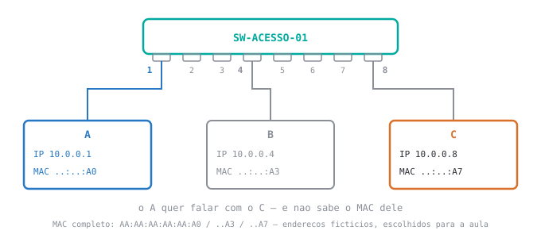
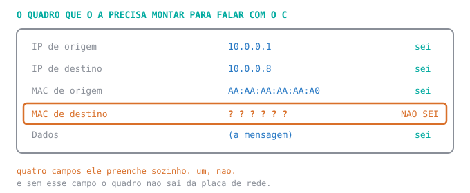
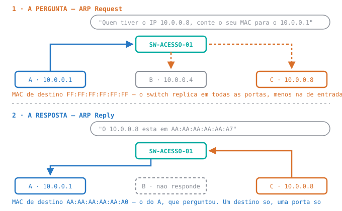
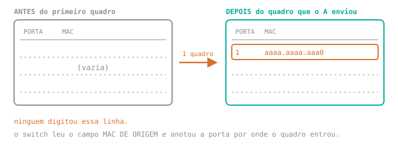
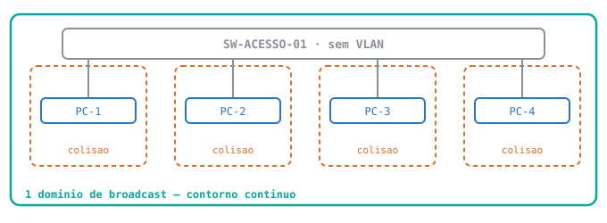

<div class="au-leitura" data-aula="s02">

# 🟢 Aula 02 — Comutação: do endereço MAC à tabela do switch

**Disciplina:** 49309 — Redes de Computadores II — Uniube<br>
**Professor:** Romualdo Mathias Filho · **romualdo.filho@uniube.br**<br>
**Data:** Terça, 11/08/2026 · **VIA203** · 📘 Teórica (75 min)<br>
**Turmas práticas:** P11 segunda · VIA215 — P12 quinta · VIA216<br>
**Página de referência:** [Plano de Ensino e Contrato](./Plano-de-Ensino-e-Contrato)

---

<div class="au-caminho">
<b>Nosso caminho até aqui</b>

Primeira aula de conteúdo: não há semana anterior para retomar. As três perguntas abaixo não cobram memória, cobram **palpite**. Responda cada uma **antes** de abrir a resposta.

<details>
<summary>Seu computador pede um endereço IP ao servidor da rede. Mas para <i>conversar</i> com esse servidor ele já precisaria ter um endereço. Como ele consegue?</summary>

Porque o IP não é o único endereço que uma máquina tem. Existe um segundo, gravado na placa de rede pelo fabricante, que já está lá quando você tira o computador da caixa.

</details>

<details>
<summary>Você liga dois PCs novos num switch, no Packet Tracer, e dá <code>ping</code>. O primeiro quase sempre volta <code>Request timed out</code>. Por quê?</summary>

Porque antes do primeiro pacote a máquina precisa **descobrir** um endereço que ela ainda não tem, e essa descoberta demora. O primeiro `ping` morre esperando. Não é erro de configuração: é o preço da primeira pergunta, e ele se paga uma vez só.

</details>

<details>
<summary>Quarenta estações num switch só, e o que uma manda para "todo mundo" chega em todas as outras. Trocar por um switch melhor resolve?</summary>

Não. Um switch melhor comuta mais rápido e tem mais portas. Nada disso muda a regra: mandar para todos aquilo que é endereçado a todos **é o que um switch faz**, por definição.

</details>
</div>

> [!INFO] 🎯 O que você leva desta aula
> - Que existe um **segundo endereço**, de fábrica, e por que sem ele nada começa.
> - Como uma máquina descobre o endereço da outra — o **ARP**.
> - Como a **tabela MAC** do switch se preenche sozinha.
> - Qual dos dois problemas da rede local o switch resolve, e qual ele não encosta.
>
> **📂 Recursos**
> - [Plano de Ensino e Contrato](./Plano-de-Ensino-e-Contrato) — calendário, notas, prazos e regras
> - **Packet Tracer** — o simulador de redes da Cisco em que você monta a topologia sem equipamento físico. Usamos no bloco de prática desta aula.

### 🧭 O caminho de hoje

Uma pergunta só, feita três vezes. Cada resposta cria a pergunta seguinte.

| | A pergunta | A resposta |
| :-: | :--- | :--- |
| **1** | Como uma máquina se comunica se ainda **não tem endereço IP**? | Ela tem um segundo endereço, de fábrica: o **MAC**. |
| **2** | Ela tem o endereço dela. Mas como descobre **o do outro**? | Perguntando para todos: o **ARP**. |
| **3** | E o switch no meio — quem ensinou a ele **por onde mandar**? | Ninguém. Ele aprendeu escutando. |

<aside class="au-antes">
<b class="au-nota-t">Antes de começar</b>

Lista de consulta, não de leitura corrida: passe os olhos antes da aula e volte aqui sempre que uma palavra travar. Nada nesta página é cobrado como "você já devia saber".

<b class="au-nota-t">O vocabulário de base</b>

**Switch** — o equipamento que liga as máquinas de uma rede local e decide, para cada mensagem, por qual tomada ela sai. É o assunto desta aula. **Comutação** é o nome dessa decisão.

**Protocolo** — o conjunto de regras que dois equipamentos combinam para se entender: o que cada um manda, em que ordem, e o que significa cada resposta.

**Ethernet** — o padrão de rede local com fio que praticamente todo escritório usa. Define o formato do quadro e o endereço MAC.

**Topologia** — o desenho de como os equipamentos estão ligados entre si.

**Banda** — a capacidade de transmissão de um enlace. Consumir banda com mensagem inútil é o problema do fim desta aula.

**Máscara de rede** — o número que acompanha o IP (`255.255.255.0`, por exemplo) e diz quais máquinas estão na mesma sub-rede.

**Bit** — a menor unidade de informação: vale 0 ou 1. "48 bits" quer dizer uma sequência de 48 zeros e uns.

**Hexadecimal** — forma de escrever números com 16 símbolos em vez de 10: `0` a `9`, depois `A`, `B`, `C`, `D`, `E`, `F`. Cada símbolo vale exatamente 4 bits — por isso 48 bits cabem em 12 símbolos.

**Endereço IP** — o endereço que o administrador configura em cada máquina, como `10.0.0.1`. Identifica a máquina **dentro da rede** e pode mudar.

**Endereço MAC** — o outro endereço, gravado de fábrica na placa de rede. Identifica **a placa**, não o computador e não a pessoa.

**Host** — qualquer máquina ligada à rede que tenha endereço próprio: um PC, um servidor, uma impressora.

**DHCP** — o serviço que entrega endereços IP automaticamente, para ninguém configurar um por um.

**Camada de enlace** — o nível da rede que entrega dados entre equipamentos ligados no mesmo trecho, usando endereço MAC. É onde o switch vive. O nível de cima, que usa IP e liga redes diferentes, é onde vive o roteador.

**Quadro** — a mensagem como ela trafega na camada de enlace: os dados, mais os endereços MAC de origem e de destino.

**Pacote** — a mensagem no nível de cima, com endereços IP. O pacote viaja **dentro** do quadro. O switch lê o quadro; o roteador lê o pacote.

**Enlace** — um trecho de ligação entre dois equipamentos. O cabo entre o switch e um PC é um enlace.

**Unicast** — quadro endereçado a **uma** estação. **Broadcast** — quadro endereçado a **todas** as estações do trecho, com destino `FF:FF:FF:FF:FF:FF`.

**Sub-rede** — o conjunto de endereços IP que conversam entre si sem precisar de roteador. Nesta aula, todas as estações estão na mesma.

**Gateway** — o endereço do roteador que a máquina usa para falar com quem está **fora** da sua sub-rede. Nesta aula ninguém sai, então ele fica vazio.

**`ping`** — o comando que testa se uma máquina alcança outra. Manda quatro pacotes e informa se cada um voltou. `Request timed out` significa que aquele pacote não teve resposta a tempo.

**Hub** — o equipamento que o switch substituiu. Não decide nada: tudo que entra por uma porta sai por todas as outras, sempre. Aparece aqui como termo de comparação.

**Full-duplex** — os dois lados de um enlace transmitem ao mesmo tempo, por pares diferentes do cabo, sem esperar a vez. É o padrão entre switch e estação hoje.

**IOS** — o sistema operacional que roda dentro dos equipamentos Cisco. **CLI** é a tela de texto em que se digitam comandos para ele.

**`Fa0/1`** — o nome que o switch dá a cada tomada do painel: `Fa` de *FastEthernet*, `0/1` de primeira porta do primeiro grupo. `Fa0/1` é a porta 1, `Fa0/8` é a porta 8.

**Porta ativa** — porta com cabo ligado e link estabelecido. Porta vazia não conta em nada nesta aula.

<b class="au-nota-t">Novo hoje</b>

**OUI** — os 6 primeiros dígitos hexadecimais de um endereço MAC. Identificam o **fabricante** da placa. Os 6 últimos identificam **aquela placa** entre todas as que o fabricante produziu.

**ARP** — o protocolo com que uma estação descobre o endereço MAC de quem tem um determinado IP. Pergunta em broadcast, porque ainda não sabe para quem perguntar.

**Cache ARP** — a lista que o **sistema operacional da estação** guarda com as respostas de ARP já recebidas. Vive na máquina e casa IP com MAC.

**Tabela MAC** — a lista que o **switch** mantém ligando cada endereço MAC à porta em que ele foi visto. Vive no equipamento e casa MAC com porta. **Não é a mesma coisa que o cache ARP.**

**Inundação** — quando o switch replica um quadro em todas as portas, menos naquela por onde ele entrou. Em inglês, `flooding`.

**Domínio de colisão** — o conjunto de equipamentos que disputam o mesmo meio para transmitir.

**Domínio de broadcast** — o conjunto de portas que recebe um quadro de broadcast. É o conceito que organiza as próximas semanas.

<b class="au-nota-t">Você vai ouvir hoje, mas é de semanas à frente</b>

**VLAN** — a divisão de um switch em redes separadas por configuração, sem trocar o equipamento. É o que corta o domínio de broadcast, e é a próxima aula.

**VLAN 1** — toda porta de um switch Cisco já nasce numa VLAN, por padrão a de número 1. É por isso que a coluna `Vlan` da tabela mostra `1` em todas as linhas mesmo sem ninguém ter configurado nada: **"sem VLAN configurada" não quer dizer "sem VLAN nenhuma"**, quer dizer que todas as portas continuam na mesma.

**Segmentar** — cortar uma rede grande em pedaços menores, para que o broadcast de um não chegue nos outros.

**Loop de camada 2** — caminho fechado entre switches que faz o mesmo quadro circular para sempre. Aparece aqui só como contraste.

**CSMA/CD** — a regra que as estações usavam para revezar um cabo compartilhado: escutar antes de falar, recomeçar se duas falassem juntas. O switch tornou isso desnecessário.

</aside>

---

## 📌 1. Toda placa de rede já nasce com um endereço, e é com ele que a máquina fala antes de ter IP [Conceito ⏳ 10 min]

| Metade do endereço | Dígitos | O que identifica |
| :--- | :-: | :--- |
| **OUI** — a primeira | 6 | o **fabricante** da placa |
| a segunda | 6 | **aquela placa**, entre todas as que o fabricante produziu |

Uma máquina recém-ligada não tem IP. Para conseguir um, precisa falar com o servidor de DHCP, que está do outro lado do cabo. Falar com quem, se ela ainda não tem endereço?

Toda placa de rede — de cabo ou de Wi-Fi — sai da fábrica com o endereço acima já gravado. Nada a configurar: ele existe desde antes de a placa ser vendida.

### 1.1 São 48 bits, escritos em 12 dígitos hexadecimais

Cada dígito hexadecimal vale 4 bits, então 48 bits cabem em 12 dígitos. Cada fabricante recebe do **IEEE** um bloco de OUI só dele e se responsabiliza por não repetir número dentro do próprio bloco. É isso que torna o endereço único no mundo.

### 1.2 O mesmo endereço aparece escrito de duas maneiras diferentes

> [!WARNING] ⚠️ Gotcha
> - `AA:AA:AA:AA:AA:A0` — de dois em dois dígitos, com dois-pontos. É como o **Windows e o Linux** mostram.
> - `aaaa.aaaa.aaa0` — de quatro em quatro, com ponto. É como o **IOS da Cisco** mostra.
>
> **É o mesmo endereço:** os 12 dígitos são os mesmos, na mesma ordem. Muda só onde caem os separadores e se as letras estão em maiúscula. Quem não sabe disso acha que a saída do switch mostra uma máquina diferente da que configurou.

### 1.3 O A sabe o IP do C e não sabe o MAC dele

<figure class="au-fig">

<figcaption class="au-legenda">Três máquinas num switch de oito portas: o <b>A</b> na porta 1, o <b>B</b> na 4, o <b>C</b> na 8. O A sabe o IP do C porque foi você que digitou. Os três MACs são fictícios e terminam em <code>A0</code>, <code>A3</code> e <code>A7</code>.</figcaption>
</figure>

> [!TIP] 💡 Dica de produção
> No Windows, `ipconfig /all` mostra o endereço MAC de cada placa na linha **Endereço Físico**. Abra no seu computador agora.
>
> Aparece **mais de um**: um notebook com placa de cabo e placa de Wi-Fi tem dois endereços MAC, um por placa. É o mesmo motivo pelo qual o MAC não identifica a **pessoa** — identifica a peça de hardware.

---

## 📌 2. Antes do primeiro pacote a máquina pergunta o endereço do destino, e pergunta para todos [Conceito ⏳ 13 min]

### 2.1 Falta um campo no quadro, e sem ele nada sai da placa

<figure class="au-fig">

<figcaption class="au-legenda">Quatro campos o A preenche sozinho: os dois IPs (o dele, e o que <b>você</b> digitou), o MAC de origem — que está na própria placa dele — e os dados. O quinto, não. E enquanto ele estiver em branco, <b>o quadro não sai</b>. Repare que os dois IPs estão num retângulo à parte: eles são o <b>pacote</b>, que viaja dentro do quadro.</figcaption>
</figure>

O A não tem como saber o MAC do C. Esse endereço está gravado numa placa do outro lado do cabo, e ninguém o escreveu em lugar nenhum.

### 2.2 O ARP resolve em dois quadros: a pergunta vai para todos, a resposta volta só para quem perguntou

<figure class="au-fig">

<figcaption class="au-legenda">A pergunta vai para todos porque o A não sabe para quem perguntar. A resposta não precisa disso: o C já sabe quem perguntou, porque o endereço do A veio escrito no campo de origem da pergunta.</figcaption>
</figure>

| # | Quem manda | Destino do quadro | O que diz |
| :-: | :--- | :--- | :--- |
| **1** | A | `FF:FF:FF:FF:FF:FF` — **todos** | *"Quem tiver o IP `10.0.0.8`, conte o seu MAC para o `10.0.0.1`"* |
| **2** | C | `AA:AA:AA:AA:AA:A0` — **só o A** | *"O `10.0.0.8` está em `AA:AA:AA:AA:AA:A7`"* |

O quadro 1 é o **ARP Request**; o quadro 2 é o **ARP Reply**. O **B** recebeu a pergunta, leu, viu que o IP não é dele e ficou quieto — não existe resposta "não sou eu". Com o Reply na mão, o A preenche o campo que faltava.

> [!WARNING] ⚠️ Gotcha — a resposta volta para quem perguntou
> "O C responde" está certo. Mas o quadro de resposta é endereçado **ao A**: o C põe o próprio MAC na origem e o MAC do A no destino. Dizer "a resposta é destinada ao C" inverte a seta e desmonta o resto do raciocínio.
>
> **Origem é sempre quem está falando agora.** No Request quem fala é o A; no Reply, o C. Trocou de falante, trocaram os dois campos de lugar.

### 2.3 A pergunta se paga uma vez: a resposta fica guardada no cache

<div class="au-term">
<div class="au-term-h"><b>A · 10.0.0.1</b> <span>· logo depois do ARP Reply</span></div>
<div class="au-term-b"><span class="cm">! o que o A guardou da conversa</span>
<span class="ps">C:\&gt;</span> <span class="kw">arp -a</span>

Interface: 10.0.0.1 --- 0x4
  Endereco IP           Endereco fisico       Tipo
<span class="mark">  10.0.0.8              aa-aa-aa-aa-aa-a7     dinamico</span>
  10.0.0.255            ff-ff-ff-ff-ff-ff     estatico</div>
</div>

O sistema operacional guardou a resposta numa lista própria, o **cache ARP** — IP de um lado, MAC do outro. A entrada some sozinha depois de alguns minutos sem conversa com aquele host, e some também quando a máquina é desligada ou o cabo é desconectado.

<details class="au-aposta">
<summary>Aposte antes de ver: o A dá <code>ping 10.0.0.8 -n 100</code> — cem pacotes seguidos. Quantos ARP Requests em broadcast ele manda?</summary>

**Um.** O primeiro pacote paga a pergunta; os outros 99 saem direto, porque o MAC do C já está na lista acima.

Por isso, **no Packet Tracer**, o `Request timed out` costuma aparecer no primeiro `ping` e não nos seguintes. Se o primeiro falha e os demais passam, é normal. Se **todos** falham, o problema é outro.

</details>

---

## 📌 3. O switch aprende sozinho lendo quem falou, mas não corta o broadcast [Conceito ⏳ 19 min]

O ARP Reply saiu do C e chegou **só** no A: o switch entregou por uma porta, não pelas oito. E ninguém configurou esse switch.

### 3.1 Um quadro atravessou o switch, e a tabela ganhou uma linha

<figure class="au-fig">

<figcaption class="au-legenda">Ninguém digitou essa linha. O switch leu o campo <b>MAC de origem</b> do quadro que passou e anotou a porta por onde ele entrou — a única coisa que ele sabe com certeza sobre onde aquela máquina está.</figcaption>
</figure>

### 3.2 Para todo quadro, o switch faz sempre os mesmos três passos

| Passo | O que ele faz |
| :-: | :--- |
| **1 · Aprende** | Grava na tabela o **MAC de origem** do quadro, com a porta por onde ele entrou. |
| **2 · Procura** | Procura na tabela o **MAC de destino**, para descobrir a porta de saída. |
| **3 · Decide** | **Achou:** manda só por aquela porta. **Não achou** — ou o destino é `FF:FF:FF:FF:FF:FF` — replica em todas as portas, menos na de entrada. |

Os dois quadros do ARP, relidos por essa regra:

| Quadro | Passo 1 — aprende | Passo 2 — procura | Passo 3 — decide |
| :--- | :--- | :--- | :--- |
| **ARP Request** (A → todos) | grava `A ↔ Fa0/1` | destino é `FF:FF:FF:FF:FF:FF` | replica para B e C |
| **ARP Reply** (C → A) | grava `C ↔ Fa0/8` | acha `A ↔ Fa0/1` | manda **só** pela `Fa0/1` |

Duas pontas aprendidas em dois quadros, sem perguntar nada a ninguém.

### 3.3 Quem nunca transmitiu não está na tabela

<div class="au-term">
<div class="au-term-h"><b>SW-ACESSO-01</b> <span>· depois do primeiro ping</span></div>
<div class="au-term-b"><span class="cm">! quem esta na tabela, e por qual porta</span>
<span class="ps">SW-ACESSO-01#</span> <span class="kw">show mac address-table</span>
          Mac Address Table
-------------------------------------------
Vlan    Mac Address       Type        Ports
----    -----------       --------    -----
<span class="mark">   1    aaaa.aaaa.aaa0    DYNAMIC     Fa0/1</span>
   1    aaaa.aaaa.aaa7    DYNAMIC     Fa0/8
<span class="cm">!</span>
<span class="cm">! o B esta ligado, com cabo bom, e nao aparece.</span></div>
</div>

`DYNAMIC` quer dizer que ninguém digitou aquela linha.

O B recebeu a pergunta do ARP e ficou quieto. Uma tabela MAC não é a lista de quem está conectado: é a lista de **quem transmitiu**.

> [!WARNING] ⚠️ Gotcha — origem, nunca destino
> O switch aprende lendo o endereço de **origem**. Nunca o de destino.
>
> Quem acredita que o switch "procura" o host erra de novo em VLAN e em roteamento entre VLANs, nas próximas semanas. A tabela não é uma busca: é um registro do que já passou.

> [!WARNING] ⚠️ Gotcha — cache ARP e tabela MAC são coisas diferentes
> | | Cache ARP | Tabela MAC |
> | :--- | :--- | :--- |
> | **Onde vive** | na **estação**, no sistema operacional | no **switch** |
> | **O que casa** | IP ↔ MAC | MAC ↔ porta |
> | **Para que serve** | preencher o campo de destino do quadro | escolher por qual porta mandar |
> | **Como se vê** | `arp -a` | `show mac address-table` |
>
> Regra de bolso: **quem tem IP na cabeça é a estação; quem tem porta na cabeça é o switch.**

### 3.4 Quando ele não sabe onde está o destino, replica — e isso não é broadcast

| MAC de destino do quadro | O que o switch faz | Nome |
| :--- | :--- | :--- |
| **está** na tabela, em porta diferente da de entrada | manda só por aquela porta | encaminhamento |
| **está** na tabela, na **mesma** porta de entrada | descarta | filtragem |
| **não está** na tabela | replica em todas as portas, menos a de entrada | **inundação** |
| é `FF:FF:FF:FF:FF:FF` | replica em todas as portas, menos a de entrada | **broadcast** |

> [!WARNING] ⚠️ Gotcha — inundação não é broadcast
> Os dois enchem todas as portas, e as causas não têm relação. No **broadcast**, o quadro é endereçado a todos: replicar é o comportamento correto. Na **inundação**, o quadro tem destino único e o switch é que não sabe onde ele está.
>
> Trocar um pelo outro custa caro no diagnóstico: você vai caçar loop de camada 2 quando o problema era uma tabela que não conseguiu aprender.

> [!NOTE] 💼 Pergunta de entrevista
> *"Por que a tabela MAC de um switch costuma estar vazia às 8h da manhã, com o equipamento ligado a noite inteira?"*
>
> **Resposta esperada:** entrada dinâmica **expira por inatividade** — no IOS, 300 segundos por padrão. Com as estações desligadas ninguém transmite, e a tabela se esvazia sozinha. É a diferença entre **configuração**, que persiste, e **estado aprendido**, que tem prazo de validade.

### 3.5 O switch corta a colisão inteira e não encosta no broadcast

<div class="au-slot">
<div class="au-slot-h"><b>Pare e responda</b> · antes de continuar a leitura</div>
<div class="au-slot-c">

Um switch de 48 portas, com 30 estações ligadas e nenhuma VLAN configurada.

**Quantos domínios de colisão e quantos domínios de broadcast existem nesse equipamento?**

1. 1 de colisão e 1 de broadcast
2. 30 de colisão e 1 de broadcast
3. 48 de colisão e 48 de broadcast
4. 30 de colisão e 30 de broadcast

Escolha um número **antes** de rolar a página.

</div>
<p class="au-slot-b"><b>Se você está lendo fora da aula:</b> anote o número escolhido num canto do caderno antes de continuar.</p>
</div>

| | Domínio de colisão | Domínio de broadcast |
| :--- | :--- | :--- |
| **O que reúne** | quem disputa o mesmo meio para transmitir | quem recebe um quadro de broadcast |
| **Num hub** | o hub inteiro é **um só** | o hub inteiro é um só |
| **Num switch** | **cada porta ativa é um domínio** | o switch inteiro é **um só** |
| **Quem corta** | o switch — e em full-duplex a disputa deixa de existir | o roteador, ou a **VLAN** |

**A resposta é a 2: 30 domínios de colisão e 1 de broadcast.** São 30 porque só as portas **ativas** contam — as 18 portas vazias não são domínio de nada. E é 1 de broadcast porque, sem VLAN, o switch inteiro é um domínio só, tenha ele 48 portas ou 4.

<figure class="au-fig">

<figcaption class="au-legenda">Quatro contornos <b>tracejados</b>, um por enlace: o switch criou quatro domínios de colisão onde um hub teria um só. O contorno <b>contínuo</b> em volta de tudo é o domínio de broadcast, e ele continua sendo <b>um</b> por mais portas que o equipamento tenha. Um switch maior desenha mais tracejados e não mexe no contínuo.</figcaption>
</figure>

**Cada ARP Request é um broadcast.** Cada estação precisa perguntar o MAC de cada máquina com quem vai falar. Num trecho com muitas estações isso vira um fluxo constante de perguntas que todas recebem, leem e quase sempre descartam. É banda consumida sem ninguém ser servido.

Não é falha do ARP — é falha de **tamanho**. E tamanho não se resolve com equipamento melhor: resolve-se cortando o trecho em pedaços.

> [!NOTE] 💼 Pergunta de entrevista
> *"Você liga dois switches um no outro, por um cabo. O que acontece com o número de domínios de colisão, e o que acontece com o número de domínios de broadcast?"*
>
> **Resposta esperada:** os domínios de colisão **aumentam** — o cabo entre os dois é mais um enlace, logo mais um domínio. Os de broadcast **se fundem**: eram dois, um por switch, e passam a ser **um só, maior**. Candidato que responde "continuam dois, um por switch" está contando equipamento em vez de contar alcance do broadcast.

> [!TIP] 💡 Dica de produção
> Num enlace moderno entre switch e estação, em full-duplex, o domínio de colisão tem dois participantes e nenhuma disputa: cada lado transmite quando quer, por pares diferentes do cabo. A colisão simplesmente não acontece.
>
> Mesmo assim a contagem continua sendo cobrada em prova e em certificação, e com razão: o domínio de colisão continua existindo como **unidade de topologia** — é ele que você conta para saber quantos segmentos independentes a sua rede tem. O que sumiu foi o fenômeno, não a fronteira.

---

<div class="au-pratica">
<b>Faça agora — no Packet Tracer · 12 min</b>

1. Ponha **um switch 2960** — o modelo de switch de rede local que o simulador oferece por padrão — e **três PCs**. Ligue PC-1 na `Fa0/1`, PC-2 na `Fa0/2` e PC-3 na `Fa0/3`, com cabo de cobre direto.
2. Clique no PC-1 → aba `Desktop` → `IP Configuration`. Marque `Static` e preencha `192.168.1.11`, máscara `255.255.255.0`, **gateway em branco** — hoje ninguém sai da rede. Repita no PC-2 com `.12` e no PC-3 com `.13`.
3. **Espere o link ficar verde.** Ao ligar o cabo a ponta fica **âmbar por cerca de 30 segundos** antes de ficar verde: é o switch decidindo se aquela porta pode encaminhar. `ping` antes disso falha, e não é defeito seu.
4. Clique no switch → aba `CLI`. Digite `enable`, que sai do modo de consulta e entra no de administração; o sinal de que funcionou é o `#` no fim do prompt. Rode `show mac address-table` e **anote quantas entradas dinâmicas aparecem**.
5. No PC-1, aba `Desktop` → `Command Prompt`. Rode `ping 192.168.1.12`. **Repare em qual dos quatro pacotes falhou.**
6. Ainda no PC-1, rode `arp -a`. **O que apareceu, e de onde veio essa informação?**
7. No switch, `show mac address-table` de novo. **Quantas entradas agora, e de quais estações?**
8. **A pergunta que vale a aula:** o PC-3 está ligado, com cabo bom, na mesma rede. Ele apareceu na tabela do switch? Por quê?

<p class="au-pronto"><b>Critério de pronto:</b> no passo 7 a tabela do switch mostra <b>duas</b> entradas dinâmicas — PC-1 e PC-2 — e o PC-3 <b>não</b> está lá. O <code>arp -a</code> do PC-1 mostra <b>uma</b> entrada, a do PC-2. E você consegue explicar, com suas palavras, <b>por que essas duas listas não têm o mesmo tamanho</b> — sendo que as duas se preencheram sozinhas, na mesma rede, nos mesmos segundos.</p>

<p><b>Se sobrar tempo:</b> do PC-2, <code>ping 192.168.1.13</code>, e rode o comando do passo 7 mais uma vez para ver o PC-3 entrar na tabela.</p>
</div>

> [!IMPORTANT] 📌 Este exercício não vale ponto
> O que você acabou de fazer é demonstração de aula teórica. **O laboratório com nota é o da sua turma prática** — P11 na segunda, VIA215; P12 na quinta, VIA216 — e **o cenário é avisado no AVA** antes dela.
>
> A régua da correção está no contrato: **dez itens verificados, oito deles = o ponto (80% de acerto)**, apurado na sua tela durante a aula.

---

<div class="au-resumo">
<b>Resumo da aula</b>

| Item | O que você precisa lembrar |
| :--- | :--- |
| **Por que o MAC existe** | A máquina precisa falar **antes** de ter um IP — inclusive para pedir o IP. |
| **O que é o MAC** | 48 bits, escritos em **12 dígitos hexadecimais**, gravados na placa pelo fabricante. |
| **As duas metades** | Os 6 primeiros dígitos são o **OUI**, o fabricante. Os 6 últimos, a placa. |
| **Duas notações** | `AA:AA:AA:AA:AA:A0` no Windows e no Linux, `aaaa.aaaa.aaa0` no IOS. **Mesmo endereço.** |
| **O MAC é da placa** | Não da máquina, não da pessoa. Duas placas, dois endereços. |
| **O problema do ARP** | O host sabe o IP do destino e **não** sabe o MAC — e sem o MAC o quadro não sai. |
| **ARP Request** | Vai em **broadcast** (`FF:FF:FF:FF:FF:FF`), porque ele não sabe para quem perguntar. |
| **ARP Reply** | Vai em **unicast**, de quem tem o IP **para quem perguntou**. Quem não é, não responde. |
| **Cache ARP** | Na estação, casa **IP ↔ MAC**, some por inatividade. Comando: `arp -a`. |
| **Tabela MAC** | No switch, casa **MAC ↔ porta**, expira em **300 s** no IOS. Comando: `show mac address-table`. |
| **Como o switch aprende** | Lendo o **MAC de origem** de cada quadro. Nunca o destino. |
| **Os três passos** | Aprende a origem → procura o destino → encaminha, ou replica se não achou. |
| **Quem entra na tabela** | Só quem **transmitiu**. Estação ligada que nunca falou não aparece. |
| **Filtragem** | Destino na tabela, na **mesma** porta de entrada: descarta. |
| **Inundação ≠ broadcast** | Mesmo efeito visível, causas diferentes. |
| **Domínio de colisão** | Quem disputa o mesmo meio. No switch, **um por porta ativa**. |
| **Domínio de broadcast** | Quem recebe o broadcast. Um switch sem VLAN é **um domínio só**. |
| **O que o switch corta** | Colisão, completamente. Broadcast, **nada**. |
| **Dois switches ligados** | Mais domínios de colisão; os de broadcast **se fundem em um**. |
| **Quem corta broadcast** | O roteador — ou a VLAN, que é a próxima aula. |

</div>

<div class="au-reflexao">
<b>Para pensar até a próxima aula</b>

<p>Duas coisas se preencheram sozinhas hoje: o cache ARP da estação e a tabela MAC do switch. Nenhuma das duas confere se o que leu é verdade, e não teria como — quem escreve o campo de origem de um quadro é a própria máquina que o enviou, e quem responde um ARP Request é quem <i>diz</i> ter aquele IP.</p>

<p>Hoje isso foi conveniente. Mas convém a quem?</p>

<p><b>O que impede uma máquina de afirmar que é outra?</b> E se nada impede, o que muda na tabela do switch — e no cache ARP dos vizinhos — quando ela faz isso? Quem passa a receber o tráfego que não era dele?</p>
</div>

## ✍️ Questões estilo Enade

Três questões no formato da prova. **As respostas não ficam nesta página** — elas voltam na correção em sala.

### Questão 1

Numa rede local, a estação A (`10.0.0.1`, MAC `AA:AA:AA:AA:AA:A0`) vai se comunicar pela primeira vez com a estação C (`10.0.0.8`, MAC `AA:AA:AA:AA:AA:A7`). Ambas estão ligadas ao mesmo switch, junto com a estação B (`10.0.0.4`), e nenhuma VLAN foi configurada.

Assinale a alternativa que descreve corretamente os dois primeiros quadros dessa comunicação.

- **A)** Ambos são enviados em broadcast, porque nenhuma das duas estações conhece o endereço MAC da outra antes da troca.
- **B)** O primeiro quadro é um ARP Request enviado por A com MAC de destino `FF:FF:FF:FF:FF:FF`; o segundo é um ARP Reply enviado por C com MAC de destino `AA:AA:AA:AA:AA:A0`.
- **C)** O primeiro quadro é um ARP Request enviado por A com MAC de destino `FF:FF:FF:FF:FF:FF`; o segundo é um ARP Reply enviado por C com MAC de destino `AA:AA:AA:AA:AA:A7`.
- **D)** O primeiro quadro é enviado diretamente a C em unicast, pois A obtém o MAC de destino a partir do endereço IP configurado.
- **E)** As estações B e C respondem ao ARP Request; A descarta a resposta de B por não corresponder ao IP consultado.

### Questão 2

Três estações estão ligadas ao `SW-ACESSO-01`: PC-1 na `Fa0/1`, PC-2 na `Fa0/2` e PC-3 na `Fa0/3`. As três estão ligadas, na mesma sub-rede, nenhuma VLAN foi criada e **nenhuma porta foi desativada**. Logo após um `ping` bem-sucedido do PC-1 para o PC-2, o técnico executa:

```text
SW-ACESSO-01#show mac address-table
          Mac Address Table
-------------------------------------------
Vlan    Mac Address       Type        Ports
----    -----------       --------    -----
   1    0001.6440.a1b2    DYNAMIC     Fa0/1
   1    000a.f3c1.7d09    DYNAMIC     Fa0/2
```

O PC-3 está ligado e operante, nenhuma porta do switch foi desativada, e mesmo assim ele não consta na tabela. Assinale a alternativa que explica corretamente a ausência.

- **A)** O PC-3 está em outra VLAN e, por isso, não é aprendido pelo switch.
- **B)** O switch registra apenas endereços de estações que transmitiram um quadro; o PC-3 recebeu o ARP Request em broadcast, mas não respondeu, então nunca foi origem de nada.
- **C)** A porta `Fa0/3` está administrativamente desativada.
- **D)** O switch aprende pelo endereço de destino dos quadros, e o PC-3 nunca foi destino.
- **E)** A tabela armazena no máximo duas entradas dinâmicas por VLAN.

### Questão 3

Uma empresa tem 60 estações distribuídas em dois switches, sem nenhuma VLAN configurada. Os usuários reclamam de lentidão nos horários de pico. A medição aponta volume elevado de tráfego de broadcast. O fornecedor propõe substituir os dois equipamentos por um único modelo de maior capacidade de comutação.

Avalie a proposta do fornecedor.

- **A)** Resolve: switches de maior capacidade de comutação filtram tráfego de broadcast por padrão, sem necessidade de configuração adicional.
- **B)** Resolve: o gargalo relatado está na velocidade de comutação dos equipamentos atuais, que o modelo superior elimina.
- **C)** Não resolve: encaminhar broadcast é comportamento definido do switch e independe da capacidade; reduzir o domínio exige VLAN ou roteador.
- **D)** Não resolve: só a migração do cabeamento de cobre para fibra óptica reduziria o volume de tráfego de broadcast na rede.
- **E)** Resolve parcialmente: o volume de broadcast recebido por estação cai pela metade a cada switch acrescentado à topologia.

### 🔬 Para ir além

METCALFE, R. M.; BOGGS, D. R. Ethernet: distributed packet switching for local computer networks. **Communications of the ACM**, v. 19, n. 7, p. 395–404, 1976. DOI: [10.1145/360248.360253](https://doi.org/10.1145/360248.360253)

**Por que ler:** é a descrição original do Ethernet, feita por quem o inventou, numa rede em que todas as estações disputavam literalmente o mesmo cabo. Ler os autores tratando essa disputa como o problema central deixa claro que o switch não "melhorou" o Ethernet — ele eliminou a razão de o CSMA/CD ter existido.

<div class="au-refs">
<b>Referências desta aula</b>

- KUROSE, J. F.; ROSS, K. W. **Redes de computadores e a internet: uma abordagem top-down.** 8. ed. São Paulo: Pearson, 2021. <span class="au-pag">cap. 6, seç. 6.4.1 — endereçamento de camada de enlace e ARP; seç. 6.4.3 — comutadores: filtragem, encaminhamento e autoaprendizagem</span>
- CISCO NETWORKING ACADEMY. **CCNA: Switching, Routing, and Wireless Essentials (SRWE).** Cisco Systems. Disponível em: https://www.netacad.com/. Acesso em: 30 jul. 2026. <span class="au-pag">módulo 2 — conceitos de comutação: encaminhamento de quadros, tabela de endereços MAC e domínios de colisão e broadcast</span>

</div>

<div class="au-proxima">
<b>Na próxima aula</b>

<p>A rede se organiza sozinha, e paga por isso mandando pergunta para todo mundo — e você viu que um equipamento melhor não muda nada nisso. Na próxima aula o problema é atacado pelo outro lado: em vez de ensinar mais ao switch, você <b>corta o domínio em dois</b>, com uma linha de configuração. É a VLAN.</p>
</div>

---

*Última atualização: 11/08/2026 · Sujeito à confirmação institucional (ver aviso na aula teórica da S01).*

**◀ [Voltar ao índice da disciplina](./)**

</div>
