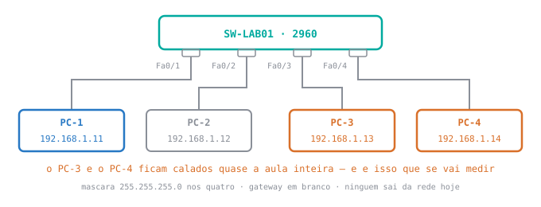

# 🟢 Lab 1 — Switching básico: ver o switch aprender

**Disciplina:** 49309 — Redes de Computadores II — Uniube 
**Professor:** Romualdo Mathias Filho · **romualdo.filho@uniube.br** 
**Data:** Quinta, 13/08/2026 · **VIA216** · 🛠️ Prática (75 min) 
**Turma:** P12 — a P11 faz este mesmo laboratório na segunda seguinte 
**Fecha a teórica de:** [Comutação: do endereço MAC à tabela do switch](./Aula-02---Comutacao-(Teorica))

---

<b>Nosso caminho até aqui</b>

Terça você viu, no quadro, o switch aprender. Hoje você vê na sua tela. Responda **antes** de abrir — o que você errar aqui é o que vai te confundir na hora do laboratório.

O PC-1 vai falar com o PC-2 pela primeira vez. Quantos quadros saem antes de o primeiro dado trafegar, e para quem cada um vai?

**Dois.** O primeiro é o **ARP Request**, e vai para `FF:FF:FF:FF:FF:FF` — todos. O PC-1 não sabe o MAC do PC-2, e não sabe a quem perguntar.

O segundo é o **ARP Reply**, e vai **só para o PC-1**, em unicast. O PC-2 já sabe quem perguntou: o endereço do PC-1 veio escrito no campo de origem do Request.

Hoje você vai **ver** os dois na tela, um de cada vez.

O switch está ligado, com quatro máquinas conectadas e link verde nas quatro. Quantas entradas tem a tabela MAC dele?

**Nenhuma.** O switch aprende lendo o campo **MAC de origem** dos quadros que passam por ele. Se ninguém transmitiu, não passou quadro nenhum, e não há o que aprender.

Uma tabela MAC não é a lista de quem está conectado — é a lista de **quem transmitiu**. Este é o ponto que o laboratório de hoje mede.

Você dá <code>ping</code> do PC-1 para o PC-2 e o primeiro dos quatro pacotes volta <code>Request timed out</code>. Consertar o quê?

**Nada.** O primeiro pacote morreu esperando o ARP resolver — é o custo da primeira pergunta, e ele se paga uma vez só.

Leia sempre **as quatro linhas e a estatística**, nunca a primeira. Quem julga pela primeira linha vai "consertar" uma rede que já estava certa.

> [!INFO] 🎯 O que você leva desta aula
> - A tabela MAC **nascendo vazia** e se preenchendo sozinha, na sua tela, sem você configurar nada.
> - O ARP Request **se multiplicando** em todas as portas, e o Reply voltando por **uma só** — visto quadro a quadro no modo Simulation.
> - A prova de que **quem nunca transmitiu não está na tabela**.
> - O método: descobrir o que quebrou sem que ninguém diga o que foi.
>
> **📂 Recursos**
> - [Aula 02 — Comutação](./Aula-02---Comutacao-(Teorica)) — a teórica que este laboratório fecha. O glossário dela vale aqui.
> - [Plano de Ensino e Contrato](./Plano-de-Ensino-e-Contrato) — calendário, notas, prazos e regras
> - **Packet Tracer 8.2+** — instalado na sua máquina. Não há bloco de instalação hoje.

> [!IMPORTANT] 📌 Este laboratório entra **sem nota** hoje
> A P12 chega neste conteúdo antes da P11, porque a teórica de comutação caiu na terça e a prática da P11 é na segunda. **Laboratório novo só vale ponto em semana em que as duas turmas se encontram** — é a regra que impede que os feriados de segunda deixem a P11 para trás, e ela vale nos dois sentidos: turma nenhuma ganha ponto que a outra não teve chance de ganhar.
>
> **O que isso significa para você, na prática:** faça hoje como se valesse. O mesmo cenário volta valendo **1 ponto** da **Atividade N1** — a nota de laboratório que compõe a primeira avaliação, ao lado da prova — quando as duas turmas estiverem no mesmo ponto, e quem já entendeu hoje faz em dez minutos. **São cinco laboratórios valendo no semestre e os cinco contam — não há descarte**, então nenhum deles é o que sobra.

<aside class="au-antes">
<b class="au-nota-t">Antes de começar</b>

Todo o vocabulário de rede desta aula — MAC, OUI, ARP, cache ARP, tabela MAC, inundação, broadcast, domínio de colisão e de broadcast — está definido no [glossário da teórica de terça](./Aula-02---Comutacao-(Teorica)). Aqui ficam só as palavras do **simulador**, que são novas.

<b class="au-nota-t">O que é novo hoje: o simulador</b>

**Modo Realtime** — o modo normal do Packet Tracer: você dá um comando e o resultado aparece na hora, como numa rede de verdade.

**Modo Simulation** — o modo que **congela o tempo**. Cada quadro vira um envelope na tela e só anda quando você manda. É com ele que se vê o que numa rede real acontece rápido demais para enxergar.

**Envelope** — o desenho de um quadro andando pela topologia, no modo Simulation. Clicar nele abre o conteúdo campo a campo.

**PDU** — o nome que o simulador dá a uma mensagem que trafega. `Add Simple PDU` é o botão que dispara um ping de uma máquina para outra, sem digitar comando.

**Edit Filters** — a lista de protocolos que o modo Simulation mostra. Vem tudo marcado, e tudo marcado é tela demais: hoje você deixa **só ARP e ICMP**.

**Capture / Forward** — o botão que avança **um passo** da simulação. É ele que dá o ritmo.

**`Fa0/1`** — o nome que o switch dá a cada tomada: `Fa` de *FastEthernet*, `0/1` de primeira porta. `Fa0/1` é a porta 1.

**`enable`** — o comando que sai do modo de consulta do switch e entra no de administração. Funcionou quando o prompt termina em `#`.

**Quebra deliberada** — eu derrubo alguma coisa na sua topologia sem dizer o quê, e você descobre. Ocupa os últimos minutos de toda prática, e o **como você descobriu** vale mais do que o que era.

</aside>

---

## 📌 1. A tabela do switch nasce vazia, mesmo com tudo ligado e link verde [Mão na massa ⏳ 13 min]

<figure class="au-fig">

<figcaption class="au-legenda">Quatro máquinas, um switch, nenhum roteador — ninguém sai da rede hoje, e por isso o <b>gateway fica em branco</b>. O <b>PC-3</b> e o <b>PC-4</b> vão ficar calados quase a aula inteira: é o silêncio deles que prova a regra do dia.</figcaption>
</figure>

**Passo 0 — onde fica cada coisa na primeira tela.** É a primeira vez que muita gente abre o Packet Tracer para valer, então vai clique a clique: no canto **inferior esquerdo** fica a caixa de dispositivos. `Network Devices` → `Switches` → arraste o **2960** para o centro. Depois `End Devices` → `End Devices` → arraste **quatro PCs**. Em `Connections`, o ícone do **raio laranja** é o cabo direto de cobre (*Copper Straight-Through*): clique nele, clique no switch, escolha `FastEthernet0/1`, clique no PC-1, escolha `FastEthernet0`. Repita nas portas 2, 3 e 4.

1. Monte a topologia acima: **um switch 2960** e **quatro PCs**, com cabo de cobre direto, nas portas `Fa0/1` a `Fa0/4`, nessa ordem.
2. Em cada PC: aba `Desktop` → `IP Configuration` → `Static`. Endereços `192.168.1.11` a `.14`, máscara `255.255.255.0`, **gateway em branco**.
3. **Espere o link ficar verde.** Ao ligar o cabo, a ponta fica **âmbar por cerca de 30 segundos** antes de virar verde. `ping` antes disso falha, e não é defeito seu.
4. Clique no switch → aba `CLI` → `enable` → `show mac address-table`.

<b>SW-LAB01</b> · antes de qualquer tráfego

! quatro maquinas ligadas, link verde nas quatro
SW-LAB01# show mac address-table
          Mac Address Table
-------------------------------------------
Vlan    Mac Address       Type        Ports
----    -----------       --------    -----
!
! nenhuma linha. e esta e a resposta certa.

**Anote em que estado a sua tabela estava aqui.** Sem essa linha de base, o "depois" não prova nada — você não vai saber se a tabela aprendeu ou se já estava assim.

> [!TIP] 💡 Dica de produção
> Salve o arquivo numa pasta **local**, nunca no Desktop nem em pasta sincronizada com nuvem. O simulador escreve no arquivo o tempo todo, e sincronização automática no meio disso é a receita clássica de "meu trabalho sumiu".

---

## 📌 2. O ARP Request se multiplica em todas as portas, e você vai ver isso acontecer [Mão na massa ⏳ 19 min]

Este é o bloco que sustenta a aula. Terça eu desenhei o ARP no quadro; hoje ele anda na sua tela, um passo por vez.

### 2.1 O modo Simulation congela o tempo para você olhar

1. Canto inferior direito: troque de `Realtime` para **`Simulation`**.
2. Clique em **`Edit Filters`**, desmarque tudo (`Show All/None`) e marque **só `ARP` e `ICMP`**. Com tudo marcado a tela vira ruído e você não acha o que interessa.
3. Na barra da direita, **`Add Simple PDU`** (o envelope fechado). Clique **primeiro no PC-1**, depois **no PC-2**.
4. Agora avance com **`Capture / Forward`**, **um clique por vez**. Não segure o botão: o valor deste bloco está em olhar cada passo.

### 2.2 Um envelope entra no switch e saem três

| Passo | O que você vê na tela | O que está acontecendo |
| :-: | :--- | :--- |
| **0** | **dois** envelopes aparecem sobre o PC-1 | o ICMP fica parado esperando; o ARP é quem sai primeiro. **O dado não anda enquanto o endereço não é resolvido** |
| **1** | um envelope sai do PC-1 e entra no switch | o ARP Request, com destino `FF:FF:FF:FF:FF:FF` |
| **2** | o envelope **vira três** — PC-2, PC-3 e PC-4 | o switch replica em todas as portas, **menos na de entrada** |
| **3** | PC-3 e PC-4 exibem um **X** vermelho | receberam, leram, viram que o IP não é deles e descartaram |
| **4** | **um** envelope volta do PC-2 ao switch | o ARP Reply, endereçado ao MAC do PC-1 |
| **5** | ele sai por **uma porta só**, para o PC-1 | o switch já aprendeu onde o PC-1 está |

**Avance até um dos envelopes do passo 2 chegar ao PC-3**, clique nele e leia o campo `DESTINATION MAC` na aba `Inbound PDU Details`. Ele está lá: `FFFF.FFFF.FFFF`.

A aba se chama `Inbound` porque é o que **entrou** naquele dispositivo — por isso a leitura é feita em quem recebeu, não em quem enviou. No PC-1, que é a origem, o simulador só oferece `Outbound PDU Details`.

Depois avance até o ARP Reply chegar ao PC-1 e leia o mesmo campo, também em `Inbound PDU Details`. **Não é mais broadcast** — é o MAC do PC-1, um destino só.

> [!WARNING] ⚠️ Gotcha — o X vermelho não é erro
> O **X** no PC-3 e no PC-4 assusta, e não é falha: é o simulador dizendo *"este dispositivo recebeu o quadro e descartou"*. É o comportamento **correto** de quem não tem o IP consultado. Não existe resposta "não sou eu" em ARP.
>
> Quem lê o X como defeito passa a aula caçando um problema que não existe.

Aposte antes de ver: você dispara o mesmo ping do PC-1 para o PC-2 uma segunda vez. Quantos envelopes o switch cria no primeiro passo?

**Um só.** Não há mais ARP: o PC-1 já tem o MAC do PC-2 guardado no cache, e o switch já tem os dois na tabela. O que sai agora é ICMP direto, por uma porta só.

**Faça o teste.** É a diferença entre a rede que não conhece ninguém e a rede que já conversou — e ela se paga uma vez.

---

## 📌 3. Quem nunca transmitiu não está na tabela, e é isso que você vai medir [Mão na massa ⏳ 16 min]

### 3.1 Dois pings, duas linhas

Volte para **`Realtime`**. No PC-1, `Desktop` → `Command Prompt`.

O bloco 2 já resolveu o ARP do PC-1 para o PC-2, e o cache guardou. Se você pingar agora, os quatro pacotes passam e você **não** vê o `Request timed out` da pergunta de abertura. Por isso a primeira linha apaga o cache: é ela que devolve a rede ao estado de quem nunca conversou.

<b>PC-1</b> · Command Prompt

! apaga o cache ARP: volta a ser a primeira conversa
C:\&gt; arp -d
!
! agora sim o primeiro pacote morre no ARP. leia as quatro linhas.
C:\&gt; ping 192.168.1.12
!
! e agora: o que o PC-1 guardou dessa conversa?
C:\&gt; arp -a

Agora no switch, `show mac address-table` de novo. **Duas** entradas: PC-1 na `Fa0/1` e PC-2 na `Fa0/2`.

### 3.2 O PC-3 está ligado, com cabo bom, e não aparece

O PC-3 e o PC-4 receberam o ARP Request — você viu os dois envelopes chegarem neles no bloco 2. Mesmo assim, **nenhum dos dois está na tabela.**

Eles receberam e ficaram quietos. O switch aprende lendo o **MAC de origem**, e quem só recebe nunca é origem de nada.

**Prove que é isso, e não outra coisa:** do **PC-3**, dê `ping 192.168.1.14` e rode o `show mac address-table` mais uma vez. As duas máquinas caladas aparecem juntas, e a tabela passa a ter quatro linhas — sem você ter configurado nenhuma delas.

**Apareceram só duas?** Então o PC-1 e o PC-2 expiraram por inatividade: entrada dinâmica tem prazo de validade, e a teórica de terça deu o número — 300 segundos, cinco minutos. Não é erro seu. Repita o `ping` do PC-1 e rode o `show mac address-table` de novo.

### 3.3 Duas listas se preencheram sozinhas, e elas não têm o mesmo tamanho

| | O `arp -a` do PC-1 | O `show mac address-table` |
| :--- | :--- | :--- |
| **Onde vive** | na estação | no switch |
| **O que casa** | IP ↔ MAC | MAC ↔ porta |
| **Quantas linhas, depois do primeiro ping** | **1** — só o PC-2 | **2** — PC-1 e PC-2 |

As duas se preencheram sozinhas, na mesma rede, nos mesmos segundos. Uma ficou com uma linha; a outra, com duas.

**Por quê?** É essa a pergunta que fecha o laboratório.

---

<b>O laboratório — os 10 itens que se verificam</b>

Esta é a lista que eu confiro na sua tela. **Anote cada resultado**: sem anotar, o "antes e depois" não existe.

1. Topologia montada: switch 2960 e quatro PCs em `Fa0/1` a `Fa0/4`, link **verde** nas quatro.
2. Endereços `192.168.1.11` a `.14`, máscara `255.255.255.0`, **gateway em branco** nos quatro.
3. `show mac address-table` **antes de qualquer tráfego**: tabela **vazia**, e você anotou isso.
4. Modo `Simulation` com `Edit Filters` mostrando **só ARP e ICMP**.
5. Capturado o passo em que **um envelope vira três**, e você sabe dizer por quê.
6. Lido o campo `DESTINATION MAC` do ARP Request: `FFFF.FFFF.FFFF`.
7. Lido o mesmo campo no ARP Reply: **não** é broadcast, é o MAC do PC-1.
8. Depois do `ping` do PC-1 para o PC-2: tabela com **duas** entradas dinâmicas, `arp -a` com **uma**.
9. **PC-3 e PC-4 ausentes da tabela**, e você explica a ausência sem usar a palavra "desligado".
10. Depois do `ping` do PC-3: a tabela passa a **quatro** entradas.

<b>Critério de pronto:</b> os 10 itens acima conferidos na sua tela, e você consegue responder, com suas palavras, <b>por que o <code>arp -a</code> e a tabela do switch não têm o mesmo número de linhas</b>. Hoje o laboratório não vale nota — mas a régua, quando ele valer, é esta: <b>8 destes 10 itens</b>.

### Terminou antes? A quebra deliberada

Quando a sua bancada fechar os 10 itens, eu **derrubo uma coisa** na sua topologia e digo só isto:

> *"Acabei de derrubar uma coisa. Você tem dois minutos para me dizer **qual** e **como descobriu**."*

Duas regras: **um teste por vez**, e diga em voz alta o que vai testar antes de testar. O "como descobriu" vale mais do que o "qual" — é ele que você leva para a próxima rede, e para a entrevista.

> [!NOTE] 💼 Pergunta de entrevista
> *"Um switch mostra a tabela MAC correta, com todas as máquinas nas portas certas, e mesmo assim duas delas não se pingam. O que você investiga?"*
>
> **Resposta esperada:** a tabela MAC correta prova que a **camada 2** está de pé — os quadros chegam e o switch sabe por onde mandar. Se o `ping` falha mesmo assim, o problema está **acima**: IP em sub-redes diferentes, máscara divergente, ou firewall no host. Um switch de camada 2 não lê IP e não tem como notar essa diferença — para ele, os quadros continuam trafegando normalmente.
>
> Candidato que responde "troco o cabo" ou "reinicio o switch" não olhou a evidência que já tinha na mão.

---

<b>Bilhete de saída</b> · anônimo · 3 min

Meia folha de papel, **sem nome**, recolhida na porta. Duas perguntas, sem nota:

1. *Com suas palavras: por que o PC-3 não apareceu na tabela do switch?*
2. *Qual foi o ponto mais confuso do laboratório de hoje?*

O que você responder aqui **abre a próxima aula**.

<b>Se você está lendo fora da aula:</b> escreva as duas respostas no caderno mesmo assim, antes de conferir com a página. Responder de cabeça e depois checar vale mais do que reler.

---

<b>Resumo do laboratório</b>

| Item | O que você viu acontecer |
| :--- | :--- |
| **Tabela vazia** | Quatro máquinas ligadas, link verde, e **nenhuma** entrada. Conectado não é o mesmo que aprendido. |
| **Como ela se preenche** | Sozinha, lendo o **MAC de origem** de cada quadro que passa. Ninguém digita nada. |
| **ARP Request** | Um envelope entra no switch e **saem três** — todas as portas, menos a de entrada. |
| **O X vermelho** | Não é erro: é quem recebeu, leu e descartou por não ter o IP consultado. |
| **ARP Reply** | Volta por **uma porta só**, endereçado ao MAC de quem perguntou. |
| **A prova do dia** | PC-3 e PC-4 ligados, com cabo bom, **ausentes da tabela** — porque nunca transmitiram. |
| **E a prova da prova** | Um `ping` saindo do PC-3 e ele aparece. O que mudou não foi a configuração, foi o silêncio. |
| **`arp -a` × tabela MAC** | Uma linha contra duas. Estruturas diferentes, em máquinas diferentes, para perguntas diferentes. |
| **O primeiro `ping`** | Cai por ARP. Julgue pelas quatro linhas e pela estatística, nunca pela primeira. |
| **Modo Simulation** | Só ARP e ICMP no filtro. Tudo marcado é tela demais. |
| **Nota** | Hoje **sem nota**. Quando valer, a régua é **8 dos 10 itens**. São cinco labs valendo e os cinco contam. |

<b>Para pensar até a próxima aula</b>

Hoje você mediu uma tabela com quatro máquinas e conseguiu conferir cada linha com o dedo na tela. Um switch de acesso de verdade tem 48 portas, e o do andar de cima tem outras 48 — e as tabelas dos dois se enchem sozinhas, do mesmo jeito, sem ninguém olhando.

<b>O que acontece com a tabela quando chegam mais endereços do que cabem nela?</b> Ela tem tamanho finito, como qualquer estrutura de memória. E se ela encher, o switch precisa decidir o que fazer com o quadro cujo destino ele não consegue mais guardar.

Você já viu hoje o que ele faz quando não sabe onde está o destino. <b>Agora imagine alguém enchendo a tabela de propósito.</b>

<b>Referências desta aula</b>

- KUROSE, J. F.; ROSS, K. W. **Redes de computadores e a internet: uma abordagem top-down.** 8. ed. São Paulo: Pearson, 2021. cap. 6, seç. 6.4.1 — endereçamento de camada de enlace e ARP; seç. 6.4.3 — comutadores: filtragem, encaminhamento e autoaprendizagem
- TANENBAUM, A. S.; FEAMSTER, N.; WETHERALL, D. J. **Redes de Computadores.** 6. ed. São Paulo: Pearson, 2021. cap. 4, cap. 4 — a camada de enlace e a comutação
- CISCO NETWORKING ACADEMY. **CCNA: Switching, Routing, and Wireless Essentials (SRWE).** Cisco Systems. Disponível em: https://www.netacad.com/. Acesso em: 13 ago. 2026. módulo 2 — conceitos de comutação: encaminhamento de quadros e tabela de endereços MAC

<b>Na próxima aula</b>

Hoje você confirmou o que a teórica prometeu: o switch aprende sozinho e <b>não corta o broadcast</b> — o ARP Request foi para todo mundo, e não havia como impedir. Na próxima teórica você corta esse domínio em dois com uma linha de configuração, sem trocar o equipamento e sem mexer em cabo. É a <b>VLAN</b>.

---

*Última atualização: 13/08/2026*

**◀ [Voltar ao índice da disciplina](./)**

