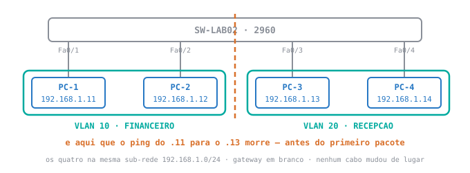

<div class="au-leitura" data-aula="s04p">

# 🟢 Lab 2 — VLANs: medir a fronteira que terça levantou

**Disciplina:** 49309 — Redes de Computadores II — Uniube<br>
**Professor:** Romualdo Mathias Filho · **romualdo.filho@uniube.br**<br>
**Data:** **P12** — quinta, 20/08/2026 · **VIA216** · **P11** — segunda, 24/08/2026 · **VIA215**<br>
**Duração:** 🛠️ Prática, 75 min · mesmo cenário e mesma régua nas duas turmas<br>
**Fecha a teórica de:** [VLANs: a fronteira que se digita em vez de se comprar](./Aula-04---VLANs-(Teorica))

---

<div class="au-caminho">
<b>Nosso caminho até aqui</b>

Na terça a fronteira subiu no projetor e você repetiu a configuração em casa, no pré-lab. Hoje você **mede** essa fronteira. Responda **antes** de abrir — o que você errar aqui é o que vai te travar no laboratório.

<details>
<summary>Num switch de fábrica você digita <code>vlan 10</code>, <code>name FINANCEIRO</code> e sai. Quantos domínios de broadcast existem agora?</summary>

**Um.** Criar a VLAN cria o **destino**, não move ninguém para dentro dele.

As quatro portas continuam na VLAN 1, e é o número de VLANs **com porta** que conta. O `show vlan brief` mostra a linha da VLAN 10 com a coluna `Ports` vazia.

Foi o passo 6 do pré-lab, e é de onde o laboratório de hoje parte.

</details>

<details>
<summary>Duas estações na mesma sub-rede, com a mesma máscara, em VLANs diferentes. O <code>ping</code> falha. Em que camada está a falha, e qual comando prova isso?</summary>

**Camada 2**, e quem prova é o `arp -a` da estação de origem.

A VLAN barra o `ARP Request`, que é broadcast. Sem resposta, o campo de MAC de destino não tem valor, e **o quadro do `ping` nunca é montado**.

A prova é a **ausência** da linha do destino no `arp -a`: se a falha fosse depois, no encaminhamento, a linha estaria lá.

</details>

<details>
<summary>Uma porta que ninguém configurou está em qual VLAN?</summary>

**Na VLAN 1.** Não existe porta fora de VLAN num switch Cisco.

"Sem VLAN configurada" nunca quis dizer "sem VLAN nenhuma" — quis dizer "na VLAN de número 1, que é a de fábrica".

Guarde isto para o item 5 do critério de pronto de hoje: **a VLAN 1 não fica vazia** só porque você moveu quatro portas. Um 2960 tem 26.

</details>

<details>
<summary>Do Lab 1: o switch preenche a tabela MAC lendo <b>qual</b> campo dos quadros que passam por ele?</summary>

**O campo de MAC de origem.** Uma tabela MAC não é a lista de quem está conectado — é a lista de **quem transmitiu**.

Foi o que você mediu no Lab 1: o PC-3 estava ligado, com link verde, e não aparecia na tabela, porque nunca tinha sido origem de nada.

**Por que isto importa hoje:** a coluna `Vlan` dessa tabela é um dos itens que valem ponto. Se você só gerar tráfego de um lado da fronteira, ela vai mostrar **um** número, não dois — e você vai achar que errou a configuração.

</details>
</div>

> [!INFO] 🎯 O que você leva desta aula
> - Dois comandos novos de diagnóstico: `show interfaces fa0/1 switchport`, que diz o que uma porta **é** antes de você adivinhar, e a leitura da coluna `Vlan` da tabela MAC.
> - O `ARP Request` que no Lab 1 virava **três** envelopes agora saindo por **uma** porta — visto passo a passo no modo Simulation.
> - A prova de que o `ping` falhou **antes** de o quadro existir, e não no caminho.
> - Uma porta trocada de VLAN ao vivo, e a rede inteira mudando de resposta por causa disso.
>
> **📂 Recursos**
> - [Aula 04 — VLANs](./Aula-04---VLANs-(Teorica)) — a teórica que este laboratório fecha. O glossário dela vale aqui, e o **pré-lab** dela é o ponto de partida de hoje.
> - [Aula 03 — Lab 1: Switching básico](./Aula-03---Lab-1-Switching-Basico-(Pratica)) — a topologia de hoje é a mesma, e a comparação com ela é metade do trabalho.
> - [Plano de Ensino e Contrato](./Plano-de-Ensino-e-Contrato) — calendário, notas, prazos e regras
> - [Manual do IOS no Packet Tracer](./Manual-do-IOS-no-Packet-Tracer) — **leia se o console for o seu gargalo**: os modos, o prompt, o `do`, as quatro mensagens de erro e a lista de comandos do semestre no anexo. Esta página ensina VLAN, não datilografia — o console está lá.
> - **Packet Tracer** — o mesmo que você usou no Lab 1. Não há bloco de instalação hoje.

> [!IMPORTANT] 📌 Este laboratório vale **1 ponto**
> É 1 ponto da **Atividade N1** — a nota de laboratório que compõe a primeira avaliação, ao lado da prova. A régua está no contrato e é sempre a mesma: **dez itens verificados, oito deles = o ponto (80% de acerto)**.
>
> Não há arquivo `.pka` hoje, então vale o outro modo previsto no contrato: **eu confiro os dez itens na sua tela, na hora.** Os dez são **re-executáveis** — eu peço o comando e leio o resultado. Você não precisa ter anotado nada para provar que fez.

<aside class="au-antes">
<b class="au-nota-t">Antes de começar</b>

O vocabulário de rede de hoje — VLAN, VLAN 1, domínio de broadcast, porta de acesso, `ARP Request`, tabela MAC — está definido no [glossário da teórica de terça](./Aula-04---VLANs-(Teorica)). Já o vocabulário do **simulador** — `Realtime`, `Simulation`, `Edit Filters`, `Capture / Forward`, PDU e envelope, usados de enfiada no bloco 3 — está no [glossário do Lab 1](./Aula-03---Lab-1-Switching-Basico-(Pratica)), que é onde eles apareceram pela primeira vez. Aqui ficam só as palavras que são **novas nesta aula**.

<b class="au-nota-t">O que é novo hoje: um comando e três campos</b>

**`show interfaces fa0/1 switchport`** — a ficha completa de **uma** porta: em que modo ela está e em que VLAN. É o comando que responde "o que esta porta **é**?" em vez de te obrigar a deduzir contando linhas. Sempre com a porta no meio: sem ela, o switch despeja as 26 portas de uma vez.

**`Administrative Mode`** — o primeiro campo dessa ficha: o modo que **você configurou**.

**`Operational Mode`** — o segundo: o modo em que a porta **está operando de fato**. Os dois podem divergir sem que nada esteja quebrado — uma porta de fábrica com PC do outro lado opera como acesso sem ninguém ter configurado acesso. O que a divergência diz é que **o comportamento de hoje não está garantido para amanhã**, e é isso que se investiga.

**`Access Mode VLAN`** — o campo que diz **em qual VLAN a porta está**. É a resposta direta.

**`do`** — o prefixo que executa um comando de consulta **sem sair** do modo de configuração. `do show vlan brief` mostra a tabela e devolve você onde estava. Sem o `do`, o switch responde `Invalid input detected`.

**Quebra deliberada** — eu derrubo alguma coisa na sua topologia sem dizer o quê, e você descobre. Ocupa os últimos minutos de toda prática, e o **como você descobriu** vale mais do que o que era.

</aside>

---

## 📌 1. Antes de configurar, saber onde você está — e provar o estado de terça [Mão na massa ⏳ 12 min]

<figure class="au-fig">

<figcaption class="au-legenda">Este é o <b>estado inicial</b> de hoje — o pré-lab da terça termina aqui. Repare que os quatro endereços estão na <b>mesma sub-rede</b> e nenhum cabo mudou de lugar: a única coisa que separa os dois lados é a configuração de quatro portas.</figcaption>
</figure>

### 1.1 O prompt é um mapa, e ler ele resolve a maior parte das travadas

O switch não tem janelas. Tudo o que ele te dá para saber onde você está é a linha em que o cursor pisca — o **prompt**. E o comando certo digitado no modo errado é recusado exatamente como um comando errado.

<figure class="au-fig">
<svg viewBox="0 0 560 232" role="img" aria-label="Escada de modos do console Cisco: Switch maior-que no modo usuario, Switch cerquilha no modo privilegiado, Switch config cerquilha na configuracao global e Switch config-if cerquilha na configuracao de interface. Desce-se com enable, configure terminal e interface fa0 barra 1; sobe-se um degrau com exit ou volta-se direto ao topo com end">
<rect x="18" y="14" width="215" height="32" rx="5" style="fill:#eef3f8" stroke="#2778c4" stroke-width="1.5"></rect>
<text x="32" y="35" font-size="14" font-family="monospace" font-weight="bold" style="fill:#2778c4">Switch&gt;</text>
<text x="140" y="35" font-size="11" font-family="monospace" style="fill:#5b6068">modo usuario</text>
<rect x="52" y="60" width="215" height="32" rx="5" style="fill:#eef3f8" stroke="#2778c4" stroke-width="1.5"></rect>
<text x="66" y="81" font-size="14" font-family="monospace" font-weight="bold" style="fill:#2778c4">Switch#</text>
<text x="174" y="81" font-size="11" font-family="monospace" style="fill:#5b6068">privilegiado</text>
<rect x="86" y="106" width="215" height="32" rx="5" style="fill:#fdf4ec" stroke="#d9702a" stroke-width="1.5"></rect>
<text x="100" y="127" font-size="14" font-family="monospace" font-weight="bold" style="fill:#d9702a">Switch(config)#</text>
<rect x="120" y="152" width="215" height="32" rx="5" style="fill:#fdf4ec" stroke="#d9702a" stroke-width="1.5"></rect>
<text x="134" y="173" font-size="13" font-family="monospace" font-weight="bold" style="fill:#d9702a">Switch(config-if)#</text>
<text x="243" y="58" font-size="11" font-family="monospace" style="fill:#3b7d4f">enable</text>
<text x="277" y="104" font-size="11" font-family="monospace" style="fill:#3b7d4f">configure terminal</text>
<text x="311" y="150" font-size="11" font-family="monospace" style="fill:#3b7d4f">interface fa0/1</text>
<path d="M 340 168 L 468 168 L 468 76 L 276 76" fill="none" stroke="#8a4fb8" stroke-width="2"></path>
<path d="M 276 76 l 9 -5 l 0 10 z" style="fill:#8a4fb8"></path>
<text x="478" y="126" font-size="12" font-family="monospace" font-weight="bold" style="fill:#8a4fb8">end</text>
<text x="478" y="142" font-size="10" font-family="monospace" style="fill:#8a4fb8">(ou Ctrl+Z)</text>
<text x="152" y="212" font-size="11" font-family="monospace" style="fill:#8a4fb8">exit sobe so um degrau</text>
</svg>
<figcaption class="au-legenda">A escada tem quatro degraus, e cada um aceita um conjunto diferente de comandos. Descer é um comando por degrau; subir tem atalho: <code>exit</code> volta <b>um</b> degrau, <code>end</code> (ou <b>Ctrl+Z</b>) volta direto ao <code>#</code>, de qualquer profundidade.</figcaption>
</figure>

Três fatos do console que você vai usar hoje o tempo todo:

| Situação | O que fazer |
| :--- | :--- |
| Você está em `(config-if)#` e quer rodar um `show` | prefixo **`do`**: `do show vlan brief` executa e te devolve onde estava |
| Você não lembra a próxima palavra do comando | **espaço + `?`**: `show ?` lista tudo o que pode vir depois |
| Digitar por extenso está custando tempo | **abreviação**: `conf t`, `int fa0/1`, `sh vl br` funcionam, desde que sejam únicas |

> [!WARNING] ⚠️ Gotcha — `% Invalid input detected` quase nunca é erro de digitação
> Na maior parte das vezes o comando estava certo e o **modo** estava errado. Antes de reler o comando, leia o prompt. Se ele diz `(config)#` e você pediu um `show`, faltou o `do`.

<details class="au-aposta">
<summary>Aposte antes de ver: você está em <code>Switch(config-if)#</code> e digita <code>exit</code>. Onde você cai?</summary>

**Em `Switch(config)#`**, não em `Switch#`.

O `exit` sobe **um** degrau. Quem espera voltar ao `#` digita o `show` seguinte ainda no modo global e leva um `% Invalid input detected` — e passa a duvidar do comando, que estava certo.

Para voltar ao topo de uma vez: **`end`** ou **Ctrl+Z**.

</details>

### 1.2 Exercício 1 — descer e subir a escada sem errar o degrau [⏳ 4 min]

Faça no seu switch, nesta ordem, **digitando**. O objetivo não é configurar nada: é a mão aprender o caminho antes de o conteúdo ficar difícil.

<div class="au-term">
<div class="au-term-h"><b>SW-LAB02</b> <span>· CLI · exercicio de console</span></div>
<div class="au-term-b"><span class="cm">! 1. descer os tres degraus, um comando por vez</span>
<span class="ps">SW-LAB02&gt;</span> <span class="kw">enable</span>
<span class="ps">SW-LAB02#</span> <span class="kw">configure terminal</span>
<span class="ps">SW-LAB02(config)#</span> <span class="kw">interface fa0/1</span>
<span class="cm">!</span>
<span class="cm">! 2. consultar daqui de baixo, SEM sair: o prefixo do</span>
<span class="ps">SW-LAB02(config-if)#</span> <span class="kw">do show vlan brief</span>
<span class="cm">!</span>
<span class="cm">! 3. subir UM degrau, e conferir o prompt</span>
<span class="ps">SW-LAB02(config-if)#</span> <span class="kw">exit</span>
<span class="ps">SW-LAB02(config)#</span>
<span class="cm">!</span>
<span class="cm">! 4. voltar ao topo de uma vez</span>
<span class="ps">SW-LAB02(config)#</span> <span class="kw">end</span>
<span class="ps">SW-LAB02#</span>
<span class="cm">!</span>
<span class="cm">! 5. o mesmo caminho, agora abreviado</span>
<span class="ps">SW-LAB02#</span> <span class="kw">conf t</span>
<span class="ps">SW-LAB02(config)#</span> <span class="kw">int fa0/1</span>
<span class="ps">SW-LAB02(config-if)#</span> <span class="kw">do sh vl br</span></div>
</div>

<p class="au-pronto"><b>Critério de pronto do exercício 1:</b> você chegou a <code>(config-if)#</code>, rodou um <code>show</code> lá de dentro com <code>do</code>, e voltou ao <code>#</code> com <code>end</code> — sem nenhum <code>% Invalid input detected</code> na tela. Apareceu algum? <b>Leia o prompt daquela linha</b> antes de reler o comando.</p>

> [!TIP] 💡 Onde isto está por escrito
> Os modos, o `do`, as abreviações, as quatro mensagens de erro e a lista de comandos do semestre estão no [Manual do IOS no Packet Tracer](./Manual-do-IOS-no-Packet-Tracer). Guarde o link: é para lá que você volta em outubro, quando o comando não for mais o problema.

### 1.3 Agora prove o estado em que a terça parou

**Abra o arquivo do pré-lab.** Não fez? Os dois atos estão no **bloco 1.4**, no fim desta seção — digite e me chame. São 10 linhas e levam cerca de 3 min; se você estiver nesse caso, pule o Exercício 1 e volte a ele quando a topologia estiver de pé.

Clique no switch → aba `CLI` → `enable`, e prove o estado inicial:

<div class="au-term">
<div class="au-term-h"><b>SW-LAB02</b> <span>· o estado em que terça terminou</span></div>
<div class="au-term-b"><span class="ps">SW-LAB02#</span> <span class="kw">show vlan brief</span>

VLAN Name                             Status    Ports
---- -------------------------------- --------- -------------------
<span class="mark">1    default                          active    Fa0/5, Fa0/6, Fa0/7, Fa0/8</span>
<span class="mark">                                                Fa0/9, Fa0/10, Fa0/11, Fa0/12</span>
<span class="mark">                                                Fa0/13, Fa0/14, ... Fa0/24</span>
<span class="mark">                                                Gig0/1, Gig0/2</span>
10   FINANCEIRO                       active    Fa0/1, Fa0/2
20   RECEPCAO                         active    Fa0/3, Fa0/4
1002 fddi-default                     act/unsup
1003 token-ring-default               act/unsup
1004 fddinet-default                  act/unsup
1005 trnet-default                    act/unsup</div>
</div>

Duas coisas dessa tela merecem sua atenção agora, e as duas valem ponto mais adiante.

**A VLAN 1 não ficou vazia.** Você moveu quatro portas, e o 2960 tem **26** — 24 FastEthernet e 2 Gigabit. As outras 22 continuam na `default`, exatamente onde nasceram. Quem esperava a VLAN 1 desaparecer estava contando as portas do desenho, não as do equipamento.

**As linhas 1002 a 1005 são herança** de mídias que ninguém usa mais — FDDI e Token Ring. O `act/unsup` quer dizer *ativa e não suportada*. Ignore-as; se a sua versão do simulador não as listar, também está certo.

### 1.4 A referência de comando — você já digitou isto na terça

Se o arquivo do pré-lab não abriu, digite os dois atos agora. **Não é o conteúdo de hoje**: é o ponto de partida.

```ios
! ATO 1 — criar as duas redes. Nenhuma porta e tocada aqui.
SW-LAB02# configure terminal
SW-LAB02(config)# vlan 10
SW-LAB02(config-vlan)# name FINANCEIRO
SW-LAB02(config-vlan)# exit
SW-LAB02(config)# vlan 20
SW-LAB02(config-vlan)# name RECEPCAO
SW-LAB02(config-vlan)# exit
! ATO 2 — mover as portas. Agora sim a rede muda.
SW-LAB02(config)# interface range fa0/1-2
SW-LAB02(config-if-range)# switchport mode access
SW-LAB02(config-if-range)# switchport access vlan 10
SW-LAB02(config-if-range)# exit
SW-LAB02(config)# interface range fa0/3-4
SW-LAB02(config-if-range)# switchport mode access
SW-LAB02(config-if-range)# switchport access vlan 20
SW-LAB02(config-if-range)# end
```

São **duas** linhas por par de portas, e elas fazem coisas diferentes: a primeira declara que a porta serve **uma** VLAN, a segunda diz **qual**.

> [!TIP] 💡 Dica de produção
> Salve o arquivo numa pasta **local**, nunca no Desktop nem em pasta sincronizada com nuvem. O simulador escreve no arquivo o tempo todo, e sincronização automática no meio disso é a receita clássica de "meu trabalho sumiu".

---

## 📌 2. Um comando diz o que a porta é, e a tabela MAC diz de que lado ela está [Mão na massa ⏳ 14 min]

Contar portas no `show vlan brief` funciona com quatro. Com 26 não funciona — e existe um comando que responde direto sobre **uma** porta.

### 2.1 A ficha da porta, e os três campos que importam

<div class="au-term">
<div class="au-term-h"><b>SW-LAB02</b> <span>· a ficha da porta Fa0/1</span></div>
<div class="au-term-b"><span class="ps">SW-LAB02#</span> <span class="kw">show interfaces fa0/1 switchport</span>
Name: Fa0/1
Switchport: Enabled
<span class="mark">Administrative Mode: static access</span>
<span class="mark">Operational Mode: static access</span>
Administrative Trunking Encapsulation: dot1q
<span class="mark">Access Mode VLAN: 10 (FINANCEIRO)</span>
Trunking Native Mode VLAN: 1 (default)</div>
</div>

Três campos importam hoje, e a tela tem uma dúzia. `Administrative Mode` é o que você configurou. `Operational Mode` é o que a porta está fazendo. `Access Mode VLAN` é em qual VLAN ela está.

### 2.2 Exercício 2 — a mesma pergunta, na outra VLAN [⏳ 3 min]

**Rode o mesmo comando na `Fa0/3`:** `show interfaces fa0/3 switchport`. Depois compare as duas telas lado a lado.

<p class="au-pronto">Pronto quando: a <code>Fa0/1</code> responde <code>Access Mode VLAN: 10 (FINANCEIRO)</code> e a <code>Fa0/3</code> responde <code>Access Mode VLAN: 20 (RECEPCAO)</code> — mesmo comando, duas respostas. É esse contraste que você vai usar no dia em que 48 portas estiverem em jogo, porque contar linhas no <code>show vlan brief</code> só funciona com quatro.</p>

<details class="au-aposta">
<summary>Aposte antes de ver: numa porta de fábrica, com um PC ligado e nada configurado, o que aparece em <code>Administrative Mode</code> e em <code>Operational Mode</code>?</summary>

**`dynamic auto` no administrativo e `static access` no operacional.** Os dois **divergem**, e nada está quebrado.

`dynamic auto` é o modo de fábrica: *"eu aceito negociar com o vizinho o que esta porta vai ser"*. É o nome literal do que a teórica chamou de modo dinâmico.

A porta de fábrica aceita negociar com o vizinho. Com um PC do outro lado não há o que negociar, então ela opera como acesso — sem ninguém ter configurado acesso.

**O que a divergência diz não é "está com defeito", é "o comportamento de hoje não está garantido".** Ligue um switch que proponha negociação e essa mesma porta muda. É por isso que `switchport mode access` existe: ele torna a porta surda a proposta.

</details>

### 2.3 A tabela do Lab 1, com uma coluna que agora tem função

O comando é o mesmo do Lab 1. O que mudou é o que a primeira coluna tem para dizer.

Gere tráfego de **um** lado só, para começar: no PC-1, `Desktop` → `Command Prompt` → `ping 192.168.1.12`.

<div class="au-term">
<div class="au-term-h"><b>SW-LAB02</b> <span>· depois de trafego apenas na VLAN 10</span></div>
<div class="au-term-b"><span class="ps">SW-LAB02#</span> <span class="kw">show mac address-table</span>
          Mac Address Table
-------------------------------------------
Vlan    Mac Address       Type        Ports
----    -----------       --------    -----
<span class="mark">  10    0001.4212.3401    DYNAMIC     Fa0/1</span>
<span class="mark">  10    0002.16aa.7b02    DYNAMIC     Fa0/2</span>
<span class="cm">!</span>
<span class="cm">! duas linhas, e as duas dizem 10. onde esta a VLAN 20?</span></div>
</div>

**Duas linhas, as duas com `10`.** A VLAN 20 não aparece, e não é defeito: o switch aprende lendo o **MAC de origem** dos quadros que passam, e ninguém do lado da recepção transmitiu ainda. É a mesma regra que deixou o PC-3 fora da tabela no Lab 1.

### 2.4 Exercício 3 — fazer o outro lado aparecer [⏳ 3 min]

**Do PC-3, dê `ping 192.168.1.14`** e rode `show mac address-table` outra vez.

<p class="au-pronto">Pronto quando: a tabela passa de <b>duas</b> para <b>quatro</b> linhas — duas com <code>10</code> nas portas 1 e 2, duas com <code>20</code> nas portas 3 e 4. Os endereços MAC da sua tela serão diferentes dos do exemplo acima, e isso é esperado: cada simulador sorteia os seus. O que se confere é o <b>número de linhas</b> e a <b>coluna <code>Vlan</code></b>, nunca o MAC.</p>

| | No Lab 1 | Agora |
| :--- | :--- | :--- |
| **Coluna `Vlan`** | `1` em todas as linhas | `10` nas portas 1 e 2, `20` nas portas 3 e 4 |
| **Coluna `Ports`** | `Fa0/1` a `Fa0/4` | as mesmas quatro portas |
| **Quantos PCs você configurou?** | — | **nenhum** |

Nenhum endereço MAC mudou, nenhum cabo saiu do lugar e nenhum PC foi tocado. A mesma tabela passou a classificar em duas redes o tráfego que antes classificava em uma — e quem faz essa classificação é a **porta de entrada** do quadro, não a estação.

**Tabela com menos linhas do que você esperava?** Entrada dinâmica expira por inatividade — o Lab 1 deu o número, 300 segundos. Repita o `ping` e rode de novo.

---

## 📌 3. O envelope que virava três agora sai por uma porta, e a falha é anterior ao pacote [Mão na massa ⏳ 18 min]

Este é o bloco que sustenta a aula, e é o único cujo conteúdo não existia na terça.

### 3.1 O broadcast encurtado, passo a passo

No Lab 1 você viu um `ARP Request` entrar no switch e sair por três portas. Faça de novo, agora com a fronteira levantada.

1. No PC-1, `Command Prompt`, rode `arp -d`. Isso apaga o cache e devolve a rede ao estado de quem nunca conversou.
2. Canto inferior direito: troque de `Realtime` para **`Simulation`**.
3. `Edit Filters` → `Show All/None` para desmarcar tudo → marque **só `ARP` e `ICMP`**. Com tudo marcado a tela vira ruído.
4. `Add Simple PDU`: clique **no PC-1**, depois **no PC-2**.
5. Avance com **`Capture / Forward`**, **um clique por vez**. Não segure o botão.

| Passo | O que você vê na tela | O que está acontecendo |
| :-: | :--- | :--- |
| **1** | um envelope sai do PC-1 e entra no switch | o `ARP Request`, com destino `FFFF.FFFF.FFFF` |
| **2** | ele sai por **uma** porta só, para o PC-2 | o broadcast foi entregue no domínio dele, que agora tem duas portas — menos a de origem, sobra uma |
| **3** | PC-3 e PC-4 **não recebem nada** | não é descarte: o quadro **não chegou**. Não há X vermelho nenhum |
| **4** | um envelope volta do PC-2 ao switch | o `ARP Reply`, endereçado ao MAC do PC-1 |

**A diferença com o Lab 1 está no passo 3, e ela é a aula inteira.** Lá o PC-3 recebia, lia, descartava e mostrava um **X** vermelho. Aqui não há X, porque não houve entrega. Descartar é uma decisão de quem recebeu; hoje ninguém recebeu.

### 3.2 O `ping` que falha e o comando que diz onde

Volte para **`Realtime`** e rode os três comandos no PC-1, nesta ordem.

<div class="au-term">
<div class="au-term-h"><b>PC-1 · 192.168.1.11</b> <span>· Command Prompt</span></div>
<div class="au-term-b"><span class="cm">! dentro da propria VLAN: responde</span>
<span class="ps">C:\&gt;</span> <span class="kw">ping 192.168.1.12</span>

Reply from 192.168.1.12: bytes=32 time&lt;1ms TTL=128
Reply from 192.168.1.12: bytes=32 time&lt;1ms TTL=128
<span class="cm">!</span>
<span class="cm">! do outro lado da fronteira: perde os quatro</span>
<span class="ps">C:\&gt;</span> <span class="kw">ping 192.168.1.13</span>

Request timed out.
Request timed out.
Request timed out.
Request timed out.

Ping statistics for 192.168.1.13:
<span class="mark">    Packets: Sent = 4, Received = 0, Lost = 4 (100% loss)</span>
<span class="cm">!</span>
<span class="cm">! e agora a prova de ONDE a falha aconteceu</span>
<span class="ps">C:\&gt;</span> <span class="kw">arp -a</span>

  Internet Address      Physical Address      Type
  192.168.1.12          0002.16AA.7B02        dynamic
<span class="cm">! o 192.168.1.13 nao esta aqui. e nunca vai estar.</span></div>
</div>

As duas máquinas têm IP na mesma faixa e a mesma máscara. Uma responde, a outra não.

**O que a ausência dessa linha prova:** a falha aconteceu **antes** de o quadro ser montado. O PC-1 nunca soube o MAC do `.13`, porque a pergunta nunca chegou lá. Se a falha fosse no encaminhamento, a linha estaria no `arp -a` e o quadro teria saído.

**Leia a estatística, não a primeira linha.** `Lost = 4 (100% loss)` é o que você vai citar na conferência — e é diferente de "um pacote caiu", que é o custo normal do primeiro ARP.

### 3.3 A recepcionista foi promovida e não mudou de mesa

O PC-4 vai para o financeiro. Ele não sai da `Fa0/4`, não troca de IP e não troca de máscara.

```ios
SW-LAB02# configure terminal
SW-LAB02(config)# interface fa0/4
SW-LAB02(config-if)# switchport access vlan 10
SW-LAB02(config-if)# end
```

### 3.4 Exercício 4 — medir a promoção, com três testes [⏳ 4 min]

Meça o que mudou, com três testes:

1. Do PC-1, `ping 192.168.1.14`. **Agora responde** — e antes não respondia.
2. Do PC-3, `ping 192.168.1.14`. **Agora falha** — e antes respondia.
3. `show interfaces fa0/4 switchport`: o `Access Mode VLAN` mudou de `20` para `10`, sem ninguém tocar no PC-4.

Uma linha de configuração mudou de rede uma máquina que continua no mesmo lugar, com o mesmo endereço e o mesmo cabo. **É isso que uma VLAN entrega**, e é por isso que a fronteira dela se muda em dez segundos.

---

<div class="au-pratica">
<b>O laboratório — os 10 itens que se verificam</b> · ⏳ conferidos ao longo dos blocos 2 e 3

**Esta lista não é um bloco no fim da aula: é o que você já está produzindo enquanto faz os Exercícios 1 a 4.** Eu circulo pelas bancadas **durante** os blocos 2 e 3, peço o comando e leio a sua tela. **Os dez são re-executáveis** — nenhum depende de você ter anotado algo, e por isso a conferência não precisa de tempo próprio: ela acontece por cima do que você está fazendo.

1. Estado inicial na tela: `show vlan brief` com `Fa0/1, Fa0/2` na VLAN 10 e `Fa0/3, Fa0/4` na VLAN 20.
2. Na mesma saída, a **VLAN 1 continua com as portas não usadas** — `Fa0/5` em diante, mais as Gigabit — e você sabe dizer por que ela não ficou vazia.
3. `show interfaces fa0/1 switchport`: `Administrative Mode: static access` e `Access Mode VLAN: 10 (FINANCEIRO)`.
4. O mesmo comando na `Fa0/3`, respondendo `Access Mode VLAN: 20 (RECEPCAO)`.
5. `show mac address-table` com tráfego só na VLAN 10: as linhas mostram `10`, a VLAN 20 **não aparece**, e você explica a ausência sem usar a palavra "desligado".
6. Depois do `ping` do PC-3 para o PC-4: a mesma tabela com **quatro** linhas, duas com `10` e duas com `20`.
7. Modo `Simulation` com `Edit Filters` mostrando **só `ARP` e `ICMP`**, e o `ARP Request` do PC-1 saindo por **uma** porta, com PC-3 e PC-4 **sem receber nada**.
8. `ping` do PC-1 para o `.13` com a estatística na tela: `Lost = 4 (100% loss)`.
9. `arp -a` do PC-1 com a linha do `.12` e **sem** a linha do `.13` — e você explica por que a ausência dessa linha situa a falha **antes** de o quadro ser montado.
10. `Fa0/4` movida para a VLAN 10: o PC-1 alcança o `.14`, o PC-3 **não** alcança, e a ficha da `Fa0/4` mostra `Access Mode VLAN: 10`.

<p class="au-pronto"><b>Critério de pronto:</b> <b>8 destes 10 itens</b> conferidos na sua tela — é a régua do contrato, 80% de acerto. Repare que só o item 1 vem pronto do pré-lab: os outros nove existem porque você mediu alguma coisa hoje. Os itens <b>5 e 9</b> são os que eu mais peço para você explicar em voz alta, porque nos dois a resposta certa é uma <b>ausência</b>.</p>
</div>

### Terminou antes? A quebra deliberada [⏳ 8 min, para toda a sala]

Assim que eu conferir os seus 10 itens, eu **derrubo uma coisa** na sua topologia e digo só isto:

> *"Acabei de derrubar uma coisa. Você tem dois minutos para me dizer **qual** e **como descobriu**."*

Duas regras: **um teste por vez**, e diga em voz alta o que vai testar antes de testar. Hoje há uma terceira: antes de mexer em qualquer PC, leia o `show vlan brief` e a ficha da porta. Metade dos defeitos possíveis está visível nesses dois comandos, e quem começa pelo host perde os dois minutos.

> [!NOTE] 💼 Pergunta de entrevista
> *"Duas estações no mesmo switch, mesma sub-rede, mesma máscara, e não se pingam. O `show vlan brief` mostra as duas portas na mesma VLAN. O que você investiga?"*
>
> **Resposta esperada:** a VLAN está descartada como causa — as duas portas estão no mesmo domínio de broadcast e o `ARP Request` alcança as duas. Então o problema está **acima** da camada 2: firewall no host, IP duplicado, ou a máscara de uma delas divergindo do que aparenta. O caminho é o `arp -a` das duas: se a linha do vizinho **existe**, o ARP resolveu e a camada 2 está de pé.
>
> Candidato que responde "recrio as VLANs" acabou de descartar a única evidência que já tinha na mão.

---

<div class="au-pratica">
<b>Para casa — 7 exercícios, no mesmo arquivo do laboratório</b>

Todos rodam na topologia de hoje, e todos se verificam sozinhos: cada um termina num comando cujo resultado você **vê na tela**. Se o resultado bateu, o exercício está pronto — você não precisa de mim para saber.

**1. O `do` sem sair do lugar.** Entre em `interface fa0/2` e, sem sair de `(config-if)#`, rode `do show interfaces fa0/2 switchport`. Volte ao `#` com **Ctrl+Z**.
<span class="au-pronto-i">Pronto quando: a ficha da porta apareceu, o prompt final é `SW-LAB02#`, e nenhuma linha da tela diz `% Invalid input detected`.</span>

**2. A escada abreviada.** Refaça o caminho `enable` → `configure terminal` → `interface fa0/3` usando só as formas curtas, e consulte a tabela com `do sh vl br`.
<span class="au-pronto-i">Pronto quando: `conf t`, `int fa0/3` e `sh vl br` funcionaram sem você digitar nenhuma palavra por extenso.</span>

**3. Uma terceira rede.** Crie a **VLAN 30**, nome `SUPORTE`, e mova a `Fa0/5` para ela.
<span class="au-pronto-i">Pronto quando: `show vlan brief` mostra a linha `30 SUPORTE active Fa0/5`, e a `Fa0/5` **sumiu** da linha da VLAN 1.</span>

**4. A fronteira nova, medida.** Arraste um **PC-5** para a topologia, ligue na `Fa0/5`, endereço `192.168.1.15`, máscara `255.255.255.0`, gateway em branco. Dele, pingue o `192.168.1.11`.
<span class="au-pronto-i">Pronto quando: a estatística diz `Lost = 4 (100% loss)` **e** o `arp -a` do PC-5 **não** tem a linha do `.11` — a mesma dupla de evidências do item 9 de hoje, numa VLAN que você criou sozinho.</span>

**5. O `no` que não desfaz o que você espera.** Rode `no vlan 30` e olhe o `show vlan brief`.
<span class="au-pronto-i">Pronto quando: a `Fa0/5` **desapareceu da tabela inteira** — não voltou para a VLAN 1, ficou órfã de uma VLAN que não existe mais. Devolva-a com `switchport access vlan 1` e confirme que ela reaparece na linha da `default`.</span>

**6. Desfazer a promoção da recepcionista.** A `Fa0/4` ficou na VLAN 10 no fim da aula. Devolva-a para a VLAN 20.
<span class="au-pronto-i">Pronto quando: o PC-3 volta a pingar o `.14`, o PC-1 **para** de pingar o `.14`, e `show interfaces fa0/4 switchport` diz `Access Mode VLAN: 20 (RECEPCAO)`. **Apague também o PC-5** que você criou no exercício 4, e devolva a `Fa0/5` à VLAN 1. Este é o estado em que o Lab 3 começa.</span>

**7. O que você digitou ainda não está salvo.** O switch guarda **duas** configurações: a `running-config`, que está na memória e morre num `reload`, e a `startup-config`, que é a que sobrevive — e ele não avisa quando as duas divergem. As três estão explicadas no [Manual do IOS](./Manual-do-IOS-no-Packet-Tracer). Rode `copy running-config startup-config`, confirme com Enter, e depois `show startup-config`.
<span class="au-pronto-i">Pronto quando: a resposta **não** é `startup-config is not present` e as suas VLANs aparecem no texto. Antes desse comando, um `reload` apagaria tudo — e o switch não avisa.</span>

<p class="au-pronto"><b>Se algum não fechar:</b> anote o comando, o prompt em que você estava e a mensagem exata. Essas três linhas resolvem quase sempre, e são o que eu peço quando você me chamar.</p>
</div>

<div class="au-slot">
<div class="au-slot-h"><b>Bilhete de saída</b> · anônimo · 3 min</div>
<div class="au-slot-c">

Meia folha de papel, **sem nome**, recolhida na porta. Duas perguntas, sem nota:

1. *Com suas palavras: por que a coluna `Vlan` da tabela MAC passou a mostrar `10` e `20` sem você ter configurado nenhum PC?*
2. *Qual foi o ponto mais confuso do laboratório de hoje?*

O que você responder aqui **abre a próxima aula**.

</div>
<p class="au-slot-b"><b>Se você está lendo fora da aula:</b> escreva as duas respostas no caderno mesmo assim, antes de conferir com a página. Responder de cabeça e depois checar vale mais do que reler.</p>
</div>

---

<div class="au-resumo">
<b>Resumo do laboratório</b>

| Item | O que você viu acontecer |
| :--- | :--- |
| **O ponto de partida** | O estado que a terça montou: quatro portas em duas VLANs, e mais nada mudado. |
| **A VLAN 1 não esvaziou** | Você moveu 4 portas de 26. As outras 22 continuam na `default`, onde nasceram. |
| **As linhas 1002–1005** | Herança de FDDI e Token Ring. `act/unsup`, e irrelevantes. |
| **A ficha da porta** | `show interfaces fa0/1 switchport` responde direto: modo administrativo, modo operacional e VLAN. |
| **Quando os dois modos divergem** | Não é defeito. É aviso: o comportamento de hoje não está garantido para amanhã. |
| **A coluna `Vlan`** | Passou de `1`, no Lab 1, para `10` e `20` — sem nenhum PC ter sido configurado. |
| **Só um lado transmitiu** | E a tabela mostrou um número só. O switch aprende pelo **MAC de origem**, e não pela lista de quem está ligado. |
| **O envelope** | No Lab 1 virava **três**. Hoje saiu por **uma** porta — e o PC-3 não recebeu nada, nem para descartar. |
| **O `ping` que falha** | Mesma sub-rede, mesma máscara, VLANs diferentes. `Lost = 4 (100% loss)`. |
| **A prova do dia** | A **ausência** da linha do `.13` no `arp -a`: a falha foi antes de o quadro ser montado. |
| **A `Fa0/4` promovida** | Uma linha de configuração mudou de rede uma máquina que não saiu do lugar. |
| **Nota** | **1 ponto** da N1. Régua: **8 dos 10 itens**, conferidos na sua tela durante a aula. |

</div>

<hr class="au-fim-aula">

<div class="au-reflexao">
<b>Para pensar até a próxima aula</b>

<p>A parede que você mediu hoje é sólida: nem o broadcast atravessa. E ela existe dentro de <b>um</b> switch, o que resolve um andar de prédio e mais nada.</p>

<p>Amanhã o financeiro cresce e ocupa dois andares. Um switch em cada um, e <b>um cabo só</b> ligando os dois. Esse cabo tem de levar a VLAN 10 e a VLAN 20 ao mesmo tempo, sem misturá-las — e a porta de acesso que você conferiu hoje serve <b>uma</b> VLAN só.</p>

<p><b>Se um quadro vai atravessar esse cabo, como o switch do outro lado descobre de qual VLAN ele veio?</b> Alguém tem de escrever essa informação no quadro. E se alguém escreve, alguém confia no que está escrito.</p>
</div>

<div class="au-refs">
<b>Referências desta aula</b>

- KUROSE, J. F.; ROSS, K. W. **Redes de computadores e a internet: uma abordagem top-down.** 8. ed. São Paulo: Pearson, 2021. <span class="au-pag">cap. 6, seç. 6.4.4 — redes locais virtuais (VLANs): isolamento de tráfego e VLANs baseadas em porta</span>
- CISCO NETWORKING ACADEMY. **CCNA: Switching, Routing, and Wireless Essentials (SRWE).** Cisco Systems. Disponível em: https://www.netacad.com/. Acesso em: 17 ago. 2026. <span class="au-pag">módulo 3 — VLANs: atribuição de portas de acesso, <code>show vlan brief</code> e verificação com <code>show interfaces switchport</code></span>

</div>

<div class="au-proxima">
<b>Na próxima aula</b>

<p>Você tem duas redes e um switch. Na próxima teórica são <b>dois</b> switches e um cabo só entre eles, carregando as duas VLANs sem misturá-las. Para isso o quadro vai ter de dizer de qual VLAN ele é, e a porta que faz esse serviço não é a porta de acesso de hoje. É o <b>trunk</b>, e a marca que o quadro carrega chama-se <b>802.1Q</b>.</p>
</div>

---

*Última atualização: 17/08/2026*

**◀ [Voltar ao índice da disciplina](./)**

</div>

