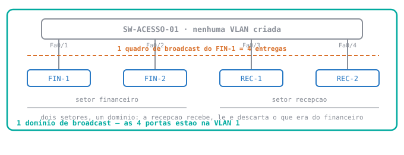
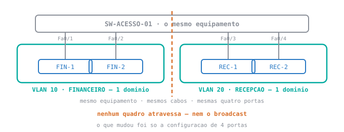

<div class="au-leitura" data-aula="s04">

# 🟢 Aula 04 — VLANs: a fronteira que se digita em vez de se comprar

**Disciplina:** 49309 — Redes de Computadores II — Uniube<br>
**Professor:** Romualdo Mathias Filho · **romualdo.filho@uniube.br**<br>
**Data:** Terça, 18/08/2026 · **VIA203** · 📘 Teórica (75 min)<br>
**Turmas práticas:** P11 segunda · VIA215 — P12 quinta · VIA216<br>
**Página de referência:** [Plano de Ensino e Contrato](./Plano-de-Ensino-e-Contrato)

---

<div class="au-caminho">
<b>Nosso caminho até aqui</b>

Na aula passada o switch aprendeu sozinho, e **não cortou o broadcast** — não havia como impedir. Hoje você impede, com configuração.

Quatro perguntas de retomada. As três primeiras são da aula passada; a quarta é de Redes I, e é a que mais vai te servir no fim de hoje. Responda **antes** de abrir.

<details>
<summary>A rede tinha três PCs e a tabela do switch tinha duas linhas. Por quê?</summary>

Porque o switch aprende lendo o **MAC de origem** de quem transmite. O terceiro PC recebeu a pergunta do ARP, viu que o IP não era dele e ficou quieto — nunca foi origem de nada.

Uma tabela MAC não é a lista de quem está conectado: é a lista de **quem transmitiu**.

</details>

<details>
<summary>Cache ARP e tabela MAC: onde cada um vive, e o que cada um casa?</summary>

O **cache ARP** vive na **estação**, no sistema operacional, e casa **IP ↔ MAC**. Vê-se com `arp -a`.

A **tabela MAC** vive no **switch**, e casa **MAC ↔ porta**. Vê-se com `show mac address-table`.

Regra de bolso: quem tem IP na cabeça é a estação; quem tem porta na cabeça é o switch.

</details>

<details>
<summary>Switch de 48 portas, 30 estações, nenhuma VLAN. Quantos domínios de broadcast? E quem corta um domínio de broadcast?</summary>

**Um.** Sem VLAN, o switch inteiro é um domínio de broadcast só — tenha ele 48 portas ou 4. Os 30 domínios de colisão são outra contagem, e é o switch que os cria.

Quem corta domínio de broadcast é o **roteador** — ou a **VLAN**. É o assunto de hoje.

</details>

<details>
<summary>De Redes I: uma máquina é <code>192.168.1.20</code> com máscara <code>255.255.255.0</code>, a outra é <code>192.168.1.30</code> com a mesma máscara. Elas estão na mesma rede? Como você decide isso?</summary>

**Estão.** A máscara `255.255.255.0` diz que os três primeiros números são a parte de rede: as duas são `192.168.1`, então pertencem à mesma sub-rede e conversam **sem roteador**.

Guarde essa conclusão. Hoje ela vai falhar — duas máquinas nessa exata situação não vão se alcançar, e a máscara não terá nada a ver com isso.

</details>
</div>

> [!INFO] 🎯 O que você leva desta aula
> - Por que um switch sozinho entrega o broadcast de um setor no outro, e qual é o **custo real** disso.
> - Como **criar** uma VLAN, e por que criar não separa nada.
> - As **duas linhas** que põem uma porta numa VLAN, e o que cada uma decide.
> - Por que duas máquinas com IP na mesma faixa podem não se alcançar — e por que isso é o **produto**, não o defeito.
>
> **📂 Recursos**
> - [Plano de Ensino e Contrato](./Plano-de-Ensino-e-Contrato) — calendário, notas, prazos e regras
> - [Manual do IOS no Packet Tracer](./Manual-do-IOS-no-Packet-Tracer) — **o console do switch, do zero**: os modos e o que o prompt diz, as três teclas que economizam digitação, por que o que você digitou não está salvo, e as quatro mensagens de erro. O **anexo** é a lista de comandos do semestre inteiro, por tema. É a página de apoio do pré-lab.
> - **Packet Tracer** — o simulador de redes da Cisco. Usamos no bloco de prática desta aula, e ele é a ferramenta do laboratório da sua turma prática.

### 🧭 A aula inteira é uma promessa e a fatura dela

| | A pergunta | A resposta |
| :-: | :--- | :--- |
| **1** | O switch entrega o broadcast em todas as portas. Isso **custa** o quê? | Banda, e algo pior: alcance de quem não deveria alcançar. |
| **2** | Como se corta esse alcance **sem** comprar equipamento? | Criando redes separadas dentro do mesmo switch: a **VLAN**. |
| **3** | E o que se **perde** quando se corta? | A conversa entre os dois lados. E recuperá-la é a próxima aula. |

<aside class="au-antes">
<b class="au-nota-t">Antes de começar</b>

Lista de consulta, não de leitura corrida: passe os olhos antes da aula e volte aqui sempre que uma palavra travar. Nada nesta página é cobrado como "você já devia saber".

<b class="au-nota-t">Da aula passada, e você vai usar hoje o tempo todo</b>

**Quadro** — a mensagem como ela trafega na camada de enlace: os dados, mais os endereços MAC de origem e de destino. O **pacote**, com os endereços IP, viaja **dentro** do quadro.

**Broadcast** — quadro endereçado a **todas** as estações do trecho, com MAC de destino `FF:FF:FF:FF:FF:FF`.

**Domínio de broadcast** — o conjunto de portas que recebe um quadro de broadcast. É o conceito central de hoje.

**Domínio de colisão** — o conjunto de equipamentos que disputam o mesmo meio para transmitir. Num switch, cada porta ativa é um. **Hoje não mexemos nesta contagem** — só na de broadcast.

**ARP** — o protocolo com que uma estação descobre o MAC de quem tem um determinado IP. Pergunta em **broadcast**, porque ainda não sabe para quem perguntar. Sem a resposta, o campo de MAC de destino fica vazio e **o quadro não sai**.

**Tabela MAC** — a lista do switch ligando cada MAC à porta em que ele foi visto.

**Sub-rede e máscara** — o conjunto de endereços IP que conversam entre si sem roteador, e o número que diz onde a rede termina. Vem de Redes I.

**`Fa0/1`** — o nome que o switch dá a cada tomada: `Fa` de *FastEthernet*, `0/1` de primeira porta do primeiro grupo.

**Porta de fábrica** — porta que ninguém configurou. Ela **não** está "sem VLAN": está na VLAN 1.

<b class="au-nota-t">Novo hoje</b>

**VLAN** — sigla de *Virtual Local Area Network*, rede local virtual. É uma rede separada criada **por configuração** dentro de um switch, sem trocar equipamento e sem mexer em cabo. "Virtual" aqui não quer dizer falsa: para o quadro, a fronteira é tão real quanto uma parede.

**VLAN 1**, ou **`default`** — a VLAN em que toda porta de um switch Cisco já nasce. É por isso que a coluna `Vlan` da tabela MAC mostra `1` em tudo mesmo sem ninguém ter configurado nada: **"sem VLAN configurada" não é "sem VLAN nenhuma"** — é "todas as portas continuam na mesma".

**ID de VLAN** — o número que identifica a VLAN no switch (`10`, `20`, `58`). Quem escolhe é o administrador. Não há relação obrigatória entre o número da VLAN e o número da sub-rede, mas **fazer os dois combinarem** — VLAN 10 com a rede `192.168.10.0`, por exemplo — poupa muito diagnóstico depois.

**Porta de acesso** — porta que serve **uma** VLAN só, e é onde se liga uma estação, uma impressora, um telefone IP. O quadro entra e sai dela sem nenhuma marca de VLAN: quem sabe a qual VLAN aquele tráfego pertence é o **switch**, pela porta em que ele entrou.

**`switchport`** — a família de comandos do IOS que configura o comportamento de uma porta de switch. `switchport mode` decide **o tipo** da porta; `switchport access vlan` decide **em qual VLAN** ela está.

**`show vlan brief`** — o comando que lista as VLANs do switch e **quais portas estão em cada uma**. É a prova de que a configuração pegou.

**`interface range`** — atalho para configurar várias portas de uma vez: `interface range fa0/1-2` aplica o que vier depois nas duas.

**Segmentar** — cortar uma rede grande em pedaços menores, para que o broadcast de um não chegue nos outros. É o verbo desta aula.

<b class="au-nota-t">Você vai ouvir hoje, mas é das próximas semanas</b>

**Trunk** — porta que carrega **várias** VLANs num único cabo. É o que resolve o problema que esta aula deixa em aberto, e é a próxima aula.

**Etiqueta 802.1Q** — a marca que o switch acrescenta ao quadro para dizer de qual VLAN ele é, quando o quadro tem de atravessar um cabo compartilhado. Numa porta de acesso ela **não** existe.

**Roteamento inter-VLAN** — o que faz duas VLANs voltarem a conversar, quando isso é desejado. Precisa de um equipamento que leia IP, e o switch de camada 2 não lê.

</aside>

---

## 📌 1. O broadcast do financeiro é entregue na recepção, e switch melhor não conserta isso [Conceito ⏳ 12 min]

Um switch de acesso num andar, 24 portas. As portas 1 e 2 atendem o setor financeiro; as 3 e 4, a recepção. Ninguém configurou nada além de ligar os cabos.

| Quem gera broadcast na rede local | Com que frequência |
| :--- | :--- |
| **ARP Request** — toda vez que uma estação precisa do MAC de alguém que não está no cache | constante, e o cache expira |
| **DHCP Discover** — toda vez que uma máquina liga e pede endereço | a cada boot, a cada volta de suspensão |
| Descoberta de serviço do sistema operacional — impressora, compartilhamento, nome de máquina | de fundo, sem ninguém pedir |

Nenhum desses é defeito. São a rede local funcionando. O problema é **quem recebe**.

### 1.1 Um quadro de broadcast é entregue em toda porta do domínio, sem exceção

<figure class="au-fig">

<figcaption class="au-legenda">Dois setores, <b>um</b> domínio. O contorno contínuo é o mesmo da aula passada e significa a mesma coisa: até onde um broadcast chega. Um <code>ARP Request</code> do <b>FIN-1</b> não é entregue "para o financeiro" — é entregue nas <b>quatro</b> portas, porque o switch não sabe que existem dois setores. Ninguém contou isso a ele.</figcaption>
</figure>

O switch não tem noção de setor, de andar, de organograma. Ele tem portas. Enquanto todas as portas estiverem na mesma VLAN, o alcance de um broadcast é o equipamento inteiro.

### 1.2 O custo tem duas metades, e a segunda não é de desempenho

| | O que acontece | Por que dói |
| :--- | :--- | :--- |
| **Banda e processamento** | cada estação recebe, interrompe o sistema, lê o quadro e quase sempre descarta | com poucas máquinas é irrelevante; o incômodo cresce com o tamanho do domínio, não com a velocidade do switch |
| **Alcance** | a máquina da recepção **recebe** o quadro do financeiro, ainda que o descarte | quem recebe pode guardar. Descartar é uma decisão do software da estação, não uma barreira da rede |

A primeira metade é a que aparece em prova. A segunda é a que aparece em auditoria: numa rede sem segmentação, **estar na mesma tomada é estar na mesma rede** — e a separação entre setores existe no organograma, não no equipamento.

E nada disso se resolve com um switch melhor. Entregar a todos aquilo que é endereçado a todos **é** o que um switch faz. A saída não é comutar melhor: é fazer o domínio ficar menor.

<details class="au-aposta">
<summary>Aposte antes de ver: você troca o switch de 24 portas por dois switches de 12, um por setor, ligados entre si por um cabo. Quantos domínios de broadcast?</summary>

**Um.** E maior do que antes.

Ligar os dois switches por um cabo **funde** os domínios: o broadcast que entra num sai no outro. Você gastou dinheiro, dobrou o número de equipamentos para manter e ficou com exatamente o mesmo alcance de broadcast — agora distribuído em duas caixas.

Domínio de broadcast é uma fronteira **lógica**. Comprar caixa não desenha fronteira lógica; configuração desenha.

</details>

---

## 📌 2. Criar a VLAN é nomear a rede; pôr a porta nela é decidir quem entra [Configuração ⏳ 15 min]

São dois atos diferentes, e confundi-los é o erro número um da semana.

```ios
! entra no modo de administracao e na configuracao
Switch> enable
Switch# configure terminal
Switch(config)# hostname SW-ACESSO-01

! ATO 1: criar as duas redes. Nenhuma porta e tocada aqui.
SW-ACESSO-01(config)# vlan 10
SW-ACESSO-01(config-vlan)# name FINANCEIRO
SW-ACESSO-01(config-vlan)# exit
SW-ACESSO-01(config)# vlan 20
SW-ACESSO-01(config-vlan)# name RECEPCAO
SW-ACESSO-01(config-vlan)# exit
```

O `name` é para gente, não para o switch — ele decide tudo pelo número. Nome de VLAN não aceita espaço.

### 2.1 A VLAN acabada de criar não tem porta nenhuma dentro

<div class="au-slot">
<div class="au-slot-h"><b>Pare e responda</b> · antes de continuar a leitura</div>
<div class="au-slot-c">

As VLANs 10 e 20 existem. **Nenhuma porta foi configurada** — o comando `switchport` ainda não foi digitado nenhuma vez.

**Quantos domínios de broadcast com estação dentro existem agora nesse switch?**

1. Três — a VLAN 1, a 10 e a 20
2. Dois — a 10 e a 20
3. Um
4. Nenhum — as estações ficaram sem VLAN

Escolha um número **antes** de rolar a página.

</div>
<p class="au-slot-b"><b>Se você está lendo fora da aula:</b> anote o número escolhido num canto do caderno antes de continuar.</p>
</div>

<div class="au-term">
<div class="au-term-h"><b>SW-ACESSO-01</b> <span>· as duas VLANs criadas, nenhuma porta tocada</span></div>
<div class="au-term-b"><span class="cm">! quais VLANs existem, e quem esta em cada uma</span>
<span class="ps">SW-ACESSO-01#</span> <span class="kw">show vlan brief</span>

VLAN Name                             Status    Ports
---- -------------------------------- --------- -------------------------------
<span class="mark">1    default                          active    Fa0/1, Fa0/2, Fa0/3, Fa0/4</span>
10   FINANCEIRO                       active
20   RECEPCAO                         active
<span class="cm">!</span>
<span class="cm">! as VLANs 10 e 20 existem e estao vazias.</span>
<span class="cm">! as quatro estacoes seguem todas na VLAN 1.</span></div>
</div>

**A resposta é a 3: um.** As linhas da VLAN 10 e da VLAN 20 existem e a coluna `Ports` das duas está **vazia**. As quatro estações continuam na `default`, e um broadcast do FIN-1 continua sendo entregue na recepção — a rede não mudou em nada.

Criar a VLAN é criar o **destino**. Ninguém se mudou ainda.

> [!TIP] 💡 Dica de produção
> Abra o Packet Tracer agora, no seu computador, e digite **só** as três linhas do ato 1 para a VLAN 10 — `vlan 10`, `name FINANCEIRO`, `exit`. Depois rode `show vlan brief` e confirme que a coluna `Ports` dela está vazia.
>
> Dois minutos. É a diferença entre ler que criar não separa e **ver** que criar não separa.

### 2.2 Duas linhas põem a porta na VLAN, e cada uma decide uma coisa diferente

```ios
! ATO 2: mover as portas. Agora sim a rede muda.
SW-ACESSO-01(config)# interface range fa0/1-2
SW-ACESSO-01(config-if-range)# switchport mode access
SW-ACESSO-01(config-if-range)# switchport access vlan 10
SW-ACESSO-01(config-if-range)# exit
SW-ACESSO-01(config)# interface range fa0/3-4
SW-ACESSO-01(config-if-range)# switchport mode access
SW-ACESSO-01(config-if-range)# switchport access vlan 20
SW-ACESSO-01(config-if-range)# end
```

| A linha | O que ela decide |
| :--- | :--- |
| `switchport mode access` | que esta porta serve **uma** VLAN só, e que ela **não negocia** nada com o equipamento do outro lado |
| `switchport access vlan 10` | **qual** é essa VLAN |

A ordem importa para o entendimento, não para o IOS: primeiro você declara o **tipo** da porta, depois o **número**. Uma porta de acesso é o lugar de uma estação — e o quadro que entra nela não carrega marca nenhuma de VLAN. Quem sabe a qual VLAN aquele tráfego pertence é o switch, pela porta.

> [!WARNING] ⚠️ Gotcha — o número sem o modo funciona hoje e quebra na semana que vem
> Digitar só `switchport access vlan 10`, sem o `switchport mode access`, dá resultado certo quando do outro lado do cabo há um PC. Você testa, funciona, e conclui que a primeira linha é enfeite.
>
> Não é. A porta de fábrica de um 2960 está em modo **dinâmico**: ela **aceita** negociar com o vizinho, embora não puxe a negociação sozinha. Com um PC do outro lado não há o que negociar e ela se comporta como acesso. Ligue do outro lado, na semana que vem, um switch cuja porta **proponha** a negociação, e essa mesma porta vira outra coisa — e aí o `access vlan 10` que você digitou passa a ser ignorado.
>
> Por isso dois switches saídos da caixa, ligados entre si, **continuam** em acesso: nenhum dos dois propõe. O defeito só aparece quando alguém propõe, e é sempre no pior dia.
>
> `switchport mode access` é o que torna a porta **surda a negociação**. Sem ela, você não configurou uma porta de acesso: você teve sorte.

> [!WARNING] ⚠️ Gotcha — apagar a VLAN não devolve a porta para a VLAN 1
> `no vlan 10` remove a VLAN. As portas que estavam nela **não** voltam para a `default`: ficam apontando para uma VLAN que não existe mais e param de encaminhar.
>
> No `show vlan brief` elas simplesmente **desaparecem da lista** — não estão na 1, não estão na 10, não estão em lugar nenhum. Quem não sabe disso passa meia hora conferindo cabo de uma estação que está muda por configuração.
>
> Reatribuir a porta a uma VLAN existente resolve. Recriar a VLAN 10 também.

> [!NOTE] 💼 Pergunta de entrevista
> *"A porta `Fa0/5` está na VLAN 10. O PC ligado nela está com um IP da faixa usada pela VLAN 20. Com quem esse PC consegue falar?"*
>
> **Resposta esperada:** com ninguém — e por **dois motivos independentes**. Na camada 2, o switch só entrega os quadros dessa porta dentro da VLAN 10; na camada 3, o IP dele está numa sub-rede em que não há mais ninguém na VLAN 10. Consertar um dos dois não resolve: **VLAN e sub-rede têm de combinar**. Candidato que responde só "falta gateway" não separou as duas camadas.

### 2.3 O `show vlan brief` lista porta, e não lista cabo nem sala

<div class="au-term">
<div class="au-term-h"><b>SW-ACESSO-01</b> <span>· depois do ato 2</span></div>
<div class="au-term-b"><span class="cm">! a prova de que a configuracao pegou</span>
<span class="ps">SW-ACESSO-01#</span> <span class="kw">show vlan brief</span>

VLAN Name                             Status    Ports
---- -------------------------------- --------- -------------------------------
1    default                          active    Fa0/5, Fa0/6, Fa0/7, Fa0/8
<span class="mark">10   FINANCEIRO                       active    Fa0/1, Fa0/2</span>
<span class="mark">20   RECEPCAO                         active    Fa0/3, Fa0/4</span>
<span class="cm">!</span>
<span class="cm">! as portas nao configuradas seguem em default -- a lista dela continua</span>
<span class="cm">! ate a ultima porta do equipamento.</span></div>
</div>

<figure class="au-fig">

<figcaption class="au-legenda">Compare com a figura anterior: <b>mesmo equipamento, mesmos cabos, mesmas portas</b>. Nada foi comprado e nada foi remanejado no rack. O que mudou foram quatro portas na configuração — e o contorno contínuo, que era um, virou <b>dois</b>. A linha tracejada no meio é a fronteira, e ela não deixa passar nem o broadcast.</figcaption>
</figure>

Repare no que a saída lista: **porta**. Não cabo, não sala, não setor.

O pertencimento é da porta, e disso saem duas consequências que confundem no primeiro contato:

- **Mudar o cabo de tomada muda a rede da estação** — sem ninguém ter tocado na estação.
- **Duas portas vizinhas no painel podem estar em redes diferentes.** A proximidade física não diz nada sobre a lógica.

---

## 📌 3. Duas VLANs no mesmo switch não se falam, e isso é o produto, não o defeito [Diagnóstico ⏳ 13 min]

Agora o preço. Você cortou o alcance do broadcast — e cortou junto **toda** a conversa entre os dois lados.

### 3.1 O `ping` falha antes de o primeiro pacote sair da placa

<div class="au-slot">
<div class="au-slot-h"><b>Pare e responda</b> · antes de continuar a leitura</div>
<div class="au-slot-c">

O **FIN-1** é `192.168.1.11` e o **REC-1** é `192.168.1.13`, os dois com máscara `255.255.255.0`. Pela regra de Redes I que você revisou na abertura, **estão na mesma sub-rede**. Mas estão em VLANs diferentes, e o `ping` do FIN-1 para o REC-1 falha.

**Onde exatamente essa comunicação falha?**

1. O quadro sai do FIN-1, o switch entrega no REC-1, e o REC-1 descarta
2. O `ARP Request` não atravessa a fronteira da VLAN, então o quadro do `ping` nunca chega a ser montado
3. Falta configurar o gateway padrão nas duas estações
4. O switch encaminha, e o REC-1 recusa por causa da máscara

Escolha um número **antes** de rolar a página.

</div>
<p class="au-slot-b"><b>Se você está lendo fora da aula:</b> anote o número escolhido num canto do caderno antes de continuar.</p>
</div>

<div class="au-term">
<div class="au-term-h"><b>FIN-1 · 192.168.1.11</b> <span>· mesma faixa de IP, VLAN diferente</span></div>
<div class="au-term-b"><span class="cm">! primeiro o vizinho de VLAN, depois o outro lado</span>
<span class="ps">C:\&gt;</span> <span class="kw">ping 192.168.1.12</span>

Reply from 192.168.1.12: bytes=32 time&lt;1ms TTL=128
Reply from 192.168.1.12: bytes=32 time&lt;1ms TTL=128

<span class="ps">C:\&gt;</span> <span class="kw">ping 192.168.1.13</span>

Request timed out.
Request timed out.
Request timed out.
Request timed out.

Ping statistics for 192.168.1.13:
<span class="mark">    Packets: Sent = 4, Received = 0, Lost = 4 (100% loss)</span>

<span class="ps">C:\&gt;</span> <span class="kw">arp -a</span>

  Internet Address      Physical Address      Type
  192.168.1.12          00D0.BA12.3401        dynamic
<span class="cm">!</span>
<span class="cm">! o 192.168.1.13 nao esta aqui. e nunca vai estar.</span></div>
</div>

**A resposta é a 2.** E a prova está na última linha: o `arp -a` tem a entrada do `.12` e **não tem** a do `.13`.

O FIN-1 fez tudo certo. A sequência dele, passo a passo:

1. Comparou o IP do destino com a própria máscara e concluiu que o `.13` está na mesma sub-rede.
2. Logo, deve entregar **direto**, sem roteador. Para isso precisa do MAC do `.13`.
3. Para descobrir esse MAC, mandou um `ARP Request` — que é **broadcast**.
4. O broadcast foi entregue em todas as portas do domínio dele **menos a de origem** — e o domínio dele agora tem só duas: `Fa0/1` e `Fa0/2`.
5. O REC-1 está na `Fa0/3`, do outro lado da fronteira. **Ele nunca recebeu a pergunta.**

Sem resposta, o campo de MAC de destino fica vazio — e quadro com esse campo vazio não sai da placa.

A falha não é no `ping`. É uma camada abaixo, no ARP, e é anterior ao primeiro pacote.

> [!WARNING] ⚠️ Gotcha — configurar gateway não resolve isso
> É a tentativa número um de quem vê esse `Request timed out`, e ela não pode funcionar: o gateway padrão é o endereço que a máquina usa para falar com quem está **fora** da sua sub-rede. Aqui o destino está **dentro** — a máscara diz que está. A estação não vai procurar gateway nenhum.
>
> E mesmo em VLANs com sub-redes diferentes, apontar o gateway não basta: alguém tem de **ler o IP e rotear**, e um switch de camada 2 não lê IP. É esse "alguém" que falta, e é a próxima aula.

<details class="au-aposta">
<summary>Aposte antes de ver: na aula passada, cem <code>ping</code> seguidos geraram <b>um</b> ARP Request. Quantos essas quatro tentativas falhadas geram?</summary>

**Mais de um** — e nunca um só.

Lá o primeiro pacote pagou a pergunta e a resposta ficou no cache; os 99 seguintes saíram direto. Aqui **nunca chega resposta**, então nada entra no cache, e cada tentativa recomeça a descoberta do zero.

É a mesma pergunta da aula passada com a resposta invertida. O mecanismo é o mesmo: quem economiza broadcast é o **cache**, e cache vazio não economiza nada.

</details>

### 3.2 Quem corta o quê — a tabela que organiza o resto do semestre

| | Domínio de colisão | Domínio de broadcast |
| :--- | :--- | :--- |
| **O que reúne** | quem disputa o mesmo meio para transmitir | quem recebe um quadro de broadcast |
| **Quem cria a fronteira** | o switch, a cada porta ativa | o **roteador** — ou a **VLAN** |
| **Antes de hoje, no SW-ACESSO-01** | 4 (uma por porta ativa) | **1** |
| **Depois de hoje** | 4 — **não mudou** | **2** |

A VLAN mexeu numa contagem e não encostou na outra. É o oposto exato do switch, que corta colisão completamente e broadcast, nada.

> [!NOTE] 💼 Pergunta de entrevista
> *"Uma empresa tem dois setores num switch e quer isolá-los. Comprar um segundo switch, um por setor, dá o mesmo resultado que criar duas VLANs?"*
>
> **Resposta esperada:** **não**, se os dois switches ficarem ligados entre si — nesse caso os domínios se fundem e não há isolamento nenhum. Dá o mesmo resultado só se os dois switches ficarem **fisicamente separados**, e aí o custo é comprar equipamento, ocupar rack e perder qualquer possibilidade de um setor crescer para uma porta do outro lado. A VLAN entrega a mesma fronteira por configuração, e ela se muda em dez segundos. Candidato que responde "sim, é equivalente" não percebeu que o cabo entre os dois switches desfaz o isolamento.

---

<div class="au-pratica">
<b>Pré-laboratório — faça em casa, antes da sua prática</b>

Isto **não é exercício de aula**: é a montagem que o laboratório da sua turma prática pressupõe pronta. São 15 minutos em casa, e quem chegar com a topologia salva começa o laboratório na parte que vale nota em vez de gastá-la digitando.

1. Monte **um switch 2960** e **quatro PCs**. Ligue PC-1 na `Fa0/1`, PC-2 na `Fa0/2`, PC-3 na `Fa0/3` e PC-4 na `Fa0/4`, com cabo de cobre direto.
2. Em cada PC: aba `Desktop` → `IP Configuration` → `Static`. Endereços `192.168.1.11`, `.12`, `.13` e `.14`, todos com máscara `255.255.255.0` e **gateway em branco**. Os quatro na mesma sub-rede, de propósito.
3. **Espere o link ficar verde.** A ponta fica âmbar por cerca de 30 segundos antes de encaminhar; `ping` antes disso falha e não é defeito seu.
4. No PC-1, `Desktop` → `Command Prompt`, rode `ping 192.168.1.13`. **Deve responder** — o primeiro dos quatro pacotes pode expirar enquanto o ARP resolve, e isso é normal. Anote: este é o estado "antes".
5. Clique no switch → aba `CLI`. Rode `enable`, `configure terminal`, e crie as duas VLANs (`vlan 10` / `name FINANCEIRO` / `exit` / `vlan 20` / `name RECEPCAO` / `exit`).
6. **Sem sair da configuração**, rode `do show vlan brief`. **A coluna `Ports` das VLANs 10 e 20 está vazia?** Repita o `ping` do passo 4: ele continua funcionando. Entenda por quê antes de seguir.
7. Agora mova as portas: `interface range fa0/1-2`, `switchport mode access`, `switchport access vlan 10`, `exit`; depois `interface range fa0/3-4`, `switchport mode access`, `switchport access vlan 20`, `end`. Confirme com `show vlan brief`.
8. **Salve o arquivo numa pasta local** e leve-o para a sua aula prática.

<p class="au-pronto"><b>Critério de pronto do pré-lab:</b> no passo 6 as VLANs 10 e 20 aparecem com a coluna <code>Ports</code> <b>vazia</b> e o <code>ping</code> entre PC-1 e PC-3 <b>ainda funciona</b>. No passo 7 o <code>show vlan brief</code> mostra <code>Fa0/1, Fa0/2</code> na VLAN 10 e <code>Fa0/3, Fa0/4</code> na 20. Este é o estado em que o laboratório da sua turma começa.</p>
</div>

> [!IMPORTANT] 📌 O pré-lab não vale ponto — o laboratório da sua turma vale
> Ninguém confere o pré-lab. Ele existe para que o laboratório da sua prática comece onde esta aula parou, em vez de repetir a digitação: **P11 na segunda, VIA215; P12 na quinta, VIA216.** O cenário é avisado no AVA antes dela.
>
> A régua da correção está no contrato: **dez itens verificados, oito deles = o ponto (80% de acerto)**, apurado na sua tela durante a aula.

---

<div class="au-resumo">
<b>O que você viu acontecer hoje</b>

Seis coisas passaram na tela nesta aula. Tente responder o *porquê* antes de abrir — é o esforço de lembrar que fixa, não a releitura.

| O que você viu acontecer | |
| :--- | :--- |
| Criamos duas VLANs e a rede não mudou em nada | <details><summary>por quê?</summary>Criar a VLAN cria o **destino**, não move ninguém. Enquanto todas as portas estiverem na VLAN 1, o domínio de broadcast continua sendo um — a coluna `Ports` das VLANs novas estava vazia.</details> |
| Depois de mover 4 portas, o mesmo switch passou a ter 2 domínios de broadcast | <details><summary>por quê?</summary>Porque a fronteira de um domínio de broadcast é **lógica**, não física. Nenhum equipamento foi comprado e nenhum cabo foi remanejado: mudou a configuração de quatro portas.</details> |
| O `ping` entre duas máquinas com IP na mesma faixa falhou | <details><summary>por quê?</summary>Porque a VLAN é uma fronteira de **camada 2**, e ela é anterior ao IP. A máscara estava certa e não teve nada a ver com a falha.</details> |
| O `arp -a` tinha a linha do vizinho de VLAN e não a do outro lado | <details><summary>por quê?</summary>O `ARP Request` é **broadcast**, e broadcast não atravessa VLAN. A pergunta nunca chegou ao outro lado, então nunca houve resposta para guardar. É a prova de que a falha foi **antes** do quadro.</details> |
| A contagem de domínios de colisão continuou 4 | <details><summary>por quê?</summary>Quem cria domínio de colisão é o switch, a cada porta ativa. A VLAN mexe **só** no alcance do broadcast — as duas contagens são independentes.</details> |
| As portas que ninguém configurou continuaram na `default` | <details><summary>por quê?</summary>Porque **"sem VLAN configurada" não é "sem VLAN"**: é estar na VLAN 1. Não existe porta fora de VLAN num switch Cisco.</details> |

**O fio para a próxima aula:** você tem duas redes e um switch. Amanhã são dois switches — e um cabo só entre eles, que precisa carregar as duas VLANs sem misturá-las. Para isso o quadro vai ter de dizer de qual VLAN ele é.

</div>

<hr class="au-fim-aula">

<div class="au-reflexao">
<b>Para pensar até a próxima aula</b>

<p>A fronteira que você levantou hoje é forte: nem o broadcast atravessa. E ela é feita de <b>configuração</b> — dez linhas digitadas num switch, guardadas num arquivo de texto dentro do equipamento.</p>

<p>Na semana que vem, para um quadro atravessar um cabo entre dois switches, ele vai carregar uma <b>marca</b> dizendo de qual VLAN ele é. Quem escreve essa marca é o switch de saída; quem confia nela é o switch de entrada.</p>

<p><b>O que aconteceria se um quadro chegasse já marcado, dizendo pertencer a uma VLAN que não é a dele?</b> Quem verifica essa afirmação? E se ninguém verifica, o que sobra da parede que você construiu hoje?</p>
</div>

## ✍️ Questões estilo Enade

Três questões no formato da prova. **As respostas não ficam nesta página** — elas voltam na correção em sala.

### Questão 1

Um técnico executa a seguinte configuração em um switch Cisco de camada 2 com quatro estações ligadas às portas `Fa0/1` a `Fa0/4`, todas na configuração de fábrica:

```ios
Switch(config)# vlan 10
Switch(config-vlan)# name FINANCEIRO
Switch(config-vlan)# exit
Switch(config)# vlan 20
Switch(config-vlan)# name RECEPCAO
Switch(config-vlan)# exit
```

Encerrada essa configuração, e sem nenhum outro comando, assinale a alternativa que descreve corretamente o estado do switch.

- **A)** Existem três domínios de broadcast, um para cada VLAN existente — a 1, a 10 e a 20 —, com as estações distribuídas automaticamente pelo IOS.
- **B)** As VLANs 10 e 20 existem sem nenhuma porta associada; as quatro estações permanecem na VLAN 1 e continuam em um único domínio de broadcast.
- **C)** As estações foram removidas da VLAN 1 e ficaram sem VLAN, o que interrompe a comunicação entre elas até que sejam atribuídas manualmente.
- **D)** As VLANs só passam a existir depois que a primeira porta é atribuída a elas, portanto o `show vlan brief` não as lista.
- **E)** As portas `Fa0/1` e `Fa0/2` são associadas à VLAN 10 e as portas `Fa0/3` e `Fa0/4` à VLAN 20, seguindo a ordem de criação.

### Questão 2

Em um switch de camada 2, as portas `Fa0/1` e `Fa0/2` estão na VLAN 10 e as portas `Fa0/3` e `Fa0/4` estão na VLAN 20, todas em modo de acesso. As quatro estações ligadas a essas portas estão configuradas na mesma sub-rede `192.168.1.0/24`, sem gateway padrão.

A estação da `Fa0/1` (`192.168.1.11`) executa `ping 192.168.1.13`, endereço da estação ligada à `Fa0/3`, e os quatro pacotes são perdidos. Em seguida, o técnico executa `arp -a` na estação de origem e verifica que **não há entrada** para `192.168.1.13`.

Assinale a alternativa que explica corretamente a falha.

- **A)** A máscara `255.255.255.0` é incompatível com o uso de VLANs, que exigem uma sub-rede distinta por VLAN para que o encaminhamento de camada 2 ocorra.
- **B)** O `ARP Request` enviado pela estação de origem é um quadro de broadcast e não é encaminhado para fora da VLAN 10; sem o `ARP Reply`, o endereço MAC de destino não é obtido e o quadro do `ping` não é transmitido.
- **C)** O quadro é transmitido normalmente e entregue à estação de destino, que o descarta ao constatar que a origem pertence a outra VLAN.
- **D)** A ausência de gateway padrão impede a comunicação, pois todo tráfego entre VLANs distintas é encaminhado pelo gateway configurado na estação.
- **E)** O switch aprendeu o endereço MAC da estação de destino na tabela MAC, mas descarta o quadro porque a entrada foi registrada em uma VLAN diferente da porta de entrada.

### Questão 3

Uma empresa segmentou a rede em **VLAN 10** (financeiro) e **VLAN 20** (recepção), num único switch de camada 2. Em seguida chega a reclamação:

| | O cenário |
| :--- | :--- |
| **O sintoma** | as estações do financeiro deixaram de acessar um servidor de arquivos |
| **Onde o servidor ficou** | na VLAN 20 |
| **Endereçamento** | todas as estações e o servidor na **mesma sub-rede** |
| **A proposta do administrador** | configurar, nas estações do financeiro, o endereço do **servidor** como gateway padrão |

Avalie a proposta.

- **A)** Resolve: o gateway padrão é consultado sempre que o destino não responde ao `ARP Request` na própria VLAN.
- **B)** Resolve parcialmente: restabelece o acesso ao servidor, mas mantém o isolamento do restante da VLAN 20.
- **C)** Não resolve: o gateway padrão só é consultado para destinos **fora** da sub-rede da estação e, como o servidor está na mesma sub-rede, ele não será consultado. Restabelecer o acesso exige devolver o servidor à VLAN do financeiro, ou reendereçar as duas VLANs em sub-redes distintas e rotear entre elas.
- **D)** Não resolve: é necessário apenas remover o comando `switchport mode access` das portas do financeiro para que elas voltem a encaminhar para a VLAN 20.
- **E)** Resolve: uma estação configurada como gateway padrão passa a encaminhar tráfego entre VLANs, função conhecida como roteamento inter-VLAN por host.

### 🔬 Para ir além

IEEE. **IEEE Std 802.1Q — Bridges and Bridged Networks.** New York: IEEE.

| | |
| :--- | :--- |
| Primeira edição | 1998 |
| Edição vigente | 802.1Q-2022 |
| Acesso | ⚠️ norma paga — não abre com login da universidade |

**Por que saber que ela existe:** é a norma que criou a VLAN, e a definição dela é sobre **pertencimento** — um conjunto de estações que se comportam como se estivessem no mesmo trecho de rede, independentemente de onde estejam fisicamente ligadas. É de lá que sai a marca 802.1Q da próxima aula. Fica aqui como referência de origem, não como leitura: **o que dá para ler de graça sobre isto é o módulo 3 do SRWE**, citado nas referências.

<div class="au-refs">
<b>Referências desta aula</b>

- KUROSE, J. F.; ROSS, K. W. **Redes de computadores e a internet: uma abordagem top-down.** 8. ed. São Paulo: Pearson, 2021. <span class="au-pag">cap. 6, seç. 6.4.4 — redes locais virtuais (VLANs): isolamento de tráfego e VLANs baseadas em porta</span>
- CISCO NETWORKING ACADEMY. **CCNA: Switching, Routing, and Wireless Essentials (SRWE).** Cisco Systems. Disponível em: https://www.netacad.com/. Acesso em: 17 ago. 2026. <span class="au-pag">módulo 3 — VLANs: definição, VLANs de dados, atribuição de portas de acesso e o comando <code>show vlan brief</code></span>

</div>

<div class="au-proxima">
<b>Na próxima aula</b>

<p>Hoje a fronteira ficou dentro de um switch só, e isso resolve um andar. Agora imagine o financeiro em dois andares, com um switch em cada um, e **um único cabo** ligando os dois. Esse cabo tem de carregar a VLAN 10 e a VLAN 20 ao mesmo tempo, sem misturá-las — e a porta de acesso que você configurou hoje serve **uma** VLAN só. Falta um tipo de porta que sirva várias, e falta o quadro dizer de qual VLAN ele é. É o <b>trunk</b>, e a marca chama-se <b>802.1Q</b>.</p>
</div>

---

*Última atualização: 17/08/2026 · Sujeito à confirmação institucional (ver aviso na aula teórica da S01).*

**◀ [Voltar ao índice da disciplina](./)**

</div>

