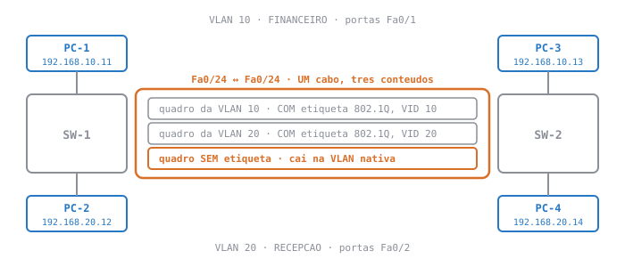

# Lab 3 — Trunk entre switches: o cabo que carrega as duas VLANs

**Disciplina:** 49309 — Redes de Computadores II — Uniube 
**Professor:** Romualdo Mathias Filho · **romualdo.filho@uniube.br** 
**Data:** **P12** — quinta, 27/08/2026 · **VIA216** · **P11** — data ainda não fechada no calendário da turma; será anunciada em sala e aqui 
**Duração:** 🛠️ Prática, 75 min · mesmo cenário e mesma régua nas duas turmas 
**Fecha a teórica de:** [Trunking 802.1Q: o quadro passa a dizer de onde veio](./Aula-05---Trunking-802.1Q-(Teorica))

---

<b>Nosso caminho até aqui</b>

Na terça você viu **por que** um cabo entre switches precisa etiquetar quadro. Hoje você põe esse cabo para funcionar, quebra ele de propósito e olha a etiqueta com os próprios olhos, no simulador.

Antes de mexer em qualquer coisa, responda de cabeça. As respostas estão logo abaixo de cada pergunta, mas **tentar primeiro é o que fixa** — ler a resposta sem tentar não vale quase nada.

1. Um cabo entre dois switches, com as duas pontas em porta de acesso na VLAN 10. Quem atravessa?
Só a VLAN 10. A porta de acesso serve **uma** VLAN, e o switch trata aquele cabo como mais uma porta dela — o tráfego da VLAN 20 nem chega a ser encaminhado para lá.

2. Onde a etiqueta 802.1Q nasce e onde ela morre?
Nasce no switch que **entrega** o quadro ao tronco e morre no switch que o **retira** do tronco, antes de entregá-lo na porta de acesso. A estação nunca vê etiqueta nenhuma — nem a de origem, nem a de destino.

3. O que é a VLAN nativa de um tronco?
É a VLAN em que cai tudo o que trafega **sem etiqueta** naquele tronco. De fábrica é a VLAN 1, e ninguém precisou escolher isso — é o padrão, não uma decisão.

4. Do Lab 2: quando o PC-1 pingou uma estação da VLAN 20, por quantas portas saiu o <code>ARP Request</code>?
Por **uma** — a outra porta de acesso da VLAN 10 daquele switch, e o quadro nunca deixou o equipamento. Guarde essa imagem: hoje o número vai ser o mesmo, e mesmo assim a tela vai ser outra. Descobrir **por quê** é o bloco 3.

> [!INFO] 🎯 O que você leva desta aula
> - Um comando de diagnóstico que você vai usar até o fim do semestre: `show interfaces trunk`, e os **quatro** campos dele que importam.
> - A VLAN nativa deixando de ser padrão de fábrica e virando decisão sua — nos **dois** lados.
> - A armadilha do `switchport trunk allowed vlan`, que **substitui** a lista em vez de acrescentar, vista na sua tela e não em slide.
> - A etiqueta 802.1Q aparecendo no quadro dentro do tronco e **sumindo** no quadro que chega na estação, passo a passo no modo Simulation.
>
> **📂 Recursos**
> - [Aula 05 — Trunking 802.1Q](./Aula-05---Trunking-802.1Q-(Teorica)) — a teórica que este laboratório fecha. O glossário dela vale aqui, e o **pré-lab** dela é o ponto de partida de hoje.
> - [Aula 04 — Lab 2: VLANs](./Aula-04---Lab-2-VLANs-(Pratica)) — o `show interfaces switchport` e o modo Simulation apareceram lá; hoje eles voltam apontados para outro alvo.
> - [Plano de Ensino e Contrato](./Plano-de-Ensino-e-Contrato) — calendário, notas, prazos e regras
> - [Manual do IOS no Packet Tracer](./Manual-do-IOS-no-Packet-Tracer) — **leia se o console for o seu gargalo**: os modos, o prompt, o `do` e as quatro mensagens de erro. Esta página ensina tronco, não datilografia.
> - **Packet Tracer** — o mesmo do Lab 2. Não há bloco de instalação hoje.

> [!IMPORTANT] 📌 Este laboratório vale **1 ponto**
> É 1 ponto da **Atividade N1**, a nota de laboratório que compõe a primeira avaliação ao lado da prova. A régua é a do contrato e é sempre a mesma: **dez itens verificados, oito deles = o ponto (80% de acerto)**.
>
> Não há arquivo `.pka` hoje: **eu confiro os dez itens na sua tela, na hora**. Os dez são **re-executáveis** — eu peço o comando e leio o resultado. Você não precisa ter anotado nada para provar que fez.

<aside class="au-antes">
<b class="au-nota-t">Antes de começar</b>

O vocabulário de rede de hoje — tronco, etiqueta 802.1Q, VLAN nativa, VLAN permitida, DTP — está definido no [glossário da teórica de terça](./Aula-05---Trunking-802.1Q-(Teorica)). O vocabulário do **simulador** — `Realtime`, `Simulation`, `Edit Filters`, `Capture / Forward`, PDU — está no [glossário do Lab 1](./Aula-03---Lab-1-Switching-Basico-(Pratica)). Aqui ficam só as palavras que são **novas nesta aula**.

<b class="au-nota-t">O que é novo hoje: um comando e quatro campos</b>

**`show interfaces trunk`** — a lista de **todos** os troncos do switch, uma linha por porta. É o primeiro comando a rodar quando alguma coisa não atravessa entre dois switches, e o único que responde de uma vez se o tronco existe, com que VLAN nativa e carregando o quê.

**`Mode`** — o que **você pediu** naquela porta: `on` quer dizer `switchport mode trunk`, `desirable` e `auto` são os modos que negociam.

**`Status`** — o que a porta **virou**: `trunking` é tronco de pé. Se este campo não disser `trunking`, nenhum dos outros importa.

**`Native vlan`** — a VLAN em que cai o tráfego **sem etiqueta** daquele tronco. Ele mostra `1` mesmo quando ninguém escolheu, porque padrão de fábrica também é um valor.

**`Vlans allowed on trunk`** — a lista de VLANs que **podem** atravessar. VLAN que existe nos dois switches mas não está nesta lista simplesmente não passa, e nada avisa.

**`switchport trunk allowed vlan add <lista>`** — a forma que **acrescenta** à lista. Sem o `add`, o comando **substitui** tudo o que estava lá.

**Quebra deliberada** — eu derrubo alguma coisa na sua topologia sem dizer o quê, e você descobre. Ocupa os últimos minutos de toda prática, e o **como você descobriu** vale mais do que o que era.

</aside>

---

## 📌 1. Prove onde você está antes de mudar qualquer coisa [Diagnóstico ⏳ 12 min]

<figure class="au-fig">

<figcaption class="au-legenda">O estado em que o pré-lab da terça deixou a rede — e o mapa do dia inteiro. As <b>duas primeiras faixas</b> são o que você vai provar no bloco 1; a <b>terceira</b>, a que passa sem etiqueta, é o bloco 2. Repare que ela existe mesmo quando ninguém a configurou: é a VLAN nativa de fábrica, e é justamente por ninguém a ter escolhido que ela é um problema.</figcaption>
</figure>

Hoje não se monta topologia. Ela veio pronta do pré-lab da terça, e o primeiro trabalho é **provar** que ela está no estado que a aula pressupõe. Rede que ninguém provou é rede que ninguém sabe onde está.

### 1.1 Se você não fez o pré-lab, a receita mínima é esta

Se você **fez** o pré-lab, pule direto para o 1.2. Se não fez, esta é a versão de resgate: ela monta a mesma topologia, sem as explicações que o pré-lab trazia. **Não são 4 minutos** — em sala, com o professor circulando, conte de 10 a 15. Você vai atrasar em relação à turma, e é por isso que o pré-lab existe.

**Primeiro a topologia** (é ela que o 1.2 pressupõe, e nenhum comando a cria):

1. Arraste **dois switches 2960** e **quatro PCs** para a área de trabalho. Renomeie os switches para `SW-1` e `SW-2`.
2. Ligue `PC-1` na `Fa0/1` do SW-1 e `PC-2` na `Fa0/2` do SW-1; `PC-3` na `Fa0/1` do SW-2 e `PC-4` na `Fa0/2` do SW-2 — **cabo direto** nos quatro.
3. Ligue a `Fa0/24` do SW-1 na `Fa0/24` do SW-2 com **cabo cruzado**. Switch com switch é cruzado; ponta vermelha é cabo errado, não configuração.
4. Endereço em cada PC (aba `Desktop` → `IP Configuration`), máscara `255.255.255.0` nos quatro e **gateway em branco**: `PC-1` `192.168.10.11` · `PC-2` `192.168.20.12` · `PC-3` `192.168.10.13` · `PC-4` `192.168.20.14`.

**Depois a configuração**, no console de cada switch. O bloco abaixo é o do SW-1; repita **igual** no SW-2, trocando só o nome do prompt.

<b>SW-1</b> · receita minima, repetir igual no SW-2

! as duas VLANs, nos DOIS switches
SW-1(config)# vlan 10
SW-1(config-vlan)# name FINANCEIRO
SW-1(config-vlan)# vlan 20
SW-1(config-vlan)# name RECEPCAO
! as portas de estacao
SW-1(config)# interface fa0/1
SW-1(config-if)# switchport mode access
SW-1(config-if)# switchport access vlan 10
SW-1(config-if)# interface fa0/2
SW-1(config-if)# switchport mode access
SW-1(config-if)# switchport access vlan 20
! e o cabo do meio
SW-1(config-if)# interface fa0/24
SW-1(config-if)# switchport mode trunk
SW-1(config-if)# switchport trunk allowed vlan 10,20
SW-1(config-if)# end

<b>Pronto quando:</b> os PCs são <code>192.168.10.11</code> (PC-1, <code>Fa0/1</code> do SW-1), <code>192.168.20.12</code> (PC-2, <code>Fa0/2</code> do SW-1), <code>192.168.10.13</code> (PC-3, <code>Fa0/1</code> do SW-2) e <code>192.168.20.14</code> (PC-4, <code>Fa0/2</code> do SW-2), todos com máscara <code>255.255.255.0</code> e <b>gateway em branco</b>, e o cabo entre <code>Fa0/24</code> e <code>Fa0/24</code> é <b>cruzado</b>. Ponta vermelha é cabo errado, não configuração.

### 1.2 Exercício 1 — os quatro campos do tronco [⏳ 4 min]

Rode isto **nos dois switches** e compare as duas telas lado a lado. É o comando mais importante desta aula. Logo depois, na `Fa0/24` de cada um, rode também `show interfaces fa0/24 switchport` — ele responde outra pergunta: o que você **pediu** (`Administrative Mode`) e o que a porta **virou** (`Operational Mode`). Hoje os dois dizem `trunk`; no Lab 2 eles discordavam.

<b>SW-1</b> · o tronco como o pre-lab o deixou

SW-1# show interfaces trunk
!
Port        Mode         Encapsulation  Status        Native vlan
Fa0/24      on           802.1q         trunking      1
!
Port        Vlans allowed on trunk
Fa0/24      10,20
!
Port        Vlans allowed and active in management domain
Fa0/24      10,20
! saida recortada -- o comando imprime mais um bloco na sua tela.

Quatro campos, e cada um responde uma pergunta diferente:

| Campo | A pergunta que ele responde | O que você deve estar vendo |
| :--- | :--- | :--- |
| `Mode` | o que **eu pedi** nesta porta? | `on` — foi `switchport mode trunk` |
| `Status` | o que a porta **virou**? | `trunking`. Se não disser isto, pare aqui: nada mais importa |
| `Native vlan` | onde cai o que passa **sem etiqueta**? | `1` — e **ninguém escolheu isso**. É o assunto do bloco 2 |
| `Vlans allowed` | o que **pode** atravessar? | `10,20` |

<b>Critério de pronto do exercício 1:</b> os <b>dois</b> switches mostram <code>Fa0/24</code> com <code>Status trunking</code> e <code>Vlans allowed 10,20</code>. Se um lado mostra e o outro devolve a tela <b>vazia</b>, você configurou um lado só — e é exatamente por isso que este exercício pede os dois.

### 1.3 Exercício 2 — a prova de que atravessa [⏳ 3 min]

Do PC-1, pingue o PC-3 (`192.168.10.13`). Do PC-2, pingue o PC-4 (`192.168.20.14`). Depois, do PC-1, pingue o PC-4 (`192.168.20.14`).

**Os dois primeiros respondem. O terceiro falha, e tem de falhar.** Se o terceiro responder, alguma porta ficou na VLAN errada — as duas VLANs atravessam o mesmo cabo, cada uma na sua, e continuam sem se enxergar. Essa separação é o produto que você entregou; ela não é defeito.

<b>PC-1</b> · as tres telas, nesta ordem

! 1. mesma VLAN, outro switch -- atravessa o tronco
PC&gt; ping 192.168.10.13
Reply from 192.168.10.13: bytes=32 time&lt;1ms TTL=128
!
! 2. no PC-2, a outra VLAN -- tambem atravessa, na dela
PC&gt; ping 192.168.20.14
Reply from 192.168.20.14: bytes=32 time&lt;1ms TTL=128
!
! 3. de volta ao PC-1, cruzando de VLAN -- tem que falhar
PC&gt; ping 192.168.20.14
Reply from 192.168.10.11: Destination host unreachable.
! Packets: Sent = 4, Received = 0, Lost = 4 (100% loss)
! quem responde e o PROPRIO PC-1: o destino esta em outra sub-rede
! e o gateway esta em branco. No Lab 2 dava "Request timed out",
! porque la as quatro estacoes estavam na mesma sub-rede.

<b>Critério de pronto do exercício 2:</b> PC-1 → <code>.13</code> responde, PC-2 → <code>.14</code> responde, PC-1 → <code>.14</code> devolve <code>Lost = 4 (100% loss)</code>. As três telas, nessa ordem. A mensagem do terceiro é <code>Destination host unreachable</code>, e não o <code>Request timed out</code> do Lab 2 — mudou o endereçamento, mudou o sintoma; o que não mudou é a separação.

---
## 📌 2. A VLAN nativa deixa de ser padrão e vira decisão sua [Mão na massa ⏳ 16 min]

O `Native vlan 1` que apareceu no bloco 1 não foi escolha de ninguém: é o que vem de fábrica. Agora você vai escolher — e vai ver, na sua tela, o que acontece quando os dois lados discordam.

### 2.1 Exercício 3 — mude num lado só, de propósito [⏳ 5 min]

Aposte antes de ver: você troca a VLAN nativa do tronco <b>em um lado só</b>. O que acontece com os <code>ping</code>s que já funcionavam?

**Nada. Eles continuam respondendo.**

A VLAN nativa não decide o caminho do tráfego **etiquetado** — e etiquetado é quase tudo o que passa ali. Ela decide uma coisa só: onde cai o que passa **sem** etiqueta. Por isso o defeito que você está prestes a criar não derruba serviço nenhum, e é exatamente por isso que ele sobrevive meses numa rede de verdade.

Quem apostou "o tronco cai" está usando a régua da disponibilidade num problema de segurança.

**Só no SW-1.** Deixe o SW-2 como está.

<b>SW-1</b> · so este lado, de proposito

SW-1(config)# vlan 99
SW-1(config-vlan)# name NATIVA
SW-1(config-vlan)# interface fa0/24
SW-1(config-if)# switchport trunk native vlan 99
SW-1(config-if)# end

Agora observe **três coisas**, nesta ordem:

1. **O console.** Pode aparecer uma mensagem de **incompatibilidade de VLAN nativa** na `Fa0/24`. Se aparecer, leia-a inteira — ela nomeia as duas VLANs em desacordo.
2. **Os pings.** Repita o exercício 2: PC-1 → `.13` e PC-2 → `.14`. **Continuam respondendo.**
3. **O `show interfaces trunk` nos dois switches.** Um diz `Native vlan 99`, o outro diz `Native vlan 1`.

> [!WARNING] ⚠️ Nada caiu, e é justamente esse o problema
> Você acabou de criar um defeito que **não tem sintoma de disponibilidade**. Nenhum usuário abre chamado, nenhum gráfico fica vermelho, o `ping` responde. O que mudou é para onde vai o tráfego que anda **sem etiqueta** neste cabo: ele sai na VLAN 99 de um lado e chega como VLAN 1 do outro. Duas VLANs que deveriam ser separadas passaram a se enxergar, e a única evidência é a divergência entre duas telas.
>
> Rede que só se confere pelo `ping` não pega isso. É o defeito da Questão 3 da teórica, agora na sua bancada.

<b>Critério de pronto do exercício 3:</b> as duas saídas de <code>show interfaces trunk</code> lado a lado, uma com <code>Native vlan 99</code> e a outra com <code>Native vlan 1</code>, <b>e</b> o <code>ping</code> do PC-1 para o <code>.13</code> ainda respondendo. Você precisa das duas evidências juntas — é o par que define este defeito.

### 2.2 Exercício 4 — feche os dois lados, e a lista junto [⏳ 6 min]

Agora conserte. **No SW-2**, crie a VLAN 99 e alinhe a nativa — e, nos **dois** switches, acrescente a 99 à lista de permitidas.

<b>SW-2</b> · alinhar o outro lado, e a lista nos dois

SW-2(config)# vlan 99
SW-2(config-vlan)# name NATIVA
SW-2(config-vlan)# interface fa0/24
SW-2(config-if)# switchport trunk native vlan 99
SW-2(config-if)# switchport trunk allowed vlan add 99
SW-2(config-if)# end
! e o mesmo "allowed vlan add 99" no SW-1, senao a nativa fica de fora da lista

> [!WARNING] ⚠️ `add` não é enfeite — sem ele o comando **substitui** a lista
> `switchport trunk allowed vlan 99` apaga o `10,20` que estava lá e deixa a lista com a VLAN 99 sozinha. As duas VLANs de verdade param de atravessar na hora, e o IOS **aceita sem reclamar**.
>
> Quem quer **somar** escreve `allowed vlan add 99`. Quem quer **trocar** escreve sem o `add`. A palavra faz o que ela diz, não o que você quis dizer — é a mesma armadilha do `no vlan 10` do Lab 2.

<b>Critério de pronto do exercício 4:</b> nos <b>dois</b> switches, <code>show interfaces trunk</code> mostra <code>Native vlan 99</code> e <code>Vlans allowed 10,20,99</code>; a mensagem de incompatibilidade, <b>se ela apareceu no exercício 3</b>, parou; e os <code>ping</code>s do exercício 2 continuam respondendo. Se a lista mostrar só <code>99</code>, você esqueceu o <code>add</code> — refaça com <code>allowed vlan 10,20,99</code>.

### 2.3 Por que a VLAN 99 e não a 1

Você acabou de mover o tráfego sem etiqueta para uma VLAN **onde não há estação nenhuma**. Isso é prática de rede, não capricho de exercício: o que trafega limpo no tronco fica isolado de qualquer máquina de usuário. Se alguém injetar um quadro sem etiqueta naquele cabo, ele cai numa VLAN vazia, e não no meio do financeiro.

A VLAN 1 é o pior lugar possível para isso justamente por ser o padrão: **toda porta que ninguém configurou está nela**. É a única VLAN cujo conteúdo você não controla.

| | VLAN nativa = 1 (fábrica) | VLAN nativa = 99 (sua decisão) |
| :--- | :--- | :--- |
| **Quem mais está nessa VLAN** | todas as portas que ninguém configurou — **de fábrica, as 26 do 2960**; na sua topologia de hoje, as 23 que sobraram | ninguém: você criou a VLAN e não pôs porta nenhuma nela |
| **Onde cai um quadro sem etiqueta injetado no cabo** | no meio de portas de usuário | numa VLAN vazia, sem para onde ir |
| **Quem escolheu isso** | ninguém — é o padrão | você, e está escrito na configuração |

---

## 📌 3. Ver a etiqueta com os próprios olhos [Mão na massa ⏳ 16 min]

Até aqui você leu a etiqueta em texto, na saída de comando. Agora você vai **olhar dentro do quadro**, passo a passo, e ver os 4 bytes aparecerem e sumirem.

### 3.1 Exercício 5 — o ARP que agora sai do equipamento [⏳ 8 min]

1. No PC-1, apague o cache com `arp -d` e feche a janela do prompt.
2. Passe o Packet Tracer para **`Simulation`**.
3. Em **`Edit Filters`**, deixe marcados **só `ARP` e `ICMP`**. Sem isso a tela enche de protocolo que não interessa hoje.
4. No PC-1, rode `ping 192.168.10.13` e volte para a topologia.
5. **Pare aqui.** Antes de avançar um único passo, faça a aposta abaixo — ela leva dez segundos e é o motivo de este exercício existir.

Aposte antes de ver: no SW-1 há <b>uma</b> porta de acesso na VLAN 10 (a do PC-1), uma na VLAN 20 (a do PC-2) e o tronco. Por <b>quantas</b> portas o <code>ARP Request</code> vai sair? Escreva o número antes de clicar em <code>Capture / Forward</code>.

**Por uma.** O número é o mesmo do Lab 2 — e a graça está em **qual**.

Não é a `Fa0/2`: aquela é da VLAN 20, e o switch não inunda a VLAN 20 com broadcast da VLAN 10. É a **`Fa0/24`**, o tronco. Pela primeira vez no semestre o broadcast **sai do equipamento**, e sai porque o tronco é membro da **VLAN 10**, como qualquer porta de acesso daquela VLAN seria. E repare no que o mesmo cabo ainda é: membro **também** da VLAN 20, ao mesmo tempo — as três faixas da figura lá do começo, agora com um quadro de verdade passando por **uma** delas.

Quem apostou "duas" contou a `Fa0/2` junto. Quem apostou "uma" e disse *`Fa0/1`* contou a porta por onde o quadro **entrou** — e switch não devolve quadro pela porta de origem.

**Agora sim, o passo 6:** avance com **`Capture / Forward`**, um passo por vez, e nunca com o `Auto Capture`. Conte as portas por onde o quadro sai e compare com o número que você escreveu.

No Lab 2 essa mesma pergunta terminava dentro do switch. Hoje ela termina no cabo do meio, e a diferença inteira é o cabo ter virado tronco.

<b>Critério de pronto do exercício 5:</b> o envelope do <code>ARP Request</code> atravessando a <code>Fa0/24</code> e chegando ao SW-2, e o PC-4 (VLAN 20) <b>sem receber nada</b> — a separação continua de pé mesmo com o tronco carregando as duas.

### 3.2 Exercício 6 — os 4 bytes, na tela [⏳ 8 min]

Clique no envelope **enquanto ele está no cabo entre os dois switches** e abra o detalhe do PDU. Depois clique no envelope **entre o SW-2 e o PC-3**, e compare.

| Onde você clica | O que o quadro mostra |
| :--- | :--- |
| No envelope **dentro do tronco** (`Fa0/24` ↔ `Fa0/24`) | o cabeçalho traz o campo **802.1Q**, com o número da VLAN — os 4 bytes que a teórica desenhou |
| No envelope **entre o SW-2 e o PC-3** (porta de acesso) | o mesmo quadro, **sem** campo 802.1Q nenhum: um Ethernet comum |

> [!NOTE] 💡 Esta é a aula inteira numa imagem
> A etiqueta **nasce** quando o quadro entra no tronco e **morre** quando ele sai. O PC-3 nunca soube que existe uma VLAN 10 — ele recebeu um quadro Ethernet comum, exatamente como receberia numa rede sem VLAN nenhuma. Toda a separação aconteceu no cabo entre os dois switches.

<b>Critério de pronto do exercício 6:</b> você abriu <b>os dois</b> envelopes e sabe dizer, apontando na tela, em qual deles existe o campo 802.1Q e em qual não existe. Se o detalhe do PDU não mostrar o campo, confira se você clicou no envelope que está <b>sobre o cabo do meio</b> — dentro do switch ele ainda não foi etiquetado.

> [!TIP] 💡 Se o seu Packet Tracer não mostrar o campo 802.1Q
> Nem toda versão exibe o cabeçalho da etiqueta no detalhe do PDU. Se a sua não mostrar, **não invente**: o item 6 da conferência passa a ser o par de saídas do `show interfaces trunk` do exercício 4, e você me avisa. A evidência que falta é do simulador, não sua.

---

<b>A conferência — os 10 itens que valem o ponto</b>

Eu passo nas bancadas durante os blocos 2 e 3 e confiro estes dez na sua tela. Todos são **re-executáveis**: eu peço o comando e leio o resultado, você não precisa ter anotado nada.

1. A topologia do pré-lab de pé: dois switches, quatro PCs, cabo **cruzado** entre `Fa0/24` e `Fa0/24`, sem ponta vermelha.
2. `show vlan brief` nos **dois** switches, com as VLANs 10 e 20 e as portas `Fa0/1` e `Fa0/2` de cada lado nelas.
3. `show interfaces trunk` no SW-1 mostrando `Fa0/24` com `Status trunking`.
4. O mesmo comando no SW-2, com o mesmo resultado — o tronco é dos **dois** lados, e este item existe porque metade das travadas do semestre é um lado só configurado.
5. `ping` do PC-1 para o `.13` respondendo, e `ping` do PC-1 para o `.14` com `Lost = 4 (100% loss)`.
6. As **duas** telas do exercício 3, uma com `Native vlan 99` e a outra com `Native vlan 1`, e o `ping` ainda respondendo — o defeito sem sintoma.
7. `show interfaces trunk` nos dois switches, depois do conserto, com `Native vlan 99` e `Vlans allowed 10,20,99`.
8. `show interfaces fa0/24 switchport` mostrando `Administrative Mode: trunk` e `Operational Mode: trunk` — o que você pediu e o que a porta virou, iguais desta vez.
9. No modo `Simulation`, o `ARP Request` do PC-1 atravessando o tronco, e o PC-4 sem receber nada.
10. Os dois envelopes do exercício 6 abertos, e você dizendo em voz alta em qual existe o campo 802.1Q e em qual não existe.

<b>Critério de pronto:</b> <b>8 destes 10 itens</b> conferidos na sua tela — a régua do contrato, 80% de acerto. Só os itens 1 e 2 vêm prontos do pré-lab; os outros oito existem porque você mediu alguma coisa hoje. Os itens <b>6 e 10</b> são os que eu mais peço para você explicar em voz alta, porque nos dois a evidência é uma comparação, não um valor isolado.

### Terminou antes? A quebra deliberada [⏳ 8 min, para toda a sala]

Assim que eu conferir os seus 10 itens, eu **derrubo uma coisa** na sua topologia e digo só isto:

> *"Acabei de derrubar uma coisa. Você tem dois minutos para me dizer **qual** e **como descobriu**."*

Duas regras: **um teste por vez**, e diga em voz alta o que vai testar antes de testar. Hoje há uma terceira, e ela é a lição do dia: **antes de mexer em qualquer PC, rode `show interfaces trunk` nos dois switches e compare as duas saídas**. Quase todo defeito de hoje está visível nessas duas telas, e quem começa pelo host perde os dois minutos.

> [!NOTE] 💼 Pergunta de entrevista
> *"Dois switches ligados por um tronco. A VLAN 10 atravessa normalmente; a VLAN 30, criada ontem nos dois equipamentos, não atravessa. Nenhum erro aparece e nada foi reiniciado. O que você investiga?"*
>
> **Resposta esperada:** `show interfaces trunk` nos dois lados, e a leitura do campo `Vlans allowed`. A hipótese mais provável é que alguém tenha rodado `switchport trunk allowed vlan 30` sem o `add` — ou, mais provável ainda, que a lista nunca tenha incluído a 30 e ninguém percebeu, porque a VLAN existe, as portas de acesso estão certas e **dentro** de cada switch ela funciona. O que não funciona é a travessia.
>
> Candidato que responde "recrio o tronco" tem chance de acertar por acidente e nenhuma de saber por quê — e vai repetir o defeito na próxima VLAN que criar.

---

<b>Para casa — 5 exercícios, no mesmo arquivo do laboratório</b>

Todos rodam na topologia de hoje, e todos se verificam sozinhos: cada um termina num comando cujo resultado você **vê na tela**.

**1. A lista que substitui.** No SW-1, rode `switchport trunk allowed vlan 20` na `Fa0/24` e olhe o `show interfaces trunk`. Depois devolva a lista completa.
Pronto quando: você viu a lista virar `20` sozinha, o `ping` do PC-1 para o `.13` **parar** de responder, e depois voltar ao normal com `switchport trunk allowed vlan 10,20,99`. O IOS não reclamou em nenhum dos dois momentos — é isso que faz o defeito ser caro.

**2. O tronco de um lado só.** No SW-2, rode `switchport mode access` na `Fa0/24`. Olhe o `show interfaces trunk` **nos dois** switches.
Pronto quando: o SW-2 devolve a tela **vazia** e o SW-1 continua mostrando `Fa0/24`. Desfaça com `switchport mode trunk` e confirme que os dois voltam a mostrar `trunking`.

**3. Separar "não é tronco" de "porta desligada".** Agora dê `shutdown` na `Fa0/24` do SW-2 e compare com o que você viu no exercício 2.
Pronto quando: você sabe dizer qual comando distingue os dois casos **olhando só o SW-2**. Ali o `show interfaces trunk` vem vazio nas duas situações; quem separa é o `show interfaces status`, onde a porta desligada aparece como `disabled`. Devolva com `no shutdown`. Repare que, olhando **os dois** switches, o `show interfaces trunk` já separaria: com o vizinho em `access` a `Fa0/24` do SW-1 continua listada, e com o vizinho em `shutdown` ela some — é a diferença entre "não combinamos" e "o cabo caiu".

**4. Uma terceira VLAN atravessando.** Crie a **VLAN 30** (`SUPORTE`) nos dois switches, ponha a `Fa0/3` de cada um nela, acrescente a 30 ao tronco **com `add`**, e ligue dois PCs novos: `192.168.30.15` e `192.168.30.16`.
Pronto quando: os dois PCs novos se pingam **atravessando o tronco**, `show interfaces trunk` mostra `10,20,30,99`, e nenhum deles alcança o `.11` nem o `.12`.

**5. Salvar, que ainda não está salvo.** Nos dois switches, `copy running-config startup-config` e depois `show startup-config`.
Pronto quando: a resposta **não** é `startup-config is not present` e o texto mostra a `Fa0/24` com `switchport mode trunk`. Sem isto, um `reload` devolve os dois equipamentos ao estado de fábrica — e o switch não avisa.

<b>Se algum não fechar:</b> anote o comando, o prompt em que você estava e a mensagem exata. Essas três linhas resolvem quase sempre, e são o que eu peço quando você me chamar.

<b>Bilhete de saída</b> · anônimo · 3 min

Meia folha de papel, **sem nome**, recolhida na porta. Duas perguntas, sem nota:

1. *Com suas palavras: por que trocar a VLAN nativa em um lado só não derrubou nada, e mesmo assim é um defeito?*
2. *Qual foi o ponto mais confuso da aula de hoje?*

A segunda pergunta é a que muda a próxima aula: o que aparecer duas vezes entra na consolidação da semana que vem.

<b>Se você está lendo fora da aula:</b> responda as duas no caderno mesmo assim, antes de conferir com o resumo abaixo. E se faltar papel na sala, as duas respostas vão no verso da sua folha de anotações e eu recolho igual — o bilhete não depende de material, nem da internet do campus.

<b>O que você viu acontecer hoje</b>

Cinco coisas passaram na sua tela. Tente responder o *porquê* antes de abrir.

| O que você viu acontecer | |
| :--- | :--- |
| O `show interfaces trunk` de um lado mostrava o tronco e o do outro vinha vazio | 

por quê?
Porque tronco é uma decisão dos **dois** lados. Um lado declarado e o outro em modo de acesso não formam tronco — e o lado declarado continua exibindo a porta, o que engana quem confere um só.
 |
| Trocar a VLAN nativa num lado só não derrubou nada | 

por quê?
Porque a nativa não afeta o tráfego **etiquetado**, que é quase todo. Ela só decide onde cai o que anda **sem** etiqueta — e é por isso que o defeito é de segurança, não de disponibilidade: nada para, e duas VLANs passam a se enxergar.
 |
| `switchport trunk allowed vlan 99` derrubou as VLANs 10 e 20 | 

por quê?
Porque o comando **substitui** a lista inteira. Quem quer acrescentar escreve `allowed vlan add 99`. O IOS aceita os dois sem reclamar, e o sintoma aparece longe do comando.
 |
| O `ARP Request` que no Lab 2 saía por uma porta do switch agora sai pelo tronco | 

por quê?
Mesma contagem, outra porta. O switch inunda o domínio de broadcast da VLAN 10, e o cabo do meio agora faz parte dele — porque o tronco é membro da VLAN 10, e da VLAN 20 junto.
 |
| O mesmo quadro tinha o campo 802.1Q no tronco e não tinha na porta de acesso | 

por quê?
Porque a etiqueta nasce ao entrar no tronco e é retirada ao sair dele. A estação recebe um Ethernet comum — ela nunca soube em que VLAN está.
 |

**O fio para a próxima aula:** as duas VLANs atravessam prédios inteiros, cada uma na sua, e continuam **sem conversar entre si**. Só que o financeiro precisa alcançar o servidor da recepção. Alguém tem de ler o **IP** e decidir para onde mandar — e um switch de camada 2 não lê IP.

<b>Para pensar até a próxima aula</b>

Você isolou o tráfego sem etiqueta numa VLAN 99 vazia, e isso deixou a rede mais segura. Mas repare no que continua verdadeiro: **o tronco aceita qualquer etiqueta que chegue nele.** Se alguém ligar um equipamento naquele cabo e mandar um quadro marcado como VLAN 10, o switch vai tratá-lo como VLAN 10 — ninguém verifica se aquele equipamento tinha o direito de dizer isso.

Onde, na topologia de hoje, esse cabo estaria fisicamente acessível a alguém de fora? E o que impediria essa pessoa de escolher a VLAN em que quer entrar? A resposta é a S16, segurança de camada 2 — e a pergunta é a mesma que a teórica de terça deixou aberta.

<b>Referências desta aula</b>

- CISCO NETWORKING ACADEMY. **CCNA: Switching, Routing, and Wireless Essentials (SRWE).** Cisco Systems. Disponível em: https://www.netacad.com/. Acesso em: 25 ago. 2026. módulo 3 — VLANs e troncos: configuração do tronco, VLAN nativa e a lista de VLANs permitidas. O localizador é o módulo, e não a subseção, porque o material do NetAcad é paginado por tópico dentro do módulo e não traz numeração de página estável para citar
- KUROSE, J. F.; ROSS, K. W. **Redes de computadores e a internet: uma abordagem top-down.** 6. ed. São Paulo: Pearson, 2013. seç. 5.4.4, p. 357–359 — redes locais virtuais (VLANs) e o encapsulamento entre comutadores
- TANENBAUM, A. S.; FEAMSTER, N.; WETHERALL, D. J. **Redes de Computadores.** 6. ed. Porto Alegre: Bookman/Pearson, 2021. seç. 4.7.5, p. 221–225 — LANs virtuais

A configuração de VLAN nativa e a lista de VLANs permitidas apoiam-se **no SRWE**: os dois livros da bibliografia tratam do conceito de VLAN e do quadro etiquetado, e não da configuração desses dois campos no IOS.

<b>Na próxima aula</b>

Um switch de camada 2 não lê IP, e as suas duas VLANs precisam conversar. Terça você vai colocar quem lê IP no meio do caminho — e vai descobrir que dá para fazer isso com **um único cabo**, o mesmo tronco de hoje, num arranjo com nome de piada e uso muito sério.

**◀ [Voltar ao índice da disciplina](./)**

