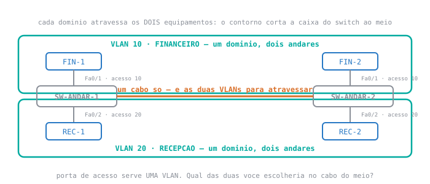
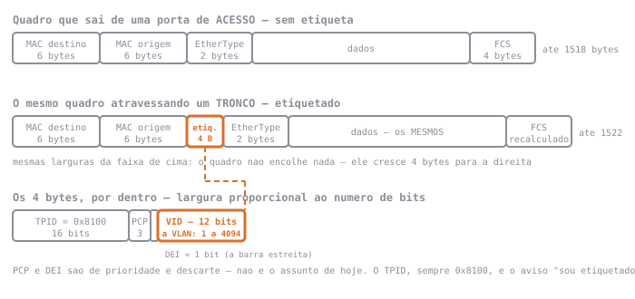

<div class="au-leitura" data-aula="s05">

# 🟢 Aula 05 — Trunking 802.1Q: o quadro passa a dizer de onde veio

**Disciplina:** 49309 — Redes de Computadores II — Uniube<br>
**Professor:** Romualdo Mathias Filho · **romualdo.filho@uniube.br**<br>
**Data:** Terça, 25/08/2026 · **VIA203** · 📘 Teórica (75 min)<br>
**Turmas práticas:** P11 segunda · VIA215 — P12 quinta · VIA216<br>
**Página de referência:** [Plano de Ensino e Contrato](./Plano-de-Ensino-e-Contrato)

---

<div class="au-caminho">
<b>Nosso caminho até aqui</b>

Na aula passada você levantou uma parede dentro de um switch, com dez linhas de configuração. Hoje a parede tem de atravessar um **cabo** — e um cabo não tem paredes.

Quatro perguntas de retomada. As três primeiras são da aula passada; a quarta é da Aula 02, e é a que mais vai te servir no meio de hoje. Responda **antes** de abrir.

<details>
<summary>Criei a VLAN 10 e a VLAN 20 e não mexi em porta nenhuma. Quantos domínios de broadcast com estação dentro?</summary>

**Um.** Criar a VLAN cria o **destino**; ninguém se mudou. A coluna `Ports` das duas continua vazia no `show vlan brief`, e as estações seguem todas na VLAN 1.

</details>

<details>
<summary>Duas máquinas, <code>192.168.1.11</code> e <code>192.168.1.13</code>, mesma máscara, VLANs diferentes. O <code>ping</code> falha <b>onde</b>?</summary>

No **ARP**, antes de o primeiro pacote existir. O `ARP Request` é broadcast e não atravessa a fronteira da VLAN; sem resposta, o campo de MAC de destino fica vazio e o quadro não sai da placa.

A prova é o `arp -a` **sem** a entrada do destino.

</details>

<details>
<summary>O que a porta de acesso faz com a informação de VLAN, quando o quadro entra por ela?</summary>

Nada — porque não há informação de VLAN no quadro. Numa porta de acesso o quadro entra e sai **limpo**. Quem sabe a qual VLAN aquele tráfego pertence é o **switch**, pela porta em que ele entrou.

Guarde isso: hoje a informação vai ter de viajar **dentro do quadro**, e é a primeira vez no semestre que isso acontece.

</details>

<details>
<summary>Da Aula 02, e olhando a figura da próxima seção: o SW-ANDAR-1 recebe um quadro do FIN-1 (VLAN 10) para um MAC que ele não conhece, e <b>inunda</b>. Uma das portas do domínio é o cabo que sobe para o SW-ANDAR-2. Quando o quadro chega lá, <b>em qual VLAN ele cai?</b></summary>

Escreveu "na 10"? É a resposta que quase todo mundo dá, e ela pressupõe uma coisa que **ainda não é verdade**: que a VLAN viaja junto com o quadro.

A resposta honesta, com o que você sabe até agora, é: **o SW-ANDAR-2 não tem como saber.** O que chegou nele foi um quadro Ethernet comum — dois endereços MAC e dados. A informação de que aquilo era da VLAN 10 vivia na **porta** do primeiro switch, e ficou lá.

A primeira metade da inundação você já sabia: o switch repete por todas as portas do domínio, menos a de origem. A segunda metade é a fatura de hoje — **a travessia apaga a VLAN**, e a aula inteira é sobre devolvê-la ao quadro.

</details>
</div>

> [!INFO] 🎯 O que você leva desta aula
> - Por que a porta de acesso, que resolveu a aula passada, **não** resolve o cabo entre dois switches.
> - O que são exatamente os **4 bytes** que o switch acrescenta ao quadro, e onde eles entram.
> - As linhas que transformam uma porta em **tronco**, e por que o modo de fábrica não serve.
> - O que é a **VLAN nativa**, por que ela existe, e por que ela é o furo mais clássico dessa parede.
>
> **📂 Recursos**
> - [Plano de Ensino e Contrato](./Plano-de-Ensino-e-Contrato) — calendário, notas, prazos e regras
> - [Manual do IOS no Packet Tracer](./Manual-do-IOS-no-Packet-Tracer) — os modos do console, as teclas que economizam digitação e as mensagens de erro. O **anexo** tem os comandos do semestre por tema.
> - **Packet Tracer** — usado no pré-laboratório desta página e no laboratório da sua turma prática.
> - **Wireshark** — o analisador de tráfego. Se ele aparecer, aparece **projetado em sala**, com uma pergunta só: a etiqueta está lá ou não está.

### 🧭 A aula inteira é uma promessa e a fatura dela

| | A pergunta | A resposta |
| :-: | :--- | :--- |
| **1** | Uma VLAN que precisa existir em **dois** switches: como ela atravessa o cabo? | O quadro passa a carregar uma marca dizendo de qual VLAN ele é. |
| **2** | Quem escreve essa marca, e quem a retira? | O switch de saída escreve; o de entrada lê e **retira** antes de entregar na estação. |
| **3** | E se um quadro chegar **sem** marca nenhuma? | Ele não é descartado. Cai na **VLAN nativa** — e é aí que a parede tem um furo. |

<aside class="au-antes">
<b class="au-nota-t">Antes de começar</b>

Lista de consulta, não de leitura corrida: passe os olhos antes da aula e volte aqui sempre que uma palavra travar. Nada nesta página é cobrado como "você já devia saber".

<b class="au-nota-t">Da aula passada, e você vai usar hoje o tempo todo</b>

**VLAN** — rede separada criada por configuração dentro de um switch, sem trocar equipamento e sem mexer em cabo.

**ID de VLAN** — o número que identifica a VLAN no switch (`10`, `20`, `99`). Hoje esse número deixa de viver só na configuração e passa a viajar **dentro do quadro**.

**Porta de acesso** — porta que serve **uma** VLAN só, onde se liga uma estação. O quadro entra e sai dela **sem marca nenhuma** de VLAN.

**VLAN 1**, ou **`default`** — a VLAN em que toda porta de um switch Cisco já nasce.

**Domínio de broadcast** — o conjunto de portas que recebe um quadro de broadcast. Hoje ele passa a atravessar mais de um equipamento.

**Quadro** — a mensagem na camada de enlace: os dados mais os endereços MAC de origem e de destino. É ele que vai ganhar quatro bytes hoje.

**Inundação** (*unknown unicast*) — o switch encaminha por todas as portas do domínio, menos a de origem, quando o MAC de destino não está na tabela.

**EtherType** — o campo do quadro que diz o que vem nos dados: se é IPv4, IPv6, ARP. É um número, e o switch o lê para saber como tratar o conteúdo.

**FCS** (*frame check sequence*) — os últimos quatro bytes do quadro, uma conta feita sobre todo o resto para detectar corrupção no caminho. Quem altera o quadro precisa refazer essa conta.

<b class="au-nota-t">Novo hoje</b>

**Tronco**, ou **trunk** — porta que carrega **várias** VLANs pelo mesmo cabo, mantendo o tráfego de cada uma separado. É o oposto da porta de acesso, e o lugar dela é entre equipamentos: switch–switch, switch–roteador, switch–servidor de virtualização.

**802.1Q**, ou **dot1q** — a norma que define **como** o quadro diz de qual VLAN ele é. É a única forma de etiquetagem que os switches usados na disciplina falam.

**Etiqueta**, ou **tag** — os **4 bytes** que o switch insere no quadro, entre o MAC de origem e o campo de tipo. Só existem enquanto o quadro está num tronco.

**TPID** (`0x8100`) — os dois primeiros bytes da etiqueta. É o valor que avisa "este quadro é etiquetado" para quem for lê-lo.

**VID** — os 12 bits que carregam o número da VLAN. Doze bits dão 4096 combinações, numeradas de 0 a 4095, e as **utilizáveis vão de 1 a 4094**: quem está reservado pela norma é o **0** e o **4095**.

**Etiquetar / desetiquetar** — o que o switch de saída e o de entrada fazem, nessa ordem. **A estação nunca vê a etiqueta**: ela é posta e retirada dentro da rede.

**VLAN nativa** — a VLAN em que o switch coloca um quadro que chegou pelo tronco **sem** etiqueta. De fábrica é a VLAN 1. É o conceito mais importante do último terço da aula.

**`switchport mode trunk`** — o comando que declara a porta como tronco **permanente**: ela não depende de acordo com o vizinho para se comportar como tronco. Cuidado com o que ele **não** faz: a porta continua **anunciando-se** ao vizinho pelo DTP. Emudecer esse anúncio é outro comando, o `switchport nonegotiate`.

**`switchport nonegotiate`** — o comando que desliga o envio de DTP naquela porta. É o que torna a porta de fato surda **e** muda a qualquer negociação. Sem ele, uma porta declarada tronco ainda pode arrastar o vizinho para tronco sem que ninguém tenha configurado o outro lado.

**`show interfaces trunk`** — o comando que lista quais portas são tronco, qual é a VLAN nativa de cada uma e **quais VLANs passam** por elas. É a prova de que a configuração pegou.

**DTP** (*Dynamic Trunking Protocol*) — o protocolo proprietário com que uma porta Cisco negocia com o vizinho se o cabo vira tronco ou não. É o que a Aula 04 chamou de "modo dinâmico", e hoje ele ganha nome.

<b class="au-nota-t">Você vai ouvir hoje, mas é das próximas semanas</b>

**Roteamento inter-VLAN** — o que faz duas VLANs voltarem a conversar. Precisa de um equipamento que leia IP, e o tronco é o cabo por onde isso vai acontecer. É a próxima aula.

**Ataque de salto de VLAN** — a família de ataques que se aproveita justamente da VLAN nativa. Aparece nomeada hoje, e é conteúdo de **segurança de camada 2**, na S16.

</aside>

---

## 📌 1. Uma VLAN em dois switches, e um cabo que serve uma VLAN só [Conceito ⏳ 13 min]

A empresa cresceu um andar. O financeiro agora tem gente no térreo e no primeiro andar; a recepção também. São dois switches, um por andar, e — como em qualquer prédio real — **um único cabo** subindo entre eles.

<figure class="au-fig">

<figcaption class="au-legenda">Os contornos são os mesmos da aula passada e significam a mesma coisa — até onde um broadcast chega. A diferença é que agora <b>cada um deles atravessa dois equipamentos</b>: o FIN-1 e o FIN-2 têm de continuar na mesma VLAN 10, ainda que estejam em andares diferentes. E há <b>um</b> cabo entre os switches, destacado em laranja.</figcaption>
</figure>

### 1.1 A solução óbvia funciona, e morre no terceiro andar

A primeira ideia de toda turma é honesta e correta: se a porta de acesso serve uma VLAN, use **um cabo por VLAN**. Uma porta de acesso na VLAN 10 de cada lado, ligadas entre si; outro par na VLAN 20. Duas VLANs, dois cabos. Funciona.

| Quantas VLANs | Quantos cabos entre os dois switches | Quantas portas isso consome, somando os dois lados |
| :-- | :-- | :-- |
| 2 | 2 | 4 |
| 5 | 5 | 10 |
| 12 | 12 | 24 — **um switch inteiro de 24 portas só para interligar** |

E cabo não é o pior. Cada VLAN nova passa a exigir **passagem de cabo em prédio**: eletroduto, canaleta, técnico subindo. A configuração deixa de ser configuração e vira obra — e a aula passada inteira defendeu o contrário, que fronteira de rede se digita.

> [!WARNING] ⚠️ Gotcha — o cabo a mais entre dois switches não é redundância, é laço
> A saída "um cabo por VLAN" tem um efeito colateral que só aparece daqui a duas aulas: **dois cabos ligando os mesmos dois switches formam um caminho fechado**, e um quadro de broadcast que entra num caminho fechado volta, é reencaminhado, volta de novo — sem nada que o faça parar.
>
> Numa rede de camada 2 isso não é lentidão: é a rede inteira parando em segundos. Existe um protocolo que impede exatamente isso, e ele é o assunto de duas semanas à frente.
>
> Por ora, guarde o que interessa hoje: **a solução de um cabo por VLAN não é só cara — ela cria um problema que a solução de um cabo só não cria.**

<details class="au-aposta">
<summary>Aposte antes de ver: e se, em vez de dois cabos, você usar <b>um</b> cabo com as duas pontas em portas de acesso da VLAN 10? O que acontece com o tráfego da VLAN 20?</summary>

**Ele não atravessa — e o da VLAN 10 atravessa perfeitamente.**

O switch trata aquele cabo como mais uma porta da VLAN 10. Um broadcast da VLAN 10 sai por lá e chega no outro andar; um broadcast da VLAN 20 nem chega a ser encaminhado para essa porta, porque ela não pertence ao domínio dele.

O resultado é o mais confuso possível para quem está diagnosticando: **metade da rede funciona entre andares e a outra metade não**, com o mesmo cabo, o mesmo switch e nenhum erro na tela. Não existe mensagem de erro para "esta porta serve só uma VLAN" — é o comportamento correto dela.

</details>

### 1.2 O que falta é o quadro dizer de onde veio

O problema não é o cabo: é a **informação que se perde na travessia**. Quando o quadro do FIN-1 chega ao SW-ANDAR-2, esse switch precisa decidir em quais portas encaminhá-lo — e para isso precisa saber que aquele quadro é da VLAN 10.

Na aula passada, quem sabia a VLAN era a **porta**. Isso funcionou porque origem e destino estavam no mesmo equipamento: a mesma tabela sabia tudo. Entre dois equipamentos, a porta de entrada do segundo switch é uma só, e por ela passa tráfego das duas VLANs.

É a pergunta que você já respondeu na abertura, agora com nome: **a travessia apaga a VLAN.**

| Onde a informação de VLAN mora | Sobrevive à travessia? |
| :--- | :--- |
| Na **porta** do switch de origem — a solução da aula passada | **Não.** Ela descreve uma tomada daquele equipamento, e a tomada não viaja |
| Numa **tabela combinada** entre os dois switches | **Não resolve.** Ela também descreve portas, e dois quadros seguidos na mesma porta podem ser de VLANs diferentes |
| **Dentro do quadro** | **Sim** — é a única coisa que atravessa o cabo junto com ele |

Só existem duas saídas: ou o segundo switch **adivinha**, ou o quadro **conta**. A norma escolheu a segunda.

> [!NOTE] 💼 Pergunta de entrevista
> *"Por que a informação de VLAN viaja dentro do quadro, e não numa tabela combinada entre os switches?"*
>
> **Resposta esperada:** porque a decisão de encaminhamento é tomada **por quadro**, no instante em que ele chega. Dois quadros que entram pela mesma porta, um atrás do outro, podem ser de VLANs diferentes — e nenhuma tabela combinada entre equipamentos distingue um do outro, porque ela descreve **portas**, não quadros. A informação tem de estar **no** quadro porque é ele que mudou de VLAN, não a porta. Candidato que propõe "os switches se avisam antes" não percebeu qual é a unidade de decisão.

---

## 📌 2. A etiqueta são 4 bytes, e ela só existe dentro do cabo entre equipamentos [Configuração ⏳ 21 min]

A norma **802.1Q** resolveu isso do jeito mais econômico possível: não criou protocolo novo, não criou mensagem nova. Ela **insere quatro bytes no quadro que já existia**.

### 2.1 Onde exatamente os quatro bytes entram

<figure class="au-fig">

<figcaption class="au-legenda">Compare as duas faixas: <b>mesmos endereços, mesmos dados</b>. A etiqueta não envolve o quadro nem o substitui — ela é <b>enfiada no meio</b>, logo depois do MAC de origem. Dos quatro bytes, os que interessam hoje são os 12 bits do <b>VID</b>: é ali que vai o número da VLAN.</figcaption>
</figure>

Três consequências saem direto do desenho:

| O que se vê na figura | O que isso significa |
| :--- | :--- |
| A etiqueta entra **depois** do MAC de origem | quem lê o quadro pela ordem encontra os dois endereços no lugar de sempre; só depois descobre que há uma etiqueta |
| O quadro cresce de até **1518** para até **1522** bytes | equipamento no meio do caminho que não conheça 802.1Q pode considerar isso um quadro grande demais e descartar |
| O `FCS` é **recalculado** | o campo de verificação estava certo para o quadro antigo; com quatro bytes a mais, ele tem de ser refeito |

O `TPID`, sempre `0x8100`, é o aviso. Naquela posição, um quadro comum traria o **EtherType** — o número que diz se o conteúdo é IPv4, IPv6, ARP. Ao encontrar `0x8100` ali, o switch entende "isto não é o tipo, é uma etiqueta" e sabe que o tipo verdadeiro vem quatro bytes adiante.

> [!TIP] 💡 Dica de produção
> Os campos `PCP` e `DEI` não são enfeite: é por eles que voz e vídeo passam na frente do resto quando o tronco congestiona. Só que **quem os usa é a qualidade de serviço**, e isso não é assunto desta disciplina. Saiba que existem, saiba que estão nos mesmos quatro bytes, e siga.
>
> **Se o livro que você abrir mostrar `CFI` no lugar do `DEI`, você não abriu o livro errado.** É o mesmo bit, com o nome que ele tinha em edições anteriores da norma. Material mais antigo traz `CFI`; material recente traz `DEI`.

### 2.2 A etiqueta nasce numa ponta e morre na outra

<div class="au-slot">
<div class="au-slot-h"><b>Pare e responda</b> · antes de continuar a leitura</div>
<div class="au-slot-c">

O **FIN-1** está na VLAN 10, ligado a uma porta de acesso do SW-ANDAR-1. Ele manda um quadro para o **FIN-2**, também na VLAN 10, ligado a uma porta de acesso do SW-ANDAR-2. Entre os dois switches há um tronco.

**Quando esse quadro chega à placa de rede do FIN-2, ele tem a etiqueta 802.1Q?**

1. Tem — e é assim que o FIN-2 sabe em que VLAN ele está
2. Tem, mas o sistema operacional a ignora
3. Não — o switch de destino a retira antes de entregar
4. Depende: tem se as duas máquinas estiverem na mesma VLAN

Escolha um número **antes** de rolar a página.

</div>
<p class="au-slot-b"><b>Se você está lendo fora da aula:</b> anote o número escolhido num canto do caderno antes de continuar.</p>
</div>

**A resposta é a 3.** A etiqueta é posta e retirada **dentro** da rede, e a viagem do quadro tem quatro momentos bem definidos:

1. O quadro entra pela porta de acesso do SW-ANDAR-1, **limpo**. O switch sabe que é da VLAN 10 porque conhece a porta.
2. Para sair pelo tronco, o switch **insere** os quatro bytes com `VID = 10` e recalcula o `FCS`.
3. O SW-ANDAR-2 recebe o quadro etiquetado, **lê** o `VID`, e passa a tratá-lo como tráfego da VLAN 10 — inclusive para decidir em quais portas encaminhar.
4. Ao entregar na porta de acesso do FIN-2, o switch **remove** a etiqueta e recalcula o `FCS` de novo. O que chega na placa é um quadro Ethernet comum.

Por isso a estação **nunca soube e nunca vai saber** em que VLAN ela está. Ela não configura VLAN, não lê VLAN, não escolhe VLAN. Quem decide é a porta em que o cabo dela está enfiado — exatamente como na aula passada.

> [!WARNING] ⚠️ Gotcha — "então é só marcar a VLAN na placa de rede do PC"
> Não é, e a tentativa aparece todo semestre. Um PC comum manda quadro **sem etiqueta**; se você forçar um sistema operacional a etiquetar e ligar esse PC numa porta de **acesso**, o switch recebe um quadro que ele não esperava etiquetado naquela porta — e o resultado não é "o PC entrou na VLAN que ele pediu".
>
> Guarde a regra que organiza o resto do semestre: **porta de acesso não espera etiqueta; tronco espera.** Etiquetar é decisão do switch, não da estação. E quando um equipamento **não é** uma estação comum — um servidor de virtualização com dez máquinas virtuais, por exemplo — a resposta certa não é forçar a placa: é ligá-lo num **tronco**, que é o tipo de porta feito para isso.

### 2.3 Duas linhas fazem o tronco, e a primeira é a que importa

```ios
! nos DOIS switches, na porta que liga um ao outro
SW-ANDAR-1(config)# interface fa0/24
SW-ANDAR-1(config-if)# switchport mode trunk
SW-ANDAR-1(config-if)# switchport trunk allowed vlan 10,20
SW-ANDAR-1(config-if)# end
```

| A linha | O que ela decide |
| :--- | :--- |
| `switchport mode trunk` | que esta porta carrega **várias** VLANs, etiquetando o que sai e lendo a etiqueta do que entra. Ela é tronco **por decisão sua**, e não por acordo com o vizinho — mas continua **anunciando-se** a ele |
| `switchport trunk allowed vlan 10,20` | **quais** VLANs têm permissão de atravessar. Sem essa linha, atravessam **todas** |
| `switchport nonegotiate` *(opcional, e é a linha que quase ninguém digita)* | que esta porta **para de anunciar-se** pelo DTP. Sem ela, a porta declarada tronco arrasta o vizinho de fábrica para tronco também — é a cena do bloco 2.4 |

A segunda linha é higiene, não obrigação: o tronco funciona sem ela. Restringir a lista evita que a inundação de uma VLAN que ninguém usa naquele andar suba o cabo à toa — e, mais tarde no semestre, evita que ela suba onde não deveria.

> [!WARNING] ⚠️ Gotcha — `allowed vlan 30` apaga a lista, não acrescenta
> Você configurou `allowed vlan 10,20`, tudo funciona. Semanas depois, nasce a VLAN 30 e você digita `switchport trunk allowed vlan 30`.
>
> A VLAN 30 passa a atravessar. E as VLANs 10 e 20 **param** — o comando **substitui** a lista inteira, não soma à existente. Dois setores caem porque alguém acrescentou um terceiro.
>
> O comando que soma é `switchport trunk allowed vlan add 30`. A palavra `add` é a diferença entre acrescentar um setor e derrubar dois.

> [!WARNING] ⚠️ Gotcha — a VLAN nativa também precisa estar na lista de permitidas
> `switchport trunk allowed vlan 10,20` faz o que a palavra diz: **só** a 10 e a 20 atravessam. A VLAN 1 — que é a nativa deste tronco, e você não escolheu isso — ficou **de fora**.
>
> É fácil não perceber, porque o `show interfaces trunk` mostra as duas coisas em blocos diferentes: `Native vlan 1` num lugar, `Vlans allowed on trunk: 10,20` noutro. Ser a nativa **não** dá passe livre na lista.
>
> Isso volta a morder quando você adotar uma VLAN nativa dedicada, no fim desta aula: trocar a nativa para a 99 e esquecer de acrescentá-la à lista de permitidas deixa a nativa nova sem travessia nenhuma. **Dois comandos, sempre juntos** — o `native vlan 99` e o `allowed vlan add 99`.

> [!WARNING] ⚠️ Gotcha — o comando `encapsulation dot1q` que os tutoriais mandam digitar
> Metade dos roteiros da internet manda rodar `switchport trunk encapsulation dot1q` antes do `switchport mode trunk`. No switch **2960** — o da disciplina e o do Packet Tracer — esse comando **não existe**, e o IOS devolve `Invalid input detected`.
>
> Não é defeito do simulador e não é erro de digitação: o 2960 fala **só** 802.1Q, então não há o que escolher. O comando existe em equipamentos mais antigos, que também falavam um padrão proprietário da Cisco hoje aposentado.
>
> A lição que sobrevive ao comando: **erro de `Invalid input` costuma dizer que o equipamento não tem a opção, não que você errou a palavra.** Antes de repetir a digitação, pergunte-se se aquele modelo tem mesmo aquela escolha.

### 2.4 E por que não deixar os dois switches combinarem sozinhos

A Aula 04 avisou que a porta de fábrica de um 2960 está em modo **dinâmico**. O protocolo que faz essa negociação tem nome — **DTP** — e o estado de fábrica não é opinião: está escrito na porta, e dá para ler.

<div class="au-term">
<div class="au-term-h"><b>SW-ANDAR-2</b> <span>· a porta <code>Fa0/24</code> como ela saiu da caixa, antes de qualquer comando</span></div>
<div class="au-term-b"><span class="cm">! o que a porta diz de si mesma</span>
<span class="ps">SW-ANDAR-2#</span> <span class="kw">show interfaces fa0/24 switchport</span>

Name: Fa0/24
Switchport: Enabled
<span class="mark">Administrative Mode: dynamic auto</span>
Operational Mode: static access
Administrative Trunking Encapsulation: dot1q
Negotiation of Trunking: On
Access Mode VLAN: 1 (default)
Trunking Native Mode VLAN: 1 (default)
<span class="cm">!</span>
<span class="cm">! saida recortada -- o comando imprime mais linhas na sua tela.</span>
<span class="cm">! Administrative Mode = o que voce pediu. Operational Mode = o que a porta virou.</span></div>
</div>

Duas linhas dessa saída resolvem a aula inteira. `Administrative Mode: dynamic auto` é **o que foi pedido** — e `auto` quer dizer *aceito se me propuserem, mas não proponho*. `Operational Mode: static access` é **o que a porta virou**: acesso, porque ninguém propôs nada.

Daí saem as duas cenas que a turma vai encontrar na quinta-feira, e elas são opostas:

| O cabo liga… | O que acontece | Por quê |
| :--- | :--- | :--- |
| dois switches **de fábrica** | **não** vira tronco; fica acesso na VLAN 1 | os dois estão em `auto` à espera, e nenhum propõe |
| um lado **`mode trunk`** e o outro de fábrica | **vira** tronco | o lado declarado anuncia-se pelo DTP, e o `auto` do outro lado **aceita** |

A primeira cena tem sintoma traiçoeiro: máquinas da VLAN 1 conversam entre os andares e as das VLANs 10 e 20 não. Alguém vai concluir que "a VLAN 10 está quebrada". Não está — o cabo nunca virou tronco.

A segunda é pior, e é a que ninguém investiga: **funciona**. A rede está de pé, o `ping` responde, e a configuração salva do segundo switch não registra tronco nenhum. Quem ler aquele arquivo daqui a um ano não vai encontrar o tronco de que a rede depende.

Por isso a régua desta disciplina é declarar os **dois** lados. `switchport mode trunk` de um lado só é uma decisão que a rede executa e o arquivo não conta — e é exatamente essa distância entre **o que está funcionando** e **o que está configurado** que o `Administrative Mode` acima mede.

---

## 📌 3. O quadro que chega sem etiqueta, e o furo que ele abre [Diagnóstico ⏳ 17 min]

Agora a exceção. Se um tronco é o lugar dos quadros etiquetados, o que ele faz com um quadro que chega **sem** etiqueta nenhuma?

### 3.1 Ele não é descartado

<div class="au-slot">
<div class="au-slot-h"><b>Pare e responda</b> · antes de continuar a leitura</div>
<div class="au-slot-c">

Chega ao tronco do SW-ANDAR-2 um quadro Ethernet comum, **sem** os quatro bytes da etiqueta. O switch precisa decidir o que fazer com ele.

**O que acontece?**

1. É descartado — tronco só aceita quadro etiquetado
2. É tratado como pertencente à **VLAN nativa** daquela porta
3. É encaminhado para **todas** as VLANs permitidas no tronco
4. É devolvido ao remetente com um pedido de reenvio etiquetado

Escolha um número **antes** de rolar a página.

</div>
<p class="au-slot-b"><b>Se você está lendo fora da aula:</b> anote o número escolhido num canto do caderno antes de continuar.</p>
</div>

**A resposta é a 2.** A norma previu o quadro sem etiqueta e reservou uma VLAN para ele: a **VLAN nativa**. Tudo o que chegar limpo naquele tronco é tratado como se fosse dela, e tudo o que sair para a VLAN nativa sai **sem etiqueta**.

Isso existe por um motivo prático: nem tudo o que se liga a um tronco fala 802.1Q. Um equipamento antigo, um ponto de acesso, um dispositivo de gerência — todos mandam quadro limpo, e a VLAN nativa é onde eles caem.

<div class="au-term">
<div class="au-term-h"><b>SW-ANDAR-1</b> <span>· a prova de que o tronco subiu, e o campo que quase ninguém lê</span></div>
<div class="au-term-b"><span class="cm">! o comando que prova que a configuracao pegou</span>
<span class="ps">SW-ANDAR-1#</span> <span class="kw">show interfaces trunk</span>

Port        Mode         Encapsulation  Status        Native vlan
<span class="mark">Fa0/24      on           802.1q         trunking      1</span>

Port        Vlans allowed on trunk
Fa0/24      10,20

Port        Vlans allowed and active in management domain
Fa0/24      10,20
<span class="cm">!</span>
<span class="cm">! saida recortada -- o comando imprime ainda um quarto bloco,</span>
<span class="cm">! sobre as VLANs em estado de encaminhamento no spanning tree.</span>
<span class="cm">! Mode "on" = configurado a mao, nao negociado.</span>
<span class="cm">! Native vlan 1 = ninguem escolheu; e o padrao de fabrica.</span></div>
</div>

Repare no que a saída mostra sem alarde: `Native vlan 1`. **Ninguém escolheu esse valor.** Ele está ali porque é o padrão de fábrica, do mesmo jeito que toda porta nasce na VLAN 1.

E repare no que ela mostra **duas linhas abaixo**: `Vlans allowed on trunk: 10,20`. Os dois campos não conversam — neste tronco, a VLAN nativa é a 1 **e a 1 não está na lista de permitidas**. Ou seja: existe uma nativa declarada por onde, hoje, nada atravessa. Ser a nativa não é passe livre, como o Gotcha do 2.3 avisou.

O cenário do 3.2, logo abaixo, é o que acontece quando a nativa **está** permitida nos dois lados — que é o caso da rede da maioria das empresas, onde ninguém restringiu lista nenhuma.

### 3.2 Quando as duas pontas discordam, o tráfego não para — ele se mistura

Um tronco tem dois lados, e cada lado tem a sua própria configuração de VLAN nativa. Se um lado diz `1` e o outro diz `99`, quem está certo?

Nenhum dos dois. E o resultado não é o cabo cair:

| | O que acontece |
| :--- | :--- |
| **Sai do SW-ANDAR-1** | tráfego da VLAN 1 sai **sem etiqueta**, porque ali a nativa é a 1 |
| **Chega no SW-ANDAR-2** | quadro sem etiqueta é tratado como da VLAN **99**, porque ali a nativa é a 99 |
| **O efeito** | duas VLANs que deveriam ser separadas passam a se enxergar através do tronco — a parede tem um buraco, e ele não aparece em nenhum `ping` que dê errado |
| **O aviso** | os switches Cisco reclamam disso na tela do console, com uma mensagem de **incompatibilidade de VLAN nativa** — que é fácil de ignorar, porque a rede continua funcionando |

Esse é o único defeito da aula que **não** se manifesta como coisa que parou. Ele se manifesta como coisa que passou a funcionar e não devia.

> [!WARNING] ⚠️ Gotcha — a VLAN nativa é a única que anda sem etiqueta, e é por isso que ela é o alvo
> Volte à pergunta que ficou aberta na aula passada: *e se um quadro chegar já marcado, dizendo pertencer a uma VLAN que não é a dele? Quem verifica essa afirmação?*
>
> A resposta honesta é: **ninguém verifica**. O switch confia na etiqueta que lê. A parede que você levantou é feita de quadros dizendo a verdade sobre si mesmos.
>
> É exatamente disso que vive a família de ataques chamada **salto de VLAN**, e o vão que ela usa é a VLAN nativa, justamente por ser a que trafega limpa. A defesa começa por não deixar a nativa ser a VLAN 1 nem uma VLAN com estação dentro — uma VLAN dedicada, sem ninguém, com o único propósito de ser o balde do tráfego não etiquetado:
>
> ```ios
> SW-ANDAR-1(config-if)# switchport trunk native vlan 99
> SW-ANDAR-1(config-if)# switchport trunk allowed vlan add 99
> ```
>
> **Nos dois lados do cabo, com o mesmo número — e as duas linhas, não só a primeira:** trocar a nativa sem acrescentá-la à lista de permitidas deixa a nativa nova sem travessia. O ferramental completo dessa defesa é a aula de **segurança de camada 2**, na S16 — hoje o que fica é saber onde está o vão.

> [!NOTE] 💼 Pergunta de entrevista
> *"Um técnico configurou o tronco só de um lado do cabo. O outro lado ficou no padrão de fábrica. O tronco sobe?"*
>
> **Resposta esperada:** num par de 2960 de fábrica, **sim** — e é o pior tipo de "sim". O lado configurado com `switchport mode trunk` passa a propor a negociação pelo DTP, e o lado dinâmico **aceita**: o cabo vira tronco sem que ninguém tenha declarado isso do outro lado. Funciona hoje, e a configuração salva daquele switch não registra nenhum tronco — quem for ler o arquivo depois não vai encontrar. Basta alguém trocar o equipamento por outro modelo, ou desligar a negociação, para a metade da rede cair sem que nada tenha sido "mudado". Candidato que responde só "sim, funciona" não separou **o que está funcionando** de **o que está configurado**.

### 3.3 Acesso e tronco, lado a lado

| | Porta de **acesso** | Porta de **tronco** |
| :--- | :--- | :--- |
| **Quantas VLANs** | uma | várias — todas as permitidas |
| **O que se liga nela** | estação, impressora, telefone IP | outro switch, roteador, servidor de virtualização |
| **O quadro que trafega** | sem etiqueta, sempre | etiquetado — **menos** o da VLAN nativa |
| **Quem sabe a VLAN** | o switch, pela porta | o **quadro**, pela etiqueta |
| **O comando que a fixa** | `switchport mode access` | `switchport mode trunk` |
| **O que ela verifica** | nada — não espera etiqueta | o `VID` da etiqueta, e confia nele |

A última linha é a que vale para o resto do semestre: **as duas portas confiam**. A de acesso confia na tomada; a de tronco confia na etiqueta. Segurança de camada 2, na S16, é toda sobre reduzir essa confiança.

---

<div class="au-pratica">
<b>Pré-laboratório — faça em casa, antes da sua prática</b>

Isto **não é exercício de aula**: é a montagem que o laboratório da sua turma prática pressupõe pronta. São 20 minutos em casa, e quem chegar com a topologia salva começa o laboratório na parte que interessa.

1. Monte **dois switches 2960** e **quatro PCs**. No SW-1: PC-1 na `Fa0/1`, PC-2 na `Fa0/2`. No SW-2: PC-3 na `Fa0/1`, PC-4 na `Fa0/2`. Ligue `Fa0/24` de um switch na `Fa0/24` do outro, com cabo de cobre **cruzado** — e não o direto da aula passada: entre dois switches o Packet Tracer exige o cruzado. **Se as pontas ficarem vermelhas, é o cabo, não a configuração.**
2. Endereços: PC-1 `192.168.10.11` e PC-3 `192.168.10.13` (o "financeiro", nos dois andares); PC-2 `192.168.20.12` e PC-4 `192.168.20.14` (a "recepção"). Máscara `255.255.255.0` em todos, **gateway em branco**.
3. **Nos dois switches**, crie a VLAN 10 (`FINANCEIRO`) e a VLAN 20 (`RECEPCAO`) e ponha as portas em modo de acesso: `Fa0/1` na 10, `Fa0/2` na 20. É a receita da aula passada, repetida duas vezes.
4. **Antes de configurar o tronco**, rode `ping 192.168.10.13` no PC-1. **Deve falhar** — anote isto, é o estado "antes".
5. Em cada switch, rode `show interfaces trunk`. **A saída vem vazia**: não há tronco nenhum, ainda que o cabo esteja lá e o link esteja verde.
6. Agora configure o tronco **nos dois lados**: `interface fa0/24`, `switchport mode trunk`, `switchport trunk allowed vlan 10,20`, `end`.
7. Repita o `show interfaces trunk`. Confira **três coisas** na saída: o `Status` diz `trunking`, a lista de VLANs permitidas mostra `10,20`, e o campo `Native vlan` mostra `1` — ninguém o escolheu.
8. Repita o `ping` do passo 4. **Agora responde.** Rode também `ping 192.168.20.14` no PC-2. Os dois lados atravessam, e nenhum enxerga o outro.
9. **Salve o arquivo numa pasta local** e leve-o para a sua aula prática.

<p class="au-pronto"><b>Critério de pronto do pré-lab:</b> no passo 5 o <code>show interfaces trunk</code> vem <b>vazio</b> e o <code>ping</code> entre andares <b>falha</b>; no passo 7 o mesmo comando mostra <code>Fa0/24</code> com <code>Status trunking</code> e <code>Vlans allowed 10,20</code>; no passo 8 o <code>ping</code> entre PC-1 e PC-3 <b>responde</b>. Se o passo 8 responde mas o passo 4 também respondia, alguma porta ficou na VLAN 1 — reveja o passo 3 antes de seguir.</p>
</div>

> [!IMPORTANT] 📌 O pré-lab não vale ponto — o laboratório da sua turma vale
> Ninguém confere o pré-lab. Ele existe para que o laboratório da sua prática comece onde esta aula parou. **P12: quinta 27/08, VIA216.** A data da **P11** depende do calendário de reposições e é avisada no AVA assim que confirmada — junto com o cenário.
>
> A régua da correção está no contrato: **dez itens verificados, oito deles = o ponto (80% de acerto)**, apurado na sua tela durante a aula.

---

<div class="au-resumo">
<b>O que você viu acontecer hoje</b>

Seis coisas passaram na tela nesta aula. Tente responder o *porquê* antes de abrir — é o esforço de lembrar que fixa, não a releitura.

| O que você viu acontecer | |
| :--- | :--- |
| Um cabo entre dois switches, com as pontas em porta de acesso, carregou uma VLAN só | <details><summary>por quê?</summary>Porque é isso que uma porta de acesso faz: serve **uma** VLAN. O switch trata aquele cabo como mais uma porta daquela VLAN, e o tráfego das outras nem chega a ser encaminhado para lá.</details> |
| O quadro cresceu de 1518 para 1522 bytes ao entrar no tronco | <details><summary>por quê?</summary>Porque a etiqueta 802.1Q são **4 bytes inseridos** entre o MAC de origem e o campo de tipo. Os dados não mudaram; o quadro é que passou a carregar o número da VLAN dentro de si.</details> |
| A estação de destino recebeu um quadro Ethernet comum, sem etiqueta | <details><summary>por quê?</summary>Porque o switch de destino **retira** a etiqueta antes de entregar na porta de acesso. A etiqueta nasce numa ponta do tronco e morre na outra — a estação nunca soube em que VLAN está.</details> |
| Dois switches de fábrica, ligados por um cabo, não formaram tronco | <details><summary>por quê?</summary>Porque a porta de fábrica está em modo dinâmico e **aceita** negociar sem propor. Os dois ficam à espera, ninguém propõe, e o cabo continua sendo acesso na VLAN 1.</details> |
| Um quadro sem etiqueta chegou ao tronco e não foi descartado | <details><summary>por quê?</summary>Porque existe a **VLAN nativa**: a VLAN em que cai tudo o que trafega limpo naquele tronco. De fábrica é a VLAN 1, e ninguém precisou escolher isso.</details> |
| O `show interfaces trunk` mostrou `Native vlan 1` sem que ninguém a tivesse configurado | <details><summary>por quê?</summary>Mesma lógica da aula passada: **"não configurado" não é "sem valor"** — é estar no padrão de fábrica. E quando os dois lados do cabo têm padrões diferentes, duas VLANs passam a se enxergar sem que nada pare de funcionar.</details> |

**O fio para a próxima aula:** as duas VLANs agora atravessam prédios inteiros, cada uma na sua. E continuam **sem conversar entre si** — foi o preço que você aceitou pagar na aula passada. Só que o financeiro precisa alcançar o servidor de arquivos da recepção. Alguém tem de ler o IP e decidir para onde mandar, e um switch de camada 2 não lê IP.

</div>

<div class="au-podcast">
<p><b>🎧 Revisão em áudio (10 min)</b> — gerada por IA a partir desta página, para o trajeto. O áudio complementa; a página é a fonte.</p>
<p><i>Disponível em breve.</i></p>
</div>

<hr class="au-fim-aula">

<div class="au-reflexao">
<b>Para pensar até a próxima aula</b>

<p>Hoje a fronteira aprendeu a viajar. Um quadro atravessa um cabo carregando, dentro de si, a afirmação de a qual VLAN ele pertence — e o switch do outro lado <b>acredita nele</b>.</p>

<p>Na semana que vem, duas VLANs voltam a conversar de propósito, e quem vai permitir isso é um equipamento que lê o endereço IP. Só que ele vai estar ligado exatamente onde? No tronco.</p>

<p><b>Se o cabo que separa as duas redes é o mesmo cabo que vai reuni-las, o que sobra da separação?</b> Ela vira uma decisão de quem configura, e não mais uma propriedade do equipamento. Quem passa a poder ligar o financeiro na recepção — e desligá-los de novo?</p>
</div>

## ✍️ Questões estilo Enade

Três questões no formato da prova. **As respostas não ficam nesta página** — elas voltam na correção em sala.

### Questão 1

Dois switches de camada 2 estão ligados por um único cabo. Em ambos existem as VLANs 10 e 20, com estações em portas de acesso. A porta que interliga os dois equipamentos está configurada, **em ambos**, como porta de acesso na VLAN 10.

Assinale a alternativa que descreve corretamente o comportamento observado.

- **A)** Nenhuma comunicação atravessa o cabo, porque portas de acesso não encaminham tráfego entre switches.
- **B)** As estações da VLAN 10 se comunicam entre os dois switches; as da VLAN 20 não, porque a porta de interligação pertence somente à VLAN 10.
- **C)** Todas as estações se comunicam normalmente, pois o switch encaminha o tráfego de todas as VLANs por qualquer porta ativa.
- **D)** As estações da VLAN 20 se comunicam entre os switches, mas sem etiqueta, por serem tratadas como VLAN nativa daquele cabo.
- **E)** O IOS recusa a configuração, exigindo que portas de interligação entre switches sejam configuradas como tronco.

### Questão 2

Uma estação ligada a uma porta de acesso na VLAN 10 do switch A envia um quadro para outra estação, também na VLAN 10, ligada a uma porta de acesso do switch B. Os dois switches estão interligados por um tronco 802.1Q corretamente configurado, cuja VLAN nativa é a VLAN 1 em ambos os lados.

Assinale a alternativa que descreve corretamente o que ocorre com a etiqueta 802.1Q nesse percurso.

- **A)** A etiqueta é inserida pela estação de origem, atravessa os dois switches inalterada e é interpretada pela estação de destino.
- **B)** A etiqueta é inserida pelo switch A e removida pelo próprio switch A antes da transmissão, sendo o número da VLAN informado ao switch B por um protocolo de sinalização à parte.
- **C)** A etiqueta não é inserida, porque origem e destino pertencem à mesma VLAN e o tronco encaminha esse tráfego sem marcação.
- **D)** A etiqueta é inserida pelo switch A ao encaminhar o quadro pelo tronco e removida pelo switch B antes da entrega na porta de acesso.
- **E)** A etiqueta é inserida e mantida até a estação de destino, que a descarta apenas se o sistema operacional não reconhecer o padrão 802.1Q.

### Questão 3

Um tronco 802.1Q interliga dois switches de camada 2. Na interface do switch A, a VLAN nativa está configurada como VLAN 1; na interface correspondente do switch B, como VLAN 99. As demais configurações do tronco são idênticas nos dois lados, e as estações continuam se comunicando.

| | O cenário |
| :--- | :--- |
| **O sintoma relatado** | nenhum: nada parou de funcionar |
| **O que o console registra** | mensagem de incompatibilidade de VLAN nativa na interface do tronco |
| **A proposta do administrador** | ignorar a mensagem, já que não há indisponibilidade |

Avalie a proposta.

- **A)** A proposta é adequada: a mensagem é meramente informativa e a incompatibilidade de VLAN nativa não altera o encaminhamento de quadros.
- **B)** A proposta é inadequada, porque a incompatibilidade impede a formação do tronco e as VLANs 10 e 20 deixam de atravessar o cabo.
- **C)** A proposta é inadequada: o quadro sem etiqueta sai na VLAN nativa de um lado e chega na do outro, e duas VLANs distintas passam a trocar tráfego.
- **D)** A proposta é adequada desde que a VLAN 99 não possua estações, pois nesse caso nenhum quadro é gerado nela.
- **E)** A proposta é inadequada, porque a incompatibilidade faz o switch descartar todo quadro não etiquetado recebido no tronco, causando perda de tráfego de gerência.

### 🔬 Para ir além

IEEE. **IEEE Std 802.1Q — Bridges and Bridged Networks.** New York: IEEE.

| | |
| :--- | :--- |
| Primeira edição | 1998 |
| Edição vigente | 802.1Q-2022 |
| Acesso | ⚠️ norma paga — não abre com login da universidade |
| Onde mora o assunto de hoje | na cláusula que especifica o **formato do quadro etiquetado**. Não cito o número dela aqui porque não abri o documento — e citar cláusula de norma paga sem tê-la aberto é o mesmo que inventar página de livro |

**Por que ela volta hoje:** na aula passada ela apareceu como a norma que **criou** a VLAN; hoje, como a norma que padronizou a **etiqueta**. É dela que vem a autoridade do formato — e é por existir uma norma pública que switches de fabricantes diferentes conseguem ler a etiqueta uns dos outros.

⚠️ **O que esta página afirma sobre os quatro bytes** — onde entram, o `0x8100`, os 12 bits do `VID`, o 0 e o 4095 reservados — **está apoiado nas três referências abaixo, não na norma**, que é paga e que eu não abri para escrever esta aula. Se algum dia você precisar da redação oficial, é neste documento que ela está; para estudar, o caminho gratuito é o módulo 3 do SRWE.

<div class="au-refs">
<b>Referências desta aula</b>

- KUROSE, J. F.; ROSS, K. W. **Redes de computadores e a internet: uma abordagem top-down.** 6. ed. São Paulo: Pearson, 2013. <span class="au-pag">seç. 5.4.4, p. 357–359</span> — redes locais virtuais: a interligação de VLANs entre switches e o quadro estendido do 802.1Q.
- TANENBAUM, A. S.; FEAMSTER, N.; WETHERALL, D. J. **Redes de Computadores.** 6. ed. Porto Alegre: Bookman/Pearson, 2021. <span class="au-pag">seç. 4.7.5, p. 221–225</span> — LANs virtuais: o formato do quadro 802.1Q e os campos da etiqueta.
- CISCO NETWORKING ACADEMY. **CCNA: Switching, Routing, and Wireless Essentials (SRWE).** Cisco Systems. Disponível em: https://www.netacad.com/. Acesso em: 25 ago. 2026. <span class="au-pag">módulo 3</span> — VLANs: troncos 802.1Q, VLAN nativa, DTP, `switchport mode trunk` e o comando `show interfaces trunk`. A numeração das subseções não é citada porque o curso exige login e ela não foi conferida: procure pelo título dos tópicos dentro do módulo.

<b class="au-nota-t">Onde cada terço da aula se apoia</b>

| O que a aula afirma | Fonte que sustenta |
| :--- | :--- |
| Por que segmentar, e VLAN entre switches | Kurose 5.4.4 · Tanenbaum 4.7.5 |
| Formato da etiqueta, `0x8100`, `VID`, 1518 → 1522 | Tanenbaum 4.7.5 · Kurose 5.4.4 · SRWE mód. 3 |
| **VLAN nativa e DTP** (o tópico 3 e o bloco 2.4) | **SRWE mód. 3, sozinho** — e o comportamento reproduzido no Packet Tracer |

A última linha é uma fragilidade declarada, não um descuido: os dois livros da bibliografia **não** tratam de VLAN nativa nem de DTP. Quem quiser conferir esse terço tem um caminho só, e ele exige login no NetAcad.

</div>

<div class="au-proxima">
<b>Na próxima aula</b>

<p>Você tem duas VLANs atravessando o prédio inteiro, cada uma na sua, e elas continuam sem se falar. Agora o financeiro precisa alcançar um servidor que está na VLAN da recepção — de propósito, com autorização, e sem derrubar a parede para os outros. Isso exige alguém que leia o <b>endereço IP</b> e decida para onde mandar, e o switch de camada 2 não lê IP. Entra o <b>roteamento inter-VLAN</b> — e ele vai se ligar exatamente no tronco que você configurou hoje.</p>
</div>

---

*Última atualização: 25/08/2026 · Sujeito à confirmação institucional (ver aviso na aula teórica da S01).*

**◀ [Voltar ao índice da disciplina](./)**

</div>
