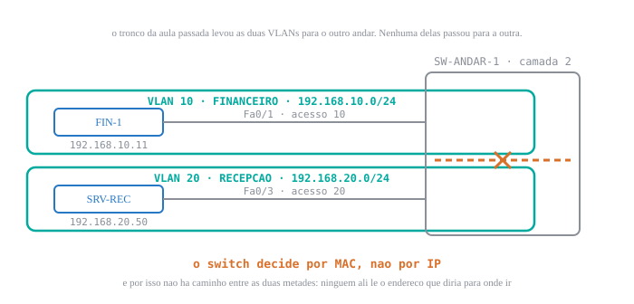

# 🟢 Lab 4 — Router-on-a-stick: o cabo que faltava para as duas redes se falarem

<b>Disciplina:</b> Redes de Computadores II · 49309 
<b>Semana:</b> S06 · <b>Data:</b> 09/09 
<b>Formato:</b> prática em Packet Tracer · 75 min 
<b>Pré-requisito:</b> a topologia do [[Aula 05 - Lab 3 Trunk entre switches (Pratica)|Lab 3]] de pé

---

🧭 <b>Antes de abrir o Packet Tracer:</b> no Lab 3, o <code>ping</code> do PC-1 para o PC-4 falhou — e eu disse que <b>tinha</b> que falhar. O que exatamente estava faltando ali?

Faltava **alguém que lesse IP**.

O switch entregou tudo o que sabia fazer: separou as duas VLANs e ainda as carregou pelo mesmo
cabo, cada uma na sua etiqueta. Mas switch lê **MAC**, e MAC não tem noção de "outra rede". Para
o PC-1, o `192.168.20.14` está numa sub-rede que não é a dele, e a regra da pilha é clara: o que
não é meu vai para o **gateway**. O gateway estava em branco.

Por isso o erro foi `Destination host unreachable` **respondido pelo próprio PC-1**: ele nem
chegou a colocar quadro no cabo. A falha aconteceu antes do primeiro pacote existir.

Hoje você coloca no cabo quem lê IP — e preenche aquele campo que ficou vazio de propósito.

<figure class="au-fig">

<figcaption class="au-legenda">O estado em que o Lab 3 deixou a sua rede, e o buraco que a aula de ontem nomeou. A separação das duas VLANs foi o <b>produto</b> que você entregou — ela não é defeito. O que falta é a peça que atravessa o vão de propósito, e só quando alguém autoriza.</figcaption>
</figure>

---

## 📌 1. Prove o ponto de partida antes de acrescentar equipamento [Diagnóstico ⏳ 12 min]

Hoje não se monta topologia nova: a de hoje é a do Lab 3 mais **um roteador**. E o primeiro
trabalho é o mesmo de sempre — provar que a base está no estado que a aula pressupõe. Acrescentar
equipamento sobre rede que ninguém conferiu é como consertar no escuro.

### 1.1 Onde VOCÊ começa hoje — ache a sua linha antes de tocar no teclado

A sala não chega toda no mesmo estado, e é por isso que esta tabela existe. **Ache a sua linha,
faça o que ela manda, e me chame se não souber em qual você está.** Leva 30 segundos e evita
que você refaça o que já tem pronto.

| Você tem… | Comece em | O `show interfaces trunk` do SW-1 tem que mostrar |
|---|---|---|
| **(a) O pré-lab de ontem feito** — roteador já ligado, subinterfaces configuradas, gateways preenchidos | **3.1** — vá direto para a tabela de rotas. Os blocos 1 e 2 são a sua conferência, não a sua montagem | **duas** portas, `Fa0/23` e `Fa0/24`, as duas com `Status trunking`. O `Native vlan` da `Fa0/24` vem `1` se você partiu do arquivo de casa e `99` se partiu do arquivo do Lab 3 em sala — **hoje os dois servem**, não mexa |
| **(b) Só o Lab 3 salvo** — dois switches, tronco de pé, sem roteador | **1.2**, e siga na ordem | **uma** porta: `Fa0/24`, `Native vlan 99`, `Vlans allowed 10,20,99` — ou `10,20,30,99`, se você fez o dever de casa 4; a 30 não atrapalha nada hoje |
| **(c) Nada salvo** | a receita abaixo, **10 a 15 min**, e **depois o 1.3** — não pule, é lá que o gateway entra | nada ainda; é o que você vai construir |

> [!NOTE] 💡 Se você é (a), a sua aula de hoje é **outra**
> Você já fez a montagem em casa, e isso conta a seu favor. O seu trabalho hoje é o **exercício
> 7** — a quebra deliberada — e a conferência inteira, que é o que eu passo olhando. Aproveite
> os 20 minutos que você ganhou para atacar o slot interativo, que ninguém termina.

**A receita mínima da linha (c)** — não são 4 minutos; conte de 10 a 15, e você vai andar atrás
da turma. É exatamente por isso que o pré-lab existe.

1. Dois switches **2960** (`SW-1`, `SW-2`) e quatro PCs.
2. `PC-1` na `Fa0/1` do SW-1 · `PC-2` na `Fa0/2` do SW-1 · `PC-3` na `Fa0/1` do SW-2 · `PC-4` na
   `Fa0/2` do SW-2 — **cabo direto** nos quatro.
3. `Fa0/24` do SW-1 na `Fa0/24` do SW-2 com **cabo cruzado**.
4. Endereços, máscara `255.255.255.0`: `PC-1` `192.168.10.11` · `PC-2` `192.168.20.12` ·
   `PC-3` `192.168.10.13` · `PC-4` `192.168.20.14`. **Gateway ainda em branco** — ele é o
   assunto do **1.3**, que você faz logo depois desta receita.
5. Nos **dois** switches: VLAN 10 `FINANCEIRO`, VLAN 20 `RECEPCAO`, `Fa0/1` na 10, `Fa0/2` na 20,
   e a `Fa0/24` como tronco com `switchport trunk allowed vlan 10,20,99` e `native vlan 99` nos dois lados — foi onde o Lab 3 parou.

<b>Pronto quando:</b> <code>show interfaces trunk</code> nos <b>dois</b> switches mostra <code>Fa0/24</code> com <code>Status trunking</code>, <code>Native vlan 99</code> e <code>Vlans allowed 10,20,99</code> — o estado em que o Lab 3 terminou — e o <code>ping</code> do PC-1 para o <code>192.168.10.13</code> responde.

### 1.2 Exercício 1 — as duas provas que autorizam começar [⏳ 5 min]

Duas telas, nesta ordem. Elas provam coisas diferentes.

<b>PC-1</b> · o que funciona e o que nao funciona, antes de mexer

! 1. dentro da propria VLAN, atravessando o tronco -- TEM que responder
PC&gt; ping 192.168.10.13
Reply from 192.168.10.13: bytes=32 time&lt;1ms TTL=128
!
! 2. cruzando de VLAN -- ainda TEM que falhar, e do mesmo jeito do Lab 3
PC&gt; ping 192.168.20.14
Reply from 192.168.10.11: Destination host unreachable.
! quem responde e o PROPRIO PC-1 -- guarde esta linha, ela vai mudar hoje

A segunda tela é a **fotografia do antes**. No fim da aula você roda o mesmo comando e a linha
muda. Se você não tirar a foto agora, no fim não tem com o que comparar.

### 1.3 Exercício 2 — o campo que estava vazio de propósito [⏳ 4 min]

Em cada um dos quatro PCs, abra `Desktop` → `IP Configuration` e olhe o campo **`Default
Gateway`**. Ele está **em branco** nos quatro, desde o Lab 2.

Aposte antes de ver: você vai preencher esse campo com um endereço que <b>ainda não existe na rede</b> — nenhum equipamento responde por ele hoje. O que acontece com os <code>ping</code>s que já funcionavam, no instante em que você preencher?

**Nada. Continuam respondendo exatamente igual.**

O gateway só entra na conversa quando o destino está **fora** da sua sub-rede. O `ping` do PC-1
para o `.13` é dentro da VLAN 10, mesma sub-rede: a pilha nem consulta o gateway. Você pode
apontar para um endereço inexistente que o tráfego local segue sem perceber.

Quem apostou "vai quebrar tudo" está tratando o gateway como se ele fosse rota de tudo. Ele é a
rota do **resto**.

**Se você fez o pré-lab, você já viu isso acontecer.** Então a sua pergunta é outra, e é mais
dura: *por que o `ping` para o `.13` continuou respondendo mesmo no intervalo em que o gateway
apontava para um endereço que ainda não existia?* Se você souber responder isso em voz alta,
você entendeu o bloco inteiro.

Agora preencha, nos quatro:

| PC | Endereço | Gateway |
|---|---|---|
| PC-1 | `192.168.10.11` | `192.168.10.1` |
| PC-2 | `192.168.20.12` | `192.168.20.1` |
| PC-3 | `192.168.10.13` | `192.168.10.1` |
| PC-4 | `192.168.20.14` | `192.168.20.1` |

**Repare no padrão:** cada VLAN tem o seu, e os dois terminam em `.1`. Não é obrigatório que
seja `.1` — é convenção, e convenção que se segue economiza a pergunta "qual era mesmo o
gateway daqui?" às três da manhã.

<b>Critério de pronto do exercício 2:</b> os quatro PCs com gateway preenchido, <b>e</b> o <code>ping</code> do PC-1 para o <code>.13</code> ainda respondendo — o tráfego de dentro da VLAN não mudou. O <code>ping</code> para o <code>.14</code> continua falhando: ninguém atende naqueles endereços <b>ainda</b>.

---

## 📌 2. Uma interface física, duas lógicas: o roteador entra na topologia [Mão na massa ⏳ 22 min]

Agora existe um endereço de gateway em cada VLAN e **ninguém atende por ele**. Você vai colocar
quem atende.

### 2.1 Exercício 3 — o roteador no cabo [⏳ 6 min]

1. Arraste um roteador **2911** — o mesmo do pré-lab de ontem; o 1941 serve igual — e renomeie para `R-BORDA`.
2. Ligue a `GigabitEthernet0/0` do `R-BORDA` na **`Fa0/23`** do `SW-1` — **cabo direto**
   (roteador e switch são equipamentos de tipos diferentes; cruzado é switch com switch).
3. **Não configure nada ainda.**

> [!NOTE] 💡 Por que a `Fa0/23` e não outra porta qualquer
> Nenhuma razão técnica: a `Fa0/23` está livre e é vizinha da `Fa0/24`, que já é o tronco.
> Manter as duas portas de infraestrutura juntas, longe das portas de estação, é higiene de
> quem vai voltar nesse switch daqui a seis meses. **Documente a sua escolha** — no Packet
> Tracer, a nota na área de trabalho serve.

### 2.2 Exercício 4 — três comandos por subinterface [⏳ 10 min]

O cabo é um só, e ele precisa carregar **as duas** VLANs. Do lado do roteador, isso significa
dividir a interface física em interfaces **lógicas**, uma por VLAN.

<b>R-BORDA</b> · uma fisica, duas logicas

! a fisica primeiro: ela nao leva IP, mas precisa estar LIGADA
R-BORDA(config)# interface gigabitEthernet 0/0
R-BORDA(config-if)# no shutdown
R-BORDA(config-if)# exit
!
! a subinterface do FINANCEIRO -- o numero depois do ponto e convencao,
! mas usar o mesmo numero da VLAN poupa muito diagnostico depois
R-BORDA(config)# interface gigabitEthernet 0/0.10
R-BORDA(config-subif)# encapsulation dot1Q 10
R-BORDA(config-subif)# ip address 192.168.10.1 255.255.255.0
R-BORDA(config-subif)# exit
!
! a subinterface da RECEPCAO
R-BORDA(config)# interface gigabitEthernet 0/0.20
R-BORDA(config-subif)# encapsulation dot1Q 20
R-BORDA(config-subif)# ip address 192.168.20.1 255.255.255.0
R-BORDA(config-subif)# end

**Os endereços não são novos:** `192.168.10.1` e `192.168.20.1` são exatamente os gateways que
você digitou nos PCs no exercício 2. Agora existe alguém atrás deles.

> [!WARNING] ⚠️ A ordem importa, e a recusa do IOS não parece uma recusa
> `encapsulation dot1Q 10` vem **antes** do `ip address`. A subinterface só aceita endereço
> depois de pertencer a uma VLAN.
>
> O problema é o formato da recusa: o IOS imprime uma explicação, o prompt volta normal, e quem
> digitava rápido não percebe. Cinco minutos depois a subinterface está **sem endereço** e
> ninguém entende por quê.
>
> **A régua: depois de configurar, leia de volta.** `show running-config interface
> gigabitEthernet 0/0.10` mostra o que **ficou**, não o que você quis.

### 2.3 Exercício 5 — a linha que não é no roteador [⏳ 6 min]

Falta uma configuração, e ela é **do outro lado do cabo**. A `Fa0/23` do SW-1 ainda é porta de
acesso: ela entrega ao roteador o tráfego de **uma** VLAN só, sem etiqueta. As subinterfaces
ficam esperando etiquetas que nunca chegam.

<b>SW-1</b> · a porta do roteador tambem e tronco

SW-1(config)# interface fa0/23
SW-1(config-if)# switchport mode trunk
SW-1(config-if)# switchport trunk allowed vlan 10,20
SW-1(config-if)# end
! mesma configuracao do Lab 3, em outra porta e com outro vizinho:
! la o tronco ia para um switch, aqui vai para um roteador.
! Para o switch nao faz diferenca nenhuma -- tronco e tronco.

<b>Critério de pronto do bloco 2:</b> <code>show interfaces trunk</code> no SW-1 lista <b>duas</b> portas — a <code>Fa0/24</code> (para o SW-2, com <code>Vlans allowed 10,20,99</code>) e a <code>Fa0/23</code> (para o roteador, com <code>10,20</code>), ambas com <code>Status trunking</code>. Se a <code>Fa0/23</code> não aparecer, o roteador está falando etiquetado com uma porta que não escuta etiqueta.

---

## 📌 3. A prova, e o defeito que engana [Mão na massa ⏳ 16 min]

### 3.1 Exercício 6 — a tabela de rotas, e o `ping` que muda [⏳ 8 min]

Configurar não é funcionar. A verificação de hoje é a **tabela de rotas**:

<b>R-BORDA</b> · duas redes diretamente conectadas

R-BORDA# show ip route
! Codigos: C - connected, L - local
      192.168.10.0/24 is variably subnetted, 2 subnets, 2 masks
C        192.168.10.0/24 is directly connected, GigabitEthernet0/0.10
L        192.168.10.1/32 is directly connected, GigabitEthernet0/0.10
      192.168.20.0/24 is variably subnetted, 2 subnets, 2 masks
C        192.168.20.0/24 is directly connected, GigabitEthernet0/0.20
L        192.168.20.1/32 is directly connected, GigabitEthernet0/0.20
! saida recortada -- a legenda dos codigos vem antes da tabela.

**Duas linhas `C`, uma por VLAN**, cada uma apontando para a sua subinterface. É isso que
autoriza o roteador a encaminhar entre as duas: ele não precisa **aprender** rota nenhuma,
porque as duas redes estão ligadas diretamente nele.

Agora o comando do exercício 1, de novo:

<b>PC-1</b> · o mesmo ping de 30 minutos atras

PC&gt; ping 192.168.20.14
Reply from 192.168.20.14: bytes=32 time&lt;1ms TTL=127
! Packets: Sent = 4, Received = 4, Lost = 0 (0% loss)

> [!TIP] 💡 Repare no `TTL=127`, e não `128`
> É a evidência mais barata da aula, e quase ninguém olha. O PC-4 respondeu com TTL 128, como
> sempre; o roteador **decrementou em um** ao encaminhar. Esse `127` é a assinatura de que o
> pacote **passou por um roteador** — e é ele que separa "chegou" de "chegou atravessando".
>
> No `ping` do PC-1 para o `.13`, que fica dentro da VLAN 10, o TTL volta `128`. Compare as
> duas telas: o número diz por onde o pacote andou.

<b>Critério de pronto do exercício 6:</b> as duas linhas <code>C</code> na tabela de rotas, <b>e</b> o <code>ping</code> do PC-1 para o <code>.14</code> com <code>Lost = 0</code> e <code>TTL=127</code>. As duas evidências juntas — a tabela prova a configuração, o <code>ping</code> prova a função.

### 3.2 Exercício 7 — desligue a física e veja o que o sintoma esconde [⏳ 8 min]

Este é o defeito mais comum da aula inteira, e você vai **criá-lo de propósito** para reconhecer
o sintoma quando ele aparecer sozinho.

Aposte antes de ver: você vai dar <code>shutdown</code> na <code>gigabitEthernet 0/0</code> — a interface <b>física</b>, que não tem endereço IP nenhum. As duas subinterfaces continuam com IP, <code>encapsulation</code> e tudo mais. O que o <code>show ip interface brief</code> vai mostrar nelas?

**As três aparecem `administratively down`** — a física e as duas lógicas.

Uma interface lógica não sobe sozinha se a física que a hospeda está desligada. Ela **herda** o
estado. E o que engana é que o IP continua listado, o método continua `manual`, a configuração
continua perfeita no `running-config` — e nada passa.

Quem apostou "só a física cai" está tratando a subinterface como equipamento independente. Ela
é uma divisão lógica de algo que continua sendo um cabo só.

**Quem fez o pré-lab viu essa tela no passo 6** e foi mandado olhar sem consertar. A pergunta de
hoje é a seguinte: o `show running-config` da subinterface, nesse estado, está **idêntico** ao de
uma subinterface funcionando. Se a configuração não distingue as duas situações, **qual comando
distingue?**

<b>R-BORDA</b> · o defeito, e a tela que o denuncia

R-BORDA(config)# interface gigabitEthernet 0/0
R-BORDA(config-if)# shutdown
R-BORDA(config-if)# end
R-BORDA# show ip interface brief
Interface              IP-Address      OK? Method Status                Protocol
GigabitEthernet0/0     unassigned      YES unset  administratively down down
GigabitEthernet0/0.10  192.168.10.1    YES manual administratively down down
GigabitEthernet0/0.20  192.168.20.1    YES manual administratively down down
! saida recortada -- o comando lista todas as interfaces do equipamento.

Repita o `ping` do PC-1 para o `.14`: volta a falhar. Agora **conserte** com um `no shutdown` na
física — as três sobem de uma vez, e o `ping` volta sem você tocar nas subinterfaces.

<b>Critério de pronto do exercício 7:</b> você tem as <b>duas</b> telas do <code>show ip interface brief</code> — uma com as três <code>administratively down</code> e outra com as três <code>up</code> — e sabe dizer qual linha de configuração separou uma da outra.

---

<b>🔌 Slot interativo — a topologia de conferência</b>

Quem terminar antes abre o `.pkt` de conferência que eu deixo no AVA e roda o roteiro de
verificação nele: são as mesmas telas dos exercícios 6 e 7, numa topologia com **três** VLANs em
vez de duas. A terceira subinterface é sua para configurar.

<b>Plano B — se o AVA não abrir ou a internet do campus cair:</b> acrescente você mesmo a VLAN 30 <code>SUPORTE</code> — a mesma do dever de casa do Lab 3 — em <code>192.168.30.0/24</code>, gateway <code>.1</code> à topologia que já está na sua tela: VLAN nos dois switches, uma porta de acesso, a VLAN na lista dos <b>dois</b> troncos e a terceira subinterface no roteador. O exercício é o mesmo e não depende de arquivo nenhum.

---

<b>A conferência — os 8 itens que eu passo olhando</b>

Eu passo nas bancadas durante os blocos 2 e 3 e confiro estes oito na sua tela. Todos são
**re-executáveis**: eu peço o comando e leio o resultado, você não precisa ter anotado nada.

1. A topologia do Lab 3 de pé, mais o `R-BORDA` ligado na `Fa0/23` do SW-1 com **cabo direto**, sem ponta vermelha.
2. Os quatro PCs com `Default Gateway` preenchido, e cada um com o da **sua** VLAN.
3. `show interfaces trunk` no SW-1 listando **duas** portas: `Fa0/23` e `Fa0/24`.
4. `show running-config interface gigabitEthernet 0/0.10` mostrando `encapsulation dot1Q 10` **e** o endereço — na ordem certa.
5. `show ip interface brief` com as três interfaces do roteador em `up/up` — a `g0/0` e as duas subinterfaces. As outras portas do 2911 continuam `administratively down`, e está certo: ninguém as usa hoje.
6. `show ip route` com as **duas** linhas `C`, cada uma apontando para a sua subinterface.
7. `ping` do PC-1 para o `192.168.20.14` com `Lost = 0` e **`TTL=127`**.
8. As duas telas do exercício 7, e você dizendo qual comando separou uma da outra.

<b>Critério de pronto:</b> <b>7 destes 8 itens</b> conferidos na sua tela. O contrato pede 80%; 7 de 8 dá 87,5%, então fica acima da régua, não abaixo. Os itens <b>7 e 8</b> são os que eu mais peço para explicar em voz alta, porque nos dois a evidência é uma <b>comparação</b>, não um valor isolado: o TTL contra o TTL de dentro da VLAN, e a tela quebrada contra a tela consertada.

---

<b>📋 Resumo — a folha de consulta</b>

| O que você quer saber | O comando | O que procurar |
|---|---|---|
| A subinterface ficou como eu quis? | `show running-config interface g0/0.10` | `encapsulation dot1Q` **antes** do `ip address` |
| As interfaces subiram? | `show ip interface brief` | `up / up` nas três que você configurou; as outras portas ficam `administratively down` |
| O roteador sabe encaminhar? | `show ip route` | uma linha `C` por VLAN, na subinterface certa |
| A porta do switch entrega etiqueta? | `show interfaces trunk` | a porta do roteador listada, `Status trunking` |
| O pacote atravessou mesmo? | `ping` de uma VLAN para a outra | `TTL=127`, não `128` |

| O erro | Como ele se apresenta |
|---|---|
| Esqueceu `no shutdown` na física | tudo configurado, três interfaces `administratively down` |
| Inverteu `ip address` e `encapsulation` | subinterface sem endereço, e o IOS "não reclamou" |
| Porta do switch continuou em acesso | uma VLAN atravessa, a outra não |
| Gateway errado no PC | só aquele PC não atravessa; os vizinhos da mesma VLAN vão bem |

---

<b>🤔 Para pensar até a próxima aula</b>

Todo o tráfego entre as suas duas VLANs passa por **um** cabo, e passa por ele **duas vezes** —
sobe etiquetado com a VLAN de origem, desce etiquetado com a de destino.

Agora imagine essa mesma filial com **cinco** VLANs e um backup noturno de 300 Mbps entre duas
delas, num enlace de 1 Gbps. **Quanto daquele cabo o backup consome, e por que o sintoma que o
cliente relata é "a rede fica lenta" em vez de "o backup está lento"?**

*Não há resposta nesta página de propósito. Traga a sua na terça.*

---

<b>📚 O que sustenta esta prática, com página</b>

São as mesmas quatro da teórica de ontem. A prática não traz bibliografia própria de propósito:
o que você executa hoje é o que a aula de 08/09 sustentou.

- **KUROSE, J. F.; ROSS, K. W.** *Redes de computadores e a internet: uma abordagem top-down.* 6. ed. São Paulo: Pearson, 2013. seç. 5.4.4, p. 357–359 — a separação entre VLANs e a interligação por tronco. É **pré-requisito** deste lab, não o conteúdo dele.
- **TANENBAUM, A. S.; FEAMSTER, N.; WETHERALL, D. J.** *Redes de Computadores.* 6. ed. Porto Alegre: Bookman, 2021. seç. 4.7.5, p. 221–225 — o formato do quadro 802.1Q, que é o que sobe e desce pelas subinterfaces.
- **CISCO SYSTEMS.** *Configuring Routing Between VLANs with IEEE 802.1Q Encapsulation.* LAN and WAN Configuration Guide, Cisco IOS XE 17.x. Disponível em: https://www.cisco.com/c/en/us/td/docs/routers/ios/config/17-x/lan-wan/b-lan-wan/m_lnsw-conf-vlan-ieee.html. Acesso em: 9 set. 2026. seç. "Defining the VLAN Encapsulation Format" — a sintaxe do `encapsulation dot1Q` no fabricante, **sem login**.
- **CISCO NETWORKING ACADEMY.** *CCNA: Switching, Routing, and Wireless Essentials (SRWE).* Disponível em: https://www.netacad.com/. Acesso em: 9 set. 2026. módulo 4 — subinterfaces e `encapsulation dot1Q`. A numeração das subseções **não é citada porque não foi conferida** (o curso exige login): procure pelo título dos tópicos dentro do módulo.

<b>➡️ Na próxima aula</b>

Você acabou de criar um caminho único por onde tudo passa duas vezes. Na terça a gente pergunta
o que acontece quando existe **mais de um** caminho entre dois switches — e por que a rede, em
vez de ficar mais rápida, para completamente.

---

