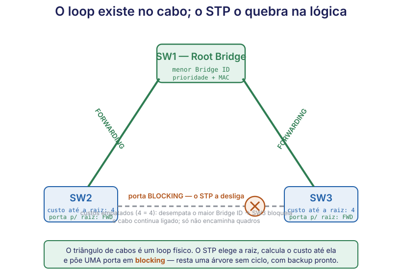

# 🟢 Aula 07 — STP: a rede tem dois caminhos e não pode usar os dois

**Disciplina:** 49309 — Redes de Computadores II — Uniube 
**Professor:** Romualdo Mathias Filho · **romualdo.filho@uniube.br** 
**Data:** Terça, 06/10/2026 · **VIA203** · 📘 Teórica (75 min) 
**Turmas práticas:** P11 segunda · VIA215 — P12 quinta · VIA216 
**Página de referência:** [Plano de Ensino e Contrato](./Plano-de-Ensino-e-Contrato)

---

<b>Nosso caminho até aqui</b>

Antes da N1 você viu o switch **aprender** endereços MAC e **inundar** (flooding) o que não
conhece. Hoje a gente descobre o que acontece quando esse mesmo switch tem **dois caminhos** para o
mesmo lugar — e por que isso, sem proteção, derruba a rede inteira. Responda **antes** de continuar.

Quando o switch recebe um quadro cujo MAC de destino <b>não está</b> na tabela, o que ele faz com esse quadro?

Faz **flooding**: replica o quadro em **todas** as portas do mesmo domínio de broadcast, menos a de
origem. Guarde isto — é a peça que, num loop, faz a rede explodir: o mesmo quadro é copiado para
sempre.

Um quadro de <b>broadcast</b> (destino <code>FF:FF:FF:FF:FF:FF</code>) é tratado como? Para onde o switch o manda?

Para **todas** as portas, sempre — broadcast nunca está "na tabela", é por definição para todo
mundo. Num caminho em anel, cada switch recebe o broadcast e o reenvia aos outros, que o reenviam de
volta: o início da **tempestade**.

Da camada 3 (Redes I): o cabeçalho IP tem um campo <b>TTL</b>. Para que ele serve, e o que acontece quando chega a zero?

O **TTL** (*Time To Live*) é um contador que cada roteador **decrementa**; ao chegar a zero, o
pacote é **descartado**. É a trava que impede um pacote IP de rodar em círculo para sempre. Guarde
esta ideia: hoje você vai ver que o quadro **Ethernet não tem** nada parecido.

Por que uma empresa ligaria dois switches com <b>dois</b> cabos em vez de um só, se um já basta para eles conversarem?

Por **redundância**: se um cabo (ou uma porta) falha, o outro assume e a rede não cai. É um objetivo
legítimo e desejável — o problema, que hoje a aula resolve, é que a redundância física na camada 2
cria um **loop**, e o loop, sem o STP, é pior que a falha que ele deveria cobrir.

> [!INFO] 🎯 O que você leva desta aula
> - Por que um **loop físico** na camada 2 não degrada a rede — ele a **derruba**, e por quê.
> - Por que o quadro Ethernet **não tem TTL** e o que isso muda em relação ao IP.
> - O que o **STP** faz (bloqueia portas para quebrar o loop, deixando uma árvore sem ciclos), por
>   que existe, e o preço que ele cobra.
> - Como o STP escolhe: **Root Bridge**, **custo**, **estados de porta** e o papel do **BPDU**.
> - O que é o **RSTP** e por que ele veio.
>
> **📂 Recursos**
> - [Plano de Ensino e Contrato](./Plano-de-Ensino-e-Contrato) — calendário, notas, prazos e regras
> - [Manual do IOS no Packet Tracer](./Manual-do-IOS-no-Packet-Tracer) — comandos do semestre por tema

---

## 📌 1. A dor primeiro: dois cabos, e a rede inteira cai [Fundamentação ⏳ 8 min]

Monte, de cabeça, a rede mais simples possível com redundância: **dois switches, dois cabos** entre
eles. A intenção é boa — se um cabo falha, o outro cobre. Agora ligue tudo e mande **um** host enviar
um único quadro de **broadcast** (um ARP, por exemplo). Siga o quadro:

1. O host manda o broadcast. O SW-A recebe e, por ser broadcast, **inunda** nas duas portas que vão
   para o SW-B (os dois cabos).
2. O SW-B recebe **duas** cópias. Cada uma é broadcast, então ele **inunda** de volta pelos dois
   cabos — inclusive pelo cabo por onde a cópia veio.
3. O SW-A recebe de volta, inunda de novo, o SW-B recebe de novo… **para sempre.**

Isso é a **tempestade de broadcast** (*broadcast storm*): um único quadro vira tráfego infinito que
satura os links e a CPU dos switches em segundos. E não vem sozinho — vêm dois efeitos colaterais:

| Efeito do loop | O que acontece | Resultado |
| :-- | :-- | :-- |
| **Broadcast storm** | o mesmo broadcast circula e se multiplica sem parar | links e CPU saturam; a rede trava |
| **Tabela MAC instável** | o mesmo MAC de origem chega por portas diferentes a cada volta | o switch reescreve a tabela sem parar (*MAC flapping*) |
| **Quadros duplicados** | cópias do mesmo quadro chegam ao destino várias vezes | aplicações confundem, conexões quebram |

> [!WARNING] ⚠️ Por que o loop de L2 é FATAL e o de L3 só atrapalha
> O cabeçalho IP (camada 3) tem **TTL**: cada roteador o decrementa e, no zero, descarta o pacote —
> um loop de L3 incomoda, mas **se extingue**. O cabeçalho **Ethernet (camada 2) não tem TTL
> nenhum.** Não existe contador, não existe "chega". O quadro **circula para sempre**. É por isso
> que um loop de camada 2 não é um bug lento: é a rede caindo em segundos.

A redundância que você queria (dois cabos para não cair) virou a causa da queda. É exatamente esse
paradoxo que o STP resolve — sem obrigar você a abrir mão do segundo cabo.

---

## 📌 1.5 STP em quatro perguntas: o quê, por quê, quando, o que ganha [Conceito ⏳ 6 min]

Antes de abrir o motor, o conceito inteiro em quatro perguntas diretas — é o que você precisa saber
dizer sobre o STP mesmo sem lembrar os detalhes internos.

> [!INFO] 📖 O que é o STP, em uma frase
> **STP** (*Spanning Tree Protocol*, IEEE 802.1D) é um protocolo de camada 2 que faz os switches
> **conversarem entre si para descobrir os caminhos redundantes e BLOQUEAR as portas que fecham um
> loop**, deixando ativa apenas uma **árvore sem ciclos** (*spanning tree*) que alcança todos os
> switches. O cabo bloqueado **continua ligado** — ele fica de reserva e reabre sozinho se o caminho
> principal cair.

**Por que ele existe / por que usar.** Porque a redundância física na camada 2 — ter mais de um
caminho entre switches, o que você **quer** para tolerar falha — cria loops, e loop de L2 derruba a
rede (bloco 1). O STP é o que permite ter o cabo de reserva **sem** pagar o preço do loop: ele mantém
a redundância física e remove o loop na lógica.

**Quando ele atua (e quando não precisaria).**

| O STP é necessário quando… | Ele não teria o que fazer quando… |
| :-- | :-- |
| há **caminho redundante** entre switches (anel, malha) | a topologia é uma **árvore** sem nenhum loop |
| você quer **tolerância a falha** na camada 2 | há um único caminho entre cada par de switches |
| a rede tem vários switches interligados | existe só um switch |

**O que se ganha — e o preço.**

| Vantagem | O preço que vem junto |
| :-- | :-- |
| **Tolerância a falha**: o backup assume sozinho se o link cai | **Convergência lenta**: o STP clássico leva **30–50 segundos** para reabrir um caminho |
| **Sem loop**: a rede não cai mesmo com cabos redundantes | Durante a convergência, aquele trecho fica **parado** |
| **Automático**: nenhuma porta é desligada à mão | A porta de reserva fica **ociosa** enquanto o principal está de pé |

> [!TIP] 💡 O preço explica a próxima evolução
> A convergência de 30–50 s do STP clássico é uma eternidade para uma rede moderna. É esse preço que
> fez nascer o **RSTP** (802.1w, bloco 6): mesma ideia, convergência em **segundos**. Guarde a
> troca: o STP comprou tolerância a falha pagando com lentidão; o RSTP recomprou a velocidade.

Os blocos seguintes abrem **como** o STP faz isso: quem manda (Root Bridge), como ele mede (custo),
o que cada porta faz (estados) e como os switches conversam (BPDU).

---

## 📌 2. O desenho: o triângulo que não pode fechar [Topologia ⏳ 4 min]

<figure class="au-fig">

<figcaption class="au-legenda">Três switches, três cabos: um <b>triângulo</b> — e todo triângulo de cabos é um loop. O STP não arranca cabo nenhum: ele elege o <b>SW1</b> como raiz, calcula o custo de cada switch até ela (SW2 e SW3 empatam em <b>4</b>), e põe <b>uma</b> porta em <code>blocking</code> (o X) — como os custos empatam, quem bloqueia é o switch de <b>maior Bridge ID</b>. Sobram dois caminhos ativos — uma <b>árvore</b> que alcança todos sem fechar o ciclo. Se o enlace SW1–SW3 cair, aquela porta bloqueada reabre e o SW3 volta pela ponte com o SW2. O backup estava lá o tempo todo, só desligado.</figcaption>
</figure>

A diferença entre "tem redundância" e "a rede cai" é essa porta vermelha: o cabo existe fisicamente,
mas o STP decide **logicamente** não encaminhar por ele enquanto não precisar. Hoje a aula mostra
**como** ele decide qual porta bloquear.

---

## 📌 3. Onde isso roda de verdade [Aplicação ⏳ 4 min]

O STP não é exercício de laboratório — ele está **ligado por padrão** em praticamente todo switch
gerenciável do mundo, rodando agora mesmo sem ninguém ter configurado nada. Três lugares concretos:

| Onde | Por que STP |
| :-- | :-- |
| **Campus universitário** (como a Uniube) | switches de acesso ligados a switches de distribuição por **mais de um** uplink, para o prédio não cair se um cabo falha; o STP mantém o backup pronto sem criar loop |
| **Datacenter / rede corporativa** | malha de switches com caminhos redundantes de propósito; sem STP, um patch cord ligado errado por engano derrubaria tudo em segundos |
| **Qualquer rede onde alguém** liga dois switches com dois cabos "para garantir" | é o caso clássico de desastre acidental — e o STP já estava ligado, salvando a rede do erro |

> [!NOTE] 💼 Pergunta de entrevista
> *"Um técnico ligou acidentalmente dois cabos entre os mesmos dois switches e a rede não caiu. Por
> quê?"* — Porque o **STP** detectou o caminho redundante e **bloqueou** uma das portas antes que o
> loop se formasse. Sem STP (ou com ele desabilitado), esse mesmo engano teria causado uma
> **broadcast storm** e derrubado o segmento inteiro. É a rede de segurança que já vem ligada.

---

## 📌 4. A teoria efetiva: como o STP escolhe o que bloquear [Teoria ⏳ 15 min]

Agora o miolo. O STP monta a árvore em três decisões, nesta ordem, e os switches tomam essas decisões
conversando por mensagens chamadas **BPDU**.

### 4.1 Primeiro, elege-se um ponto de referência — a Root Bridge

Para desenhar uma árvore, você precisa de uma **raiz**. O STP elege **um** switch como **Root
Bridge** — o ponto a partir do qual todos os caminhos são medidos. A eleição é por **menor Bridge
ID**, e o Bridge ID tem duas partes:

> [!NOTE] 📖 Bridge ID = prioridade + MAC
> O **Bridge ID** é um número formado pela **prioridade** (configurável, padrão 32768) seguida do
> **endereço MAC** do switch. Vence o **menor**. Como todo switch sai de fábrica com a mesma
> prioridade, o desempate acaba caindo no **menor MAC** — por isso, numa rede nova sem configuração,
> o switch mais **antigo** (MAC mais baixo) costuma virar raiz, o que nem sempre é o que você quer.

| Parte do Bridge ID | O que é | Quando decide |
| :-- | :-- | :-- |
| **Prioridade** | número configurável, padrão **32768** | é o primeiro critério: menor prioridade vence |
| **Endereço MAC** | o MAC do switch, fixo de fábrica | é o **desempate** quando a prioridade é igual — vence o menor MAC |

### 4.2 Depois, cada switch mede sua distância até a raiz — o custo

Com a raiz eleita, cada switch calcula o **custo** do seu caminho até ela — e **custo vem da banda**
do enlace: quanto mais rápido o link, menor o custo (mesma ideia que você verá no OSPF, só que aqui
é camada 2). Cada switch escolhe como **porta-raiz** aquela que o leva à raiz pelo **menor custo
acumulado**. No enlace que fecha o loop, o STP mantém encaminhando a ponta de **menor custo** até a
raiz e põe a outra em `blocking`; **quando os custos empatam** (como no triângulo da figura, 4 = 4),
o desempate vai para o **maior Bridge ID** — é a porta desse switch que fecha o loop e, por isso,
bloqueia.

| Velocidade do enlace | Custo STP (padrão) | Leitura |
| :-- | :-- | :-- |
| 10 Mbps | 100 | link lento → custo alto → caminho evitado |
| 100 Mbps (Fast) | 19 | intermediário |
| 1 Gbps (Gigabit) | 4 | link rápido → custo baixo → caminho preferido |

> [!TIP] 💡 Mesma lógica do OSPF, outra camada
> Custo derivado de banda, menor é melhor, soma-se ao longo do caminho — é exatamente o raciocínio
> que você vai rever no OSPF (camada 3). A diferença é só o palco: aqui o STP decide **qual porta de
> switch bloquear**; no OSPF o cálculo escolhe **qual rota instalar**.

### 4.3 Cada porta assume um estado — e não vira forwarding de imediato

Uma porta no STP clássico não sai de "desligada" para "encaminhando" de uma vez — ela sobe por
estados, e é isso que leva os **30–50 segundos** de convergência:

| Estado | O que a porta faz | Dura |
| :-- | :-- | :-- |
| **Blocking** | não encaminha nada; só escuta BPDUs | enquanto for a porta perdedora do loop |
| **Listening** | ainda não encaminha; participa da eleição da árvore | ~15 s |
| **Learning** | ainda não encaminha, mas já **aprende** MACs | ~15 s |
| **Forwarding** | encaminha quadros normalmente | estado final de uma porta ativa |

> [!TIP] 💡 Por que a demora de propósito
> Os estados Listening e Learning existem para a porta **não** começar a encaminhar antes de a árvore
> inteira estar estável — ligar cedo demais recriaria, por um instante, o loop que o STP veio
> impedir. É segurança comprada com tempo. Os **30 s** de uma porta subindo do zero (15 + 15) são o
> cenário limpo; quando a convergência parte de uma **falha detectada por timeout**, soma-se ainda o
> *Max Age* (~20 s) de espera até concluir que o caminho caiu — daí a faixa **30–50 s**. E é
> exatamente esse tempo que o RSTP vai cortar.

### 4.4 Como os switches conversam — o BPDU

Nada disso funcionaria se os switches não trocassem informação. A mensagem do STP é o **BPDU**
(*Bridge Protocol Data Unit*): quadros que os switches enviam uns aos outros anunciando quem eles
acham que é a raiz, com que Bridge ID e a que custo. É pelo BPDU que a raiz é eleita, que os custos
se propagam e que uma falha é detectada — quando os BPDUs **param de chegar** por uma porta, o STP
sabe que algo caiu e recalcula a árvore, reabrindo a porta de reserva.

O ciclo do BPDU, em três passos:

1. **No início**, cada switch envia BPDUs se declarando a raiz — ninguém sabe de ninguém ainda.
2. **Ao receber** um BPDU com Bridge ID menor, o switch reconhece a raiz melhor e passa a repassar a
   informação dela; assim a eleição e os custos convergem pela rede toda.
3. **Em regime**, no STP clássico (802.1D) só a **raiz** origina BPDUs periodicamente e os demais os
   repassam; quando eles **somem** de uma porta, aquele switch conclui que o caminho caiu e dispara
   o recálculo da árvore. *(No RSTP — bloco 6 — isso muda: cada switch gera o seu próprio BPDU a cada
   Hello, e é parte do porquê de ele convergir mais rápido.)*

---

## 📌 5. Exemplo prático: a porta bloqueada é um backup, não um desperdício [Mão na massa ⏳ 5 min]

Volte ao triângulo do desenho: SW1 é a raiz, os enlaces SW1–SW2 e SW1–SW3 estão em **forwarding**, e
a porta do SW3 para o SW2 está em **blocking**. Tudo funciona, o tráfego flui pela árvore.

Aposte antes de ver: alguém <b>derruba o cabo SW1–SW3</b> (um dos enlaces ativos). O SW3 fica isolado? O que o STP faz com a porta que estava <b>bloqueada</b>?

**O SW3 não fica isolado.** Quando o cabo SW1–SW3 cai, o SW3 para de receber BPDUs da raiz por
aquela porta. O STP detecta a mudança, **recalcula** a árvore e **reabre** a porta que estava em
`blocking` (a do enlace SW2–SW3): agora o SW3 alcança a raiz **passando pelo SW2**.

A porta "desperdiçada" era, o tempo todo, o **backup**. Esse é o ponto inteiro do STP: a redundância
física que criava o loop vira redundância **útil** — guardada, pronta, e acionada sozinha. O preço é
o tempo de reabrir (dezenas de segundos no STP clássico), e é o que o próximo bloco vem resolver.

<b>O que levar do exemplo:</b> a porta em <code>blocking</code> não é cabo jogado fora — é a apólice de seguro que o STP mantém ligada e aciona sozinho. Loop no normal, backup na falha.

---

## 📌 6. RSTP: a mesma ideia, mas em segundos [Evolução ⏳ 4 min]

O calcanhar do STP clássico é a convergência: **30–50 segundos** para reabrir um caminho é tempo
demais — uma ligação VoIP cai, uma sessão trava. O **RSTP** (*Rapid Spanning Tree Protocol*, IEEE
**802.1w**) é a evolução que resolve isso: **mesma lógica** (eleger raiz, bloquear porta, árvore sem
ciclo), mas convergência em **segundos**, porque as portas negociam a transição ativamente em vez de
esperar temporizadores fixos.

> [!NOTE] 📖 O que levar sobre RSTP hoje
> Você não precisa dos detalhes internos do RSTP agora — precisa saber **que ele existe**, **por que
> veio** (a lentidão do STP clássico) e que é o padrão usado na prática moderna. O STP de 1998 abriu
> o caminho; o RSTP de 2001 é o que roda nas redes de hoje. Mesma árvore, relógio mais rápido.

---

<b>🔌 Momento interativo — vote antes de eu abrir o Packet Tracer</b>

Três switches novinhos, saídos da caixa, ligados em triângulo. Nenhum foi configurado. **Qual deles
vira a Root Bridge?** **(A)** o primeiro que foi ligado · **(B)** o de menor endereço MAC · **(C)** o
que está fisicamente no meio · **(D)** nenhum — eles revezam. Vote no Plickers.

<b>Plano B — se o Plickers ou a internet do campus cair:</b> mão levantada com o número de dedos da alternativa (A=1, B=2, C=3, D=4). A resposta e o porquê vêm logo abaixo; o importante é você ter se comprometido com um palpite — e perceber que o STP não olha nem ordem de ligar nem posição física.

---

<b>📋 Resumo — a folha de consulta</b>

| Conceito | O que é | Por que importa |
|---|---|---|
| Loop de camada 2 | caminho em anel entre switches | sem proteção, derruba a rede em segundos |
| Broadcast storm | o mesmo broadcast circulando sem parar | satura links e CPU |
| Sem TTL em L2 | o quadro Ethernet não tem contador | por isso o loop é fatal, não só lento |
| STP (802.1D) | bloqueia portas para quebrar o loop | redundância física sem derrubar a rede |
| Root Bridge | o switch de referência da árvore | eleito pelo **menor Bridge ID** |
| Bridge ID | prioridade + MAC; vence o menor | define quem é a raiz |
| Custo | número derivado da banda; menor = melhor | escolhe a porta-raiz de cada switch |
| Estados de porta | Blocking → Listening → Learning → Forwarding | por que o STP clássico demora 30–50 s |
| BPDU | mensagem entre switches | elege a raiz e detecta falha |
| RSTP (802.1w) | STP com convergência em segundos | o que se usa na prática hoje |

| O erro clássico | A correção |
|---|---|
| "redundância em L2 é sempre segura" | não — sem STP, o cabo extra vira loop e derruba tudo |
| "o loop se resolve sozinho como no IP" | não — Ethernet **não tem TTL**; circula para sempre |
| "a porta bloqueada é cabo desperdiçado" | não — é o **backup**, reaberto sozinho na falha |
| "a Root Bridge é a mais rápida/central" | não — é a de **menor Bridge ID** (prioridade+MAC) |

---

  

  
clique para virar

  <button class="au-fc-prev" type="button" aria-label="Card anterior">←</button>
  
  <button class="au-fc-next" type="button" aria-label="Próximo card">→</button>

---

  

  

  

  

    
    

      <button class="au-quiz-prev" type="button" aria-label="Questão anterior">←</button>
      
      <button class="au-quiz-next" type="button" aria-label="Próxima questão">→</button>
    

  

---

<b>🎬 Para ver em casa — como a rede acha o caminho (em português)</b>

O STP decide caminhos dentro de uma rede local; para ver a visão maior — como os **pacotes viajam e
os roteadores acham o caminho** pela internet inteira — assista à série **"Como a Internet
Funciona"** do **NIC.br** (Núcleo de Informação e Coordenação do Ponto BR), a instituição que
administra o domínio `.br`. É didática, curta e **narrada em português**.

▶️ Canal oficial: <a href="https://www.youtube.com/@NICbrvideos" target="_blank" rel="noopener">youtube.com/@NICbrvideos</a> — série "Como a Internet Funciona".

---

<b>🎧 Podcast da aula — "Como um cabo extra derruba a rede"</b>

Dois apresentadores conversam sobre o STP (Spanning Tree Protocol) como se explicassem a um colega:
o loop de camada 2, por que a rede cai, e como o protocolo bloqueia uma porta para resolver. Ouça no
caminho, antes ou depois de ler a aula.

<audio controls preload="none" style="width:100%;margin-top:.75rem">
<source src="assets/aula07-stp-podcast.m4a" type="audio/mp4">
Seu navegador não reproduz áudio embutido — <a href="assets/aula07-stp-podcast.m4a">baixe o episódio aqui</a>.
</audio>

🎙️ Gerado com Google NotebookLM (Audio Overview, em português). Material de apoio — a fonte da aula é o texto acima.

---

<b>🤔 Para pensar até a próxima aula</b>

Hoje você viu que o STP elege como raiz o switch de **menor Bridge ID** — e que, sem configuração,
isso costuma cair no switch **mais antigo** da rede, por ter o MAC mais baixo.

**Por que isso é um problema, e o que você faria?** Pense: o switch mais antigo talvez seja o mais
fraco e o pior posicionado da rede, e mesmo assim virou o centro de tudo. Como você forçaria um
switch **específico** (o mais potente, no núcleo) a ser a raiz? Traga sua resposta.

*Não há resposta nesta página de propósito.*

---

<b>📚 O que sustenta esta aula, com página</b>

- **KUROSE, J. F.; ROSS, K. W.** *Redes de computadores e a internet: uma abordagem top-down.* 8. ed. São Paulo: Pearson, 2021. cap. 6, p. 484–492 — comutação na camada de enlace, switches e o problema dos laços na topologia comutada.
- **TANENBAUM, A. S.; FEAMSTER, N.; WETHERALL, D. J.** *Redes de Computadores.* 6. ed. Porto Alegre: Bookman, 2021. seç. 4.8, p. 332–339 — bridges, switches e o *spanning tree* como solução para pontes com caminhos redundantes.
- **IEEE.** *802.1D-2004 — Media Access Control (MAC) Bridges.* IEEE Standards Association, 2004. seç. 17 — definição normativa do Spanning Tree Protocol (e do RSTP, incorporado). É a fonte do protocolo em si.

<b>➡️ Na próxima aula</b>

Você entendeu por que a rede não pode usar os dois caminhos ao mesmo tempo — e como o STP escolhe um
e guarda o outro. Na próxima aula a gente faz o cabo "desperdiçado" **trabalhar de verdade**:
**EtherChannel**, que junta vários links num só, somando a banda em vez de bloquear — e a
**redundância de gateway**, para o roteador de saída também ter backup.

