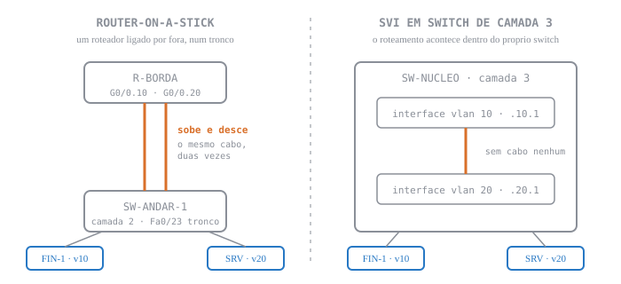

# Aula 08 — Revisão Geral para a N1

<b>Nosso caminho até aqui</b>

Quatro perguntas. Papel, sem consulta, seis minutos. Não vale nota, e é por isso que
funciona: o que você não recuperar agora é exatamente o que precisa de estudo nos seis dias
que faltam.

<ol>
<li>Um switch recebe um quadro cujo MAC de destino <b>não está</b> na tabela dele. O que ele faz, e como a tabela muda depois disso?</li>
<li>Duas portas de acesso no mesmo switch, VLANs diferentes, mesma faixa de IP. Os dois PCs se pingam? Por quê?</li>
<li><b>Semana passada:</b> numa topologia router-on-a-stick, por que o cabo entre o switch e o roteador precisa ser tronco, e não porta de acesso?</li>
<li><b>Espiral (Redes I):</b> 192.168.10.0/26 — quantos hosts úteis, e qual o último endereço utilizável?</li>
</ol>

<b>Respostas</b> — abra só depois de ter escrito as suas

<ol>
<li><b>Inunda</b> por todas as portas daquela VLAN, menos a de entrada. A tabela não muda por causa do destino; ela muda porque o switch leu o MAC de <b>origem</b> desse mesmo quadro e anotou a porta de onde ele veio.</li>
<li><b>Não.</b> VLANs diferentes são domínios de broadcast diferentes: o ARP de um nunca chega ao outro. A faixa de IP ser a mesma não ajuda, e na verdade piora — os dois PCs acham que são vizinhos e por isso nem tentam usar o gateway.</li>
<li>Porque o roteador precisa saber <b>de qual VLAN</b> cada quadro veio para decidir por qual subinterface tratá-lo. Porta de acesso entrega quadro sem etiqueta: chegaria tudo indistinguível, e uma subinterface só poderia ser usada.</li>
<li><b>62 hosts úteis</b> (2⁶ − 2). A sub-rede vai de 192.168.10.0 a 192.168.10.63; o último utilizável é <b>192.168.10.62</b>, porque o .63 é o broadcast.</li>
</ol>

> [!INFO] 🎯 O que você leva desta aula
> - Um método de diagnóstico que você aplica na prova: **de baixo para cima**, camada por camada.
> - Os três pontos exatos onde uma rede com VLANs quebra, e o **sintoma** de cada um.
> - Clareza sobre o que cai na N1 de 22/09 — e sobre o que **não** cai.

### 🧭 Esta aula não ensina nada novo, e essa é a proposta

Você já configurou VLAN, já subiu tronco e já fez duas VLANs se falarem por um roteador. O que
ainda não aconteceu é você **encontrar o defeito sozinho, sem saber de antemão qual era**. É
disso que a prova trata. Hoje são três redes quebradas: você lê a saída, nomeia o defeito numa
frase, e só então eu abro.

| Diagnóstico | A saída que você recebe | O que ele cobra |
| :--- | :--- | :--- |
| **1** | `show mac address-table` | a porta de acesso e o domínio de broadcast |
| **2** | `show interfaces trunk` | a lista de VLANs permitidas no tronco |
| **3** | `show ip interface brief` + `running-config` | o encapsulamento da subinterface |

Os três têm em comum a coisa que a prova mais cobra: **nenhuma interface está `down`.**

> [!WARNING] ⚠️ Um laço que fica aberto, e é justo você saber
> A aula passada terminou perguntando o que acontece quando você puxa **dois** cabos entre os
> mesmos dois switches. A resposta chama-se **STP**, e ela não cabe antes de 22/09: o assunto
> vem depois da prova, junto com EtherChannel. **Nada de STP cai na N1.** Se você estudou por
> conta própria, ótimo — só não gaste nisso os seis dias que faltam.

---

## 📌 1. O quadro que não chega [Diagnóstico ⏳ 13 min]

<b>Aposte antes de ver</b>

PC-A e PC-B estão no mesmo switch, na mesma VLAN, mesma sub-rede. PC-A pinga PC-B e
<b>funciona</b>. Agora eu desligo PC-B, espero cinco minutos, ligo de volta e pingo outra vez.
O primeiro ping falha e os quatro seguintes passam.

<b>Escreva sua hipótese antes de continuar.</b> Por que exatamente <i>um</i> falhou?

### 1.1 O switch aprende, esquece, e inunda enquanto não sabe

Três comportamentos, e todo o resto da comutação sai deles:

| Comportamento | O que dispara | Qual MAC o switch está lendo |
| :--- | :--- | :--- |
| **Aprender** | todo quadro que entra, sempre | o de **origem** — e anota a porta de onde veio |
| **Encaminhar** | o MAC de destino **está** na tabela | o de **destino** — sai só pela porta certa |
| **Inundar** | o MAC de destino **não** está | o de **destino** — sai por todas as portas daquela VLAN, menos a de entrada |

A coluna da direita é o que mais se erra: o switch **aprende pela origem e decide pelo destino**,
e são dois campos diferentes do mesmo quadro.

> [!WARNING] ⚠️ Gotcha — quem perdeu o ping não foi o switch
> É tentador culpar a tabela MAC: a entrada de PC-B expirou, o switch "esqueceu". Mas esquecer
> **não derruba pacote nenhum** — o switch simplesmente inunda, e o quadro chega igual.
>
> Quem custou o primeiro ping foi o **cache ARP do PC-A**, que também expirou. Sem o MAC de
> PC-B, o PC-A não consegue **montar** o quadro: ele segura o ICMP, dispara um ARP, e o primeiro
> ping estoura o tempo antes de a resposta voltar. Do segundo em diante o cache está quente.
>
> A distinção vale ponto na prova: **o switch nunca é a causa de uma perda isolada de pacote por
> envelhecimento.** O host é.

### 1.2 Broadcast é o que a VLAN existe para conter

O mesmo desenho da Aula 02. Conte os dois tipos de fronteira separadamente — é literalmente a questão que a prova faz.

Um **domínio de broadcast** é o conjunto de portas que recebem um quadro de broadcast. Um switch
sem VLANs é um domínio de broadcast só. Cada VLAN criada divide esse domínio, e essa é a única
coisa que uma VLAN faz — tudo mais decorre daí.

> [!WARNING] ⚠️ Gotcha — domínio de colisão não é domínio de broadcast
> Confundir os dois é o erro clássico da prova. **Cada porta de switch** é um domínio de colisão
> próprio. **Cada VLAN** é um domínio de broadcast. Um switch de 24 portas com 2 VLANs tem
> **24 domínios de colisão** e **2 de broadcast**. Some errado aqui e a questão inteira vai junto.

**A saída que você diagnostica.** PC-A (VLAN 10) não alcança PC-B, que *deveria* estar na
VLAN 10 no mesmo switch:

<b>SW1</b> · diagnóstico 1

SW1# show mac address-table
          Mac Address Table
-------------------------------------------
Vlan    Mac Address       Type        Ports
----    -----------       --------    -----
  10    0060.7015.a1b2    DYNAMIC     Fa0/1
   1    000c.85d3.4e77    DYNAMIC     Fa0/2

Uma frase, em dupla: **qual é o defeito?**

<i>A resposta deste diagnóstico entra nesta página depois da aula de 15/09.</i>

---

## 📌 2. O tronco que passa metade [Diagnóstico ⏳ 13 min]

<b>Aposte antes de ver</b>

Dois switches, um tronco entre eles, duas VLANs. Os PCs da VLAN 10 se falam entre switches.
Os da VLAN 20 <b>não</b>. O tronco está <code>up/up</code> nos dois lados.

<b>Escreva duas hipóteses</b>, não uma. Na prova, quem escreve só uma costuma escrever a errada.

### 2.1 A etiqueta existe porque o cabo é um só

Repare <b>onde</b> os 4 bytes entram: depois do MAC de origem, antes do tipo. É essa posição que a prova cobra.

Um tronco carrega várias VLANs pelo mesmo par de fios. Para o switch do outro lado saber a que
VLAN cada quadro pertence, o 802.1Q insere **4 bytes** entre o MAC de origem e o campo de tipo —
dentro deles, 12 bits de VLAN ID, e daí o limite de 4094 VLANs úteis.

A etiqueta existe **só dentro do tronco**: é colocada quando o quadro entra e **retirada** quando
ele sai por uma porta de acesso. O PC nunca vê etiqueta, e é por isso que você não configura VLAN
no PC.

> [!NOTE] 💼 Pergunta de entrevista
> *"Como um quadro etiquetado pode ter 1522 bytes, se o máximo da Ethernet é 1518?"*
> Porque o próprio IEEE ampliou o limite: o **802.3ac** elevou o quadro máximo para 1522 bytes
> justamente para acomodar os 4 bytes da etiqueta. Equipamento antigo, anterior a essa revisão,
> descarta esses quadros como erro de tamanho — a Cisco apelidou o caso de *baby giant*, que é
> jargão do fabricante, não nome de padrão. A resposta boa mostra que você sabe que o limite
> **mudou**, e não só que a etiqueta ocupa espaço.

### 2.2 Os três defeitos de tronco, distinguidos pelo sintoma

| Sintoma | Causa provável | Comando que confirma |
| :--- | :--- | :--- |
| Só a **VLAN nativa** atravessa; as demais caem | um lado é `access`, o outro `trunk` | `show interfaces trunk` (o lado access não aparece) |
| **Uma** VLAN não passa, as outras sim | VLAN fora da lista de permitidas, ou inexistente no outro switch | `show interfaces trunk`, coluna *Vlans allowed* |
| Tráfego **aparece na VLAN errada** | VLAN nativa divergente entre as pontas | `show interfaces trunk`, coluna *Native vlan* |

> [!WARNING] ⚠️ Gotcha — o tronco continua `up` com a nativa errada
> Divergência de VLAN nativa **não derruba o tronco** no Packet Tracer. O tráfego sem etiqueta de
> um lado desemboca na VLAN nativa do outro — a rede "funciona", só que entregando quadros na
> VLAN errada. É o defeito de camada 2 mais difícil de achar olhando o estado das interfaces,
> porque o estado não acusa nada.

**A saída que você diagnostica:**

<b>SW1</b> · diagnóstico 2

SW1# show interfaces trunk

Port        Mode         Encapsulation  Status        Native vlan
Fa0/24      on           802.1q         trunking      1

Port        Vlans allowed on trunk
Fa0/24      10

Uma frase, em dupla: **qual é o defeito?**

<i>A resposta deste diagnóstico entra nesta página depois da aula de 15/09.</i>

---

## 📌 3. A porta entre as VLANs [Diagnóstico ⏳ 13 min]

### 3.1 As duas maneiras, e quando cada uma é a certa

O mesmo desenho da Aula 06. A diferença que a prova cobra não é o desenho: é <b>o que cada arranjo exige</b>.

| | **Router-on-a-stick** | **SVI (switch de camada 3)** |
| :--- | :--- | :--- |
| Onde roteia | roteador externo | o próprio switch |
| Como | uma **subinterface** por VLAN, com `encapsulation dot1Q <vlan>` | uma **interface virtual** `interface vlan <N>` por VLAN |
| Exige | tronco entre switch e roteador | `ip routing` ligado no switch |
| Gargalo | todo o tráfego entre VLANs passa **duas vezes** pelo mesmo cabo | nenhum: roteia em ASIC, dentro do próprio equipamento |

> [!TIP] 💡 Pro-Tip — o teste dos três níveis, nesta ordem
> Quando uma VLAN não alcança outra, teste **nesta ordem** e pare no primeiro que falhar:
> 1. o PC pinga o **próprio gateway**? Não → o problema é VLAN/porta de acesso, não roteamento.
> 2. o roteador pinga o gateway **da outra VLAN**? Não → o problema é a subinterface ou o tronco.
> 3. o PC pinga o gateway da outra VLAN? Não → o problema é rota ou máscara **no PC**.
>
> Esse roteiro vale pontos na prova mesmo quando a resposta final sai errada: ele mostra método.

> [!WARNING] ⚠️ Gotcha — `ip routing` não é assunto de roteador
> `ip routing` liga o roteamento num **switch de camada 3**, que vem com ele desligado. Num
> roteador já está ligado por definição. Responder "faltou `ip routing`" para um problema de
> router-on-a-stick é a resposta errada com a cara mais confiante possível.

**A saída que você diagnostica.** Os PCs da VLAN 10 se pingam; nenhum host alcança a VLAN 20, e
o gateway da VLAN 20 não responde:

<b>R1</b> · diagnóstico 3

R1# show ip interface brief
Interface               IP-Address     OK? Method Status    Protocol
GigabitEthernet0/0/1    unassigned     YES unset  up        up
GigabitEthernet0/0/1.10 192.168.10.1   YES manual up        up
GigabitEthernet0/0/1.20 192.168.20.1   YES manual up        up

R1# show running-config interface g0/0/1.20
interface GigabitEthernet0/0/1.20
 encapsulation dot1Q 30
 ip address 192.168.20.1 255.255.255.0

Uma frase, em dupla: **qual é o defeito?**

<i>A resposta deste diagnóstico entra nesta página depois da aula de 15/09.</i>

---

<b>Como cada diagnóstico roda em sala</b>

A saída é projetada. Vocês têm <b>4 minutos em dupla</b> para escrever <b>uma frase</b>
nomeando o defeito. Não é para consertar: é para nomear — na prova, nomear corretamente já vale
a maior parte dos pontos da questão de análise. Só depois eu abro o bloco de resposta.

<b>Plano B (sem projetor):</b> as três saídas impressas em meia folha, uma por dupla, rodando
entre as mesas a cada 4 minutos.

<b>Resumo — o que revisar nos seis dias que faltam</b>

<ul>
<li><b>Comutação:</b> aprender / encaminhar / inundar. Domínio de colisão é por porta, de broadcast é por VLAN. Perda isolada de pacote por envelhecimento é <b>cache ARP do host</b>, não tabela MAC do switch.</li>
<li><b>VLAN:</b> ela faz uma coisa só, dividir o domínio de broadcast. Porta de acesso sem <code>switchport access vlan</code> fica na VLAN 1.</li>
<li><b>Tronco:</b> a etiqueta de 4 bytes só existe dentro dele. Os três defeitos, distinguidos pelo <b>sintoma</b>, não pelo comando. <code>allowed vlan</code> redefine; <code>allowed vlan add</code> acrescenta.</li>
<li><b>Inter-VLAN:</b> subinterface com <code>encapsulation dot1Q</code> correto, ou SVI com <code>ip routing</code>. Nunca os dois assuntos trocados.</li>
<li><b>O método:</b> de baixo para cima, um teste por vez, parando no primeiro que falha.</li>
</ul>

<b>🎧 Revisão em áudio (10 min)</b> — gerada por IA a partir desta página, para o trajeto. O
áudio complementa; a página é a fonte. <i>Disponível em breve.</i>

<b>Para pensar até terça</b>

Os três defeitos de hoje tinham algo em comum: em nenhum deles a interface estava
<code>down</code>. Nos três, todos os comandos de estado diziam que a rede estava saudável.

Se o estado da interface não prova que a rede funciona, <b>o que prova?</b> Escreva sua
resposta antes de 22/09. Ela é, essencialmente, a pergunta que a prova faz.

<b>Referências desta revisão</b>

<ul>
<li>KUROSE, J. F.; ROSS, K. W. <b>Redes de computadores e a internet: uma abordagem top-down.</b> 8. ed. São Paulo: Pearson, 2021. seç. 6.4.3 — comutadores de camada de enlace; seç. 6.4.4 — VLANs — sustenta os tópicos 1 e 2. Edição e seções conforme a bibliografia do <b>Plano de Ensino</b>; os números de página não são citados porque não foram conferidos no volume.</li>
<li>TANENBAUM, A. S.; FEAMSTER, N.; WETHERALL, D. J. <b>Redes de Computadores.</b> 6. ed. São Paulo: Pearson, 2021. cap. 4, seç. 4.7.5 — LANs virtuais — o formato do quadro 802.1Q e os campos da etiqueta.</li>
<li>CISCO NETWORKING ACADEMY. <b>CCNA: Switching, Routing, and Wireless Essentials (SRWE).</b> Cisco Systems. Disponível em: https://www.netacad.com/. Acesso em: 15 set. 2026. módulos 2 a 4 — VLANs, troncos e roteamento entre VLANs. A numeração das subseções não é citada porque o curso exige login e não foi conferida.</li>
<li>CISCO SYSTEMS. <b>Configuring Routing Between VLANs with IEEE 802.1Q Encapsulation.</b> <i>LAN and WAN Configuration Guide, Cisco IOS XE 17.x.</i> Disponível em: https://www.cisco.com/c/en/us/td/docs/routers/ios/config/17-x/lan-wan/b-lan-wan/m_lnsw-conf-vlan-ieee.html. Acesso em: 15 set. 2026. seç. "Defining the VLAN Encapsulation Format" — a sintaxe do <code>encapsulation dot1Q</code>, sem login.</li>
</ul>

<b class="au-nota-t">O que esta página afirma sem conferência na fonte</b>

<ul>
<li>O comportamento do <code>switchport trunk allowed vlan</code> <b>sem</b> <code>add</code> (tópico 2.2) é sintaxe do IOS da Cisco. Os livros tratam do conceito de tronco, não da sintaxe do fabricante, e <b>este ponto não foi conferido na documentação antes de a página ser escrita.</b></li>
<li>Os <b>intervalos de página</b> de Kurose e Tanenbaum não foram conferidos nos volumes — por isso a página cita <b>seção e capítulo</b>, que vêm do Plano de Ensino, e não número de página.</li>
</ul>

<b>Na próxima aula</b>

<b>22/09: prova N1</b>, em duas etapas. Primeiro você resolve sozinho, 50 minutos. Depois, em
grupo, vocês refazem as quatro questões mais difíceis, 18 minutos. A nota soma as duas partes.

Essa segunda etapa não é bondade: é o momento em que você discute uma questão que acabou de
tentar, com a memória ainda ativada. É onde mais se aprende na prova inteira.

