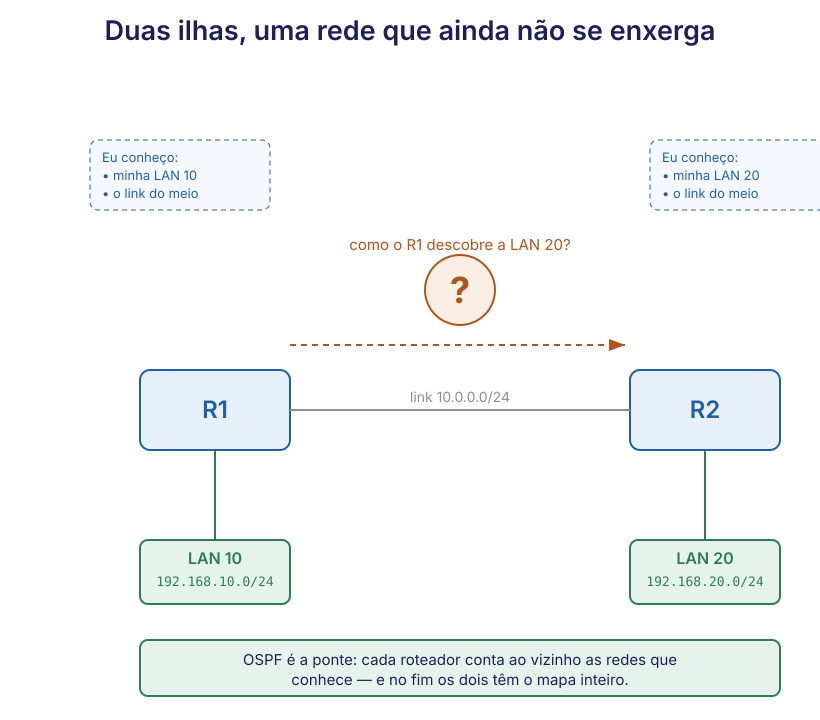
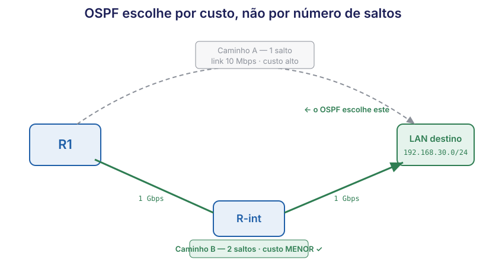

# 🟢 Aula 11 — OSPF: a rede que desenha o próprio mapa

**Disciplina:** 49309 — Redes de Computadores II — Uniube 
**Professor:** Romualdo Mathias Filho · **romualdo.filho@uniube.br** 
**Data:** Terça, 06/10/2026 · **VIA203** · 📘 Teórica (75 min) 
**Turmas práticas:** P11 segunda · VIA215 — P12 quinta · VIA216 
**Página de referência:** [Plano de Ensino e Contrato](./Plano-de-Ensino-e-Contrato)

---

<b>Nosso caminho até aqui</b>

Na sua prática desta semana (o Lab 6) você ligou o OSPF com dois comandos e **viu** a rota do
vizinho aparecer sozinha na tabela, marcada com `O`. Hoje a gente abre a caixa: **como** ela
apareceu, **por que** o número do custo estava ali, e **por que** existe aquela palavra "área".

Quatro perguntas de retomada. As três primeiras são do Lab 6; a quarta é da Aula 06 (Inter-VLAN), e
volta a servir hoje. Responda **antes** de continuar.

No Lab 6, antes de ligar o OSPF, o <code>ping</code> entre as duas LANs falhava mesmo com o link físico de pé. Por quê?

Porque faltava a **rota**. O R1 só conhecia de nascença as redes ligadas direto nele (as linhas
`C`); a LAN do outro roteador não estava na tabela, então o pacote era descartado. O link existir
não basta — o roteador precisa **saber** que a rede existe e por onde chegar.

Depois de ligar o OSPF, uma linha apareceu na tabela com a letra <code>O</code>. O que ela significava, e quem a digitou?

`O` = rota aprendida por **OSPF**. **Ninguém a digitou** — ela apareceu sozinha porque os dois
roteadores se contaram as redes que conheciam. É o oposto da rota estática, que é escrita à mão.

No Lab 6, quando você pôs <code>area 0</code> num roteador e <code>area 1</code> no outro, a adjacência não subiu — e <b>sem mensagem de erro</b>. O que isso te diz sobre "área"?

Que "área" não é enfeite: é **condição** para dois roteadores trocarem rotas. Dois roteadores no
mesmo enlace só viram vizinhos se estiverem na mesma área. Hoje você descobre **por que** o OSPF
organiza a rede em áreas — e por que a área 0 tem nome especial.

Da Aula 06: a tabela de rotas tem linhas <code>C</code> (connected) e <code>L</code> (local). O que o roteador faz quando o destino de um pacote <b>não casa</b> com nenhuma linha da tabela?

Ele **descarta** o pacote (a não ser que tenha uma rota default). A tabela de rotas é a única fonte
de verdade do encaminhamento: o que não está nela não existe para o roteador. É por isso que
**preencher a tabela** — à mão ou via OSPF — é o assunto de hoje.

> [!INFO] 🎯 O que você leva desta aula
> - Por que a rota estática **não escala**, e quando ainda assim ela é a escolha certa.
> - O que é um protocolo de **estado de enlace** e como cada roteador monta o **mapa** da rede.
> - O que é **custo**, como o OSPF o calcula, e por que ele escolhe o caminho de menor custo — que
>   nem sempre é o de menos saltos.
> - Por que existem **áreas**, e o que a **área 0** (backbone) tem de especial.
>
> **📂 Recursos**
> - [Plano de Ensino e Contrato](./Plano-de-Ensino-e-Contrato) — calendário, notas, prazos e regras
> - [Manual do IOS no Packet Tracer](./Manual-do-IOS-no-Packet-Tracer) — comandos do semestre por tema
> - **Packet Tracer** — o lab desta semana (OSPF área única) é o chão desta aula

---

## 📌 1. O porquê: a rota escrita à mão não escala [Fundamentação ⏳ 10 min]

Antes de qualquer comando, a pergunta que o OSPF responde: **por que não escrever as rotas à mão?**

Você *pode*. Uma **rota estática** é uma linha que o administrador digita: "para chegar na rede X,
mande para o roteador Y". Funciona, é previsível, e numa rede de dois ou três roteadores é a
escolha certa — simples e sem overhead.

O problema aparece quando a rede cresce. Faça a conta:

| Tamanho da rede | Rotas estáticas a manter | O que acontece quando um link cai |
| :-- | :-- | :-- |
| 3 roteadores | poucas, gerenciável | você conserta à mão, rápido |
| 50 roteadores | centenas de linhas, em dezenas de equipamentos | **cada** tabela afetada é reescrita **à mão**, de madrugada |
| rede de um provedor | inviável | — |

Dois custos crescem juntos: o **trabalho** de manter e o **risco** de erro humano. E há um custo
pior: a rota estática **não reage**. Se o caminho que você escreveu cai, o tráfego para — a rota
continua apontando para um link morto até alguém reescrever.

> [!TIP] 💡 Onde a rota estática ainda ganha
> Não é "estática é ruim". Para uma rede pequena e estável, ou para a **rota default** que aponta
> para a saída da internet, a estática é mais simples e segura — sem protocolo rodando, sem tráfego
> de controle. A regra real: **estática onde a topologia não muda; dinâmica onde ela muda ou cresce.**

É daí que nasce o roteamento **dinâmico**: em vez de você escrever cada rota, os roteadores
**conversam entre si** e descobrem os caminhos sozinhos — e **recalculam** quando algo muda. O OSPF
é um desses protocolos, e é o que você já viu funcionar no Lab 6.

---

## 📌 2. O desenho: duas ilhas e a ponte [Topologia ⏳ 4 min]

<figure class="au-fig">

<figcaption class="au-legenda">A mesma figura do seu Lab 6, e por bom motivo: é o problema que o OSPF resolve. Cada roteador nasce conhecendo só a própria vizinhança — a LAN ligada nele e o link do meio. A LAN do outro é uma <b>ilha</b> invisível. O que você fez na prática foi construir a <b>ponte</b>: cada roteador passou a contar ao vizinho as redes que conhece. Hoje a aula mostra <b>como</b> essa conversa monta, em cada roteador, o mapa inteiro da rede.</figcaption>
</figure>

A diferença entre a prática e a teoria de hoje é esta: no Lab 6 você viu a **ponte funcionar**;
agora você vai ver **o que trafega por ela** — não rotas prontas, mas *descrições de quem está
ligado em quem*, com que a rede inteira desenha o próprio mapa.

---

## 📌 3. Onde isso roda de verdade [Aplicação ⏳ 4 min]

O OSPF não é exercício de laboratório — é o protocolo de roteamento interno mais usado em redes
corporativas e de provedores no mundo. Três lugares concretos onde ele está rodando agora:

| Onde | Por que OSPF |
| :-- | :-- |
| **Campus universitário** (como a Uniube) | dezenas de prédios, VLANs e links; quando um enlace entre blocos cai, o OSPF redesenha o caminho sem ninguém tocar em roteador |
| **Rede de uma empresa** com filiais | matriz + filiais ligadas por vários caminhos; o OSPF escolhe o melhor e troca para o backup sozinho se o principal falha |
| **Provedor de internet** (dentro da rede dele) | o OSPF mantém o interior do provedor convergido; na borda, entre provedores, entra o BGP (outro assunto) |

> [!NOTE] 💼 Pergunta de entrevista
> *"Qual a diferença entre um protocolo de roteamento interno (IGP) e externo (EGP)?"* — OSPF é um
> **IGP**: roteia **dentro** de um domínio administrativo (uma empresa, um campus, um provedor). BGP
> é o **EGP**: roteia **entre** domínios diferentes, que é como a internet inteira se conecta. Hoje
> a gente fica no IGP; o BGP é de outra disciplina/curso.

---

## 📌 4. A teoria efetiva: como a rede desenha o próprio mapa [Teoria ⏳ 17 min]

Agora o miolo. O OSPF é um protocolo de **estado de enlace** (*link-state*). A ideia tem três
etapas, e você já viu as duas primeiras acontecerem no Lab 6.

### 4.1 Cada roteador descreve seus vizinhos — o LSA

Em vez de contar "as rotas que eu uso" (isso é outro tipo de protocolo, o *vetor de distância*,
como o RIP), cada roteador OSPF anuncia **a quem ele está diretamente ligado e com que custo**.
Essa descrição é o **LSA** (*Link-State Advertisement*).

> [!NOTE] 📖 LSA, em uma frase
> O LSA é o "cartão de visita" de cada roteador: "eu sou o R1, estou ligado à rede 10.0.0.0 com
> custo 1 e à rede 192.168.10.0 com custo 1". Cada roteador gera o seu e **inunda** (flooding) a
> rede com ele, até todos terem uma cópia de todos.

O ciclo do LSA, em três passos:

1. Cada roteador **monta** o próprio LSA, listando seus enlaces diretos e o custo de cada um.
2. **Inunda** a rede: manda o LSA aos vizinhos, que o repassam adiante, até alcançar todos.
3. Cada roteador **guarda** os LSAs que recebeu — e é essa coleção que vira o mapa (próximo passo).

### 4.2 Todos juntam os LSAs no mesmo mapa — a LSDB

Quando os LSAs param de circular, **cada** roteador tem a coleção completa — a **LSDB**
(*Link-State Database*). E aqui está o ponto que define o OSPF: **todos os roteadores da área têm a
LSDB idêntica.** Não é que cada um conhece um pedaço — cada um tem o **mapa inteiro**, igual ao do
vizinho.

Foi exatamente a linha `from LOADING to FULL` do seu Lab 6: `LOADING` é a troca de LSAs; `FULL`
é "terminamos, nossas LSDBs estão sincronizadas".

| Protocolo tipo… | O que cada roteador guarda | Analogia |
| :-- | :-- | :-- |
| Vetor de distância (RIP) | só "para a rede X, vá por Y, a tantos saltos" | ouvir dizer "é por ali" sem ver o mapa |
| **Estado de enlace (OSPF)** | **o mapa inteiro da área**, idêntico em todos | ter a planta da cidade na mão |

### 4.3 Cada um calcula o melhor caminho — Dijkstra e o custo

Com o mapa completo, cada roteador roda o **algoritmo de Dijkstra** (SPF — *Shortest Path First*,
daí o nome OSPF) e calcula, **a partir de si mesmo**, o caminho de **menor custo** para cada rede.
O resultado dessas contas é a linha `O` que apareceu na sua tabela.

**O que é custo?** É um número que o OSPF atribui a cada enlace, derivado da **largura de banda**:
quanto mais rápido o link, menor o custo. O caminho escolhido é o de **menor custo acumulado** — a
soma dos custos dos links no caminho.

<figure class="au-fig">

<figcaption class="au-legenda">O que faz o OSPF diferente do RIP: ele escolhe por <b>custo</b>, não por número de saltos. Um caminho de <b>um</b> salto por um link lento pode ter custo MAIOR que um caminho de <b>dois</b> saltos por links rápidos — e o OSPF escolheria o de dois saltos, porque é o de menor custo. O RIP, que só conta saltos, erraria aqui. É por isso que o <code>[110/2]</code> do seu Lab 6 tinha aquele <code>2</code>: era o custo acumulado até a LAN do vizinho.</figcaption>
</figure>

> [!WARNING] ⚠️ Menos saltos ≠ melhor caminho
> O erro clássico: achar que o roteamento sempre pega "o caminho mais curto em número de
> roteadores". OSPF **não** faz isso — ele soma **custos**, e custo vem de banda. Um atalho por um
> link de 10 Mbps perde para um desvio por dois links de 1 Gbps. Quem confunde isso está pensando
> em RIP, um protocolo mais antigo que só sabia contar saltos.

### 4.4 Por que áreas, e o que é a área 0

Numa rede grande, fazer **todos** os roteadores guardarem o mapa inteiro e recalcularem tudo a cada
mudança fica caro. A solução do OSPF é dividir a rede em **áreas**: dentro de uma área, todos têm o
mapa detalhado; entre áreas, só um resumo cruza a fronteira. Mudança dentro de uma área não obriga
as outras a recalcular tudo.

| | Sem áreas (tudo numa só) | Com áreas |
| :-- | :-- | :-- |
| Mapa que cada roteador guarda | a rede **inteira**, detalhada | só a **sua** área em detalhe + resumo das outras |
| Um link cai lá longe | **todos** recalculam | só a área daquele link recalcula |
| Rede pequena (seu Lab 6) | tudo bem — foi o que você fez | dividir não traria ganho |
| Rede de um campus/provedor | caro, não escala | é como se faz na prática |

> [!NOTE] 📖 A área 0 (backbone)
> A **área 0** é a espinha dorsal: toda outra área precisa se conectar a ela. É convenção e é regra
> do protocolo. No Lab 6 você usou **área única** — a rede inteira na área 0 — porque com dois
> roteadores não há motivo para dividir. Dividir em áreas é assunto de redes grandes; o que você
> precisa levar hoje é **por que** a divisão existe: conter o custo de recalcular.

E aqui fecha o mistério do Lab 6: dois roteadores em áreas diferentes no mesmo enlace **não** viram
vizinhos porque o OSPF trata áreas como mapas separados — eles não compartilham a LSDB detalhada, e
sem LSDB comum não há adjacência. Não era enfeite: era o protocolo protegendo a fronteira do mapa.

---

## 📌 5. Exemplo prático: o custo decide, ao vivo [Mão na massa ⏳ 9 min]

Vou abrir o Packet Tracer e montar uma topologia com **dois caminhos** do R1 até a mesma rede: um
direto por Gigabit, outro por um desvio. Depois ligamos o OSPF e olhamos qual caminho ele escolhe.

<b>R1</b> · o OSPF escolheu, e o show prova

R1# show ip route ospf
! Codigos: O - OSPF
O    192.168.30.0/24 [110/2] via 10.0.0.2, 00:01:40, GigabitEthernet0/0
! custo 2 pelo caminho Gigabit -- e NAO pelo desvio, que daria custo maior

Aposte antes de ver: eu <b>derrubo</b> o link Gigabit (o caminho de custo 2). O desvio (custo maior) continua de pé. O que acontece com o <code>ping</code> do R1 para a rede 192.168.30.0, e quanto tempo demora?

**O `ping` cai por alguns segundos e volta sozinho pelo desvio.** Quando o link Gigabit morre, o
OSPF detecta, cada roteador **recalcula** com Dijkstra, e a melhor rota passa a ser o desvio — que
antes perdia por custo, mas agora é o único de pé.

Isso é o que a rota estática **não** faz: ela ficaria apontando para o link morto. O recálculo
automático é o motivo de existir roteamento dinâmico — e é a resposta à pergunta "por que não
escrever tudo à mão" do começo da aula.

<b>O que levar do exemplo:</b> o OSPF não só acha o caminho — ele <b>reage</b>. Derruba um link, ele recompõe. É a diferença viva entre uma tabela escrita à mão e uma rede que mantém o próprio mapa.

---

<b>🔌 Momento interativo — vote antes de eu abrir o Packet Tracer</b>

Na topologia que vou montar, o R1 tem dois caminhos até a mesma rede: **(A)** um salto direto por um
link de 10 Mbps, e **(B)** dois saltos por links de 1 Gbps. **Qual o OSPF escolhe?** Vote no Plickers.

<b>Plano B — se o Plickers ou a internet do campus cair:</b> mão levantada — caminho A (um dedo) ou caminho B (dois dedos). A resposta e o porquê vêm no exemplo prático logo abaixo; o importante é você ter se comprometido com um palpite antes de ver.

---

<b>📋 Resumo — a folha de consulta</b>

| Conceito | O que é | Onde você viu/vê |
|---|---|---|
| Rota estática | linha escrita à mão; não reage a mudança | pré-requisito; usada para rota default |
| Rota dinâmica | aprendida por protocolo; recalcula sozinha | a linha `O` do Lab 6 |
| Estado de enlace | cada roteador descreve seus vizinhos (LSA) | o conceito do OSPF |
| LSA | o "cartão de visita" de cada roteador | inundado pela rede |
| LSDB | o mapa completo, idêntico em todos | o que `FULL` sincroniza |
| Dijkstra / SPF | calcula o menor custo a partir de si | gera a tabela de rotas |
| Custo | número derivado da banda; menor = melhor | o `2` do `[110/2]` |
| Área / área 0 | divide a rede para conter o recálculo | por que áreas diferentes não casam |

| O erro clássico | A correção |
|---|---|
| "OSPF escolhe menos saltos" | não — escolhe **menor custo** (isso é RIP) |
| "área é só um número" | é condição de adjacência e divisão do mapa |
| "rota estática é sempre pior" | não — é melhor em rede pequena/estável e na default |

---

<b>🤔 Para pensar até a próxima aula</b>

Hoje você viu o OSPF escolher o caminho de **menor custo**, e o custo vem da **banda**. Mas o
administrador pode **mudar** o custo de um link à mão, forçando o OSPF a preferir um caminho que ele
não escolheria sozinho.

**Por que alguém faria isso?** Pense num link que é tecnicamente rápido, mas **caro** (um link de
operadora cobrado por tráfego) que você quer usar só como backup. Como o custo manual resolveria
isso? Traga sua resposta.

*Não há resposta nesta página de propósito.*

---

<b>📚 O que sustenta esta aula, com página</b>

- **KUROSE, J. F.; ROSS, K. W.** *Redes de computadores e a internet: uma abordagem top-down.* 6. ed. São Paulo: Pearson, 2013. seç. 5.3, p. 338–350 — algoritmos de roteamento: estado de enlace (Dijkstra) × vetor de distância. É a base teórica de tudo nesta aula.
- **TANENBAUM, A. S.; FEAMSTER, N.; WETHERALL, D. J.** *Redes de Computadores.* 6. ed. Porto Alegre: Bookman, 2021. seç. 5.2, p. 262–278 — roteamento por estado de enlace, inundação de LSAs e construção do mapa.
- **CISCO NETWORKING ACADEMY.** *CCNA: Enterprise Networking, Security, and Automation (ENSA).* Disponível em: https://www.netacad.com/. Acesso em: 5 out. 2026. módulos de OSPF de área única — conceito de OSPF, custo e área. A numeração das subseções **não é citada porque não foi conferida** (o curso exige login).

<b>➡️ Na próxima aula</b>

Você entendeu como o OSPF escolhe o caminho sozinho. Na próxima aula prática (Lab 7) você vai
**verificar** o OSPF com os comandos de diagnóstico — `show ip ospf`, `show ip ospf interface` — e
ver o custo e os papéis (aquele `/DR` que apareceu ao lado do `FULL`) com nome e explicação. O que
hoje ficou "é assim", lá vira "e eu confiro na tela".

