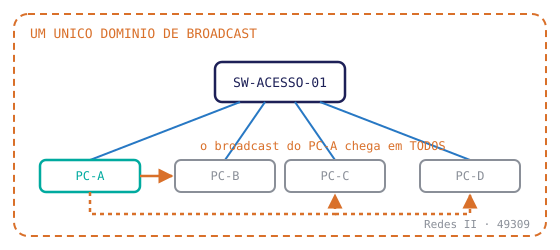

# Kit de Componentes

Esta página é o **guia vivo** da plataforma: cada bloco que uma aula pode ter aparece aqui, renderizado, com o markup ao lado. Quem escreve aula — pessoa ou agente — escolhe da lista abaixo em vez de inventar marcação.

> [!INFO] 🎯 Como usar
> Todo o conteúdo da aula vive dentro de `
`. Os blocos são independentes: usar só os que a aula pede. A ordem canônica está no `_Template_Aula.md`.

---

## 0. Cabeçalho da aula

**Vem logo depois do `# Título`, antes de qualquer bloco.** Diz de quem é a aula, de quando é e para onde ir atrás do documento.

**Disciplina:** 49304 — Redes de Computadores I · Sistemas de Informação — Uniube 
**Professor:** Romualdo Mathias Filho 
**Semana:** 3 · Terça, 11/08/2026 · VIA203 · 📘 Teórica (75 min) 
**Página de referência:** [Plano de Ensino e Contrato](./Plano-de-Ensino-e-Contrato)

> [!WARNING] ⚠️ Cada linha termina em ` `, menos a última
> Markdown junta linhas consecutivas num parágrafo só. Sem a quebra dura, este bloco vira **uma linha corrida** no portal — e o Obsidian não denuncia, porque ele respeita a quebra simples. O erro só aparece publicado. O linter `validar_anatomia_aula.ps1` cobra isso (regra "cabeçalho colapsa").

---

## 1. Nosso caminho até aqui

**Abre toda aula.** É o único bloco obrigatório em 100% delas.

<b>Nosso caminho até aqui</b>

Responda **antes** de abrir. Se errar, você acabou de descobrir o que revisar hoje.

Na Aula 02, o switch aprendeu o endereço MAC de um host. Como?

Olhando o **MAC de origem** do primeiro quadro que chegou naquela porta. O switch nunca "pergunta" — ele aprende observando o que passa, e guarda o par porta ↔ MAC na tabela.

Se o MAC de destino não está na tabela, o que o switch faz?

Faz **flooding**: replica o quadro em todas as portas do mesmo domínio de broadcast, menos a de origem. É por isso que um domínio grande demais degrada a rede inteira — e é exatamente o problema que a VLAN resolve.

> [!NOTE] Por que perguntas e não um resumo
> Recap passivo é quase inerte. Prática de recuperação em sala rende **g = 0,50** (Yang et al., 2021; Rowland, 2014) e **g = 0,74** quando espaçada (Latimier et al., 2021). O ganho vem do esforço de lembrar — se a resposta já está na tela, não há esforço. **Nunca** escrever este bloco como parágrafo pronto.

---

## 2. Antes de começar (pré-treinamento)

Os termos **antes** do conteúdo pesado, nunca depois (*d* = 0,75).

<aside class="au-antes">
<b class="au-nota-t">Antes de começar</b>

**Domínio de broadcast** — o conjunto de portas que recebe um quadro de broadcast. Um switch sem VLAN é um domínio só.

**Tronco (trunk)** — enlace que carrega várias VLANs, identificando cada quadro com uma etiqueta 802.1Q.

</aside>

---

## 3. Figura + legenda

Desenho nasce no **Excalidraw** e entra como `.svg`. A legenda fica **colada** na figura — nunca em rodapé (contiguidade espacial, *g* = 0,74).

<figure class="au-fig">

<figcaption class="au-legenda">Sem VLAN, o broadcast do PC-A chega em todo mundo. A VLAN é o corte que transforma um domínio em dois.</figcaption>
</figure>

---

## 4. Aposte antes de ver

*Predict-then-reveal*. Custa zero e força decisão real antes da resposta.

Antes de rolar: o PC-A (VLAN 10) consegue pingar o PC-B (VLAN 20) no mesmo switch?

**Não.** Mesmo switch, mas domínios de broadcast diferentes. Para conversar precisa de roteamento entre VLANs — que é a aula da semana que vem.

---

## 5. Slot interativo

A moldura onde entra a ferramenta. O slot existe sempre; a ferramenta é opcional. **Todo slot declara o plano B** — a aula não pode depender da internet do campus.

<b>Interativo</b> · Vevox · 3 min

Abra **vevox.app** e entre com o ID da sessão que está no projetor. Duas perguntas de múltipla escolha sobre domínio de broadcast — anônimo, sem cadastro.

<b>Plano B:</b> se a rede cair, as mesmas duas perguntas vão na mão com os cartões Plickers. Mesmo conteúdo, mesmo tempo.

> [!TIP] O que pode entrar no slot
> **H5P** via `h5p-standalone` — roda sem servidor, direto no site estático · **Vevox** ou **Plickers** para votação em sala · `<iframe>` de simulador · widget próprio em HTML/CSS puro (ver a seção 6, logo abaixo).

---

## 6. Seletor de camada (interativo sem JS)

O componente-assinatura. Isola uma camada do desenho com radio button — funciona no celular, no teclado, e imprime com tudo visível.

<figure class="au-fig au-switch" role="group" aria-label="Seletor de VLAN">
<input type="radio" name="kitvlan" id="kv-all" checked>
<input type="radio" name="kitvlan" id="kv-10">
<input type="radio" name="kitvlan" id="kv-20">

<label for="kv-all">TODAS</label>
<label for="kv-10">VLAN 10</label>
<label for="kv-20">VLAN 20</label>

<svg class="au-camadas" viewBox="0 0 420 160" role="img" aria-label="Switch com hosts em duas VLANs">
<rect x="150" y="10" width="120" height="34" rx="6" fill="none" stroke="#8a8f98" stroke-width="2"></rect>
<text x="210" y="32" text-anchor="middle" font-size="13" fill="#8a8f98" font-family="monospace">SW-ACESSO-01</text>
<g class="c1">
<line x1="180" y1="44" x2="90" y2="100" stroke="#2778c4" stroke-width="2"></line>
<rect x="40" y="100" width="100" height="30" rx="5" fill="none" stroke="#2778c4" stroke-width="2"></rect>
<text x="90" y="120" text-anchor="middle" font-size="12" fill="#2778c4" font-family="monospace">PC-A · VLAN 10</text>
</g>
<g class="c2">
<line x1="240" y1="44" x2="330" y2="100" stroke="#00aa9f" stroke-width="2"></line>
<rect x="280" y="100" width="100" height="30" rx="5" fill="none" stroke="#00aa9f" stroke-width="2"></rect>
<text x="330" y="120" text-anchor="middle" font-size="12" fill="#00aa9f" font-family="monospace">PC-B · VLAN 20</text>
</g>
</svg>
<figcaption class="au-legenda">Isole uma VLAN: o que some da tela é exatamente o que some do domínio de broadcast.</figcaption>
</figure>

---

## 7. Terminal

Config real, com prompt. Uma linha marcada por bloco — a que o texto ao lado explica.

<b>SW-ACESSO-01</b> · config

! porta do PC-ADM-1
SW-ACESSO-01(config)# interface Fa0/1
SW-ACESSO-01(config-if)# switchport access vlan 10

---

## 8. Callouts

Três, e só três: Pro-Tip, Gotcha e Pergunta de Entrevista.

> [!TIP] 💡 Dica de produção
> Em rede de campus real, VLAN de voz e de dados vão na mesma porta — o telefone faz switch interno e etiqueta o próprio tráfego.

> [!WARNING] ⚠️ Gotcha
> Um `switchport mode dynamic` esquecido negocia tronco sozinho. É assim que um host acaba enxergando VLAN que não deveria.

> [!NOTE] 💼 Pergunta de entrevista
> *"Por que segmentar em VLANs se o roteador já separa as redes?"* — Porque a VLAN corta o **domínio de broadcast** na camada 2, antes de o tráfego chegar ao roteador. Sem ela, o broadcast de um setor consome banda e CPU de todos os outros.

---

## 9. Exercício prático

Só do que foi visto **no dia**. Numerado porque é roteiro de execução — aqui a ordem carrega informação.

<b>Prática — 20 min, em duplas</b>

1. Abra o arquivo `lab03_vlans.pkt` no Packet Tracer.
2. Crie a **VLAN 10** (nome `ADM`) e a **VLAN 20** (nome `LAB`) no `SW-ACESSO-01`.
3. Coloque `Fa0/1` e `Fa0/2` na VLAN 10; `Fa0/3` e `Fa0/4` na VLAN 20.
4. Teste: `ping` de PC-A para PC-B. Anote o resultado **antes** de tentar consertar.

<b>Critério de pronto:</b> <code>show vlan brief</code> mostra as quatro portas nas VLANs certas, e o ping entre VLANs falha. <b>Falhar aqui é o resultado correto</b> — é o que abre a próxima aula.

---

## 10. Resumo

Cheatsheet de consulta. Denso de propósito.

<b>Resumo da aula</b>

| Comando / conceito | Para que serve |
|---|---|
| `vlan 10` + `name ADM` | cria a VLAN e dá nome legível |
| `switchport access vlan 10` | põe **uma** porta na VLAN |
| `show vlan brief` | confere o mapa porta ↔ VLAN |
| Domínio de broadcast | o que a VLAN corta — a razão de tudo isto existir |

---

## 11. Podcast da aula

Gerado no Gemini Notebook (ex-NotebookLM) a partir do documento-fonte. Bloco discreto: é apoio de revisão, não a aula.

<b>🎧 Resumo em áudio — 8 min</b>

Conversa de dois locutores sobre os pontos da aula. Serve para ouvir no trajeto. <b>Gerado por IA</b> a partir do material da disciplina — se divergir da aula, a aula vence.

<audio controls preload="none" src="assets/audio/aula03_resumo.m4a"></audio>

---

## 12. Reflexão

Pergunta aberta de saída, **sem resposta na página**. É o que o aluno leva no ônibus.

<b>Para pensar até a próxima aula</b>

Se a VLAN resolve o domínio de broadcast, por que as redes ainda caem por causa de broadcast? O que a VLAN <i>não</i> protege?

---

## 13. Referências

Autor, obra, editora, ano **e página**. A página é obrigatória.

<b>Referências desta aula</b>

- KUROSE, J. F.; ROSS, K. W. **Redes de Computadores e a Internet: uma abordagem top-down.** 8. ed. São Paulo: Pearson, 2021. cap. 6, p. 468–479
- TANENBAUM, A. S.; FEAMSTER, N.; WETHERALL, D. **Redes de Computadores.** 6. ed. Porto Alegre: Bookman, 2021. cap. 4, p. 302–311
- IEEE. **802.1Q-2022 — Bridges and Bridged Networks.** IEEE Standards Association, 2022. seç. 5.5

---

## 14. Próxima aula

Uma frase que abre laço. Não é índice do que vem.

<b>Na próxima aula</b>

Hoje você cortou a rede em duas e elas pararam de se falar — de propósito. Na próxima, elas voltam a conversar sem perder o isolamento: <b>roteamento entre VLANs</b>. E vai bastar uma interface.

