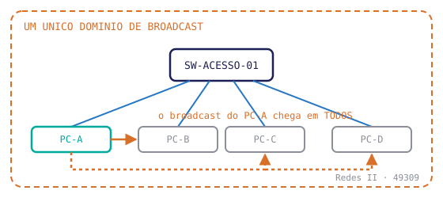
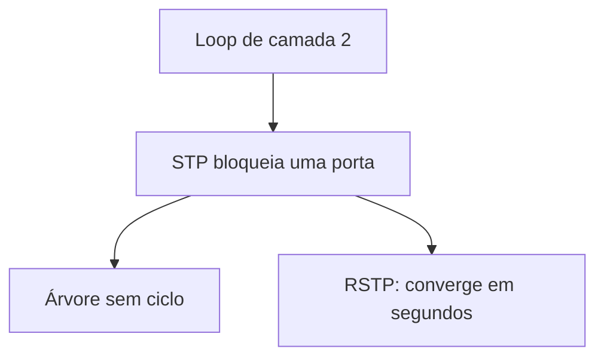

<div class="au-leitura" data-aula="kit">

# Kit de Componentes

Esta página é o **guia vivo** da plataforma: cada bloco que uma aula pode ter aparece aqui, renderizado, com o markup ao lado. Quem escreve aula — pessoa ou agente — escolhe da lista abaixo em vez de inventar marcação.

> [!INFO] 🎯 Como usar
> Todo o conteúdo da aula vive dentro de `<div class="au-leitura" data-aula="sNN">`. Os blocos são independentes: usar só os que a aula pede. A ordem canônica está no `_Template_Aula.md`.

---

## 0. Cabeçalho da aula

**Vem logo depois do `# Título`, antes de qualquer bloco.** Diz de quem é a aula, de quando é e para onde ir atrás do documento.

**Disciplina:** 49304 — Redes de Computadores I · Sistemas de Informação — Uniube<br>
**Professor:** Romualdo Mathias Filho<br>
**Semana:** 3 · Terça, 11/08/2026 · VIA203 · 📘 Teórica (75 min)<br>
**Página de referência:** [Plano de Ensino e Contrato](./Plano-de-Ensino-e-Contrato)

> [!WARNING] ⚠️ Cada linha termina em `<br>`, menos a última
> Markdown junta linhas consecutivas num parágrafo só. Sem a quebra dura, este bloco vira **uma linha corrida** no portal — e o Obsidian não denuncia, porque ele respeita a quebra simples. O erro só aparece publicado. O linter `validar_anatomia_aula.ps1` cobra isso (regra "cabeçalho colapsa").

---

## 1. Nosso caminho até aqui

**Abre toda aula.** É o único bloco obrigatório em 100% delas.

<div class="au-caminho">
<b>Nosso caminho até aqui</b>

Responda **antes** de abrir. Se errar, você acabou de descobrir o que revisar hoje.

<details>
<summary>Na Aula 02, o switch aprendeu o endereço MAC de um host. Como?</summary>

Olhando o **MAC de origem** do primeiro quadro que chegou naquela porta. O switch nunca "pergunta" — ele aprende observando o que passa, e guarda o par porta ↔ MAC na tabela.

</details>

<details>
<summary>Se o MAC de destino não está na tabela, o que o switch faz?</summary>

Faz **flooding**: replica o quadro em todas as portas do mesmo domínio de broadcast, menos a de origem. É por isso que um domínio grande demais degrada a rede inteira — e é exatamente o problema que a VLAN resolve.

</details>
</div>

> [!NOTE] Por que perguntas e não um resumo
> Recap passivo é quase inerte. Prática de recuperação em sala rende **g = 0,50** (Yang et al., 2021; Rowland, 2014) e **g = 0,74** quando espaçada (Latimier et al., 2021). O ganho vem do esforço de lembrar — se a resposta já está na tela, não há esforço. **Nunca** escrever este bloco como parágrafo pronto.

---

## 2. Antes de começar (pré-treinamento)

Os termos **antes** do conteúdo pesado, nunca depois (*d* = 0,75).

<aside class="au-antes">
<b class="au-nota-t">Antes de começar</b>

**Domínio de broadcast** — o conjunto de portas que recebe um quadro de broadcast. Um switch sem VLAN é um domínio só.

**Tronco (trunk)** — enlace que carrega várias VLANs, identificando cada quadro com uma etiqueta 802.1Q.

</aside>

---

## 3. Figura + legenda

Desenho nasce no **Excalidraw** e entra como `.svg`. A legenda fica **colada** na figura — nunca em rodapé (contiguidade espacial, *g* = 0,74).

<figure class="au-fig">

<figcaption class="au-legenda">Sem VLAN, o broadcast do PC-A chega em todo mundo. A VLAN é o corte que transforma um domínio em dois.</figcaption>
</figure>

---

## 4. Aposte antes de ver

*Predict-then-reveal*. Custa zero e força decisão real antes da resposta.

<details class="au-aposta">
<summary>Antes de rolar: o PC-A (VLAN 10) consegue pingar o PC-B (VLAN 20) no mesmo switch?</summary>

**Não.** Mesmo switch, mas domínios de broadcast diferentes. Para conversar precisa de roteamento entre VLANs — que é a aula da semana que vem.

</details>

---

## 5. Slot interativo

A moldura onde entra a ferramenta. O slot existe sempre; a ferramenta é opcional. **Todo slot declara o plano B** — a aula não pode depender da internet do campus.

<div class="au-slot">
<div class="au-slot-h"><b>Interativo</b> · Vevox · 3 min</div>
<div class="au-slot-c">

Abra **vevox.app** e entre com o ID da sessão que está no projetor. Duas perguntas de múltipla escolha sobre domínio de broadcast — anônimo, sem cadastro.

</div>
<p class="au-slot-b"><b>Plano B:</b> se a rede cair, as mesmas duas perguntas vão na mão com os cartões Plickers. Mesmo conteúdo, mesmo tempo.</p>
</div>

> [!TIP] O que pode entrar no slot
> **H5P** via `h5p-standalone` — roda sem servidor, direto no site estático · **Vevox** ou **Plickers** para votação em sala · `<iframe>` de simulador · widget próprio em HTML/CSS puro (ver a seção 6, logo abaixo).

---

## 6. Seletor de camada (interativo sem JS)

O componente-assinatura. Isola uma camada do desenho com radio button — funciona no celular, no teclado, e imprime com tudo visível.

<figure class="au-fig au-switch" role="group" aria-label="Seletor de VLAN">
<input type="radio" name="kitvlan" id="kv-all" checked>
<input type="radio" name="kitvlan" id="kv-10">
<input type="radio" name="kitvlan" id="kv-20">
<div class="au-switch-lbl">
<label for="kv-all">TODAS</label>
<label for="kv-10">VLAN 10</label>
<label for="kv-20">VLAN 20</label>
</div>
<svg class="au-camadas" viewBox="0 0 420 160" role="img" aria-label="Switch com hosts em duas VLANs">
<rect x="150" y="10" width="120" height="34" rx="6" fill="none" stroke="#8a8f98" stroke-width="2"></rect>
<text x="210" y="32" text-anchor="middle" font-size="13" style="fill:#8a8f98" font-family="monospace">SW-ACESSO-01</text>
<g class="c1">
<line x1="180" y1="44" x2="90" y2="100" stroke="#2778c4" stroke-width="2"></line>
<rect x="40" y="100" width="100" height="30" rx="5" fill="none" stroke="#2778c4" stroke-width="2"></rect>
<text x="90" y="120" text-anchor="middle" font-size="12" style="fill:#2778c4" font-family="monospace">PC-A · VLAN 10</text>
</g>
<g class="c2">
<line x1="240" y1="44" x2="330" y2="100" stroke="#00aa9f" stroke-width="2"></line>
<rect x="280" y="100" width="100" height="30" rx="5" fill="none" stroke="#00aa9f" stroke-width="2"></rect>
<text x="330" y="120" text-anchor="middle" font-size="12" style="fill:#00aa9f" font-family="monospace">PC-B · VLAN 20</text>
</g>
</svg>
<figcaption class="au-legenda">Isole uma VLAN: o que some da tela é exatamente o que some do domínio de broadcast.</figcaption>
</figure>

---

## 7. Terminal

Config real, com prompt. Uma linha marcada por bloco — a que o texto ao lado explica.

<div class="au-term">
<div class="au-term-h"><b>SW-ACESSO-01</b> <span>· config</span></div>
<div class="au-term-b"><span class="cm">! porta do PC-ADM-1</span>
<span class="ps">SW-ACESSO-01(config)#</span> <span class="kw">interface</span> Fa0/1
<span class="mark"><span class="ps">SW-ACESSO-01(config-if)#</span> <span class="kw">switchport access vlan</span> <span class="vl">10</span></span></div>
</div>

---

## 8. Callouts

Três, e só três: Pro-Tip, Gotcha e Pergunta de Entrevista.

> [!TIP] 💡 Dica de produção
> Em rede de campus real, VLAN de voz e de dados vão na mesma porta — o telefone faz switch interno e etiqueta o próprio tráfego.

> [!WARNING] ⚠️ Gotcha
> Um `switchport mode dynamic` esquecido negocia tronco sozinho. É assim que um host acaba enxergando VLAN que não deveria.

> [!NOTE] 💼 Pergunta de entrevista
> *"Por que segmentar em VLANs se o roteador já separa as redes?"* — Porque a VLAN corta o **domínio de broadcast** na camada 2, antes de o tráfego chegar ao roteador. Sem ela, o broadcast de um setor consome banda e CPU de todos os outros.

---

## 9. Exercício prático

Só do que foi visto **no dia**. Numerado porque é roteiro de execução — aqui a ordem carrega informação.

<div class="au-pratica">
<b>Prática — 20 min, em duplas</b>

1. Abra o arquivo `lab03_vlans.pkt` no Packet Tracer.
2. Crie a **VLAN 10** (nome `ADM`) e a **VLAN 20** (nome `LAB`) no `SW-ACESSO-01`.
3. Coloque `Fa0/1` e `Fa0/2` na VLAN 10; `Fa0/3` e `Fa0/4` na VLAN 20.
4. Teste: `ping` de PC-A para PC-B. Anote o resultado **antes** de tentar consertar.

<p class="au-pronto"><b>Critério de pronto:</b> <code>show vlan brief</code> mostra as quatro portas nas VLANs certas, e o ping entre VLANs falha. <b>Falhar aqui é o resultado correto</b> — é o que abre a próxima aula.</p>
</div>

---

## 10. Resumo

Cheatsheet de consulta. Denso de propósito.

<div class="au-resumo">
<b>Resumo da aula</b>

| Comando / conceito | Para que serve |
|---|---|
| `vlan 10` + `name ADM` | cria a VLAN e dá nome legível |
| `switchport access vlan 10` | põe **uma** porta na VLAN |
| `show vlan brief` | confere o mapa porta ↔ VLAN |
| Domínio de broadcast | o que a VLAN corta — a razão de tudo isto existir |

</div>

---

## 11. Podcast da aula

Gerado no Gemini Notebook (ex-NotebookLM) a partir do documento-fonte. Bloco discreto: é apoio de revisão, não a aula.

<div class="au-podcast">
<p><b>🎧 Resumo em áudio — 8 min</b></p>
<p>Conversa de dois locutores sobre os pontos da aula. Serve para ouvir no trajeto. <b>Gerado por IA</b> a partir do material da disciplina — se divergir da aula, a aula vence.</p>
<audio controls preload="none" src="assets/audio/aula03_resumo.m4a"></audio>
</div>

---

## 12. Reflexão

Pergunta aberta de saída, **sem resposta na página**. É o que o aluno leva no ônibus.

<div class="au-reflexao">
<b>Para pensar até a próxima aula</b>

<p>Se a VLAN resolve o domínio de broadcast, por que as redes ainda caem por causa de broadcast? O que a VLAN <i>não</i> protege?</p>
</div>

---

## 13. Referências

Autor, obra, editora, ano **e página**. A página é obrigatória.

<div class="au-refs">
<b>Referências desta aula</b>

- KUROSE, J. F.; ROSS, K. W. **Redes de Computadores e a Internet: uma abordagem top-down.** 8. ed. São Paulo: Pearson, 2021. <span class="au-pag">cap. 6, p. 468–479</span>
- TANENBAUM, A. S.; FEAMSTER, N.; WETHERALL, D. **Redes de Computadores.** 6. ed. Porto Alegre: Bookman, 2021. <span class="au-pag">cap. 4, p. 302–311</span>
- IEEE. **802.1Q-2022 — Bridges and Bridged Networks.** IEEE Standards Association, 2022. <span class="au-pag">seç. 5.5</span>

</div>

---

## 14. Próxima aula

Uma frase que abre laço. Não é índice do que vem.

<div class="au-proxima">
<b>Na próxima aula</b>

<p>Hoje você cortou a rede em duas e elas pararam de se falar — de propósito. Na próxima, elas voltam a conversar sem perder o isolamento: <b>roteamento entre VLANs</b>. E vai bastar uma interface.</p>
</div>

---

## 15. Flashcards (revisão ativa, sem backend)

Cards de vira-e-revela para revisão espaçada. **HTML + CSS/JS do tema** — roda no site estático, no celular e no teclado, sem servidor e sem conta. Clique (ou Enter/Espaço) vira o card; os botões navegam. O conteúdo vive num `<script type="application/json">`, então adicionar card é editar uma lista. O **comportamento e o estilo são globais** (componente `Flashcards` do Quartz): a aula escreve só o bloco de dados + o esqueleto.

<div class="au-flashcards" data-fc="exemplo">
<script type="application/json" class="au-fc-data">
[
  {"q": "O que o switch usa para aprender um MAC?", "a": "O MAC de <b>origem</b> do primeiro quadro que chega na porta."},
  {"q": "O que a VLAN corta?", "a": "O <b>domínio de broadcast</b>, na camada 2."},
  {"q": "Dois hosts em VLANs diferentes no mesmo switch se pingam?", "a": "<b>Não</b> — precisam de roteamento entre VLANs."}
]
</script>
<div class="au-fc-stage" tabindex="0" role="button" aria-live="polite">
  <div class="au-fc-face au-fc-q"></div>
  <div class="au-fc-hint">clique para virar</div>
</div>
<div class="au-fc-nav">
  <button class="au-fc-prev" type="button" aria-label="Card anterior">←</button>
  <span class="au-fc-count"></span>
  <button class="au-fc-next" type="button" aria-label="Próximo card">→</button>
</div>
</div>

> [!TIP] 💡 Como reusar numa aula
> Copie só o bloco `<div class="au-flashcards">` (dados em JSON + esqueleto). **Não** cole `<style>` nem `<script>`: o Quartz remove script executável vindo do Markdown, e o estilo+comportamento já vêm do componente global `Flashcards` (`quartz/components/Flashcards.tsx`). Troque o `data-fc` por um id único e edite a lista JSON. Quantos blocos quiser por página — a hidratação é idempotente.

> [!WARNING] ⚠️ Sem resposta de avaliação aqui
> Flashcards são **estudo**, não prova: nada é enviado nem guardado (não há backend). Pergunta que vale nota vai no Banco de Questões (nos marcadores de comentário do Obsidian, que o gate exige), nunca num card público.

---

## 16. Quiz autocorretivo (verificação ativa, sem backend)

Múltipla escolha que se corrige na hora. O aluno clica numa opção: acerto fica **verde**, erro fica **laranja**, a explicação aparece, a questão **trava** (uma resposta só) e o placar soma. **HTML + CSS/JS do tema** — roda no site estático, no celular e no teclado, sem servidor e **sem guardar nota** (é estudo, não avaliação). O conteúdo vive num `<script type="application/json">`; adicionar questão é editar a lista. O **comportamento e o estilo são globais** (componente `Quiz` do Quartz): a aula escreve só o bloco de dados + o esqueleto.

<div class="au-quiz" data-quiz="exemplo">
<script type="application/json" class="au-quiz-data">
[
  {"q": "O que a VLAN corta?", "opcoes": ["O domínio de colisão", "O domínio de broadcast", "O cabo físico"], "correta": 1, "explica": "A VLAN segmenta o <b>domínio de broadcast</b> na camada 2 — o domínio de colisão quem resolve é o switch."},
  {"q": "Dois hosts em VLANs diferentes no mesmo switch se pingam direto?", "opcoes": ["Sim, mesmo switch", "Não, precisam de roteamento entre VLANs"], "correta": 1, "explica": "Mesmo switch, mas domínios diferentes: precisa de roteamento entre VLANs (a aula seguinte)."}
]
</script>
<div class="au-quiz-stage" tabindex="0" role="group" aria-live="polite">
  <div class="au-quiz-q"></div>
  <div class="au-quiz-opcoes" role="radiogroup"></div>
  <div class="au-quiz-feedback" aria-live="polite"></div>
  <div class="au-quiz-foot">
    <span class="au-quiz-score"></span>
    <div class="au-quiz-nav">
      <button class="au-quiz-prev" type="button" aria-label="Questão anterior">←</button>
      <span class="au-quiz-count"></span>
      <button class="au-quiz-next" type="button" aria-label="Próxima questão">→</button>
    </div>
  </div>
</div>
</div>

> [!TIP] 💡 Como reusar numa aula
> Copie só o bloco `<div class="au-quiz">` (dados em JSON + esqueleto). **Não** cole `<style>` nem `<script>` executável: o Quartz remove script executável vindo do Markdown, e o estilo+comportamento já vêm do componente global `Quiz` (`quartz/components/Quiz.tsx`). Troque o `data-quiz` por um id único e edite a lista JSON. Cada questão é `{"q": "enunciado", "opcoes": ["a","b","c"], "correta": 0, "explica": "por quê"}` — `correta` é o **índice** (começa em 0). Quantos blocos quiser por página — a hidratação é idempotente.

> [!WARNING] ⚠️ Estudo, não avaliação
> O quiz é **client-side puro**: nada é enviado nem guardado, o placar some ao recarregar. Pergunta que vale nota vai no Banco de Questões (nos marcadores de comentário do Obsidian), **nunca** aqui — a resposta certa fica visível no JSON da página.

---

## 17. Podcast da aula (componente global, CSS-only)

Resumo em áudio da aula, gerado por IA (NotebookLM / Gemini Notebook) a partir do documento-fonte. Bloco discreto de apoio de revisão. O `<audio controls>` nativo já traz os controles — o componente global `Podcast` só estiliza a moldura (**sem JavaScript**).

<div class="au-podcast">
<p>🎧 Resumo em áudio — 8 min</p>
<p>Conversa de dois locutores sobre os pontos da aula. Serve para ouvir no trajeto.</p>
<p class="au-podcast-origem"><b>Gerado por IA</b> (NotebookLM) a partir do material da disciplina — se divergir da aula, a aula vence.</p>
<audio controls preload="none" src="assets/aula-exemplo-podcast.mp3"></audio>
</div>

> [!TIP] 💡 Como reusar numa aula
> Copie só o bloco `<div class="au-podcast">`. **Não** cole `<style>`: o estilo vem do componente global `Podcast` (`quartz/components/Podcast.tsx`). O **mp3 não existe por padrão** — gere o áudio no NotebookLM, salve o arquivo em `content/assets/` e troque o `src="assets/aula-exemplo-podcast.mp3"` pelo nome real (ex.: `src="assets/aula07_podcast.mp3"`). Sem JS, sem backend; o `preload="none"` evita baixar o áudio antes de o aluno dar play.

> [!NOTE] 📖 Formato do arquivo
> `.mp3` é o mais compatível. `.m4a` também funciona no `<audio>` nativo (ver a seção 11). Mantenha o áudio curto (6–10 min) e avise que é **gerado por IA**.

---

## 18. Diagrama clicável (Mermaid, nativo do Quartz)

O Quartz **já renderiza Mermaid por padrão** (opção `mermaid: true` do Obsidian Flavored Markdown — não precisa de componente nem de plugin). Para um diagrama **clicável**, use a diretiva `click` do próprio Mermaid: cada nó vira um link. É a opção de **menos atrito** — zero JavaScript nosso, zero `.tsx`, roda no SPA e no dark mode nativamente.

Escreva um bloco de código com a linguagem `mermaid` e, no fim, uma linha `click NODE "url"` por nó que deve navegar:

````markdown

```mermaid
graph TD
  A[Loop de camada 2] --> B[STP bloqueia uma porta]
  B --> C[Árvore sem ciclo]
  B --> D[RSTP: converge em segundos]
  click A "./Aula-07-STP-Spanning-Tree-Teorica" "Ir para a aula de STP"
  click D "./Aula-08-EtherChannel" "Ir para EtherChannel"
```
````

> [!TIP] 💡 Como ligar os nós
> `click <ID do nó> "<url>" "<tooltip opcional>"`. A URL pode ser **interna** (`./Nome-da-Aula`, resolvida pelo Quartz como link do portal) ou **externa** (`https://...`). O ID é a letra/rótulo que você deu ao nó no `graph` (`A`, `B`, `C`…). O cursor vira mãozinha nos nós clicáveis; os demais ficam estáticos.

> [!NOTE] 📖 Por que Mermaid e não um SVG com hidratador
> Como o Mermaid já está ligado no `quartz.config.ts`, um diagrama clicável custa **só sintaxe Markdown** — não há componente a manter. Se algum dia precisar de um SVG desenhado à mão (Excalidraw) com áreas clicáveis, aí sim vale um `<a href>` dentro do SVG inline (a figura da seção 3 já aceita `<a>`); mas para fluxos e árvores, o Mermaid nativo resolve com menos código.

</div>
